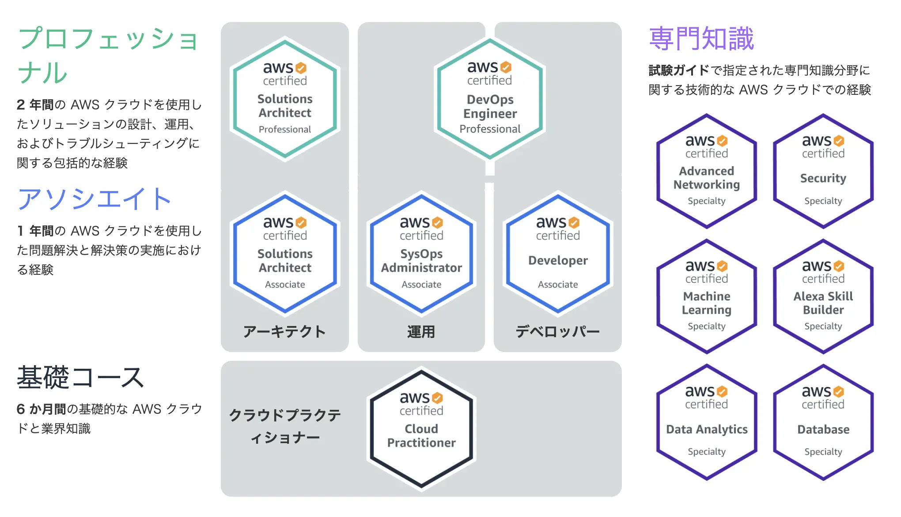
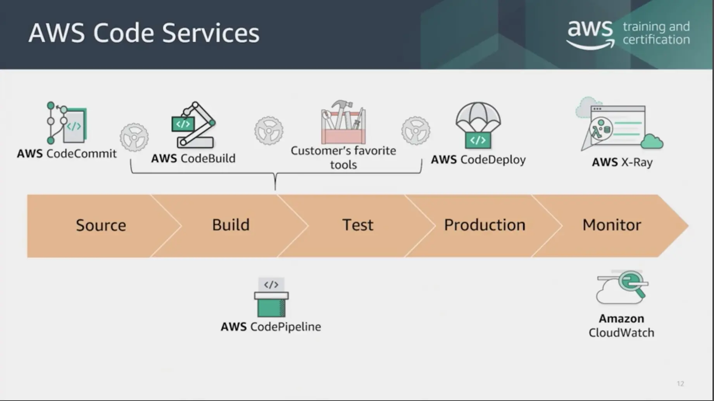

The goal I have set for myself since joining the company is to obtain at least one qualification per year. This is because I am originally from a liberal arts background and became an engineer after changing jobs, so I don't have enough knowledge to become an engineer compared to other people. Therefore, there are many cases where I don't know where to start studying, but by studying for qualifications, I can at least study for the questions that will be asked, so I rely on studying for qualifications and aim to improve my skills.

Meanwhile, this time I took the AWS certification qualification. The types of AWS certifications are shown in the image below, but the one I took was Developer - Associate. I had experience with basic AWS services (such as EC2 and S3) at work, and I had also tried creating a simple serverless app using Functions and Queue on Azure, and used services such as Bastion, so I chose to become a developer without hesitation. I managed to pass the exam, but after using it for a while, I realized that it wasn't a qualification that I could easily try...

*Source: AWS official website - [AWS Certification](https://aws.amazon.com/certification/)*

In any case, as I did with the previous [Java certification article](../java-se-8-gold/), I would like to briefly describe how the test went from my perspective.

## what is the exam like

As for the test itself, rather than the content and scope of knowledge asked in the questions (types of AWS services), it felt like a history subject from my school days. Of course, the basic purpose of the test is to confirm the knowledge that the examinee has, so it is natural to assume that questions will be asked about the specifications and features of AWS services. However, the questions asked in the actual test are more memorization questions such as ``What CLI command should I enter given these requirements?'' and ``What options should I use to configure 〇〇 for this service under this situation?'' rather than ``What kind of service should I use and what kind of configuration should I configure to develop such an application?'' For example, there may be a problem such as choosing the "file name" of a file used to configure a certain setting for a particular service.

AWS has a really diverse range of services, and their roles and areas overlap in some areas, so if you don't have an accurate grasp of the service specifications, it will be difficult to design and develop them, so I think it would be natural for the exam to take a similar form. Especially as your qualification level increases and you think about application design, you will need to consider development efficiency and cost issues, so you will need to know the details of each service's specifications.

However, with the development of cloud services, we are now in an era where infrastructure is written and built using code, and even though the qualification is "developer", couldn't they have made the exam more oriented towards developers? That's what I thought. For example, if the question was about Lambda, I thought it would be a good idea to ask which language should be written in cases where there is frequent access and cases where there is a large amount of processing.

## how did you prepare

In my case, I purchased a book that summarized the three associate qualifications, but since it was only an introduction to AWS services, I purchased a course with 5 mock exams from [Udemy](https://www.udemy.com/). However, rather than targeting developers, I had the impression that it also included content for professional-level qualifications. If anything, I think Udemy's mock exams were more difficult. There are also multiple mock tests available on Udemy, so I think the impression you get from the actual test will change depending on which one you choose.

Personally, I think there is a lot of overlap with knowledge that is tested in other certifications, so it was most efficient for me to buy a difficult mock-exam course and solve it repeatedly. That approach may also help when preparing for other certifications. I also took AWS online video courses (they are free, but only available in English) and referred to official documentation. AWS's official [training courses](https://aws.amazon.com/training/learn-about/) provide videos and PDF materials, so it is worth taking a look.

Also, although this may not apply to those who have taken the test from a practitioner, AWS services are often referred to by abbreviations, and it is difficult to guess what kind of service it is based on the name alone, so I recommend that you at least create your own dictionary for the services mentioned in the mock exams. Although [EBS](https://aws.amazon.com/ebs) and [EFS](https://aws.amazon.com/efs) are storage, [ECS](https://aws.amazon.com/ecs) is a container service... (Also, [SQS](https://aws.amazon.com/sqs) and [SNS](https://aws.amazon.com/sns) are messaging, but [STS](https://docs.aws.amazon.com/STS/latest/APIReference/welcome.html) is security-related.)

Anyway, I think that ``memorizing'' is the most important qualification.

## What are you asked?

Now, let's move on to the content of the exam. If you look at the developer's [certification page](https://aws.amazon.com/certification/certified-developer-associate/) on the AWS official website, there are several items listed as **recommended knowledge and experience**, but that is only a rough outline and does not say what specific questions will appear in the actual exam. There are sample questions, so you can use those as a reference. In my case, I studied through mock exams, but I did not know which mock exams were actually targeted at developers, so I thought it might be worth purchasing AWS's official mock exams.

Anyway, the following questions are often asked in actual tests (and are considered important as a developer).

## serverless architecture

The most common problem pattern involves developing on serverless architectures. In other words, you will be presented with the case of building an application using a combination of [AWS Lambda](https://aws.amazon.com/lambda), [Amazon DynamoDB](https://aws.amazon.com/dynamodb), or [Amazon Kinesis](https://aws.amazon.com/kinesis/), and asked about things to be careful of, what to do if a problem occurs, and various settings. I don't think it's enough to simply understand what serverless is. Therefore, it is necessary to study the above three in detail. It's a good idea to remember how to configure dependencies in Lambda, how to configure shards with scaling in mind, and the specifications of RCU and WCU.

Also, even if you are doing serverless development, things around endpoints and security are the same as general application development (with a server), so there are issues that should be considered in terms of general development patterns. Examples include [Amazon API Gateway](https://aws.amazon.com/api-gateway) settings, S3, and how to use CLI commands.

## security

There are also security concerns. The main topics include setting policies, roles, and groups in [IAM](https://aws.amazon.com/iam), and managing encryption keys using [KMS](https://aws.amazon.com/kms). There were issues with Lambda, so of course there were issues with Lambda authorizers.

## Log/monitoring

You may be asked how to track an application in the event of a failure, or what settings should be made depending on the requirements you want to monitor. For example, there are questions about how to configure the [X-Ray](https://aws.amazon.com/xray) daemon, and what the differences are between [CloudWatch](https://aws.amazon.com/cloudwatch) and [CloudTrail](https://aws.amazon.com/cloudtrail).

## Code brothers

This is a question related to CI/CD. You will be asked about [CodePipeline](https://aws.amazon.com/codepipeline), [CodeDeploy](https://aws.amazon.com/codedeploy), [CodeBuild](https://aws.amazon.com/codebuild), and [CodeStar](https://aws.amazon.com/codestar), but it is not difficult as long as you understand the role of each.

However, there are some overlaps in functionality with [Elastic Beanstalk](https://aws.amazon.com/elasticbeanstalk) and [CloudFormation](https://aws.amazon.com/cloudformation), and I feel like there were issues with choosing which one to use for deployment. These differences must be kept in mind.

In my case, I think I was able to understand a lot by looking at the image below.

*Source: AWS official website training course `Exam Readiness: AWS Certified Developer - Associate (Digital)`*

The above content is well explained in the AWS official video, so I recommend watching it at least once.

## Good information to refer to

Other things you might want to keep in mind are:

## Services you just need to know the name of

Although you won't be asked about it in depth during the test, there are [OpsWorks](https://aws.amazon.com/opsworks), [Step Functions](https://aws.amazon.com/step-functions), and [Systems Manager](https://aws.amazon.com/systems-manager) parameter stores that you should know by name (and just a rough idea of what they do). However, I don't think I can afford to memorize this much. There are so many other things to remember...

## AWS Elastic Load Balancer

There are also questions about [ELB](https://aws.amazon.com/elasticloadbalancing), but at first I had a hard time understanding ALB, NLB, and CLB, so I think it's a good idea to remember the following. ELB is something that cloud practitioners are also asked about, so it's a good thing to remember if you're new to AWS qualifications like me, or if you don't know anything about ELB.

| Features | ALB | NLB | CLB |
|---|---|---|---|
| Supported Protocols | HTTP, HTTPS | TCP, TLS | TCP, SSL/TLS, HTTP, HTTPS |
| Platform | VPC | VPC | EC2-Classic, VPC |
| Health-Check | Response | Response | Response |
| CloudWatch Matrix | Compatible | Compatible | Compatible |
| Logging | Response | Response | Response |
| Zonal Fail-Over | Correspondence | Correspondence | Correspondence |
| Connection Draining | Correspondence | Correspondence | Correspondence |
| Load balancing across multiple ports on the same instance | Supported | Supported | - |
| WebSockets | Compatible | Compatible | - |
| Target (IP address) | Correspondence | Correspondence | - |
| Target (Lambda) | Support | - | - |
| Load balancer deletion protection | Support | Support | - |
| Path-based routing | Support | - | - |
| Host-based routing | Support | - | - |
| Native HTTP/2 | Compatible | - | - |
| Idle Connection Timeout setting | Compatible | Compatible | - |
| Load balancing between Zonds | Supported | Supported | Supported |
| SSL Offload | Compatible | Compatible | Compatible |
| SNI(Server Name Indication) | Compatible | - | - |
| Sticky Session | Compatible | - | Compatible |
| Backend server encryption | Supported | Supported | Supported |
| Fixed IP | - | Supported | - |
| Elastic IP address | - | Compatible | - |
| Retain source IP address | - | Support | - |
| Resource-based IAM permissions | Supported | Supported | Supported |
| Tag-based IAM permissions | Supported | Supported | - |
| Slow start | Response | - | - |
| User authentication | Response | - | - |
| Redirect | Correspondence | - | - |
| Fixed response | Correspondence | - | - |

## After getting accepted

If you pass the exam, you will receive an email shortly afterwards informing you that you will receive some benefits. Details can be found on the [AWS certification site](https://aws.amazon.com/certification/benefits), but to briefly introduce the following benefits.

- You can purchase goods with the AWS certification logo.
- Receive a coupon to purchase one AWS certification practice exam
- Join [LinkedIn](https://www.linkedin.com)'s AWS community
- Get a coupon for half price on your next exam
- Get notified when there is an event
- Receive a digital badge that can be registered on [Acclaim](https://www.youracclaim.com)

Honestly, other than getting a digital badge and a coupon for a mock exam, I'm a little skeptical as to whether there's anything to use it for. However, if you pay for it yourself, it would certainly be an advantage to have the next exam at half price. In my case, the company is paying for it, so I'm not particularly happy even if it's half the price...

## lastly

So, was it worth taking the test? I think that was the case. It's true that I had a hard time because I'm not good at memorizing things and I don't really like it, but I think it helped me gain a deeper understanding of the AWS service. Even if it is a cloud from a different vendor, the general concept of the service is still the same as AWS, so I think it will be useful even when using Azure, GCP, etc. In fact, we are using the knowledge gained from using AWS to effectively utilize VMs in Oracle Cloud.

Also, the services provided in the free tier differ depending on the cloud, but in the case of AWS, Lambda and DynamoDB can be used for free. So, I feel like I can now create some kind of serverless application with the knowledge I gained by studying this qualification. Oracle Cloud and GCP provide VMs that can be used for free, so with this combination, I think it would be possible to launch a great service with just a free plan. I think this is probably the kind of knowledge I would not have gained if I had not challenged myself to obtain the qualification.

One annoying thing is that AWS certifications have a validity period of 3 years. Cloud services are constantly changing, and new services are constantly appearing, so it can't be helped, but I feel like I need to think carefully about where I will use my qualifications (for example, to find a job or change jobs). Also, I think it shares a lot with other qualifications, so I think it would be better to acquire different qualifications in succession as soon as possible. Therefore, I would like to try my hand at becoming a solution architect someday.

Well, I'm tired for a while so I don't feel like trying at all...
