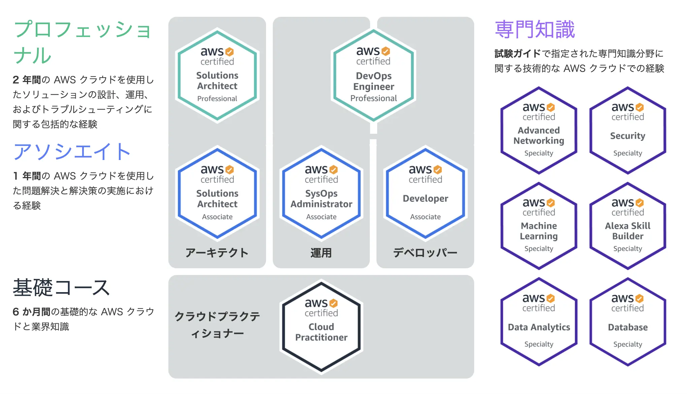
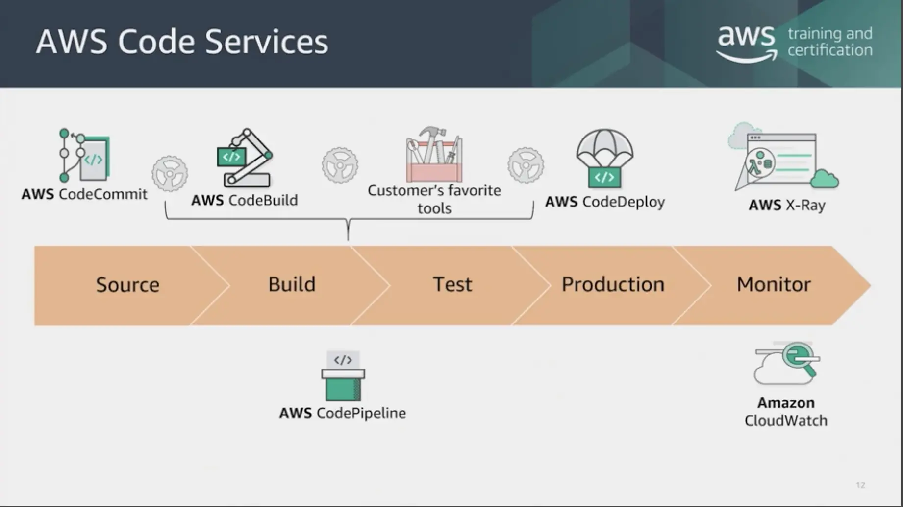

入社してから自分で立てた目標は、年に1つ以上の資格を取ることです。それは自分が元文系出身であって、転職でエンジニアになったので他の人と比べエンジニアとしてのベースとなる知識が足りないからです。なので「何から勉強したら良いかわからない」場合も多く、資格の勉強をしていると少なくとも問われることに対しての勉強はできるので、資格の勉強を頼りにして自分のスキルアップを狙っています。

そんな中、今回はAWS認定の資格を受験しました。AWS認定資格の種類は以下の画像の通りですが、この中で自分が受験したのはデベロッパー - アソシエイトです。仕事でAWSの基本的なサービス(EC2とS3など)に触れたことがあり、AzureでもFunctionsとQueueによる簡単なサーバレスアプリを作ってみたり、Bastionなどのサービスを使ってみた経験があったので悩まずデベロッパーを選択。なんとか受かりましたが、少し使ってみただけで気安く挑戦するような資格ではなかったと実感しました…

*出典：AWS公式サイト - [AWS認定](https://aws.amazon.com/jp/certification/?nc1=h_ls)*

ともかく、前回の[Java資格の時](../java-se-8-gold)でもそうであったように、今回も自分の観点からテストはどうだったかについて簡単に述べていきたいと思います。

## 試験はどんな感じか

問題で問われる知識の内容や範囲(AWSのサービスの種類)の側面でなく、テストそのものはどうかというと、学生時代の歴史の科目のような感覚のテストでした。もちろん、テストとは受験者の持っている知識の確認が基本なのであって、AWSのサービスの仕様や特徴などを問われるだろうと推測するのは自然なことだと思います。しかし、実際のテストで問われるのは「このようなアプリを開発するためにはどんなサービスを使って、どのような構成にするべきか？」といった物よりも、「このような要件で、入力すべきCLIのコマンドは何か？」、「この状況下のこのサービスで、〇〇を設定するために使うオプションは何か？」のような、暗記の問題が多い感覚です。例えば、特定のサービスにとある設定をするために使うファイルの「ファイル名」を選ぶような問題があったりします。

AWSには本当に多様なサービスがあって、それぞれの役割や領域が重なる部分もあるので、サービスの仕様を正確に把握していない場合は設計も開発も難しくなるので、自然に試験もこのような形になるのかも、とは思っています。特に資格のレベルが上がり、アプリケーションの設計という面で考えると、開発の効率やコストの問題も考えなくてはならないので、各サービスの仕様の詳細までを知っておく必要があるでしょう。

ただ、このようなクラウドサービスの発達により、インフラもコードで書いて構築する時代となっているし、資格も「デベロッパー」なのに、より開発者よりな形の試験にするのはできなかったのかな？と思ったりもしました。例えばLambdaについての問題だとすると、頻繁なアクセスがある場合と処理量の多い場合はそれぞれどの言語で書いた方がいいか、を聞いたりしたらよかったのではないかなと思いました。

## どうやって準備したか

自分の場合はアソシエイトの3つの資格の概要をまとめた本を購入しましたが、あくまでAWSのサービスを紹介するものでしかなかったので、[Udemy](https://www.udemy.com/)で5回分の模擬試験の講座を購入しました。ただ、こちらもデベロッパーをターゲットとしてるよりは、プロフェッショナルレベルの資格の内容も含めているような印象でした。どちらかというとUdemyの模擬試験の方が難しかったと思います。他にもUdemyの模擬試験も複数ありますので、どれを選ぶかによってまた実際のテストで受ける印象は変わってくるのではないかと思います。

個人的には他の資格もある程度問われる知識に関しては共有する部分が多いと思うので、難易度の高い模擬試験の講座を購入し、繰り返して解いてみることがもっとも効率的ではないかと思います。そうすると他の資格を受験するときに役立つ可能性もあるでしょう。他にもAWSのオンライン動画講座を受講したり(無料ですが、英語版しかないです)、公式のドキュメントを参照したりしていました。AWSの公式の[トレーニングコース](https://aws.amazon.com/jp/training/course-descriptions/)で動画やPDFの資料を提供していますので、目を通しておくのをオススメします。

また、プラクティショナから取得されている方にはあまり当てはまらないことなのかもしれませんが、AWSのサービスは略称で呼ばわれることが多く、名称だけではどんなサービスなのか推測が難しいので、少なくとも模擬試験で言及されるサービスに対しては自分の辞書を作っておくのをオススメします。[EBS](https://aws.amazon.com/jp/ebs)と[EFS](https://aws.amazon.com/jp/efs)はストレージなのに、[ECS](https://aws.amazon.com/jp/ecs)はコンテナサービスだったりするので…(他にも、[SQS](https://aws.amazon.com/jp/sqs)と[SNS](https://aws.amazon.com/jp/sns)はメッセージングなのに[STS](https://docs.aws.amazon.com/STS/latest/APIReference/welcome.html)はセキュリティ関連の物だったりします)

とにかく「覚える」ことがまず大事な資格だと思います。

## 何を問われるか

それでは、次は試験の内容です。AWS公式サイトのデベロッパーの[紹介ページ](https://aws.amazon.com/jp/certification/certified-developer-associate/)を見ると、**推奨される知識と経験**としていくつか挙げられている項目がありますが、これはあくまで大まかな概念の話であって、実際のテストで具体的に何を問われるかは提示されていません。サンプル問題があるのでそちらを参照することはできますがね。自分の場合は模擬試験を通じて勉強はしたものの、模擬試験のうちどれがデベロッパーに当てはまるかは分かりませんでしたので、AWの公式の模擬試験を購入するのもありかなと思いました。

とにかく、実際のテストでよく問われれる(デベロッパーとして重要視される)と感じたのは以下のような物です。

### サーバレスアーキテクチャ

もっとも多かった問題のパターンは、サーバレスアーキテクチャでの開発に関するものです。つまり、[AWS Lambda](https://aws.amazon.com/jp/lambda)と[Amazon DynamoDB](https://aws.amazon.com/jp/dynamodb)、もしくは[Amazon Kinesis](https://aws.amazon.com/jp/kinesis/)の組み合わせでアプリを構築する場合を提示して、そこで注意すべきことや、障害が起きた場合の対処、各種設定方などを問われます。単純にサーバレスがどんな物であるか、を理解しているだけでは十分ではないと思います。なので以上の三つに関しては、詳細まで勉強する必要があります。Lambdaでの依存関係の設定はどうするか、スケーリングを考慮したシャードの設定方法、RCUとWCUのスペックなどを覚えておくといいでしょう。

また、サーバレス開発をする場合だとしても、エンドポイントやセキュリティ周りのことは一般的なアプリケーション開発(サーバあり)と変わらないので、一般的な開発のパターンで考えるべきところの問題もありました。例えば、[Amazon API Gateway](https://aws.amazon.com/jp/api-gateway)の設定やS3、CLIコマンドの使い方などがあります。

### セキュリティ

セキュリティに関する問題もあります。主に[IAM](https://aws.amazon.com/jp/iam)でのポリシー、ロール、グループの設定や、[KMS](https://aws.amazon.com/jp/kms)を使った暗号化キーのマネージメント、などがあります。Lambdaについての問題があるので、もちろんLambdaオーソライザーに関しての問題もありました。

## ログ・監視

アプリケーションに障害が起きた場合での追跡方法や、監視したい要件でどのような設定をすべきかを問われます。例えば[X-Ray](https://aws.amazon.com/x-ray)デーモンの設定方法や、[CloudWatch](https://aws.amazon.com/jp/cloudwatch)と[CloudTrail](https://aws.amazon.com/jp/cloudtrail)の違いが何かなどをとう問題があります。

### Code兄弟

CI/CD関連で問われる問題です。[CodePipeline](https://aws.amazon.com/jp/codepipeline)、[CodeDeploy](https://aws.amazon.com/jp/codedeploy)、[CodeBuild](https://aws.amazon.com/jp/codebuild)、[CodeStar](https://aws.amazon.com/jp/codestar)に関して問われますが、それぞれの役割をちゃんと理解していれば難しくはないです。

ただ、機能的に[Elastic Beanstalk](https://aws.amazon.com/jp/elasticbeanstalk)や、[CloudFormation](https://aws.amazon.com/jp/cloudformation)と重なる部分があり、デプロイでどれを使うかを選ぶような問題もあったような気がします。これらの違いはちゃんと覚えておく必要があります。

自分の場合は、以下のイメージを見てだいぶ理解ができたと思います。

*出典：AWS公式サイトトレーニングコース `Exam Readiness: AWS Certified Developer - Associate (Digital)`*

以上の内容は、AWS公式の動画でよく説明してくれているので、一回は受講することをオススメします。

## 参考にすると良い情報

他に、ちょっと覚えておくと良さげなものは以下の通りです。

### 名前だけは知っておきたいサービス

テストで深くは問われないですが、名前だけ(そして何をするものか、大まかなイメージだけ)知っておくといいものとしては、[OpsWorks](https://aws.amazon.com/jp/opsworks)、[Step Functions](https://aws.amazon.com/jp/step-functions)、[Systems Manager](https://aws.amazon.com/jp/systems-manager)のパラメータストアがあります。ただ、こちらまで覚えるのは流石に余裕がないと思います。他も覚えるべきものは山ほどあるので…

### AWS Elastic Load Balancer

[ELB](https://aws.amazon.com/jp/elasticloadbalancing)についての問題も出ますが、最初はいまいちALB、NLB、CLBのことがわからず苦労をしていたので、以下のことを覚えておくと良いと思います。ELBはクラウドプラクティショナでも問われるものなので、私みたいにAWSの資格が初めてだったり、ELBのことが全くわからない場合に覚えておくといいでしょう。

| 特徴 | ALB | NLB | CLB |
|---|---|---|---|
| 対応Protocol | HTTP, HTTPS | TCP, TLS | TCP, SSL/TLS, HTTP, HTTPS |
| プラットフォーム | VPC | VPC | EC2-Classic, VPC |
| Health-Check | 対応 | 対応 | 対応 |
| CloudWatchマトリックス | 対応 | 対応 | 対応 |
| ロギング | 対応 | 対応 | 対応 |
| Zonal Fail-Over | 対応 | 対応 | 対応 |
| Connection Draining | 対応 | 対応 | 対応 |
| 同じインスタンスの複数ポートに負荷分散 | 対応 | 対応 | - |
| WebSockets | 対応 | 対応 | - |
| ターゲット(IPアドレス) | 対応 | 対応 | - |
| ターゲット(Lambda) | 対応 | - | - |
| ロードバランサー削除保護 | 対応 | 対応 | - |
| パスベースルーティング | 対応 | - | - |
| ホストベースルーティング | 対応 | - | - |
| Native HTTP/2 | 対応 | - | - |
| Idle Connection Timeout設定 | 対応 | 対応 | - |
| Zond間の負荷分散 | 対応 | 対応 | 対応 |
| SSLオフロード | 対応 | 対応 | 対応 |
| SNI(Server Name Indication) | 対応 | - | - |
| Sticky Session | 対応 | - | 対応 |
| バックエンドサーバ暗号化 | 対応 | 対応 | 対応 |
| 固定IP | - | 対応 | - |
| Elastic IPアドレス | - | 対応 | - |
| 送信元IPアドレスを保持 | - | 対応 | - |
| リソースベースIAMアクセス許可 | 対応 | 対応 | 対応 |
| タグベースのIAM権限 | 対応 | 対応 | - |
| スロースタート | 対応 | - | - |
| ユーザ認証 | 対応 | - | - |
| リダイレクト | 対応 | - | - |
| 固定応答 | 対応 | - | - |

## 受かったあとは

試験に受かったら、しばらくしていくつかの特典をもらえるよ、というお知らせのメールが届きます。詳細は[AWS認定のサイト](https://aws.amazon.com/jp/certification/benefits)からも確認できる内容ですが、簡単に紹介しますと以下の特典が提供されます。

- AWS認定ロゴのついたグッズを購入できる
- AWS認定資格の模擬試験を一つ購入できるクーポンをもらえる
- [LinkedIn](https://www.linkedin.com)のAWSコミュニティに入れる
- 次の試験が半額になるクーポンをもらえる
- イベントがあったら通知をもらえる
- [Acclaim](https://www.youracclaim.com)に登録できるデジタルバッジをもらえる

正直デジタルバッジと模擬試験のクーポンがもらえる以外、使うところがあるかどうかは少々疑問になるライナップではあります。ただ、自腹の場合は確かに次の試験が半額になるのはメリットになるでしょう。自分の場合は会社負担のなっているので、半額でも特にうれしくはないのですが…

## 最後に

それで、受験する価値はあったのか？というと、それはあったと思います。暗記に弱く、あまり好きではないので苦労したのは事実ですが、おかげでAWSというサービスをより深く理解することができたと思っています。違うベンダーのクラウドだとしても、やはり大まかなサービスのコンセプトはやはりAWSと変わらないものなので、AzureやGCPなどを使う場合でも十分役立つのではないかと思います。実際、AWSを使うことで得られた知識でオラクルクラウドのVMを有効活用しているところです。

また、クラウドごとに無料Tierで提供されるサービスはそれぞれ違うのですが、AWSの場合はLambdaとDynamoDBが無料で使えます。なので、この資格を勉強しならが得られた知識で何らかのサーバレスアプリケーションを作ることも可能になったような感覚です。オラクルクラウドとGCPでは無料で使えるVMを提供しているので、この組み合わせだと無料プランだけで立派なサービスを立ち上げることも不可能ではないような気がしますね。おそらく、こういうのも資格に挑戦してなかったら得られなかった知識だっただろうと思っています。

一つ悩ましいのは、AWSの資格は3年という有効期限があるということです。クラウドは常に変化するサービスであり、続々と新しいサービスが登場するものなので仕方ないものですが、資格を持ってどこに活用するか(例えば、就職や転職に使うなど)はよく考える必要がありそうな気がします。あとは、、他の資格とも共有する部分が多いと思うので、連続して違う資格を早めに取っておいたほうが良さげな感じですね。なので自分もいつかまた、ソリューションアーキテクトなどに挑戦したいと思っています。

ま、しばらくは疲れたので全然挑戦する気にならないのですが…
