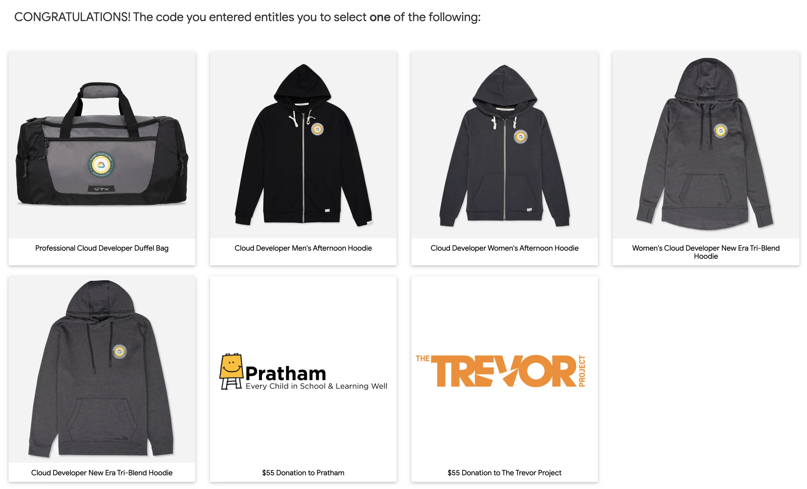

이번에 [Professional Cloud Developer](https://cloud.google.com/certification/cloud-developer) 자격을 취득했습니다. 작년에는 따로 자격을 취득하지 않았기 때문에 꽤 오랜만의 합격이었습니다. 지금까지는 주로 AWS를 사용해 왔지만, GCP 서비스도 더 알고 싶었고 AWS와 어떤 차이가 있는지도 궁금해서 시험을 보게 됐습니다.

이번 글에서는 시험 준비를 어떻게 했는지 간단히 정리해 보겠습니다.

## 시험은 어떤가

이전에는 [AWS Certified Developer - Associate 취득 후기](/ko/posts/aws-certification-associate-developer/)에 대한 글도 썼지만, 클라우드라는 플랫폼이 제공하는 서비스의 본질은 제공자가 달라도 크게 다르지 않습니다. IaaS나 PaaS의 개념, 그리고 백엔드 서비스를 클라우드에 배포하고 구성한 경험이 있다면 준비가 아주 어렵지는 않을 거라고 느꼈습니다.

시험은 원격 감독과 현장 감독 중에서 선택할 수 있습니다. 전자는 집에서 치르는 방식이고, 후자는 시험 센터에서 치르는 방식입니다. 저는 평일에만 가능한 현장 감독이 불편해서 원격 감독을 선택했습니다. AWS 시험 때도 그랬지만, 원격 감독은 시험을 볼 방을 꽤 꼼꼼히 준비해야 합니다. 필요한 조건은 [KRYTERION 사이트](https://kryterion.force.com/support/s/article/Launching-your-Online-exam?language=en_US)에 나와 있으니 미리 확인하는 것이 좋습니다. 저도 조건에 맞춰 방을 정리하는 일이 꽤 번거로웠기 때문에, 오히려 현장 감독이 더 편했을 것 같습니다.

원격 감독 시험은 KRYTERION이 제공하는 전용 브라우저로 진행됩니다. 브라우저가 실행되면 다른 앱은 최소화되고, 외부 모니터를 연결한 경우 해당 화면이 검게 바뀝니다. 저는 Apple Silicon Mac을 사용하고 있어서 호환성이 걱정됐지만 문제없이 실행할 수 있었습니다. [시스템 체크](https://www.kryteriononline.com/systemcheck/#)도 제공되니 자신의 PC로 응시 가능한지 미리 확인하는 것이 좋습니다. 생체 인증 정보 등록도 필요한데, 이건 단순히 사진을 찍는 수준입니다. 시험이 시작되기 전에는 등록한 생체 인증을 확인하고, 감독관 지시에 따라 방을 보여 주거나 신분증을 제시하는 정도의 절차가 있습니다.

다른 자격은 시험 직후 결과를 알려 주는 경우도 많지만, GCP 자격은 합격 메일이 오기까지 약 1주일이 걸렸습니다. 점수나 세부 결과도 바로 보이지 않았습니다. 시험 중 기록을 함께 검토하는 절차가 있는 듯했고, 전용 브라우저를 쓰는 만큼 키 입력이나 카메라 영상 같은 정보도 일정 부분 확인하는 것처럼 보였습니다.

## 어떻게 준비했나

먼저 Udemy에서 모의고사를 찾아봤습니다. 영어판과 일본어판이 있었는데, 리뷰에서 본 것처럼 실제 시험보다 쉬운 문제가 많았습니다. 저는 5회분 영어 모의고사를 4번 풀면서 모두 80% 이상 맞췄지만, 본시험은 더 어렵고 복잡한 문제가 많아서 이것만으로는 부족하다고 느꼈습니다.

공식 모의고사도 [여기](https://docs.google.com/forms/d/e/1FAIpQLSc_67KaPnNwQrLZ7kuhw-aubz7gMAwY6DQwRJYcW0qlG-iajA/viewform)에 있습니다. 이쪽이 실제 시험에 더 가깝고, 일부는 거의 그대로 나온 문제도 있다고 합니다. 그래서 공식 모의고사를 풀면서 각 서비스 문서를 함께 보는 방식이 가장 효율적이라고 느꼈습니다.

모의고사 외에는 Kubernetes 문제가 많다는 이야기를 듣고, 실제로 써 본 적이 없어서 그쪽을 중심으로 많이 공부했습니다. 그 밖에는 테스트와 배포 개념, 예를 들면 Blue-Green이나 Canary 배포 정도를 다시 확인했습니다.

## 무엇이 나오나

[HipLocal 사례 연구](https://cloud.google.com/certification/guides/cloud-developer/hip-local-case-study?hl=ko)를 참고해 준비하는 것이 좋습니다. HipLocal 관련 문제 자체의 비중은 크지 않지만, 이 사례를 활용한 문제는 모의고사에서 보지 못한 패턴도 나올 수 있습니다. 시험 전에 사례 연구에 맞춰 어떤 마이그레이션이 적절할지 GCP 서비스와 함께 살펴보는 편이 좋습니다.

다만 HipLocal 사례를 전부 외울 필요까지는 없습니다. 저도 이 부분이 꽤 신경 쓰였는데, 실제 시험에서는 브라우저 오른쪽에 사례 연구 내용이 표시되어 있어서 필요할 때마다 참고할 수 있었습니다. 안내에는 HipLocal 외 다른 사례가 나올 수도 있다고 적혀 있었지만, 형식 자체는 비슷하게 준비하면 충분해 보였습니다.

출제 범위나 세부 문항은 다른 후기에서도 어느 정도 찾아볼 수 있지만, 저는 문제를 정확히 다 기억하지 못해서 구체적으로 적지는 않겠습니다. 전체적으로는 Kubernetes 관련 비중이 높았고, 그다음으로 스토리지와 서버리스 관련 문제가 눈에 띄었습니다. 특히 [Anthos](https://cloud.google.com/anthos)와 [Istio](https://istio.io/)가 언급된 문제는 기억에 남습니다. 저도 이름만 아는 수준이어서 답을 고르기 쉽지 않았습니다.

## 합격 후

Google Cloud Certification Perks Webstore에서 혜택을 받을 수 있는 코드가 이메일로 왔습니다. 혜택 종류는 수시로 바뀌는 것 같고, 다른 블로그에서는 Bluetooth 스피커를 받을 수 있었다고 했지만, 제가 받을 때는 아래 같은 선택지였습니다.

저는 지퍼가 달린 후드를 원했지만, 그때는 2XL만 선택할 수 있어서 지퍼 없는 쪽을 골랐습니다. 딱히 원하는 물건이 없다면 기부 옵션도 있으니 그쪽을 선택해도 좋겠습니다.

자격 증명은 [Accredible](https://www.accredible.com/) 사이트에서 확인할 수 있습니다. AWS나 Oracle 자격을 [Credly](https://www.credly.com/)에서 확인하듯이, 인증을 사이트에 연결하거나 LinkedIn 등에 공유할 수 있습니다. 인증서는 PDF로도 다운로드할 수 있었습니다.

AWS 자격은 보통 3년 유효한데, GCP는 2년이었습니다. 클라우드는 변화가 빠르고 서비스도 계속 바뀌니 유효기간이 있는 것 자체는 자연스럽습니다. 다만 공부량과 시험료($200)를 생각하면 2년은 조금 짧게 느껴졌습니다.

## 마지막으로

시험 직후에는 모의고사와 체감이 너무 달라서 떨어진 줄 알았습니다. 나중에 합격 메일을 받았을 때도 실감이 잘 나지 않았습니다. 돌이켜 보면, 그만큼 모의고사 문제 유형에만 집중해 외운 부분이 있었던 것 같습니다.

실제 시험은 문제와 선택지를 차분히 읽으면 답이 보이는 경우도 있고, GCP 문서를 제대로 읽어 두었다면 판단할 수 있는 내용도 많습니다. 그래서 우선은 공식 [인증 가이드](https://cloud.google.com/certification/guides/cloud-developer)를 중심으로 각 서비스 문서를 한 번 훑어보는 것을 권합니다. 모의고사는 어디까지나 감을 잡는 용도에 가깝기 때문에, 점수가 잘 나온다고 방심하면 오히려 위험할 수 있습니다.

난이도를 비교하면, 제가 예전에 취득한 AWS 자격은 어소시에이트 레벨이었기 때문에 이번 시험이 더 어렵게 느껴졌습니다. 합격하고 나서도 "프로페셔널"이라는 이름에 걸맞으려면 더 공부해야겠다는 생각이 들 정도였습니다. 그래도 평소에 GCP를 자주 쓰고, 온프레미스에서 클라우드로 옮기는 경험이 있는 분이라면 충분히 도전해 볼 만한 시험입니다.
