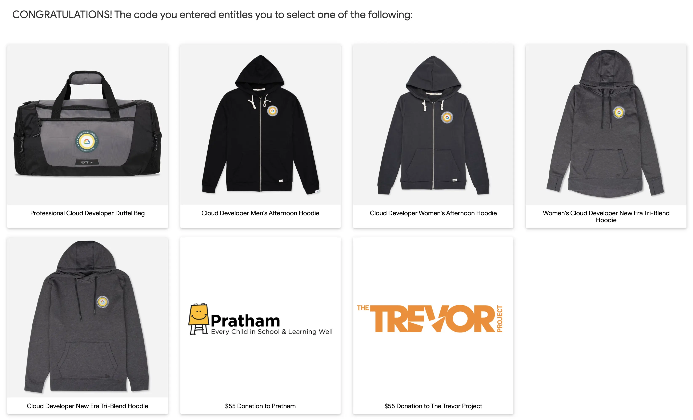

この度は[Professional Cloud Developer](https://cloud.google.com/certification/cloud-developer)の資格を取得しました。去年は特に資格を取得してないので、久々の資格取得となります。今までは主にAWSを使っていたので関連した資格を取得するのが良いかなと思っていましたが、GCPのサービスがもっと知りたいというのもあり、AWSの資格と比べどう違うかも気になったための受験となります。

前回もそうであったように、無事資格の取得ができましたので、今回のポストではどのように試験の準備をしたかなどについて簡単に述べたいと思います。

## 試験はどんな感じか

以前、[AWSの資格](../aws-certification-associate-developer)に関する記事を書いたことがありますが、プロバイダが違ってもCloudというプラットフォームが提供するサービスの根本は変わらないので、試験もまたそのような感覚です。基本的にIaaSやPaaSのようなサービスの概念や、バックエンドサービスのクラウドでのデプロイと構成の経験があれば試験の準備はそう難しくないかなと感じました。

受験は遠隔監視とオンサイト監視の二つを選べ、前者は自宅での受験、後者はテストセンターでの受験となります。自分の場合はオンサイト監視が平日しか選べなかったため遠隔監視を選んでいます。AWSの試験の時もそうでしたが、遠隔監視の場合は受験できる部屋の準備をきちんとする必要があります。準備に必要なものは[KRYTERIONのサイト](https://kryterion.force.com/support/s/article/Launching-your-Online-exam?language=en_US)に明示されているので、事前にチェックした方が良いです。個人的にはこの要件に合わせて部屋を片付けるのもかなり大変なものだったので、オンサイト監視の方が楽だろうと思いました。

遠隔監視での試験はKRYTERIONが提供する専用のブラウザを使って進行します。ブラウザが起動すると他のアプリは最小化され、外部モニタを繋いでいる場合はそのモニタの画面が黒くなります。私の場合はApple Silicon Macを使っているので互換性の方が気になりましたが、問題なく実行できました。[システムチェック](https://www.kryteriononline.com/systemcheck/#)のサイトも提供しているので、自分のPCで受験できるかはこちらでも確認したほうが良いでしょう。また、生体認証情報の登録が必要となりますが、こちらは単純に写真を撮るだけです。当日は試験が始まる前に登録した生体認証を確認し、監視官の指示の元に部屋の様子を見せたり身分証明書を提示するなどの簡単な手続きがあります。

他の資格の場合はその場や当日で結果がわかるケースも多かったかなと思いますが、GCPの資格は認定のメールが届くまで1週間ほどの時間がかかっています。満点や得点がわからないという特徴を踏まえて考えてみると、受験当時のさまざまな状況を考慮して総合的に判断するのではないかと思っています。受験専用のブラウザを使うことになっているので、おそらくキー入力やカメラの映像なども全部録画されていたのではないかと思います。

## どうやって準備したか

まずはUdemyから模擬試験を検索してみました。中には英語になっているものと日本語版がありますが、どれもレビューに書いてある通りで、実際のテストと比べ簡単な問題が多いです。自分の場合は5回分を提供する英語の方を4周してどれも8割以上の正解を記録しましたが、本番ではより難しい（模擬試験では問われてないものやより複雑な）問題が多かったため、これだけでは不十分と思いました。

模擬試験は[公式の方](https://docs.google.com/forms/d/e/1FAIpQLSc_67KaPnNwQrLZ7kuhw-aubz7gMAwY6DQwRJYcW0qlG-iajA/viewform)もあり、こちらは比較的に実際のテストに近い問題が多いので（こく一部ですが、ほぼそのままの問題もあります）こちらの方を問題で問われる各サービスのドキュメントを調べながら勉強した方が良いかなと思います。

模擬試験の他にはKubernetesの問題が多いという情報があり、実際に使ったことがなかったのでそちらを中心に色々調べたことが多かったです。そのほかはテストやデプロイの概念（Blue-Greenやカナリアなど）を一度チェックしているくらいです。

## 何を問われるか

[HipLocalのケーススタディ](https://cloud.google.com/certification/guides/cloud-developer/hip-local-case-study?hl=ja)を参考にして準備をした方が良いです。HipLocalに関する問題自体は全体の割合として高くないものの、このケーススタディを用いた問題の場合は、模擬試験で問われる問題以外でもいろいろなパターンがありますので試験の前にケーススタディに合わせてどうやってマイグレーションを行ったらいいかをGCPのサービスと照らし合わせながら確認した方が良いかと思います。

一つ、HipLocalのケーススタティを全て覚えておく必要はありません。個人的にはここがかなり気になっていたところなのですが、実際のテストではブラウザの右側にケーススタディが提示されていたのでそれを参考して問題を解くことができました。ブラウザに表示された内容ではHipLocal以外のケーススタディが提示される可能性もあるように書いてありましたが、おそらく他のテストでも似たようなパターンの問題があるためそのような記述があるのかなという感覚です。

問われる問題の範囲や詳細に対しては他のブログでも見つけることができ、自分としては詳細までは覚えてないので詳しくは述べませんが、やはりKubernetesに関する問題が多い感覚で、次にはストレージやサーバレスに関する問題が多かったかなと思います。そのほか、印象に残ったものは[Anthos](https://cloud.google.com/anthos)や[istio](https://istio.io/)が言及された問題があったことです。どちらも名前しか聞いてないくらいだったので、その問題に対しては正解となっているかどうかすらわかりませんでした。

## 受かったあとは

Google Cloud Certification Perks Webstoreから特典をもらえるコードがメールで送られてきました。もらえる特典の種類は随時変わるらしく、他のブログではBluetooth Speakerなどをもらえると書いてありましたが、私の場合は以下から選ぶようになっていました。

私はジッパーフードの方を選びたかったのですが、今回はサイズを2XLしか選べなかったので、今回はジッパーのない方を選んでいます。欲しいものが特になかったら、寄付できるオプションもありますのでそちらを選んでも良いかもですね。

資格の認証は[Accredible](https://www.accredible.com/)というサイトから確認できます。こちらのサイトではAWSやOracleの資格を[Credly](https://www.credly.com/)で確認できたように、認定の証明をサイトにリンクできたり、Linkedinなどに共有できる機能があります。認定書はPDFとしてダウンロードもできました。

一つ、AWSの場合は資格の有効期限が3年となっていましたが、GCPの場合は2年となっていました。クラウドだとやはりサービスの仕様が変わることも多く、新しいサービスが導入される場合も多いので有効期限を設けていること自体は当たり前とは思いますが、勉強すべき量と受験料($200)を考えると少し短い感覚です。

## 最後に

受験後に模擬試験とあまりにも違う問題が多かったため今回こそ落ちたのではないかという不安があり、のちに合格したというメールを受けてもやはり実感があまりありませんでした。ただ、それはあくまで自分が模擬試験で問われるもののみを覚えていただけなのが原因な気もします。

実際の問題は問題と選択肢を注意深く読むことで正解が見えてくるものもあったり、GCPのドキュメントを確認していたらわかるようなことも多いので、まずは公式の[認定資格ガイド](https://cloud.google.com/certification/guides/cloud-developer)に提示されてある内容を中心に各サービスのドキュメントを一読することをお勧めします。模擬試験はあくまで模擬試験なので、良い点数が取れたからと油断したら落ちる可能性も十分にあり得るのではないかと思います。

問題の難易度に関しては、やはりどうしても自分が以前取得したAWSの資格と比較してしまいますが、そちらはアソシエイトレベルのものだったため、こちらの資格の方が難しい感覚ではありました。個人的には合格してからも本当にプロフェッショナルを名乗るにはより勉強が必要なのではないかという気がするくらいでした。ただ、普段からGCPのサービスを色々と利用してオンプレからのマイグレーション経験がある方ならそこまで難しくないのかもしれませんので、油断だけしないなら、十分受かる資格なのではないかなと思っています。

では、また！
