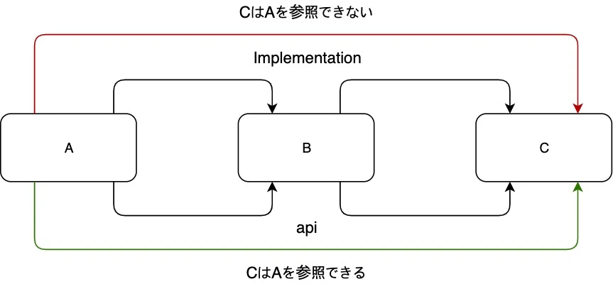

It is no exaggeration to say that half of modern programming is done on the Internet. We live in an era where you can get information not only from official language and MW guidelines, but also from numerous communities on the web. And some, like Maven and Gradle, assume that dependency management itself is connected to the internet. I'm not far from this trend, and when I encounter a problem with the code I'm writing, I tend to search for it. Although it may take some time, you can usually solve the problem.

However, although it is convenient, there are risks in seeking knowledge on the Internet. The question is whether that information is accurate. First of all, when it comes to coding information, by my standards, anything that has been around for more than two years is hard to believe. Even if that was the correct answer at the time, it may not be the case now. For example, even if you are using the same library, the package structure or method signature may change due to version upgrades, but I don't think all the information on the internet reflects all of these changes. Even if there is code that actually works, that code is just plain text, and it is not something that can currently be compiled and run.

This is the theme of this article: how dependencies should be written in Gradle. Up until now, when I was writing dependencies, I had referred to officially recommended code snippets and blog posts and copied them as needed. However, the same library would appear as `compile`, `implementation`, or `runtime`, which was quite confusing. In the end, the result seemed to be the same no matter how you wrote it, so I wondered why they were divided this way.

In the end, I found the answer to that question by facing a certain problem myself. So this time it's not just about theory, but also about where problems can occur and how to solve them.

## compile? implementation?

If you look up how to write dependencies in Gradle on the internet, you will find the same library written as either `compile` or `implementation`. At the moment, either may seem to work, so at first glance it can look like there is no real difference. But the point in question is `compile`. This keyword is probably the oldest way to express dependencies, and it seems to have the most search results. It is also easy to understand because it roughly means "use this library at compile time."

However, when I look at the Dependency management tab of Gradle's [4.7 version Java Library Plugin](https://docs.gradle.org/4.7/userguide/java_plugin.html#sec:java_plugin_and_dependency_management), compile is written as `Deprecated`[^1]. At the time of writing this post, the stable version is 5.6, and 6.0 is planned for the future, so it seems better to avoid using it as much as possible.

[See official document](https://docs.gradle.org/5.6.4/userguide/java_library_plugin.html#sec:java_library_separation) Then, it appears that `compile` was divided into two, `implementation` and `api`. In other words, it is better to choose one of these instead of compile from now on.

## implementation and api

It seems that with the existing `compile`, "dependency propagation" always occurred. In other words, let's say you create a new library called B using library called A. And also create C which depends on B. In this case, C can also touch A simply by relying on B. In some cases, this situation may be undesirable. Even if you wrap A and create B for the purpose of narrowing down the specifications, you can directly handle A from C. This is also not very desirable from a Java encapsulation perspective.

`implementation` imposes constraints on the propagation of this dependency. In other words, when B depends on A, if you write it in `implementation` instead of `compile`, you will not be able to directly reference A from C. For this reason, it seems that it is recommended to use `impelementation` instead of `compile` in many cases these days.

On the other hand, in `api`, dependency propagation occurs as before. If B depends on A, you should use this if you want C to also reference A, rather than complete wrapping. In fact, I was creating several libraries for work, and some of them needed to reference the original library. In this case, if `implementation` was used, Gradle would no longer be able to recognize the direct reference to A from C, and a compilation error might occur. Therefore, when describing dependencies, it is important to correctly understand the nature of what you are creating and decide how to describe it.

These relationships can be expressed as a simple diagram like this.

## Finally

This is a simple explanation of how Gradle dependencies should be written. In reality, there are various ways to write `implementation` and `api`, surprisingly, `runtimeOnly` for reference only at runtime, and `testImplementation` for testing, so I think you need to be flexible depending on the situation. However, in most cases, I think the most important thing is to organize the dependencies and make sure to use `implementation` and `api` properly.

Also, as mentioned earlier, it is important to check whether the information obtained from the internet reflects the API updates. Old information may cause problems with current code. In that sense, there is a possibility that this post may become incorrect information as time passes. Well, not just this post, but maybe all the information I write on this blog as a whole.

When writing code and referring to information on the internet, I think you should always check the date it was written and compare it with the official documentation. Study with the latest policy!

[^1]: Deprecated means "not recommended." In the world of programming, this term refers to functions that are likely to disappear in the future due to some problem or because they are no longer needed. For example, in Eclipse, adding `@Deprecated` to a Java function shows a strikethrough on the function name.
