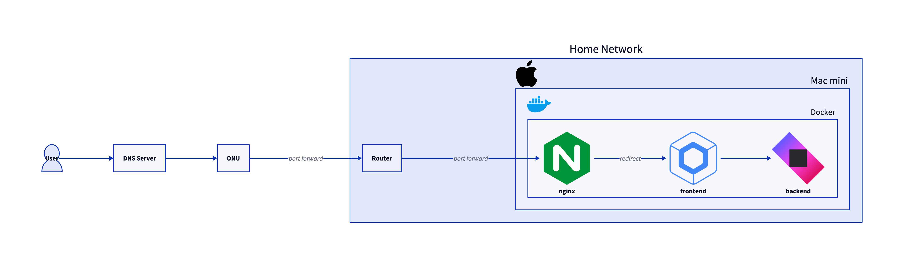

이번에는 홈 서버를 만들었습니다. 아직 막 만든 상태라 개선할 점이나 과제가 많겠지만, 일단 하나의 구성을 정리해 두었으니 그 내용을 간단히 설명해 보겠습니다.

## 왜 자작 서버를 만들었는가

요즘은 무료로 쓸 수 있는 클라우드 서비스도 많아서 Firebase나 Vercel 같은 서비스를 이용하면 웹 애플리케이션을 쉽게 공개할 수 있습니다. 그래서 "그냥 기존 서비스를 쓰면 되는 것 아닌가?"라고 생각한 적도 있지만, 굳이 자작 서버를 만들게 된 이유를 정리해 보겠습니다.

### 성능

많은 클라우드 서비스의 VM이나 서버리스 환경은 CPU, 메모리, 스토리지에 제약이 있는 경우가 많습니다. AWS나 GCP 같은 서비스는 CPU 아키텍처가 Broadwell처럼 꽤 오래된 세대를 쓰는 경우도 있습니다. 반면 이번에 자작 서버로 쓴 머신은 M2 Pro가 들어간 Mac mini라서, IPC 기준으로 보면 더 높은 성능을 기대할 수 있습니다. 메모리도 32GB라서 제약이 거의 없습니다.

### 비용

무료 서비스라고 해도 WAF 같은 보안 기능이나 데이터베이스를 붙이면 결국 비용이 드는 경우가 많습니다. 사용량이 늘면 생각보다 저렴하지 않기도 합니다. 당분간은 취미나 개인 용도로만 쓰고 싶어서 가능한 한 지출을 줄이고 싶었습니다. 자작 서버는 전기 요금이 들 수 있지만, Mac mini는 소비전력이 낮고 사용하지 않을 때는 슬립으로 두면 전기료 부담도 크지 않다고 봤습니다.

### 기능

서버리스나 VM 환경은 런타임이 정해져 있거나 DB 선택지가 제한되는 경우가 있습니다. 예를 들어 지금도 Oracle Cloud 무료 인스턴스를 쓰고 있는데, 무료 플랜에서는 PostgreSQL을 바로 쓸 수 없어서 VM 안에 DB를 띄우는 형태로 운영하고 있습니다. 기존 플랫폼을 쓰면 내가 원하는 기능보다 서비스가 제공하는 기능에 맞춰야 할 때가 있습니다. 이번에는 그런 제약 없이, 원하는 기술로 자유롭게 서비스를 만들고 싶었습니다.

### 기타

다른 이유도 있지만 가장 큰 이유는 Mac을 두 대 쓰고 있고, 남는 자원을 활용하고 싶었기 때문입니다. 이동할 때는 MacBook Pro를 쓰고, 항상 켜 두는 쪽은 Mac mini라서 이걸 서버로 돌리고 외부에서도 접근할 수 있게 해 보고 싶었습니다.

## 인프라 구성

전체 구성을 그림으로 나타내면 다음과 같습니다.



### ONU

집에서는 NURO 광을 쓰고 있어서 인터넷 연결에는 ONU가 필요합니다. ONU는 Optical Network Unit의 약자로, 광회선을 통해 인터넷에 접속하기 위한 장치입니다. 기본적인 라우터 기능도 갖고 있습니다.

저는 ONU와 별도로 Wi-Fi 라우터를 쓰고 있으므로, ONU에서는 포트 포워딩만 설정해 두었습니다. TCP 80번과 443번 포트를 포워딩해 두면 외부에서 ONU 뒤의 서버에 접근할 수 있습니다.

### 라우터

다음은 라우터입니다. 앞서 말했듯이 ONU에도 라우터 기능이 있으니 꼭 필요한 것은 아닙니다. 다만 라우터가 제공하는 무료 DDNS 기능을 쓰기 위해 라우터를 사용하고 있습니다. ONU만으로는 IP가 고정되지 않으므로, 라우터의 DDNS를 이용해 구입한 도메인과 연결하면 항상 같은 도메인으로 접속할 수 있습니다. 고정된 도메인이 있으니 SSL 인증서도 받기 쉬워집니다. 여기서도 80번과 443번 포트를 포워딩해 둡니다.

### 서버

서버에는 앞서 말한 Mac mini를 사용합니다. 내부에서는 Docker 컨테이너로 빌드한 Nginx와 Ktor 애플리케이션이 동작하고 있습니다. Nginx는 리버스 프록시 역할을 하며 Ktor 애플리케이션으로 요청을 전달합니다. Ktor에서는 정적 파일도 제공할 수 있으므로, Compose Web(WASM)으로 만든 웹 애플리케이션을 내려 주고 있습니다.

Docker에서 Nginx와 Ktor는 같은 네트워크로 묶여 있어서, Nginx가 Ktor에 접근할 때 컨테이너 이름을 사용할 수 있습니다. Nginx는 80번과 443번 포트의 요청을 받아 Ktor로 전달합니다. Certbot으로 SSL 인증서를 발급받았기 때문에 HTTPS로 접근할 수 있고, 80번 요청은 301 리다이렉션으로 443번으로 보냅니다.

이 구성은 Docker Compose로 다음처럼 정의됩니다.

```yaml
services:
  nginx:
    build:
      context: .
      dockerfile: Dockerfile_nginx
    container_name: nginx
    ports:
      - "80:80"
      - "443:443"
    volumes:
      - certs:/etc/letsencrypt
      - certs-data:/var/www/certbot
    networks:
      - home_network

  certbot:
    image: certbot/certbot
    container_name: certbot
    volumes:
      - certs:/etc/letsencrypt
      - certs-data:/var/www/certbot
    networks:
      - home_network

  app:
    build:
      context: .
      dockerfile: Dockerfile
    image: app:latest
    container_name: app
    ports:
      - "8888:8888"
    networks:
      - home_network
    depends_on:
      - nginx

networks:
  home_network:
    driver: bridge

volumes:
  certs:
  certs-data:
```

또 무단 접근을 막기 위해 Nginx는 다음과 같은 Dockerfile로 빌드합니다.

```Dockerfile
# 베이스 이미지로 최신 Nginx 사용
FROM nginx:latest

# 필요한 패키지 설치
RUN apt-get update && apt-get install -y \
    git \
    dnsutils \
    wget \
    && rm -rf /var/lib/apt/lists/*

# Nginx Ultimate Bad Bot Blocker 저장소 복제
RUN git clone https://github.com/mitchellkrogza/nginx-ultimate-bad-bot-blocker.git /opt/nginx-ultimate-bad-bot-blocker

# 필요한 디렉터리를 만들고 bot 설정 파일 복사
RUN mkdir -p /etc/nginx/bots.d /usr/local/sbin \
    && cp /opt/nginx-ultimate-bad-bot-blocker/bots.d/* /etc/nginx/bots.d/ \
    && cp /opt/nginx-ultimate-bad-bot-blocker/conf.d/globalblacklist.conf /etc/nginx/conf.d/

# install-ngxblocker 스크립트 다운로드 및 실행
RUN wget https://raw.githubusercontent.com/mitchellkrogza/nginx-ultimate-bad-bot-blocker/master/install-ngxblocker -O /usr/local/sbin/install-ngxblocker \
    && chmod +x /usr/local/sbin/install-ngxblocker \
    && /usr/local/sbin/install-ngxblocker -x

# setup-ngxblocker 스크립트 다운로드 및 실행
RUN wget https://raw.githubusercontent.com/mitchellkrogza/nginx-ultimate-bad-bot-blocker/master/setup-ngxblocker -O /usr/local/sbin/setup-ngxblocker \
    && chmod +x /usr/local/sbin/setup-ngxblocker \
    && /usr/local/sbin/setup-ngxblocker -x

# Nginx 커스텀 설정 파일 추가
COPY ./nginx/nginx.conf /etc/nginx/nginx.conf
COPY ./nginx/default.conf /etc/nginx/conf.d/default.conf

# 인증서용 볼륨(Let's Encrypt 사용)
VOLUME ["/etc/letsencrypt", "/var/www/certbot"]

# Nginx 설정을 테스트하고 실행
CMD ["nginx", "-g", "daemon off;"]
```

## 과제

인프라 구성 자체는 큰 문제가 없지만, 애플리케이션 쪽에서는 몇 가지 과제가 있었습니다. 주로 프런트엔드에서 쓰고 있는 Compose Web(WASM)과 관련된 부분입니다.

### 라우팅 미지원

WASM으로 만든 애플리케이션의 특성일 수도 있지만, 기본적으로 SPA처럼 정적 콘텐츠를 생성하는 쪽에 가깝고 아직 Alpha 단계라 미지원 부분이 많습니다. 특히 라우팅이 미지원이라 페이지 전환이 과제입니다. 공식 지원은 아직 없지만 최근 [Compose WASM용 라우팅 라이브러리](https://mvnrepository.com/artifact/app.softwork/routing-compose-wasm-js)도 나왔고 다른 대안도 몇 가지 있어서, 이번에는 이런 걸 사용해 보려 합니다.

### Safari 미지원

WASM은 브라우저별 지원 차이도 신경 써야 합니다. Compose Web은 아직 Safari에서 동작하지 않는 것으로 알려져 있는데, 이유는 Wasm GC 지원이 부족하기 때문입니다. Mac에서는 Safari 비중이 아주 높지 않을 수도 있지만, iOS에서는 상황이 다르기 때문에 무시하기 어렵습니다. 다만 [Safari도 WasmGC 지원이 예정되어 있다](https://www.publickey1.jp/blog/24/safariwasmgcsafari_technology_preview_202wasmgc.html)고 하니, 이 부분은 시간을 두고 지켜봐야 할 것 같습니다.

### CJK 미지원

일본어, 중국어, 한국어 같은 CJK 문자도 아직 완전히 안정적이지 않습니다. Compose Web에서는 일본어 입력 시 글자가 깨지는 문제가 있었고, 아마 폰트나 렌더링 쪽 이슈로 보입니다. [관련 이슈](https://github.com/JetBrains/compose-multiplatform/issues/3967)를 보면 최근 버전에서 일부 개선은 된 듯하지만, Kotlin 버전에 따라 바로 적용하기 어려운 경우도 있어 아직은 더 지켜봐야 합니다.

## 마지막으로

이번 글은 인프라 구성 정리에 가까웠지만, Compose를 이용해 Kotlin만으로 애플리케이션을 끝까지 가져가 보고 싶다는 의도도 함께 있었습니다. 앞으로는 가능하면 Compose 기반 애플리케이션 개발 경험도 더 정리해 보고 싶습니다. Compose Web은 예전 JS 시절부터 조금씩 만져 봤고, 최근에는 WASM 쪽으로 무게가 실리고 있지만 아직 미지원 영역이 적지 않습니다.

그래도 서버와 클라이언트 코드를 `common` 소스셋으로 공유할 수 있다는 점은 여전히 큰 매력입니다. 이 장점을 실제 아키텍처에 어떻게 녹일 수 있을지 계속 실험해 볼 생각입니다.
