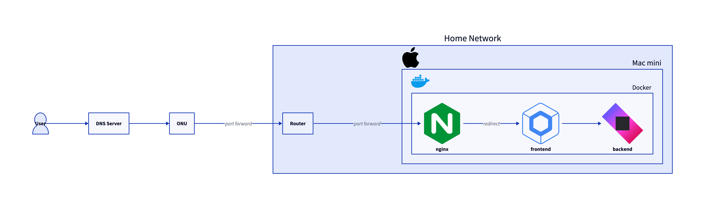

この度は、ホームサーバを作りました。まだ作ったばかりなので、色々と改善や課題があるかと思いますが、一通りの構成を整えたので、その構成について簡単に説明します。

## なぜ自作サーバを作るのか

最近は無料で使えるクラウドのサービスも多く、FirebaseやVercelなどのサービスを使えば、簡単にWebアプリケーションを公開することができます。なので既存のサービスを利用するだけで良いのでは？ということは自分でも考えたことはありますが、そこであえて自作サーバを作ることになった理由について簡単に説明します。

### 性能

多くのクラウドで提供するVMやサーバレスのサービスは、CPUやメモリ、ストレージなどに制限があることが多いです。また、AWSやGCPといったサービスの場合、使われているCPUのアーキテクチャがBroadwellのような、かなり旧時代のものが使われていることが多いですね。それに比べ、今回自作サーバの構築に使ったマシンはM2 ProのMac miniなので、IPCで比べるとより高い性能を期待できます。メモリも同じく、32GBのメモリを搭載しているので、メモリの制約もないですね。

### 費用

無料のサービスだと基本的に費用はかからなくても、セキュリティのためのWAFのような追加の機能を追加したり、データベースを使ったりすると、結局はお金がかかることが多いです。そして使用量が多くなるとあまり費用が安いわけでもないですね。当分は趣味や個人的に使うための機能のためだけに使いたいので、少しでも支出を減らしたいと思いました。自作サーバだと電気代がかかることはありますが、Mac miniの場合は消費電力が少ないので、それほど気にならなく、使っていない時はスリープにしておけば電気代も抑えられると思います。

### 機能

サーバレスやVMの場合、場合によっては対応するランタイムが決まっていたり、DBの選択肢が限られていたりすることがあります。例えば、今もOracle Cloudの無料のインスタンスを利用中ですが、無料の場合PostgreSQLを利用できないのでVMの中にDBを起動する形となっています。このように既存のプラットフォームを使うと自分が使いたい機能よりも、サービスの提供する機能に合わせる必要があることがありますね。今回は特にそういった制約を受けずに、自分が使いたい技術を使って自由にサービスを構築したいと思いました。

### その他

他にも色々な理由を書きましたが、最も大きな理由は2台のMacを使っているところで、余っているリソースを活用したいと思ったところですね。移動がある時はMacBook Proを使っていて、常に使っているのはMac miniなのでサーバとして運用して、外からもアクセスできるようにしたいと思いました。

## インフラ構成

インフラの場合、まず全体を図で表すと以下のようになります。



### ONU

自宅では、NURO光を利用しているので、そもそもネットの接続のためにはONUが必要ですね。ONUはOptical Network Unitの略で、光回線を利用してインターネットに接続するための装置です。基本的なルータとしての機能も揃っているものです。

私の場合ONUとは別にWi-Fiルータを使っているので、ONUの設定としてはフォートフォワードだけを設定しておきました。TCPの80番ポートと443番ポートをフォートフォワードしておけば、外部からONUの後ろにアクセスが可能になります。

### ルータ

次はルータです。先に説明した通り、ONUにはルータとしての機能も揃っているのであえて使う必要はないものですが、ルータが提供している無料のDDNSの機能を使うために、ルータを使っています。ONUだけではIPが固定されていないので、ルータのDDNSを使い、さらにそれを購入したドメインに紐付けることで、常に同じドメインでアクセスできるようになります。固定のドメインがあるので、SSL証明書も取得しやすくなりますね。ここでも80番ポートと443番ポートをフォートフォワードしておきます。

### サーバ

サーバは、上述したMac miniを使っています。中ではDockerコンテナとしてビルドしたNginxとKtorのアプリケーションが動いています。Nginxはリバースプロキシとして動いており、Ktorのアプリケーションにリクエストを転送しています。Ktorアプリケーションでは静的ファイルの配信ができるので、Compose Web(WASM)で作成したWebアプリケーションを配信しています。

DockerでNginxとKtorは同じネットワークとして構成しているので、NginxからKtorにアクセスする際は、コンテナ名でアクセスできます。Nginxが80番ポートと443番ポートからのリクエストを受けて、Ktorのアプリケーションに転送しています。そしてCertbotを使ってSSL証明書を取得しているので、HTTPSでアクセスできるようになっています。80番のリクエストは301リダイレクトで443番にリダイレクトです。

これらの構成は、以下のようにDocker Composeで定義しています。

```yaml
services:
  nginx:
    build:
      context: .
      dockerfile: Dockerfile_nginx
    container_name: nginx
    ports:
      - "80:80"
      - "443:443"
    volumes:
      - certs:/etc/letsencrypt
      - certs-data:/var/www/certbot
    networks:
      - home_network

  certbot:
    image: certbot/certbot
    container_name: certbot
    volumes:
      - certs:/etc/letsencrypt
      - certs-data:/var/www/certbot
    networks:
      - home_network

  app:
    build:
      context: .
      dockerfile: Dockerfile
    image: app:latest
    container_name: app
    ports:
      - "8888:8888"
    networks:
      - home_network
    depends_on:
      - nginx

networks:
  home_network:
    driver: bridge

volumes:
  certs:
  certs-data:
```

また、不正アクセスを防ぐためにNginxは以下のようなDockerfileでビルドしています。

```Dockerfile
# ベースイメージとして最新の Nginx を使用
FROM nginx:latest

# 必要なパッケージをインストール（git, wget, dnsutils）
RUN apt-get update && apt-get install -y \
    git \
    dnsutils \
    wget \
    && rm -rf /var/lib/apt/lists/*

# Nginx Ultimate Bad Bot Blocker のリポジトリをクローン
RUN git clone https://github.com/mitchellkrogza/nginx-ultimate-bad-bot-blocker.git /opt/nginx-ultimate-bad-bot-blocker

# 必要なディレクトリを作成し、bot 設定ファイルをコピー
RUN mkdir -p /etc/nginx/bots.d /usr/local/sbin \
    && cp /opt/nginx-ultimate-bad-bot-blocker/bots.d/* /etc/nginx/bots.d/ \
    && cp /opt/nginx-ultimate-bad-bot-blocker/conf.d/globalblacklist.conf /etc/nginx/conf.d/

# install-ngxblocker スクリプトのダウンロードと実行
RUN wget https://raw.githubusercontent.com/mitchellkrogza/nginx-ultimate-bad-bot-blocker/master/install-ngxblocker -O /usr/local/sbin/install-ngxblocker \
    && chmod +x /usr/local/sbin/install-ngxblocker \
    && /usr/local/sbin/install-ngxblocker -x

# setup-ngxblocker スクリプトのダウンロードと実行
RUN wget https://raw.githubusercontent.com/mitchellkrogza/nginx-ultimate-bad-bot-blocker/master/setup-ngxblocker -O /usr/local/sbin/setup-ngxblocker \
    && chmod +x /usr/local/sbin/setup-ngxblocker \
    && /usr/local/sbin/setup-ngxblocker -x

# Nginx のカスタム設定ファイルを追加（nginx.conf や default.conf を追加する）
COPY ./nginx/nginx.conf /etc/nginx/nginx.conf
COPY ./nginx/default.conf /etc/nginx/conf.d/default.conf

# 証明書のためのボリューム（Let's Encrypt を使用する場合）
VOLUME ["/etc/letsencrypt", "/var/www/certbot"]

# Nginx 設定をテストして起動
CMD ["nginx", "-g", "daemon off;"]
```

## 課題

概ねインフラの構成には問題がないですが、アプリケーションの部分にはいくつか課題を感じました。主にFrontendで使っているCompose Web(Wasm)のことです。

### Routing未対応

Wasmで作成したアプリケーションの特徴なのかもしれませんが、基本的にSPAのような静的コンテンツを生成するのもあり、まだAlphaのため色々と未対応の部分があります。特にRoutingが未対応なので、ページ遷移が課題ですね。まだ公式はないのですが、直近で[Compose Wasmに対応するRoutingのライブラリ](https://mvnrepository.com/artifact/app.softwork/routing-compose-wasm-js)がリリースされたり、他にもいくつかあるので今回はそれを使ってみようと思います。

### Safari 未対応

Wasmの場合、ブラウザによっては動作しないことがあります。Compose Webの場合、Safariでは動作しないことがわかっているので、Safariでの動作を考える必要があります。理由はGCにまだ未対応だからとのことですね。Macを使う場合でもSafariを使っているユーザは少ないと思いますが、iOSの場合はSafariを使うユーザが多いので、これはなかなか大きな課題ですね。ただ、[SafariでももうすぐWasmGCに対応する](https://www.publickey1.jp/blog/24/safariwasmgcsafari_technology_preview_202wasmgc.html)とのことなので、それまで待つしかないですね。

### CJK未対応

いわゆる日本語や中国語、韓国語などの文字が未対応です。Compose Webの場合、まだCJKの文字が未対応のようで、日本語を入力すると文字化けしてしまいます。これはおそらくフォントないしはレンダリングの問題のようで、[こちらのやりとり](https://github.com/JetBrains/compose-multiplatform/issues/3967)を見ると最新のComposeのバージョンで一部を解消したようですが、Koltinのバージョンによっては使えなかったりするのでまだ色々と調整が必要そうです。

## 最後に

今回は主にインフラの構成の話になりましたが、Composeを使ってKotlinだけで完結するようなアプリケーションを作るのも目的の一つだったので、もしできれば今後はComposeを使ったアプリケーションの開発についても書いていけたらと思います。Compose Webの場合はJSの時代から少し触っていたものの、最近はWasmの方に力を入れてきたのもあって、まだまだ未対応の部分が多いですが、これからの発展が楽しみですね。個人的には、commonパッケージを通じてサーバとクライアントのコードを共有できるのが一番の魅力だと思っているので、色々とアーキテクチャなどを考えながら開発していきたいと思います。

それでは、また！
