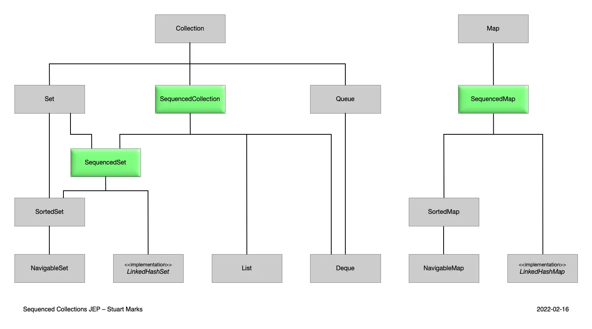

Java 17이 나온 지 약 2년이 지났고, 이번 달에는 Java 21이 출시됩니다. 아직도 프로젝트에 따라서는 Java 7 같은 오래된 버전을 쓰는 경우가 적지 않지만, Java 21은 새로운 LTS이므로 앞으로 새 프로젝트를 시작할 때는 충분히 검토해 볼 만한 선택지라고 생각합니다. 그래서 이번 글에서는 Java 21에서 눈에 띄는 변화들을 간단히 정리해 보겠습니다.

이번 글은 Java 17 이후의 변화를 중심으로 다룹니다. Java 11에서 17까지의 변화가 궁금하다면 [Java 17에서 무엇이 바뀌었나](../java-enter-to-17/)를 참고해 주세요.

## 언어 사양

### String Templates (Preview)

Kotlin 같은 언어에는 문자열 안에 변수를 자연스럽게 끼워 넣는 String Interpolation 기능이 있습니다. 예를 들어 `x`와 `y`라는 값이 있을 때 Kotlin에서는 이렇게 쓸 수 있습니다.

```kotlin
val s = "$x plus $y equals ${x + y}"
```

반면 Java에서는 같은 일을 하려면 보통 아래처럼 작성하게 됩니다.

```java
// String concatenation
String s = x + " plus " + y + " equals " + (x + y);

// StringBuilder
String s = new StringBuilder()
                 .append(x)
                 .append(" plus ")
                 .append(y)
                 .append(" equals ")
                 .append(x + y)
                 .toString();

// String.format
String s = String.format("%2$d plus %1$d equals %3$d", x, y, x + y);
String t = "%2$d plus %1$d equals %3$d".formatted(x, y, x + y);

// MessageFormat
MessageFormat mf = new MessageFormat("{0} plus {1} equals {2}");
String s = mf.format(x, y, x + y);
```

이런 방식은 전반적으로 장황하고 읽기도 좋지 않습니다. 그래서 Java 21에는 String Templates라는 기능이 들어왔습니다.

다만 Java는 단순한 문자열 보간 대신, SQL Injection 같은 문제까지 고려한 다른 접근을 택했습니다. 문자열 안에 값을 바로 끼워 넣는 것이 아니라, 먼저 [템플릿](https://download.java.net/java/early_access/jdk21/docs/api/java.base/java/lang/StringTemplate.html)을 만들고 그것을 처리하는 방식입니다.

```java
// STR 사용 예
String name = "Joan";
String info = STR."My name is \{name}"; // My name is Joan

// RAW 사용 예
String name = "Joan";
StringTemplate st = RAW."My name is \{name}";
String info = STR.process(st); // My name is Joan
```

[STR](https://download.java.net/java/early_access/jdk21/docs/api/java.base/java/lang/StringTemplate.html#STR)와 [RAW](https://download.java.net/java/early_access/jdk21/docs/api/java.base/java/lang/StringTemplate.html#RAW)는 먼저 `StringTemplate` 인스턴스를 만듭니다. 이 객체는 `fragments`와 `values`를 가지고 있는데, `fragments`는 변수 자리를 빈 문자열로 치환한 문자열 조각들이고 `values`는 실제 값 목록입니다. 그래서 최종 문자열뿐 아니라, 템플릿에 들어간 값 자체도 따로 다룰 수 있습니다.

```java
int x = 10, y = 20;
StringTemplate st = RAW."\{x} plus \{y} equals \{x + y}";
String s = st.toString(); // StringTemplate{ fragments = [ "", " plus ", " equals ", "" ], values = [10, 20, 30] }
```

또 `StringTemplate`에는 `Processor` 인터페이스가 있어서, 필요하다면 직접 구현해 활용할 수도 있습니다.

```java
// Processor Interface
public interface StringTemplate {
    @FunctionalInterface
    public interface Processor<R, E extends Throwable> {
        R process(StringTemplate st) throws E;
    }
}

var INTER = StringTemplate.Processor.of(StringTemplate::interpolate);
String s = INTER."\{x} plus \{y} equals \{x + y}";
```

아직 Preview 기능이기 때문에 문법이나 사용 방식이 바뀔 가능성은 있습니다. 그래도 개인적으로는 꽤 흥미로운 접근이라고 느꼈습니다.

### Sequenced Collections

Java의 컬렉션은 종류에 따라 첫 요소나 마지막 요소를 꺼내는 방식이 제각각입니다. 예를 들어 첫 번째와 마지막 요소를 얻는 코드만 봐도 컬렉션 타입마다 모양이 달라집니다.

```java
// List
var firstOnList = list.get(0);
var lastOnList = list.get(list.size() - 1);

// Deque
var firstOnDeque = deque.getFirst();
var lastOnDeque = deque.getLast();

// SortedSet
var firstOnSortedSet = sortedSet.first();
var lastOnSortedSet = sortedSet.last();

// LinkedHashSet
var firstOnLinkedHashSet = linkedHashSet.iterator().next();
var lastOnLinkedHashSet = linkedHashSet.stream().reduce((first, second) -> second).orElse(null);
```

역순 순회도 마찬가지입니다. 하고 싶은 일은 같은데 컬렉션에 따라 코드 모양이 꽤 다릅니다.

```java
// NavigableSet with descendingSet
for (var e: navigableSet.descendingSet()) {
    process(e);
}

// Deque with reverse Iterator
for (var it = deque.descendingIterator(); it.hasNext(); ) {
    var e = it.next();
    process(e);
}

// List with reverse ListIterator
for (var it = list.listIterator(list.size()); it.hasPrevious(); ) {
    var e = it.previous();
    process(e);
}
```

게다가 구현 클래스에 따라서는 순서를 보존하던 컬렉션이 래핑 과정에서 그 성질을 잃는 경우도 있습니다. 예를 들어 `LinkedHashSet`을 `Collections.unmodifiableSet()`으로 감싸면 순서 보존 특성이 드러나지 않게 됩니다.

그래서 Java 21에는 [SequencedCollection](https://download.java.net/java/early_access/jdk21/docs/api/java.base/java/util/SequencedCollection.html)과 [SequencedSet](https://download.java.net/java/early_access/jdk21/docs/api/java.base/java/util/SequencedSet.html)이 추가됐습니다.

```java
interface SequencedCollection<E> extends Collection<E> {
    // new method
    SequencedCollection<E> reversed();
    // methods promoted from Deque
    void addFirst(E);
    void addLast(E);
    E getFirst();
    E getLast();
    E removeFirst();
    E removeLast();
}

interface SequencedSet<E> extends Set<E>, SequencedCollection<E> {
    SequencedSet<E> reversed();    // covariant override
}
```

Map에도 [SequencedMap](https://download.java.net/java/early_access/jdk21/docs/api/java.base/java/util/SequencedMap.html)이 추가됐습니다.

```java
interface SequencedMap<K,V> extends Map<K,V> {
    // new methods
    SequencedMap<K,V> reversed();
    SequencedSet<K> sequencedKeySet();
    SequencedCollection<V> sequencedValues();
    SequencedSet<Entry<K,V>> sequencedEntrySet();
    V putFirst(K, V);
    V putLast(K, V);
    // methods promoted from NavigableMap
    Entry<K, V> firstEntry();
    Entry<K, V> lastEntry();
    Entry<K, V> pollFirstEntry();
    Entry<K, V> pollLastEntry();
}
```

이 인터페이스들이 추가되면서 컬렉션 계층 구조도 바뀌었습니다.


*출처: OpenJDK - [JEP 431: Sequenced Collections](https://openjdk.org/jeps/431)*

상속 구조가 바뀌면 다운캐스팅 문제가 걱정될 수도 있지만, 예를 들어 `List`는 `SequencedCollection`을 상속하므로 그대로 새 메서드를 사용할 수 있습니다.

### Generational ZGC

ZGC는 Java 11에서 도입된 GC인데, Java 21에서는 Generational ZGC가 추가됐습니다. ZGC 힙을 Young Generation과 Old Generation으로 나누어, 더 자주 Young GC를 수행할 수 있게 하는 방식입니다. 이를 통해 Young 영역 GC 시간을 줄이고 메모리나 CPU 오버헤드를 낮추는 방향을 목표로 합니다.

Generational ZGC는 아래 옵션으로 사용할 수 있습니다.

```bash
java -XX:+UseZGC -XX:+ZGenerational
```

물론 새로운 GC의 설계나 구현 세부는 [공식 문서](https://openjdk.org/jeps/439)에 잘 정리돼 있습니다. 하지만 애플리케이션 개발자 입장에서는 결국 "실제 성능 이점이 얼마나 있느냐"가 더 궁금합니다. 그런 면에서는 [이 글](https://timefold.ai/blog/2023/java-21-performance/)이 참고가 될 수 있습니다. 글의 결론만 보면 아직은 ParallelGC가 가장 성능이 좋다고 합니다. 다만 이런 결과는 머신 스펙, 특히 메모리 환경에 따라 달라질 수 있으니, 실제로는 직접 테스트해 보는 편이 가장 확실하겠습니다.

### Record Patterns

Java 16에서는 [Pattern Matching](https://openjdk.org/jeps/394)이 도입되면서 `instanceof` 이후 캐스팅 코드를 더 간결하게 쓸 수 있게 됐습니다.

```java
// Prior to Java 16
if (obj instanceof String) {
    String s = (String)obj;
    ... use s ...
}

// As of Java 16
if (obj instanceof String s) {
    ... use s ...
}
```

Java 21에서는 이 패턴 매칭을 [Record](https://openjdk.org/jeps/395)에도 적용할 수 있게 됐습니다.

```java
// As of Java 16
record Point(int x, int y) {}

static void printSum(Object obj) {
    if (obj instanceof Point p) {
        int x = p.x();
        int y = p.y();
        System.out.println(x+y);
    }
}

// As of Java 21
static void printSum(Object obj) {
    if (obj instanceof Point(int x, int y)) {
        System.out.println(x+y);
    }
}
```

중첩된 Record도 매칭할 수 있습니다.

```java
static void printXCoordOfUpperLeftPointWithPatterns(Rectangle r) {
    if (r instanceof Rectangle(ColoredPoint(Point(var x, var y), var c),
                               var lr)) {
        System.out.println("Upper-left corner: " + x);
    }
}
```

### Pattern Matching for switch

Pattern Matching 개선은 `switch`에도 반영됐습니다. 이제 `case null`을 다룰 수 있고, 스마트 캐스트나 `when` 조건도 함께 사용할 수 있습니다.

```java
static void testStringEnhanced(String response) {
    switch (response) {
        case null -> { }
        case "y", "Y" -> {
            System.out.println("You got it");
        }
        case "n", "N" -> {
            System.out.println("Shame");
        }
        case String s
        when s.equalsIgnoreCase("YES") -> {
            System.out.println("You got it");
        }
        case String s
        when s.equalsIgnoreCase("NO") -> {
            System.out.println("Shame");
        }
        case String s -> {
            System.out.println("Sorry?");
        }
    }
}
```

이 기능은 Enum에도 적용됩니다.

```java
static void exhaustiveSwitchWithBetterEnumSupport(CardClassification c) {
    switch (c) {
        case Suit.CLUBS -> {
            System.out.println("It's clubs");
        }
        case Suit.DIAMONDS -> {
            System.out.println("It's diamonds");
        }
        case Suit.HEARTS -> {
            System.out.println("It's hearts");
        }
        case Suit.SPADES -> {
            System.out.println("It's spades");
        }
        case Tarot t -> {
            System.out.println("It's a tarot");
        }
    }
}
```

아직 primitive type에는 적용되지 않지만, 이 부분도 이후 버전에서 더 개선될 가능성이 있어 보입니다.

### Foreign Functions and Memory Access API (Third Preview)

Java 19부터 들어온 기능으로, Java runtime 밖의 코드나 데이터에 접근할 수 있게 해 주는 API입니다. Java 21에서는 Third Preview로 제공되며, Java에서 C나 C++ 코드를 직접 호출할 수 있습니다.

```java
// 1. Find foreign function on the C library path
Linker linker          = Linker.nativeLinker();
SymbolLookup stdlib    = linker.defaultLookup();
MethodHandle radixsort = linker.downcallHandle(stdlib.find("radixsort"), ...);
// 2. Allocate on-heap memory to store four strings
String[] javaStrings = { "mouse", "cat", "dog", "car" };
// 3. Use try-with-resources to manage the lifetime of off-heap memory
try (Arena offHeap = Arena.ofConfined()) {
    // 4. Allocate a region of off-heap memory to store four pointers
    MemorySegment pointers
        = offHeap.allocateArray(ValueLayout.ADDRESS, javaStrings.length);
    // 5. Copy the strings from on-heap to off-heap
    for (int i = 0; i < javaStrings.length; i++) {
        MemorySegment cString = offHeap.allocateUtf8String(javaStrings[i]);
        pointers.setAtIndex(ValueLayout.ADDRESS, i, cString);
    }
    // 6. Sort the off-heap data by calling the foreign function
    radixsort.invoke(pointers, javaStrings.length, MemorySegment.NULL, '\0');
    // 7. Copy the (reordered) strings from off-heap to on-heap
    for (int i = 0; i < javaStrings.length; i++) {
        MemorySegment cString = pointers.getAtIndex(ValueLayout.ADDRESS, i);
        javaStrings[i] = cString.getUtf8String(0);
    }
} // 8. All off-heap memory is deallocated here
assert Arrays.equals(javaStrings,
                     new String[] {"car", "cat", "dog", "mouse"});  // true
```

지금까지는 Java에서 다른 언어로 만든 라이브러리나 애플리케이션을 사용할 때 wrapper나 runtime을 거치는 경우가 많았는데, 이 API를 이용하면 더 직접적으로 호출할 수 있게 됩니다. 그 결과 애플리케이션 크기를 줄이거나 성능을 개선할 여지도 생길 수 있습니다.

다만 아직 Preview이고, 직접 메모리에 접근하기 때문에 메모리 누수 같은 문제를 일으킬 가능성도 있습니다. 실제 사용 시에는 주의가 필요합니다.

### Unnamed Patterns and Variables (Preview)

사용하지 않는 변수를 `_`로 표시할 수 있게 됐습니다.

```java
// Loop
int acc = 0;
for (Order _ : orders) {
    if (acc < LIMIT) { 
        ... acc++ ...
    }
}

// Multiple assignment
Queue<Integer> q = ... // x1, y1, z1, x2, y2, z2, ...
while (q.size() >= 3) {
    var x = q.remove();
    var _ = q.remove();
    var _ = q.remove(); 
    ... new Point(x, 0) ...
}

// Catch block
String s = ...
try { 
    int i = Integer.parseInt(s);
    ... i ...
} catch (NumberFormatException _) { 
    System.out.println("Bad number: " + s);
}

// try-with-resources
try (var _ = ScopedContext.acquire()) {
    ... no use of acquired resource ...
}

// Lambda
stream.collect(Collectors.toMap(String::toUpperCase, _ -> "NODATA"))
```

### Virtual Threads

Project Loom이라는 이름으로 오랫동안 개발돼 온 기능입니다. 개인적으로는 Java 21에서 가장 주목받는 기능 중 하나라고 생각합니다.

기존 멀티스레드 프로그래밍은 생성 가능한 스레드 수에 물리적인 한계가 있었는데, 가상 스레드는 OS 스레드를 더 잘게 나눠 사용하는 방식이라 훨씬 많은 스레드를 동시에 다룰 수 있습니다.

사용법 자체는 기존 스레드 모델과 크게 다르지 않습니다.

```java
try (var executor = Executors.newVirtualThreadPerTaskExecutor()) {
    IntStream.range(0, 10_000).forEach(i -> {
        executor.submit(() -> {
            Thread.sleep(Duration.ofSeconds(1));
            return i;
        });
    });
}  // executor.close() is called implicitly, and waits
```

가상 스레드는 실제 OS 스레드와 1:1로 대응하지 않기 때문에, 기존처럼 ThreadPool을 만들어 스레드 수를 세밀하게 제한할 필요가 거의 없습니다. 공식 문서에서도 굳이 풀링을 권장하지 않을 정도입니다.

실제로 [Kotlin에서 Java 가상 스레드를 활용하도록 Dispatcher를 구현해 실험한 글](https://kt.academy/article/dispatcher-loom)을 보면, 30스레드 머신에서도 100만 개의 가상 스레드를 생성해 처리할 수 있었다고 합니다. JVM 기반 서버 애플리케이션에서는 그동안 스레드 수를 제한해야 했던 경우가 많았으니, 가상 스레드 도입으로 훨씬 많은 요청을 동시에 다룰 수 있을 것으로 기대됩니다.

### Unnamed Classes and Instance Main Methods (Preview)

이제 함수를 톱레벨에 정의할 수 있습니다. 전통적인 Hello World 예제도 훨씬 단순해집니다.

```java
// Prior to Java 21
public class HelloWorld { 
    public static void main(String[] args) { 
        System.out.println("Hello, World!");
    }
}

// As of Java 21
void main() {
    System.out.println("Hello, World!");
}
```

톱레벨 함수나 필드도 Unnamed Class의 멤버로 취급되므로 이런 코드도 동작합니다.

```java
// Method
String greeting() { return "Hello, World!"; }

void main() {
    System.out.println(greeting());
}

// Field
String greeting = "Hello, World!";

void main() {
    System.out.println(greeting);
}
```

또한 `main`을 가진 Unnamed Class는 아래처럼 실행할 수 있습니다.

```java
new Object() {
    // the unnamed class's body
}.main();
```

### Scoped Values (Preview)

웹 애플리케이션에서는 보통 하나의 요청에 하나의 스레드가 할당되고, 그 안에서 일관된 컨텍스트를 유지하며 처리하는 경우가 많습니다. 그런데 이 컨텍스트를 객체로 다루려면 기존에는 함수 인자로 계속 넘겨야 했습니다.

```java
@Override
void handle(Request request, Response response, FrameworkContext context) {
    ...
    var userInfo = readUserInfo(context);
    ...
}

private UserInfo readUserInfo(FrameworkContext context) {
    return (UserInfo)framework.readKey("userInfo", context);
}
```

또는 [ThreadLocal](https://docs.oracle.com/en/java/javase/18/docs/api/java.base/java/lang/ThreadLocal.html)을 쓸 수도 있습니다.

```java
public class Framework {
    private final Application application;
    public Framework(Application app) { this.application = app; }
    
    private final static ThreadLocal<FrameworkContext> CONTEXT 
                       = new ThreadLocal<>();

    void serve(Request request, Response response) {
        var context = createContext(request);
        CONTEXT.set(context);
        Application.handle(request, response);
    }

    public PersistedObject readKey(String key) {
        var context = CONTEXT.get();
        var db = getDBConnection(context);
        db.readKey(key);
    }
}
```

하지만 `ThreadLocal`은 몇 가지 문제가 있습니다. 값이 변경 가능하다는 점, 더 이상 필요하지 않은 값을 적절히 정리해야 한다는 점, 그리고 그에 따른 오버헤드가 있다는 점입니다.

그래서 Java 21에는 [ScopedValue](https://download.java.net/java/early_access/jdk21/docs/api/java.base/java/lang/ScopedValue.html)가 추가됐습니다.

```java
class Framework {
    private final static ScopedValue<FrameworkContext> CONTEXT 
                        = ScopedValue.newInstance();

    void serve(Request request, Response response) {
        var context = createContext(request);
        ScopedValue.where(CONTEXT, context)
                   .run(() -> Application.handle(request, response));
    }
    
    public PersistedObject readKey(String key) {
        var context = CONTEXT.get();
        var db = getDBConnection(context);
        db.readKey(key);
    }
}
```

`ScopedValue`에는 setter가 없지만 그렇다고 값을 바꿀 수 없는 것은 아닙니다. `ThreadLocal`과는 다른 방식으로, 특정 값을 바인딩한 범위 안에서 `run()`을 실행하게 됩니다.

```java
private static final ScopedValue<String> X = ScopedValue.newInstance();

void foo() {
    ScopedValue.where(X, "hello").run(() -> bar());
}

void bar() {
    System.out.println(X.get()); // prints hello
    ScopedValue.where(X, "goodbye").run(() -> baz());
    System.out.println(X.get()); // prints hello
}

void baz() {
    System.out.println(X.get()); // prints goodbye
}
```

이 방식은 값이 스레드 실행 전체에 계속 남아 있지 않기 때문에, `ThreadLocal`보다 더 안전하게 사용할 수 있습니다.

### Vector API (Sixth Incubator)

예전 `java.util.Vector`와는 관계없는, 수치 계산용 Vector API입니다. 행렬이나 벡터 연산 같은 계산을 더 효율적으로 처리하기 위한 목적입니다.

```java
// Prior to Java 21
void scalarComputation(float[] a, float[] b, float[] c) {
   for (int i = 0; i < a.length; i++) {
        c[i] = (a[i] * a[i] + b[i] * b[i]) * -1.0f;
   }
}

// As of Java 21
static final VectorSpecies<Float> SPECIES = FloatVector.SPECIES_PREFERRED;

void vectorComputation(float[] a, float[] b, float[] c) {
    int i = 0;
    int upperBound = SPECIES.loopBound(a.length);
    for (; i < upperBound; i += SPECIES.length()) {
        // FloatVector va, vb, vc;
        var va = FloatVector.fromArray(SPECIES, a, i);
        var vb = FloatVector.fromArray(SPECIES, b, i);
        var vc = va.mul(va)
                   .add(vb.mul(vb))
                   .neg();
        vc.intoArray(c, i);
    }
    for (; i < a.length; i++) {
        c[i] = (a[i] * a[i] + b[i] * b[i]) * -1.0f;
    }
}
```

일반적인 웹 애플리케이션에서는 당장 쓸 일이 많지 않을 수도 있습니다. 하지만 수치 계산이 중요한 영역에서는 기존 코드보다 더 빠르게 병렬 연산을 수행할 여지가 있으니, 사용처가 분명히 있을 것 같습니다.

### Deprecate the Windows 32-bit x86 Port for Removal

Windows x86-32 포트는 제거 예정 단계로 들어가며, 우선 Deprecated 처리됩니다. 가상 스레드도 해당 환경에서는 기대만큼 성능 향상이 어렵고, 마지막 32비트 지원 Windows였던 Windows 10 역시 2025년 10월에 지원 종료되기 때문에 자연스러운 수순처럼 보입니다.

### Prepare to Disallow the Dynamic Loading of Agents

Java 에이전트의 동적 로드는 실행 중인 애플리케이션을 바꿀 수 있습니다. 하지만 이런 기능은 애플리케이션 무결성을 해칠 가능성도 있습니다. 그래서 앞으로는 기본적으로 동적 로드를 막는 방향으로 가고, Java 21에서는 우선 경고를 출력합니다.

```text
WARNING: A {Java,JVM TI} agent has been loaded dynamically (file:/u/bob/agent.jar)
WARNING: If a serviceability tool is in use, please run with -XX:+EnableDynamicAgentLoading to hide this warning
WARNING: If a serviceability tool is not in use, please run with -Djdk.instrument.traceUsage for more information
WARNING: Dynamic loading of agents will be disallowed by default in a future release
```

이 경고를 피하려면 애플리케이션 실행 시 `-XX:+EnableDynamicAgentLoading` 옵션을 넣어야 합니다. [Datadog](https://www.datadoghq.com/)이나 [JMX](https://docs.oracle.com/cd/F25597_01/document/products/wls/docs90/jmxinst/understanding.html)처럼 모니터링 도구가 이런 기능에 의존할 수 있기 때문에, 앞으로는 관련 도구들의 구현 방식도 조금씩 바뀔 수 있겠습니다.

### Key Encapsulation Mechanism API

최신 암호화 알고리즘을 지원하기 위한 API입니다. 양자 컴퓨터 환경에서는 기존 암호화 방식이 더 이상 안전하지 않을 수 있다는 이야기가 많고, 공식 문서에서도 `Post-Quantum Cryptography standardization process`를 언급하고 있습니다.

이 API는 새로운 알고리즘 기반의 공개키/비밀키 쌍 생성, 캡슐화, 캡슐 해제 등을 지원합니다.

```java
// Receiver side
KeyPairGenerator g = KeyPairGenerator.getInstance("ABC");
KeyPair kp = g.generateKeyPair();
publishKey(kp.getPublic());

// Sender side
KEM kemS = KEM.getInstance("ABC-KEM");
PublicKey pkR = retrieveKey();
ABCKEMParameterSpec specS = new ABCKEMParameterSpec(...);
KEM.Encapsulator e = kemS.newEncapsulator(pkR, specS, null);
KEM.Encapsulated enc = e.encapsulate();
SecretKey secS = enc.key();
sendBytes(enc.encapsulation());
sendBytes(enc.params());

// Receiver side
byte[] em = receiveBytes();
byte[] params = receiveBytes();
KEM kemR = KEM.getInstance("ABC-KEM");
AlgorithmParameters algParams = AlgorithmParameters.getInstance("ABC-KEM");
algParams.init(params);
ABCKEMParameterSpec specR = algParams.getParameterSpec(ABCKEMParameterSpec.class);
KEM.Decapsulator d = kemR.newDecapsulator(kp.getPrivate(), specR);
SecretKey secR = d.decapsulate(em);
```

### Structured Concurrency (Preview)

병렬 처리를 더 단순하게 만들기 위한 API입니다. 여러 스레드에서 실행되는 하위 작업을 하나의 작업 단위처럼 다룰 수 있게 해 줍니다.

예를 들어 아래 코드는 `user`와 `order`를 각각 다른 스레드에서 가져와 응답을 구성합니다.

```java
Response handle() throws ExecutionException, InterruptedException {
    Future<String>  user  = esvc.submit(() -> findUser());
    Future<Integer> order = esvc.submit(() -> fetchOrder());
    String theUser  = user.get();   // Join findUser
    int    theOrder = order.get();  // Join fetchOrder
    return new Response(theUser, theOrder);
}
```

이 방식에는 몇 가지 문제가 있습니다.

- `findUser()`가 실패해도 `fetchOrder()`는 계속 실행돼 자원을 낭비할 수 있다.
- `handle()`을 실행한 스레드가 인터럽트돼도 하위 작업은 계속 돌 수 있다.
- `findUser()`가 지나치게 오래 걸리면, `fetchOrder()`가 이미 실패했더라도 기다리게 될 수 있다.

Java 21의 새 API는 이런 문제를 아래처럼 다룰 수 있게 해 줍니다.

```java
Response handle() throws ExecutionException, InterruptedException {
    try (var scope = new StructuredTaskScope.ShutdownOnFailure()) {
        Supplier<String>  user  = scope.fork(() -> findUser());
        Supplier<Integer> order = scope.fork(() -> fetchOrder());

        scope.join()            // Join both subtasks
             .throwIfFailed();  // ... and propagate errors

        // Here, both subtasks have succeeded, so compose their results
        return new Response(user.get(), order.get());
    }
}
```

[StructuredTaskScope](https://download.java.net/java/early_access/jdk21/docs/api/java.base/java/util/concurrent/StructuredTaskScope.html)를 사용하면 다음과 같은 장점이 있습니다.

- `findUser()` 또는 `fetchOrder()` 중 하나가 실패하면 나머지 작업을 취소할 수 있다.
- `handle()` 실행 스레드가 인터럽트되면 하위 작업도 함께 취소된다.
- 병렬 처리 흐름이 구조적으로 더 명확해진다.

## API

이번에 추가된 API들은 각 JEP와 Javadoc에 잘 정리돼 있습니다. 버전별로 추가된 항목을 확인하고 싶다면 [Javadoc 링크](https://download.java.net/java/early_access/jdk21/docs/api/new-list.html)를 보는 편이 빠릅니다.

## 마지막으로

요즘은 Java로 직접 애플리케이션을 작성하는 경우가 많지 않고, 주로 Kotlin을 쓰고 있습니다. 그래서 새 API 중에는 제 코드에 바로 영향을 주지 않는 것도 많습니다. 그래도 Virtual Threads처럼 Kotlin에서도 활용할 수 있는 기능이 있고, Tomcat이나 Netty처럼 Java로 작성된 미들웨어가 이런 변화를 바탕으로 더 좋아질 수 있다고 생각하면 꽤 반갑습니다.

또 Java 쪽에서 새롭게 제시하는 접근법은 Kotlin과는 다른 방향을 보여 주는 경우도 많아서, 언어를 넘어서 공부할 만한 내용이 많다고 느꼈습니다.

현재는 업무에서 Java 17을 쓰고 있지만, Java 21도 조만간 직접 써 보고 싶습니다. 특히 다음 시기에는 Kotlin 2.0도 함께 보게 될 테니, Java의 새 기능을 잘 활용해서 Kotlin 빌드와 애플리케이션 성능까지 더 좋아질 수 있으면 좋겠습니다.
