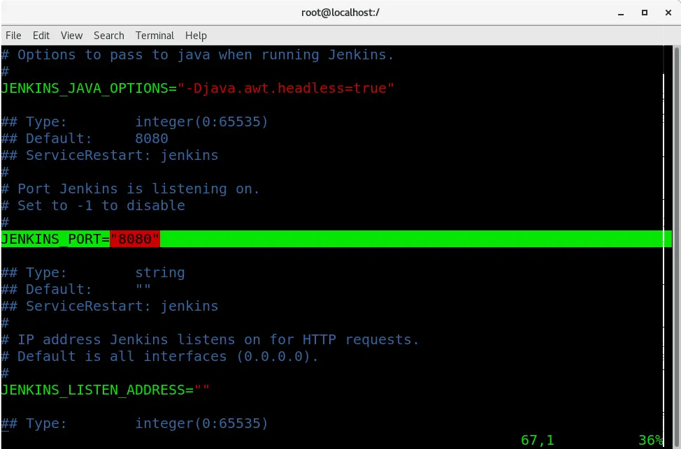
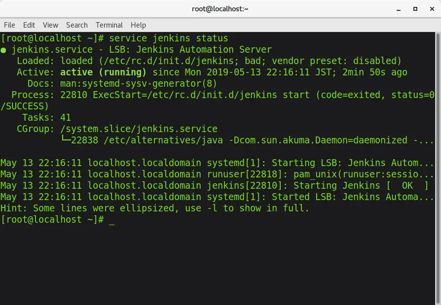
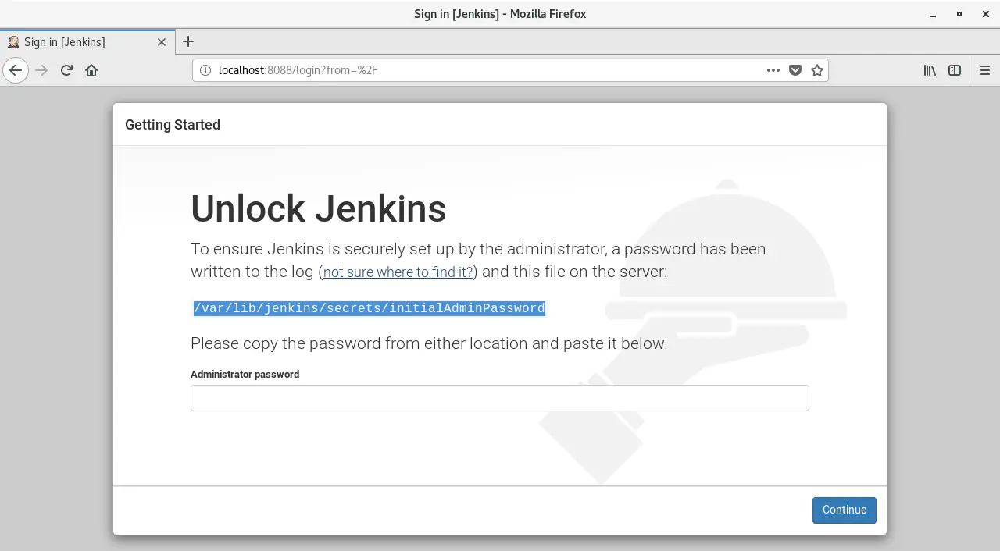
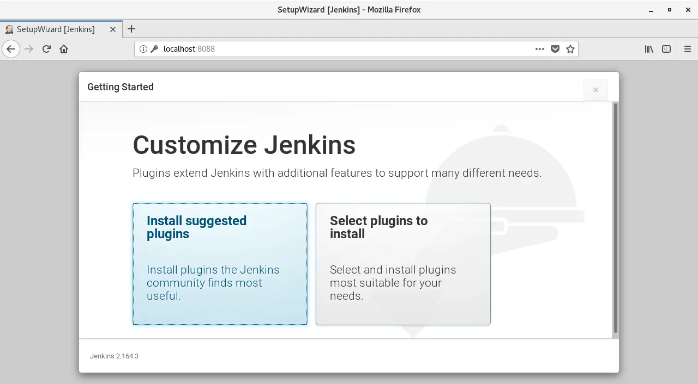
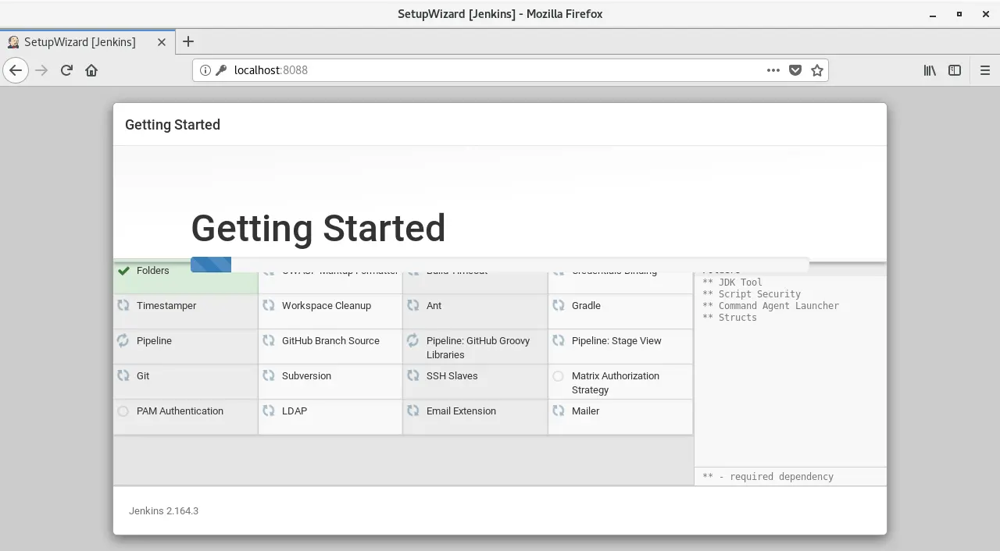
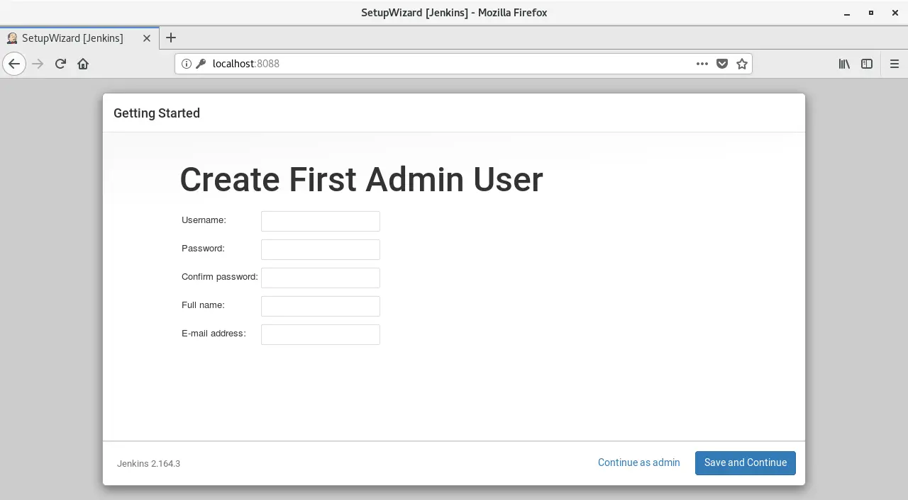
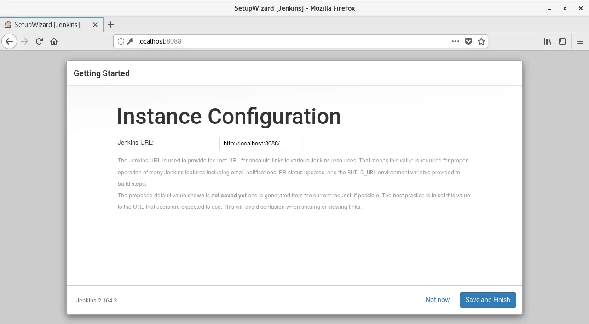
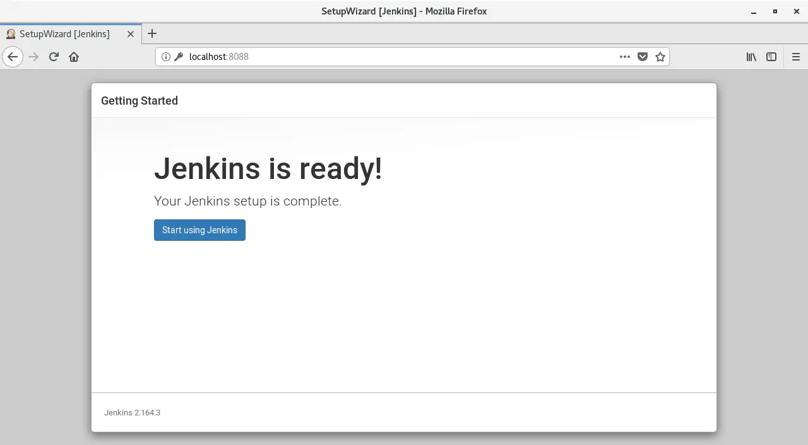
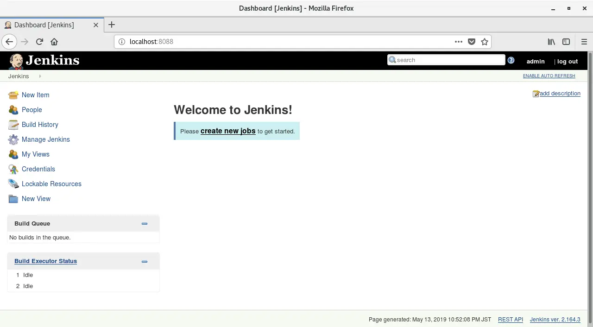

Continuing from last time. After installing Jenkins, it's time for initial configuration. Getting started is always the most troublesome part of anything, but doing the initial settings properly will make the rest of the work much easier. So this time I would like to first talk about the initial settings of Jenkins.

The initial settings for Jenkins are roughly in the following order. There may be other settings that would be useful if you made them, but please use this as a reference as this is based on my point of view as a beginner.

## Port settings

The base port for Jenkins is `8080`. If you start Jenkins as is, you can connect to Jenkins from a web browser with `IP address of the system running Jenkins:8080`.

However, if you have experience developing web applications, you will know that port 8080 is not a good option. Two or more services configured on the same port can cause problems. [^1]

I thought I might use Tomcat later, so I changed the Jenkins port to `8088`. You can open the Jenkins system configuration file with `vi` or `vim`[^2].

```bash
sudo vim /etc/sysconfig/jenkins
```

Then, a screen like the one below will appear. If you scroll down a little, you'll see it's kindly written as `JENKINS_PORT`! Press `I` to switch to insert mode and change to your favorite port.



When you have finished rewriting, do not forget to save and exit with `ESC` -> `:wq`.

## Startup ~ Setting initial password

Jenkins will ask for an initial password the first time you start it. The location where this initial password is stored seems to be basically saved in a path called `/var/lib/jenkins/secrets/initialAdminPassword`, but the path may change depending on the environment such as the OS. [^3]But don't worry, you can check the path from the initial settings page once you start Jenkins.

After setting the port (you can leave it as is if you want to use 8080 as is), first start Jenkins.

```bash
service jenkins start
```

The message `[OK]` should be output (there may be a problem with the port settings), but just to be sure, check the startup status.

```bash
service jenkins status
```

In fact, Dr. Jenkins, who had been fine the day before because he was at work, suddenly found himself unable to connect. After all, when people experience something bad, they become more cautious. Once you see the message `Active: active (running)`, you can finally connect to the Jenkins page.



Enter `IP address of the system running Jenkins:port number` in your web browser to connect to the Jenkins page. Of course, you can also connect using `localhost:8080` etc. from the running system.



As expected, the path was `/var/lib/jenkins/secrets/initialAdminPassword`. As with port settings, look inside with vi or vim and enter the password.

```bash
sudo vim /var/lib/jenkins/secrets/initialAdminPassword
```

## Configuring plugins and administrator accounts

If you successfully enter your password, the plugin settings screen will appear after a while. It seems like you could choose the plug-in yourself, but I'm not confident in it, so I'll press the Recommend button. Of course, you can install plugins later.



Once you press the recommended button, the plugin installation will proceed automatically, so just wait.



After installing the plugin, the next step is to set up an administrator account. I will get angry if I don't meet even one item, so I will write them all down.



Next to setting the administrator account is setting the connection address. I think it's fine as is (I installed CentOS and run Jenkins on a virtual machine), so I'll leave it as is.



Then, a screen will appear saying that Jenkins has been prepared. It's been a long time...I'm going to press the button to use it now.



Jajaan. We finally arrived. This is the main screen of Jenkins. The journey so far has been really long. Still, Jenkins is a powerful tool, so I think it's worth going this far.



Next, I would like to explain specifically what kind of tasks (Jobs) I created and executed together with Mr. Jenkins. Let's meet again!

(continued)

[^1]: This is especially true when implementing a web application using something like Spring Framework. Tomcat's basic port is also `8080`.

[^2]: It's always difficult to choose between vi and vim. Vim is better in that it's more colorful and the code is easier to read, but it's not installed on some systems.

[^3]: When I installed it on macOS, there were cases where the initial password path was directly under the user home directory. This may be because it was installed as a non-root user.
