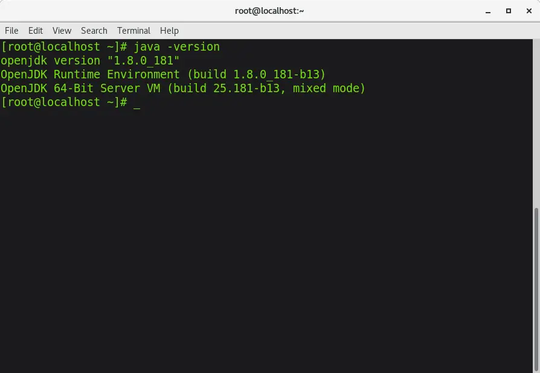
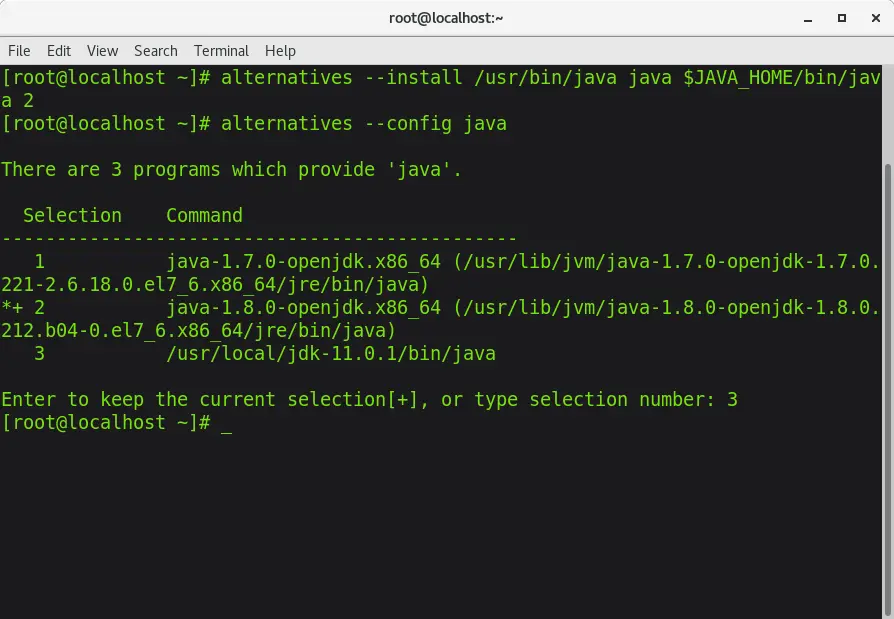
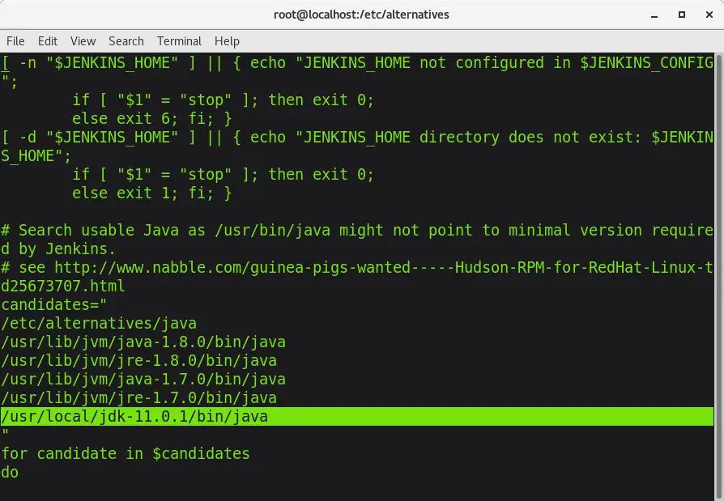
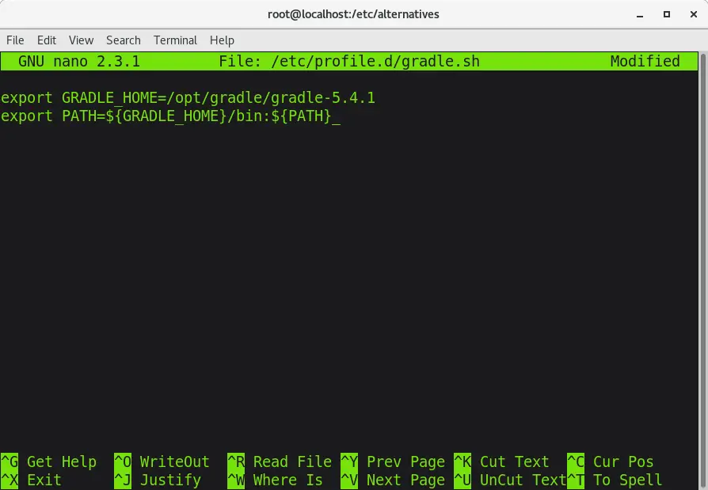
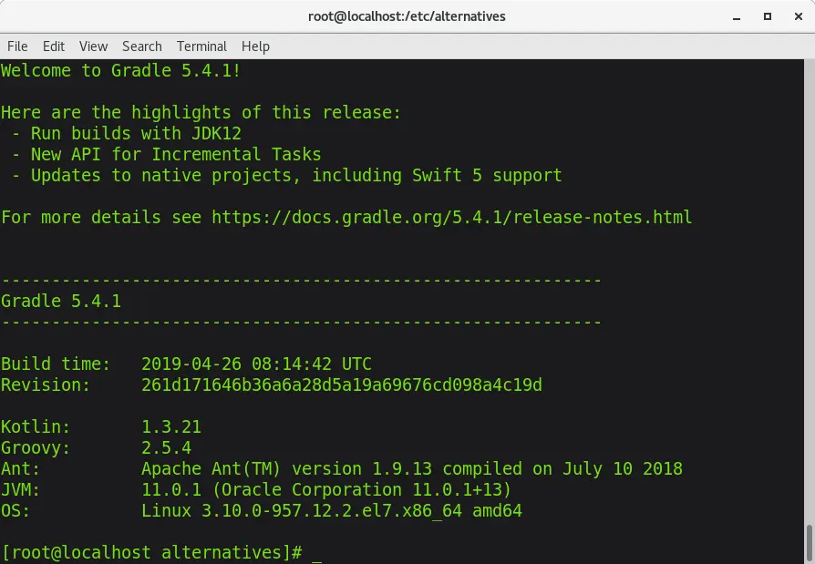
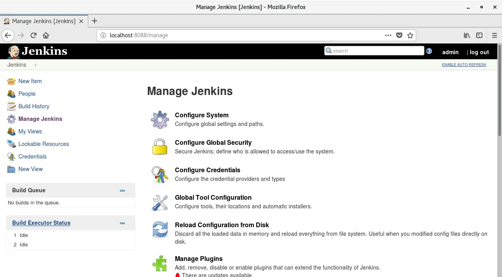
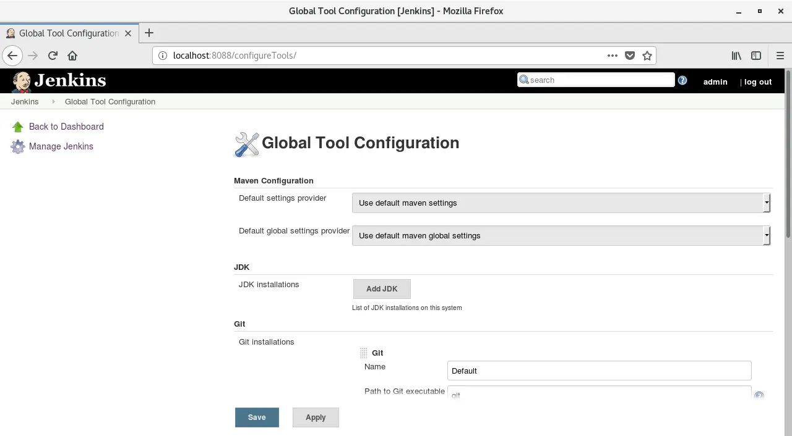
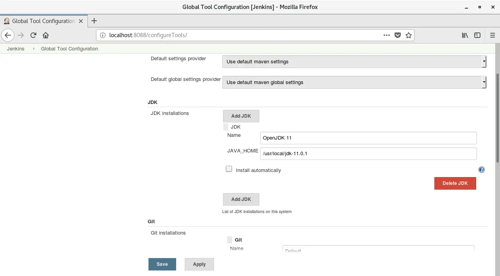
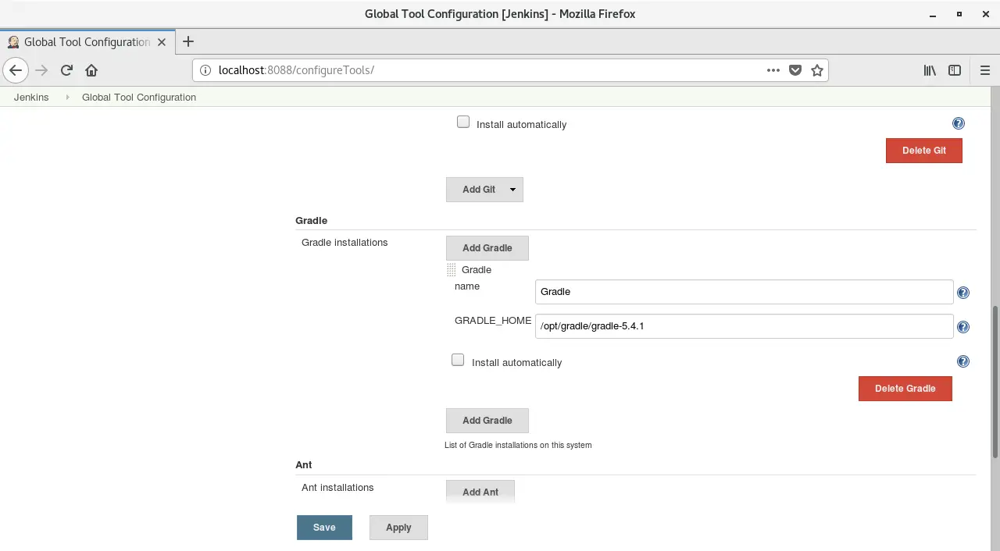

There are several tasks at work that I would like to automate using Jenkins. There are also several steps required to accomplish the task. Of course it is important to have the imagination to want to do something, but I think it is more important than anything to create the necessary environment to do something. In this post, I would like to talk about the tasks I was given at work and the process I went through to prepare them.

First, pull the Spring Boot application from Git and build it. First of all, I have worked with Spring Framework[^1], but this was my first time using Spring Boot. Although I have used Maven before, I had never touched a project using Gradle like this one. Spring Boot and Gradle are said to be easier to initialize than before, but since I had only ever run applications in Eclipse, I did not even have a starting point at first.

I also didn't know how to configure jobs in Jenkins, so I started by researching how to configure and automate jobs in Jenkins.

In Jenkins, you can create a task named Job, set a certain action inside it, and execute it as a unit. Like all programs, it's like a shell script in Linux, automating actions that need to be repeated. The completed Job can then be executed manually or by specifying conditions (trigger).

Let's look back at this task. I have a Java application on Git. Pull it (bring the source code to the server where Jenkins is running) and build it (make it into an executable package). Jenkins is now ready to deploy a runnable application while ensuring you have the latest source code. The first tools you need are JDK and Gradle.

## Let's install OpenJDK

First of all, Jenkins can be run on Java 8, but this application used Java 11. Install OpenJDK11[^2]. `yum install java` will install Oracle's Java, so if you want to install OpenJDK you will need to do a few more steps. This time I will use curl instead of wget.

```bash
curl -O https://download.java.net/java/GA/jdk11/13/GPL/openjdk-11.0.1_linux-x64_bin.tar.gz
```

curl -O downloads a file from a URL and saves it. The downloaded file is compressed, so unzip it.

```bash
tar zxvf openjdk-11.0.1_linux-x64_bin.tar.gz
```

tar is a command used to compress and decompress. z means .gz file, x means to expand the compressed file, v means to display the processed file, and f means to specify this file. Once unzipped, store the file in the appropriate location.

```bash
mv jdk-11.0.1 /usr/local/
```

Next, write a simple shell script. This is for setting environment variables on Linux. First, create a file using vi or vim.

```bash
vi /etc/profile.d/jdk11.sh
```

Press i and write the following content. Please check the path where Java is stored.

```bash
export JAVA_HOME=/usr/local/jdk-11.0.1
export PATH=$PATH:$JAVA_HOME/bin
```

Save and exit with `ESC` -> `:wq`. Now apply the shell script to the current state with the `source` command.

```bash
source /etc/profile.d/jdk11.sh
```

OpenJDK11 is now prepared. I'm using CentOS7, but there seem to be different procedures for different Linux systems such as Ubuntu. Anyway, let's check with `java -version` whether the installation is completed properly.



Huh? Java version is 8. It was already installed.

## Switch the version of Java you want to use

If you already have a different version of JDK installed, you can select the Java version you want to use by following these steps:
First, register the newly installed Java so that it can be selected.

```bash
alternatives --install /usr/bin/java java $JAVA_HOME/bin/java 2
```

After registration is complete, use the following command to display the currently registered Java.

```bash
alternatives --config java
```

Two versions of Java were already installed when CentOS was installed. Enter 3 because Java11 is now number 3. Java is now ready.



By the way, Jenkins is also made with Java, so in some cases it can be started with Java 11 JVM. To register Java 11 JVM with Jenkins, follow the steps below.

```bash
vi /etc/init.d/jenkins
```

Jenkins configuration file. The paths for various JVM versions are listed in the candidates section, so add the path to the OpenJDK 11 bin folder here. `Esc` then `:wq` to finish!



## Let's also install Gradle

Next, install Gradle. It was easy to install with `brew install gradle` on macOS, but it seems that the same steps as OpenJDK are required on Linux. I'll try using wget again.

```bash
wget https://services.gradle.org/distributions/gradle-5.4.1-bin.zip -P /tmp
```

-P option saves the file in the specified folder.

```bash
sudo unzip -d /opt/gradle /tmp/gradle-5.4.1-bin.zip
```

Since it is a zip file, unzip it using the unzip command. `-d` is also an option to specify a folder (directory).

```bash
sudo nano /etc/profile.d/gradle.sh
```

This time I will create a script using nano. It feels more like a GUI. If you don't have nano, you can install it with `yum install nano` or use vi.

I often use vi because it can be used anywhere (depending on the environment, even if you have sudo privileges, you may not be able to install various things without permission), but I think nano is more intuitive and easier to use.



Enter the following content as shown in the attached image.

```bash
export GRADLE_HOME=/opt/gradle/gradle-5.4.1
export PATH=${GRADLE_HOME}/bin:${PATH}
```

In nano, if you press ctrl+x, you will be asked if you want to save the edited content. Press Y and then enter to save. For me, who uses a US standard keyboard, I like it because it's easier to input than :wq.

Next, give execution permission to the created script and register it as an environment variable with the `source` command.

```bash
sudo chmod +x /etc/profile.d/gradle.sh
$ source /etc/profile.d/gradle.sh
```

I have often written commands like chmod 755, but it seems better to use +x to only give execution permission.

```bash
gradle -v
```

To check if the installation was successful, check the version. If the following screen is displayed, Gradle installation is successful.



It looks like the latest version supports Swift5. I would like to deal with this someday as well.

Now, let's go back to Jenkins and register JDK and Gradle as environments in Jenkins.

## Connect JDK and Gradle to Jenkins

I finally returned to Jenkins. It got to the point where I couldn't tell if this was a Jenkins post or a Linux post, but I came back anyway.

Enter `localhost:Jenkins port number` in your web browser to open the main Jenkins screen. Then click `Manage Jenkins` from the left menu. A screen like the one below will appear.



Press `Global Tool Configuration`. This is the screen where you can set environment variables used by Jenkins.



Press `ADD JDK` in the JDK section. The `install automatically` option is usually checked, but that option can only be installed with Oracle Java. Also, because there is a version restriction, uncheck it and enter the path to the installed Java 11 in `JAVA_HOME`. It should look like the following. You also need a `Name`, so enter something appropriate.



Next is Gradle. Like Java, it also has an option for automatic installation. However, the version is lower than the one we installed. So here too, remove the automatic installation option and enter the path. It will look like this:



Don't forget to press `Save` to save!

This completes the JDK and Gradle settings in Jenkins. Now you can build Java applications. In the next post, I would like to create a task to pull and build an application created with Spring Boot using Git.

[^1]: Strictly speaking, it can be said to be an older version rather than Spring Framework. Spring Boot is included in the Spring Framework. I would like to learn about Spring Boot someday, so I would like to post if I have a chance.
[^2]: Currently, up to Java 12 is available, but Jenkins only recently started supporting Java 11 (March 2019), so I chose Java 11 first.
