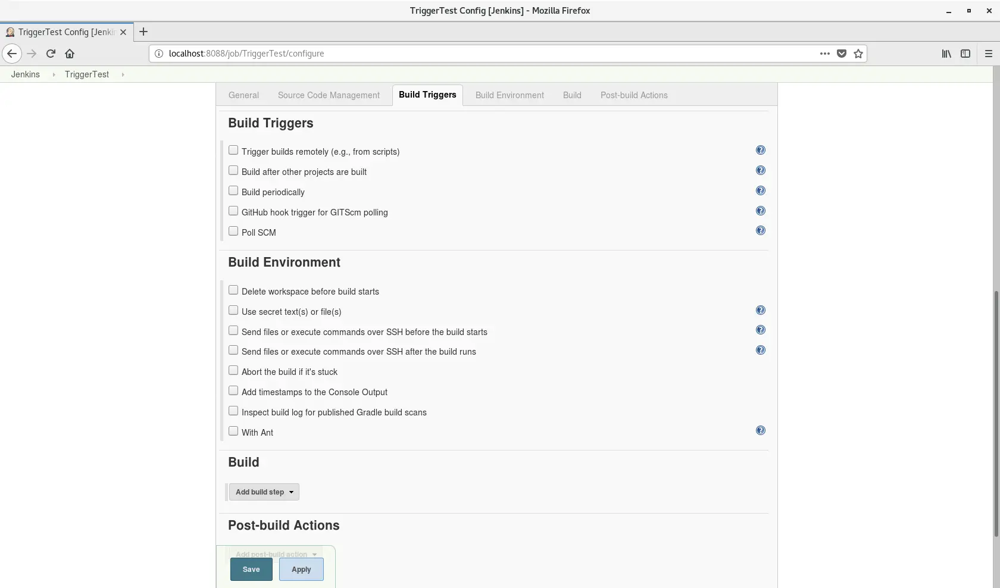
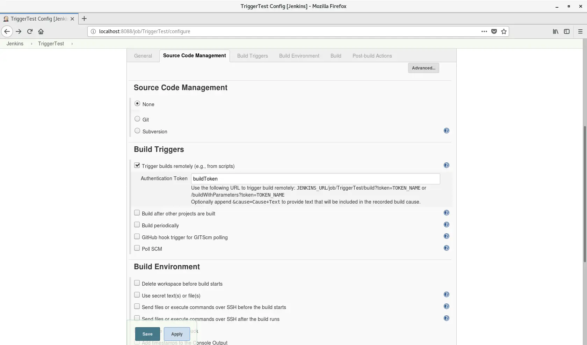
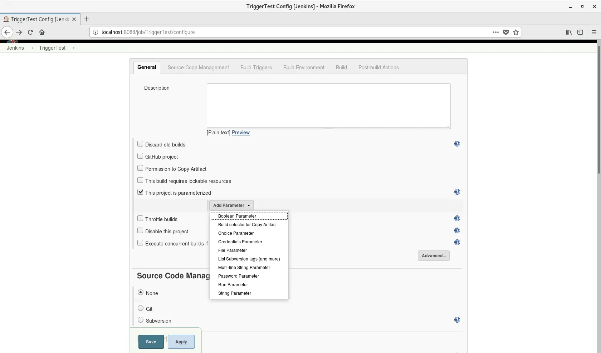
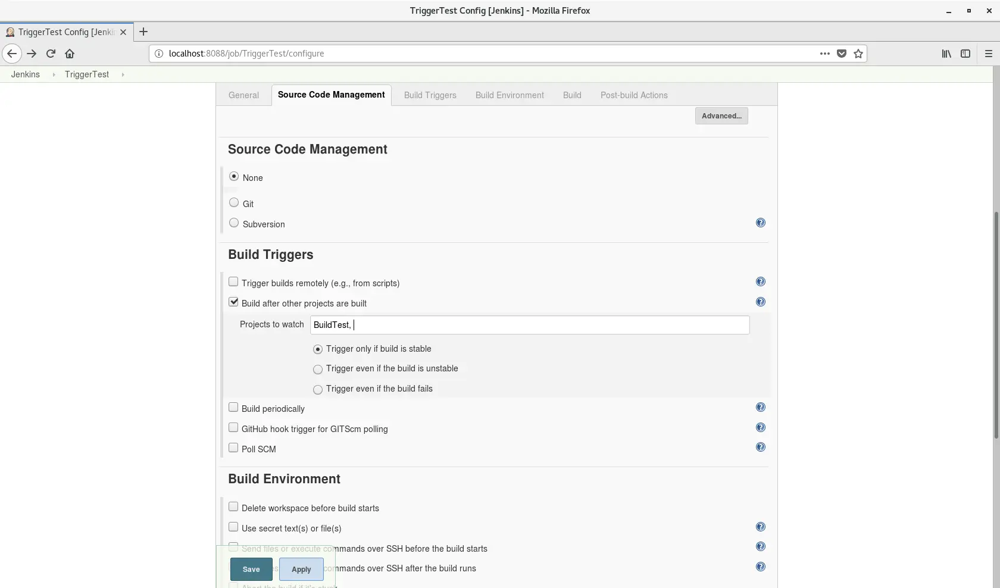
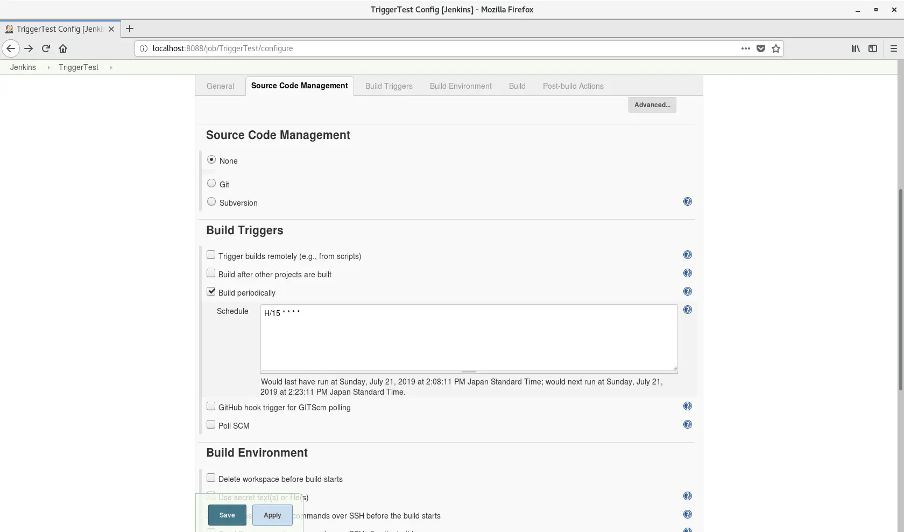
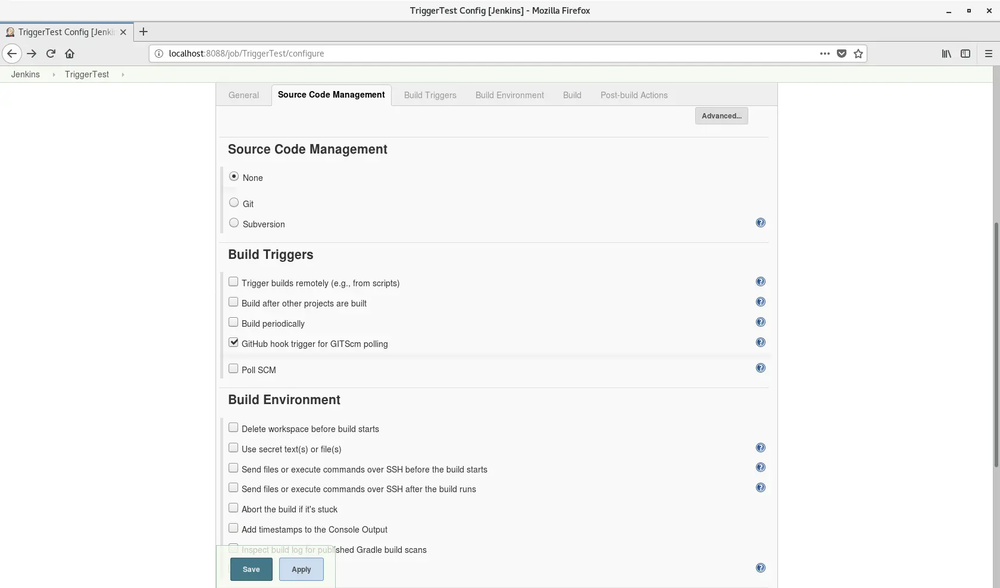
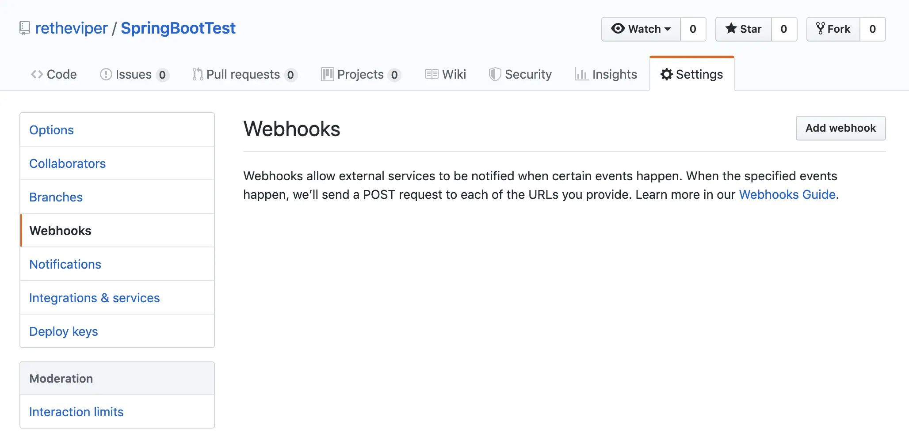
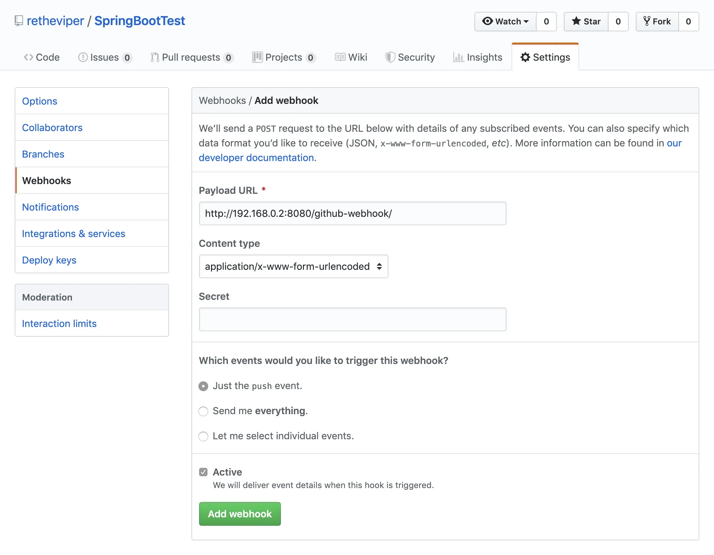
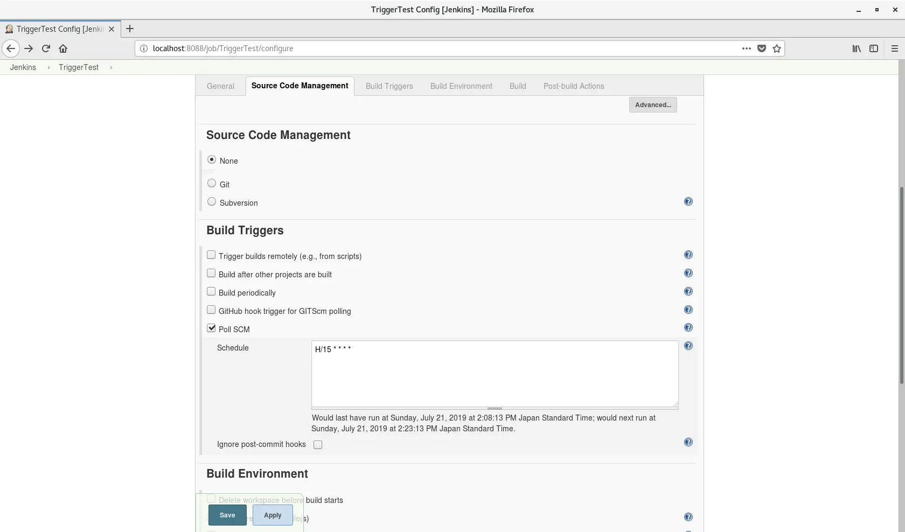

이번에는 Jenkins에서 Job을 자동 실행하는 방법을 정리해 보겠습니다. 관리 콘솔에서 직접 버튼을 눌러 실행할 수도 있지만, 매번 그렇게 처리하는 방식은 곧 불편해집니다. 결국 "특정 조건에서 자동으로 실행되게 만들고 싶다"는 요구가 생기게 됩니다. 예를 들어 정해진 시간마다 돌리거나, Git 저장소에 커밋이 들어왔을 때만 빌드하고 싶은 경우가 그렇습니다.

Jenkins의 Job에서는 이런 조건 기반 자동 실행을 설정할 수 있습니다. 이것을 `Build Trigger`라고 부릅니다. 기본 설정만으로도 필요한 경우는 어느 정도 커버되고, 플러그인을 조합하면 더 다양한 방식으로 Job을 실행할 수 있습니다. 이번 글에서는 어떤 트리거들이 있는지와 각각을 어떻게 쓰는지 정리해 보겠습니다.

## Build Trigger의 종류

Jenkins에서 Job을 만들면 `General`과 `Source Code Management` 탭 다음에 `Build Trigger` 탭이 있는 것을 확인할 수 있습니다. 플러그인 구성에 따라 항목은 조금씩 달라질 수 있으니 한 번 직접 확인해 보세요. 저는 Jenkins를 설치할 때 추천 플러그인 구성을 선택했기 때문에 다음과 같은 항목이 있었습니다.

- `Trigger builds remotely`
- `Build after other projects are built`
- `Build periodically`
- `GitHub hook trigger for GITScm polling`
- `Poll SCM`

이제 각 항목이 무슨 뜻인지 하나씩 보겠습니다.

## Trigger builds remotely

이 옵션은 이름 그대로 Jenkins 관리 콘솔에 들어가지 않아도 외부에서 Job을 실행할 수 있게 해 줍니다. 이 메뉴를 선택하면 URL을 통해 Job을 호출할 수 있습니다. `Authentication Token`에 인증용 토큰 이름을 넣으면 다음과 같은 주소로 Job을 실행할 수 있습니다.

Jenkins URL이 `192.168.0.2:8080`, Job 이름이 `TriggerTest`, 토큰 이름이 `buildToken`이라고 가정하면:

1. `http://192.168.0.2:8080/job/TriggerTest/build?token=buildToken`
2. `http://192.168.0.2:8080/job/TriggerTest/buildWithParameters?token=buildToken`

1번은 파라미터 없이 단순히 Job만 실행할 때 쓰고, 2번은 파라미터를 함께 넘기고 싶을 때 씁니다. 여기서 받는 파라미터는 `General` 탭에서 `This project is parameterized`를 체크하고 파라미터를 추가하면 설정할 수 있습니다. 이렇게 받은 값은 Job 내부의 셸 스크립트 등에서 외부 변수처럼 사용할 수 있습니다.

Linux의 `curl`처럼 외부에서 Job을 호출해야 할 때 유용한 기능입니다.

## Build after other projects are built

Jenkins에서는 Job을 여러 개 만들 수 있습니다. 서로 다른 역할을 하는 Job을 목적에 따라 나눠 두는 것이죠. 다만 경우에 따라서는 이 Job들을 연동해야 할 수도 있습니다. 같은 프로그램에서도 메서드나 클래스를 나눠 놓고 결국 함께 쓰는 것과 비슷합니다.

이 옵션을 선택하면 어떤 Job 뒤에 빌드할지 지정할 수 있습니다. 여러 Job을 등록하는 것도 가능합니다. `Projects to watch`에 먼저 빌드할 Job 이름을 넣고 아래 세 가지 옵션 중 하나를 고르면 됩니다. Jenkins의 실행 결과는 보통 `stable`(성공), `unstable`(일부 성공), `fail`(실패)로 나뉘며, 여기서는 이전 Job의 결과가 어느 상태였는지를 조건으로 삼습니다.

- `Trigger only if build is stable`
- `Trigger even if the build is unstable`
- `Trigger even if the build fails`

1번은 이전 Job이 정상적으로 빌드되었을 때만 실행합니다. 아티팩트가 필요할 때 이런 식으로 쓸 수 있습니다. 2번은 빌드가 불안정해도 실행하고, 3번은 실패하더라도 실행합니다. 목적이 다르니 상황에 맞게 선택하면 됩니다.

## Build periodically

시간 기준으로 정기 실행하고 싶다면 이 옵션을 씁니다. `Schedule` 칸에 Jenkins 고유 규칙에 맞춰 주기를 적으면 조건에 따라 Job이 자동으로 반복 실행됩니다. 형식이 꽤 복잡하지만 한 번만 정리해 두면 쓸모가 많습니다.

`기본 포맷`

1. 시간 단위는 공백으로 구분합니다.
2. 작성 순서는 분(minute), 시(hour), 일(day of month), 월(month), 요일(week)입니다.
3. `*`는 해당 위치에서 가능한 모든 값을 허용한다는 뜻입니다.
4. `M-N`처럼 `-`를 넣으면 범위를 지정할 수 있습니다.
5. `M-N/X` 또는 `*/X`는 간격 실행을 뜻합니다.
6. `A,B,C`처럼 여러 값을 나열할 수 있습니다.

주기적으로 실행되는 Job이 여러 개라면 `H`를 쓰는 것을 추천합니다. 예를 들어 Job이 10개인데 모두 `0 0 * * *`로 설정하면, 매일 0시에 모든 Job이 한꺼번에 실행됩니다. 서버 사양이 좋지 않거나 Job 수가 많다면 부하가 꽤 커질 수 있습니다.

반면 `H H * * *`로 두면 Jenkins가 알아서 분산해 상대적으로 부하가 적은 시간대에 실행합니다. `H`는 범위도 지정할 수 있어서 `H H(0-1) * * *`처럼 적으면 매일 0시부터 1시 사이의 낮은 부하 구간에 실행되도록 할 수 있습니다.

예시는 다음과 같습니다.

- 15분마다 실행: `H/15 * * * *`
- 매시간 0분부터 30분 사이에 10분 간격으로 실행: `H(0-29)/10 * * * *`
- 평일 9시부터 16시 사이에 2시간 간격으로 실행: `H 9-16/2 * * 1-5`
- 1월부터 11월 사이의 1일과 15일에만 실행: `H H 1,15 1-11 *`

포맷에 익숙해지기까지는 시간이 좀 걸리겠지만, 꽤 복잡한 규칙까지 표현할 수 있어서 유용한 기능입니다.

## GitHub hook trigger for GITScm polling

이 옵션은 GitHub와 연동해서 저장소에 Push가 들어오면 빌드가 실행되도록 하는 기능입니다. Jenkins 쪽에서는 이 옵션만 켠다고 끝나지만, GitHub에서 Push가 발생했다는 사실을 Jenkins에 알려 주는 설정이 별도로 필요합니다.

GitHub 저장소의 `Settings` 탭에 들어가 `Webhooks` 메뉴로 이동하면 아래와 같은 화면이 나옵니다.

여기서 `Add Webhooks`를 누르면 다음 화면으로 넘어갑니다.

여기서는 복잡한 설정이 필요 없고 `Payload URL`에 Jenkins URL과 `/github-webhook/`를 적어 주면 됩니다. 예를 들어 Jenkins URL이 `192.168.0.2:8080`이라면 `http://192.168.0.2:8080/github-webhook/`가 됩니다. 이제 저장소에 Push가 발생하면 Job이 자동으로 빌드됩니다.

## Poll SCM

SCM은 `Source Control Management`의 약자입니다.[^1] Git이나 SVN 같은 소스 관리 도구를 뜻합니다. `Poll SCM`을 선택하면 `Build periodically`처럼 `Schedule` 입력란이 나타납니다. 여기에도 주기를 적습니다. 다만 차이는, 정해진 시간이 되더라도 반드시 빌드가 실행되는 것은 아니라는 점입니다. 그 시점에 소스를 확인하고 변경이 있을 때만 빌드가 실행됩니다. Git이나 SVN과 연동해서 쓰기에 적합한 설정입니다.

## 마지막으로

여러 종류의 빌드 트리거를 지정할 수 있다는 점은 Jenkins의 큰 장점입니다. Git 연동과 스케줄 실행, 원격 호출을 적절히 조합하면 반복 작업을 꽤 유연하게 자동화할 수 있습니다. Jenkins 자체 업데이트나 서비스 재시작 같은 운영성 작업에도 응용할 수 있습니다.

나중에 또 유용한 활용법을 찾으면 Jenkins 관련 글을 이어서 써 보겠습니다.

[^1]: 소프트웨어 엔지니어링 관점에서는 `Software Configuration Management`의 약자이기도 합니다. 쉽게 말하면 소스 코드뿐 아니라 개발 환경이나 빌드 구조 같은 전체 환경 정보를 정의하고 관리하는 것을 뜻합니다.
