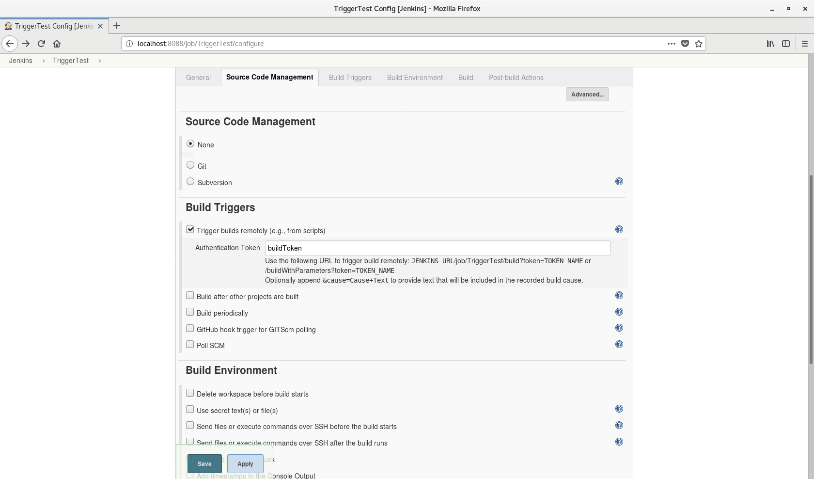
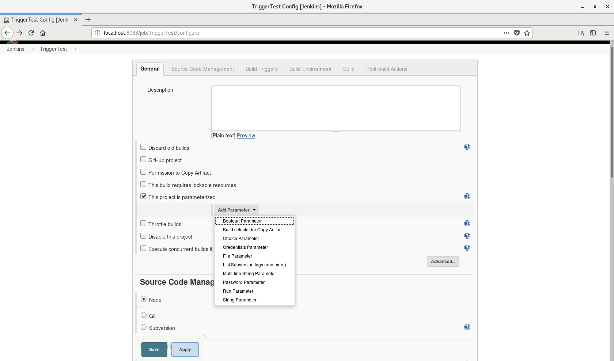

今回は、Jenkinsで生成したJobを実行する方法について述べたいと思います。基本的にJenkinsの管理コンソールでJobを実行することは可能ですが、いちいちログインしてJobを起動することは便利ではないです。なので「とある条件でJobを自動的に実行したい」と思うようになりますね。例えば簡単に考えられるものとしてまず「定期的実行」があるでしょう。特定の時間、もしくは頻度などを指定して自動的に実行してくれるバッチ的な処理にはこのような設定が必要ですね。また、とある条件が満たされた時にだけ実行したい場合もあります。たとえばGitのリポジトリにコミットが発生したときは、その時だけビルドしたいですね。

JenkinsのJobではこのような、条件によるJobの自動実行を設定することが可能です。これを`Build Trigger`と呼びます。基本設定でも必要なパターンの最低限は揃えていますし、プラグインの組み合わせによってはより多彩な設定でJobを実行するように設定できます。今回のポストでは、そのビルドトリガーにどんなものがあるか、またどのように使えるかということを述べたいと思います。

## Build Triggerの種類

JenkinsでJobを生成すると、GeneralとSource Code Managementのタブの後にBuild Triggerというタブがあることを確認できます。プラグインの構成が違うと増えたり減ったりもするので一度確認してみてください。私はJenkinsをインストールするときオススメのプラグイン構成を選んでいるので、以下の構成になっています。

- Trigger builds remotely
- Build after other projects are built
- Build periodically
- GitHub hook trigger for GITScm polling
- Poll SCM

では、これらの機能がそれぞれどんな意味を持ち、どう活用できるかを一つづつ見てみましょう。

## Trigger builds remotely

これは、「遠隔」という表現通り、Jenkinsの管理コンソールに接続しなくてもJobを外部から実行できるようにするという意味です。このメニューを選ぶと、URLでJobをコールできるようになります。`Authentication Token`に認証として使うトークン名を入力すると、以下のようなURLでJobをコールできます。

(JenkinsのURLが`192.168.0.2:8080`、Job名が`TriggerTest`、トークン名が`buildToken`であると仮定)

1. `http://192.168.0.2:8080/job/TriggerTest/build?token=buildToken`
2. `http://192.168.0.2:8080/job/TriggerTest/buildWithParameters?token=buildToken`

１番の設定は、パラメーターなしでただJobを実行するときに用います。２番目の場合は、パラメーターを渡したいときに使えますね。ここで受け取るパラメーターは、Generalタブで`This project is parameterized`をチェックし、パラメーターを追加すると設定できます。パラメーターで受け取った値はJobの中のシェルスクリプトなどで外部変数として使うことができます。

LinuxのCurlなど、外部からのコールが必要である時使うと便利な機能です。

## Build after other projects are built

JenkinsではJobを複数生成することができます。そしてJobを複数生成することはそれぞれ違う機能をするJobをそれぞれの目的に合わせて分けるという意味でしょう。ただ場合によってはそれらのJobを連携する必要もあるかもしれません。同じプログラムの中でもメソッドやクラスは分けてもそれらを繋いで使うことになりますので。

こちらのオプションをチェックすると、どんなJobの後にビルドするかを入力できます。複数のJobを登録することもできますね。`Projects to watch`に先にビルドしたいJob名を入力し、下の三つのオプションを選びます。JenkinsのJobの実行結果には`stable`(成功)`unstable`(一部成功)`fail`(失敗)の三段階があって、ここで選ぶのは前段階のJobがその三つのうちどのような結果になったかという判定の条件です。

- Trigger only if build is stable
- Trigger even if the build is unstable
- Trigger even if the build fails

１番目は、前段階のJobが成功的にビルドできた場合。成果物が必要だったりするとこちらのオプションですね。２番目はビルドが不安定でも実行する。また３番目は失敗しても実行する。各自目的と用途が違うので、必要に合わせて適合したものを選びましょう。

## Build periodically

時間による定期実行が欲しい場合はこちらのオプションを使います。`Schedule`の欄に、Jenkins固有のルールに合わせて周期を書くと自動的に条件に合わせてJobのビルドが繰り返されます。かなり複雑ではありますが、一旦紹介します。

`基本フォーマット`

1. 時間単位は空白を基準に分ける
2. 記入順は分(minute)、時間(hour)、日付(day of month)、月(month)、週(week)
  - 分(minute): 0から59までの数字
  - 時間(hour): 0から23までの数字
  - 日付(day of month): 1から31までの数字
  - 月(month): 1から12までの数字
  - 週(week): 0から7前での数字(0と７は日、1は月、2は火、3は水、4は木、5は金、6は土)
3. `*`は入力できる全範囲の値を許容するという意味(分の位置に入力すると0~59までの全数字)
4. `M-N`のように`-`を入れると範囲の指定が可能(`2-4`は2から4までの値)
5. `M-N/X`または`*/X`は合間の意味(時間の位置に`*/2`と入力すると、２時間置きという意味になる)
6. `A,B,C`のように複数の値を列挙できる

そのほかに、周期的に実行されるJobが複数ある場合は`H`を使うことがオススメです。例えばJobが10種類あって、それぞれを`0 0 * * *`にすると、全てのJobが毎日0時に実行されることになりますね。もしサーバーのスペックがあまりよくなかったり、Jobの数がそれ以上になると負荷は無視できないレベルになるはずです。

そこで`H H * * *`に指定すると、Jenkinsで自動判断を行い、サーバーへの負荷があまり発生しない時間帯にJobが実行されるようになります。もちろん`H`でも範囲の指定ができますので`H H(0-1) * * *`のように指定すると、毎日0時から1時までの間、負荷の低い時間帯にビルドが行われます。

このフォーマットに従って書かれたいくつかの例を見てみましょう。

- 15分置きでビルド実行: `H/15 * * * *`
- 毎時間の30分までに、10分置きでビルド実行(1時から1時半まで、2時から2時半までなど): `H(0-29)/10 * * * *`
- 平日の9時から16時の間、２時間置きにビルド実行: `H 9-16/2 * * 1-5`
- 1月から11月の間、1日と15日だけビルド実行: `H H 1,15 1-11 *`

フォーマットになれるまでは少し時間がかかりそうですが、かなり複雑なルールまで対応できるので魅力的なプションですね。

## GitHub hook trigger for GITScm polling

このオプションは[GitHub](https://github.com)との連動で、リポジトリにPushが発生するとビルドが行われるということです。Jenkins内ではこのオプションを選ぶだけであまり複雑な設定はないですが、GitHubのリポジトリでPushが発生したということをJenkins側に知らせるための設定が必要となります。

GitHubのリポジトリに入ると、上段に`Settings`というタブがあります。それをクリックし、さらに`Webhooks`というメニューに入ります。そうすると以下のような画面が現れます。

ここで`Add Webhooks`ボタンを押すと、また以下のような画面になります。

ここでも複雑な設定はいらなく、`Payload URL`にJenkinsのURL/github-webhookと書くだけです。例えばJenkinsのURLが`192.168.0.2:8080`だとすると、`http://192.168.0.2:8080/github-webhook/`と書きます。これでリポジトリにPushが発生したら、Jobは自動ビルドされます。WebサーバーでのGit管理もこれで簡単にできますね。

## Poll SCM

'

SCMとは、`Source Control Management(ソース管理構成)`のことです。[^1]GitやSVNなどのツールによる意味します。Poll SCMを選択すると、`Build periodically`同様`Schedule`の入力欄が現れます。ここに同じく周期を入力します。ただ何が違うかというと、設定した時間になっても必ずしもビルドが行われるのではないということです。設定した時間になるとソースの確認をして、そこで変更があった場合のみビルドが行われるらしいですね。GitやSVNの連動で使える設定みたいです。

## 最後に

様々なビルドトリガーの指定ができるゆえ、活用できる方法が多いという面もまたJenkinsの魅力ではないかと思います。Jenkins自体のアップデート対応も、周期的に`yum update`するようなJobを構成するとできそうな気がしますね。そのほか、Git連動と`systemctl`でのサービス管理機能を組み合わせて`Tomcat`や`Node.js`の管理もローカルでできますので便利です。

それではまた、便利な使い方を見つけたらJenkinsのポストを載せましょう！

[^1]: ソフトウェアエンジニアリングの観点からは、Software Configuration Management(ソフトウェア構成管理)の略でもあります。簡単にいうとソースコードだけでなく、開発環境やビルド構造などの全般的な環境情報を定義・管理することを構成管理というらしいです。
