This time, I would like to create a single job with Jenkins. First of all, as I wrote last time, the tasks I was asked to do were as follows. ``I have a Spring Boot application in Git, so I would like you to create a Job to build it.'' I looked in the repository and installed Java and Gradle, so I decided to start generating jobs.

This time, in order to create an environment similar to the one back then, I created a Spring Boot project in advance and uploaded it to Git.

## So what is Job?

The reason to use Jenkins is this Job. A Job is an `automated task` and can include execution conditions, frequency, and task content. For example, you can set up a job to run when someone pushes to a Git repository, or you can set up Git to automatically pull a job when it is executed.

Therefore, the fact that you can save a lot of time by starting Jenkins on the server and creating jobs as needed can be said to be all thanks to this job. This time, let's explain the steps to generate this Job.

## Generate a Job

Enter the Jenkins main page. Since there are no jobs, you can see that there is a link called `create new jobs` on the main screen. If there is no Job, you can also create one here. However, if you have any Jobs, click `New item` on the left menu to move to the new Job generation screen. Click on one.

Specify the Job name in `Enter an item name`. Also, below are some templates for what kind of Jobs to generate. Here, select `Freestyle project`. By the way, a folder with the same name as the name specified when creating the job will be created under the Jenkins folder `Workspace`, so we recommend that you create it without half-width alphanumeric characters or spaces as much as possible.

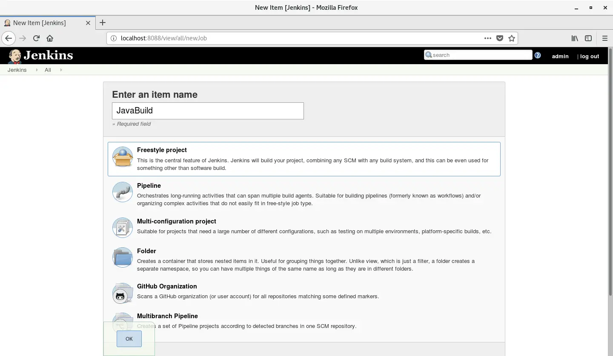

Once you have chosen a Job name and template, press `Ok` to generate the Job.

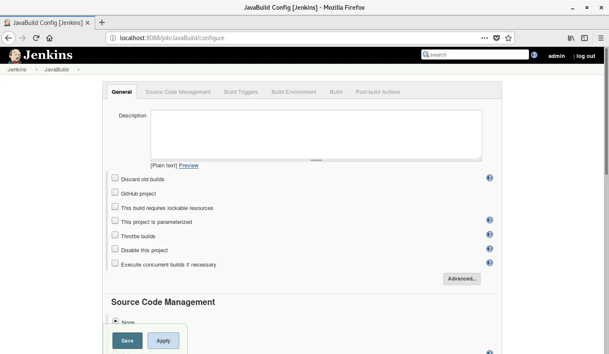

This is the main screen for job settings. The functions of each tab at the top of the screen are as follows.

- `General`: Job general settings. You can write a description of the Job (what kind of task it is, etc.), and configure settings such as whether to delete builds before build [^1].
- `Source Code Management`: Settings related to version control. Compatible with Git and Subversion. This time we will be using Git.
- `Build Triggers`: Trigger settings for how to execute the Job. You can configure settings such as whether to execute remotely via a URL or periodically.
- `Build Environment`: Settings related to the environment used when building a Job. Basically, a Job occupies a space called Workspace, and all files used during the build are saved in that folder. The basic path is `/var/lib/jenkins/workspace/[generated Job name]`.
- `Build`: Specify the action (task) when building the Job. This is where the main processing takes place.
- `Post-build Actions`: Specify the action to perform after the Job finishes building. You can specify actions such as building another Job.

The number of actions that can be specified for each tab may increase depending on what plugins are installed. It may be covered in another post, but for example, `Publish over SSH`

## Set up a Git repository

Now let's get serious about creating this task. First, we need to import the Java code from Git, so select Git from `Source Code Management`.

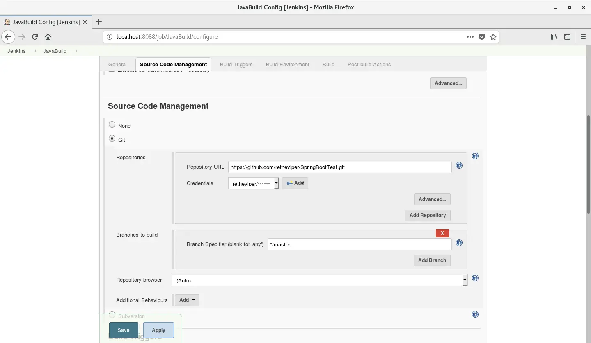

Enter the Git repository in `Repository URL`. If nothing is entered at first, a connection error will occur, but when you enter the URL, it will automatically try to connect to the repository, and if there is no problem, the error will disappear. Also, select authentication information such as ID to connect from `Credentials`. There will be nothing at first, so click on `Add` and enter your new credentials.

Currently, the repository I created has only one branch, but if you want to pull only a specific branch, you can specify it by entering the branch name in the `Branches to Build` field.

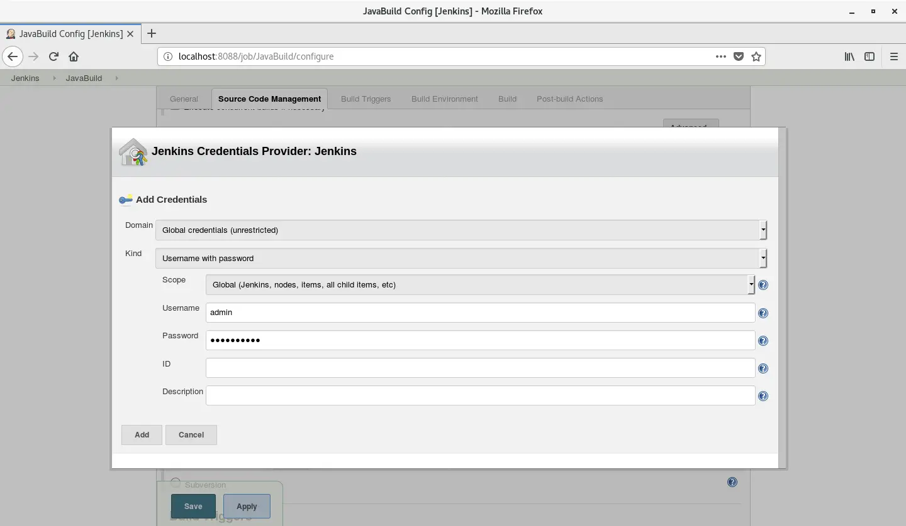

The rest are default values, just enter your Git ID and password and press `Add` to finish. The authentication information entered here is a global setting, so it can be used in other jobs as well.

Once you have successfully entered the authentication information, press `Save` to save your work. This will return you to a screen like the one below.

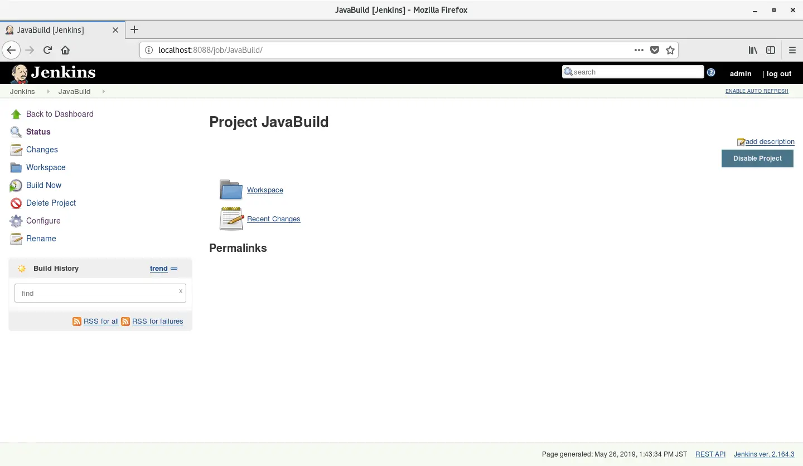

## Try building (1)

Up to this point, we have finished setting up the task of pulling from Git. Let's build it to verify that the task works as intended. Click `Build now` from the menu on the left, and after a while you will see your first build appear in the area called `Build History` at the bottom left. If there is a blue circle next to `#1`, it means the build was successful. You can check the status of the build as a yellow circle will appear if it is unstable and a red circle will appear if it fails.

Once the build is successful, click `#1` to view the build details. A screen like the one below will appear.

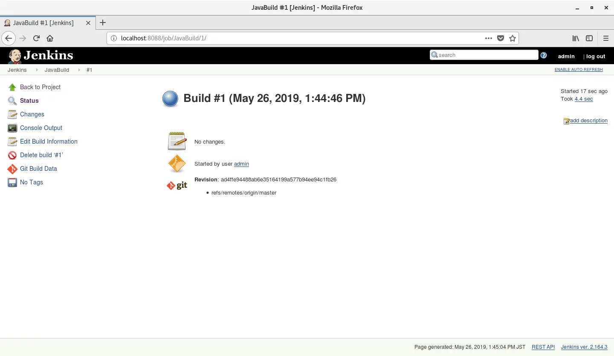

To see what was done in the actual build, click `Console Output` from the left menu. It will be displayed on a screen similar to a Linux console.

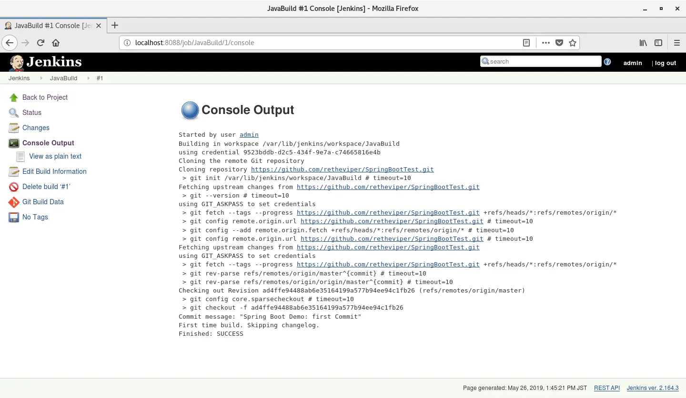

You can confirm that you have pulled from the Git repository (branch is master) as specified. It even outputs the commit message.

You can check the folders under `/var/lib/jenkins/workspace/` directly from the Linux console, but you can also check the Job workspace from the Jenkins web console. Click `Back to Project` in the left menu, then click `Workspace`, and the following screen will appear.

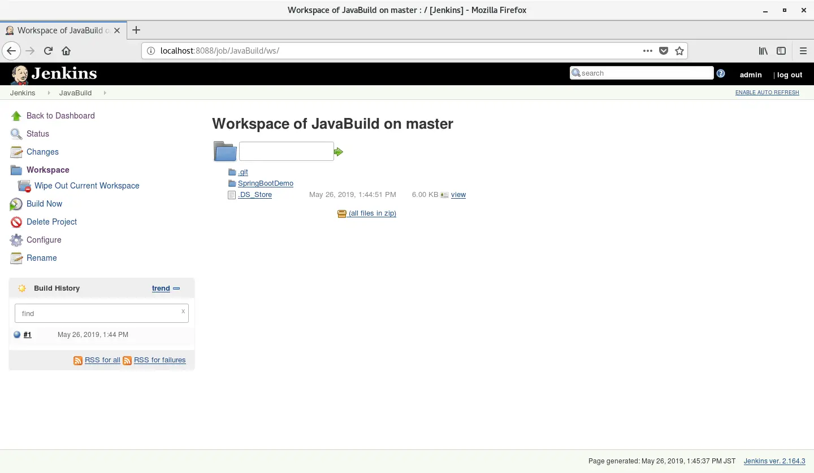

You can confirm here that the Git pull was actually performed correctly and the folder and files were generated.

## Gradle settings

Next, let's configure the build using Gradle. Click `Configure` with the gear icon to return to the Job settings screen. Since the purpose is to build a Jar file with Gradle, it will be a task after pulling with Git.

Go to the `Build` tab, click on `Add build step`, and select `Invoke Gradle script` from the dropdown menu. Then click on `Advanced...`.

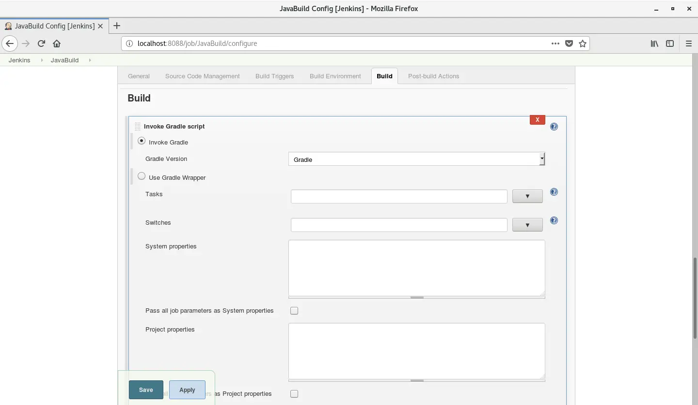

Here, for `Invoke Gradle`, select Gralde, which was included in the previous post, from the drop-down menu.

And then enter `bootJar` in Tasks under `Use Gradle Wrapper`. This command will generate an executable Jar file. Also, in the `bootJar` command, it is necessary to secure the path for `build.gradle` (Gralde is executed in the folder with the Job name in Workspace, so this is required unless `build.gradle` is in the same path). Write the path properly in `Build File` below.

Of course, the Gradle command also has an option to specify the path of the build file, so you can build the same way even if you write a command like `-b SpringBootDemo/build.gradle bootJar` instead of just `bootJar`.

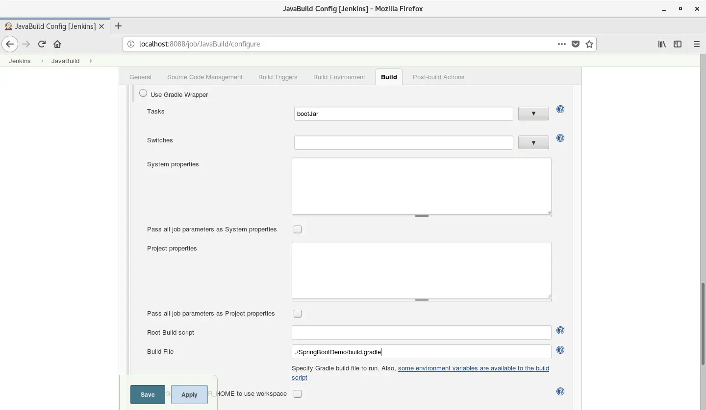

This completes the build settings in Gradle. Next, let's verify it as we did with Git.

## Try building (2)

The build procedure is also the same as with Git. Check the console output of the build in the steps `Build Now` -> `#2` -> `Console Output`.

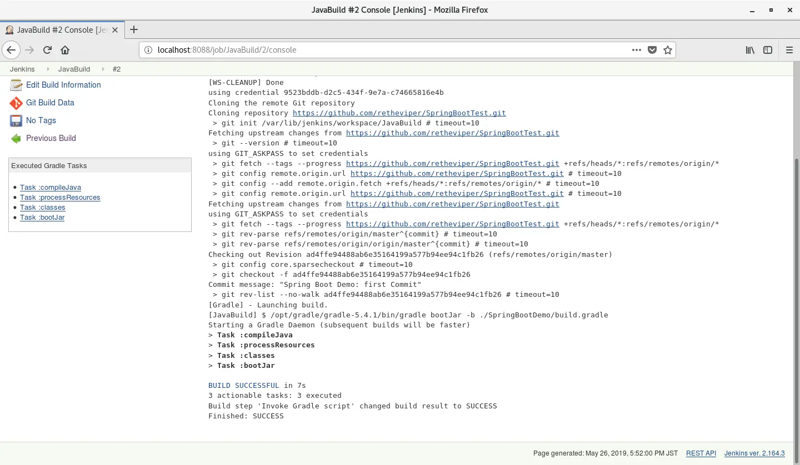

The build with Gradle has finished successfully. Now, let's check whether the Jar file was created properly.

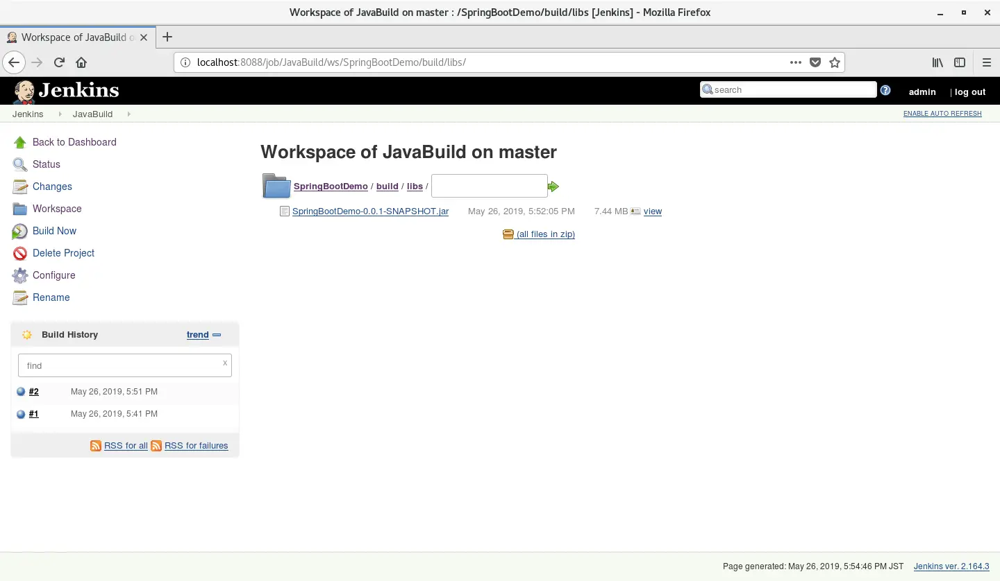

You can confirm that the Jar file has been properly created in the `build/libs` folder.

## lastly

This is not all you can do with Jenkins. You can create a deployment job after the build is completed and link it to execute that job, or you can set it up so that you can perform tests by linking with JUnit. So in future posts, I will write about how to test and deploy the resulting Jar file.

I also recommend checking the `Delete workspace before build starts` option on the `Build Environment` tab in the Job settings. When running a Job, we will first clean the Workspace folder before executing the task, but this will prevent abnormal operations caused by files generated in the previous build.

I haven't tried all the features yet because I haven't touched many parts of it in my work, but Jenkins is such a good tool that I think the possibilities are endless depending on the various plugins and their combinations. I would like to do more research.

[^1]: The build in Jenkins Job is an image close to the Job version. The unit from setting up to executing a job at a specific point in time is called a build. This is a slightly different concept from Java build, so don't confuse it.
