In this post, I would like to create a Job that deploys the built Jar file. The task that inspired me to write this post is actually simple. Just transfer the Jar file generated by a Job like [the previous post](../jenkins-java-build/) to a different server and execute it. I thought it would be better to connect these tasks into a series of tasks, but apparently the project was not designed that way. The reason seems to be that each server is used for different purposes.

Anyway, let's create a job to transfer the Jar file via SSH. We have already created a Job to build the Jar file, so we will use that source.

## Securing deliverables

First, I would like to think about how to bring the Jar file to the new Job's workspace. Simply, you can add a task to the previously generated Job to copy files using a shell command after building. This is also the first method I tried at work.

However, if the file path or Jar file name changes, the command will need to be modified, so I don't think it's a very smart method. So this time I would like to use the plugin method. From the Jenkins main screen, click `Manage Jenkins` and `Manage Plugins` in order to go to the plugin installation screen. Then, after clicking `Availale`, enter `Copy` in `Filter` in the upper right corner.

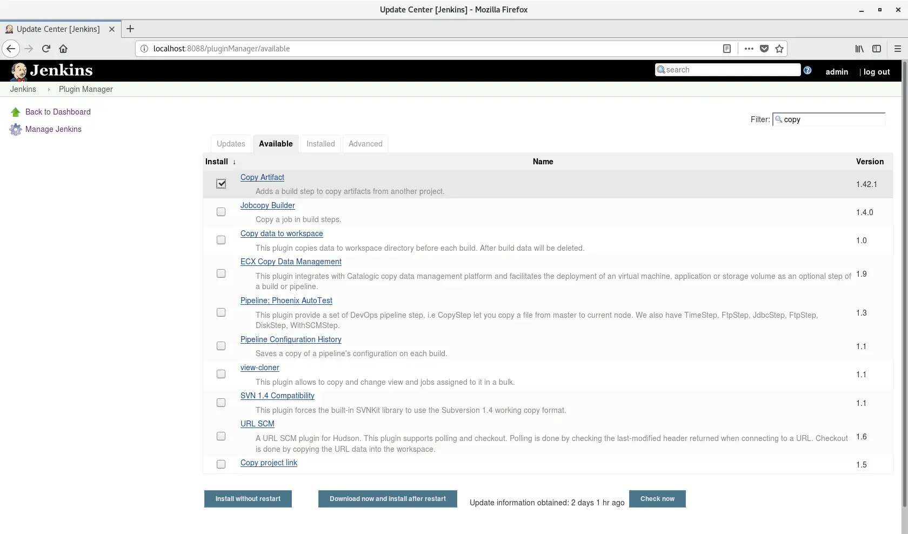

You can see that a plugin called `Copy Artifact` appears in the list. Check this and install it. If possible, restart Jenkins after installing or updating plugins. During the restart, a screen like the one below will appear.

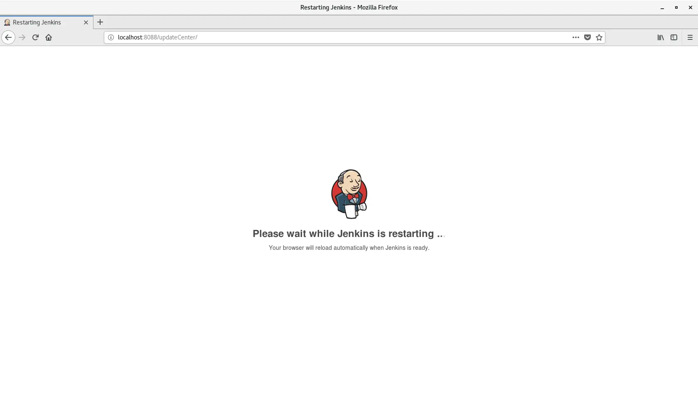

You can restart by entering the command `service jenkins restart` directly from the terminal, but you can also do it as an option after installing and updating plugins. After restarting, the screen will automatically return to the original screen.

Once the restart is complete and the plug-in has been successfully installed, check if you can now use the plug-in from the Job. First of all, this plugin can be configured to specify and save artifacts after the job is finished. The artifacts saved in this way can also be copied to the workspace so that they can be used by other Jobs. So, first of all, let's add a process to save the artifact to the job that will be the copy source.

Enter the settings for the `JavaBuild` job you created last time and select `Archive the artifacts` from the `Post-build actions` tab. Then enter the route of the artifact you want to save.

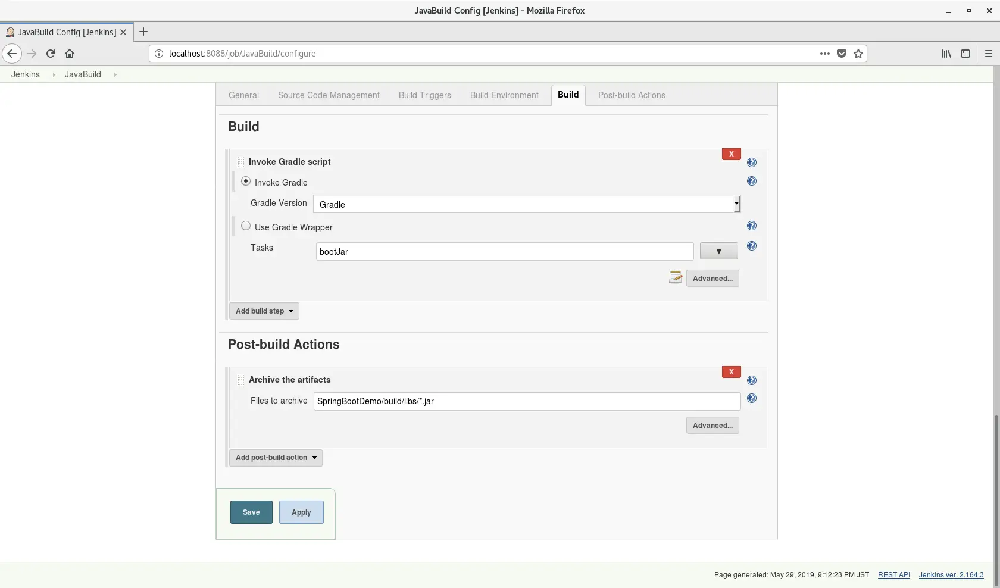

When changes occur to the Job, save and check. I think one of the few disadvantages of Jenkins is that you don't know if it will work as expected until you try to build it, but it's still important to check it.

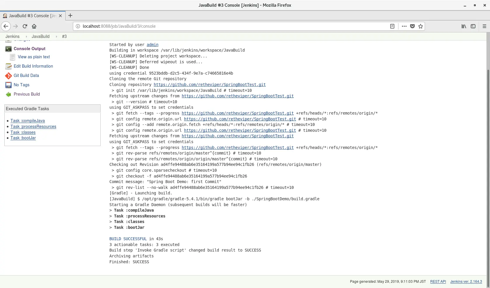

I was able to build it properly. You can check the saved artifacts from the Job main screen. Check what files were saved.

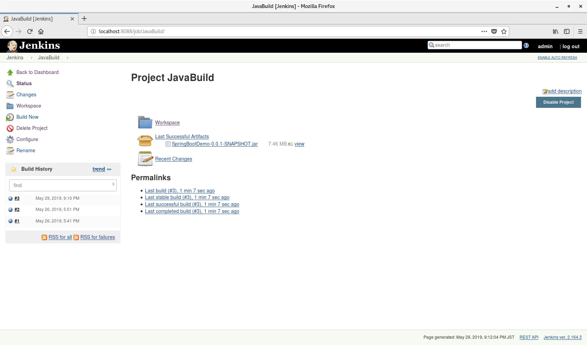

As I wanted, I was able to save only the built files. [^1]`*.jar` is specified, but only one file is built, so this is a natural result. In any case, the settings for this Job are now complete. Let's move on to the next task.

## Inherit the deliverables

This time, I created a Job called `JavaDeploy` for deployment only. Here, you first need to set up the saved artifacts to be brought to the workspace.

If you go to the `Build` tab from the Job settings screen and click `Add Build Step`, you will see that the item `Copy artifacts from another project` has appeared in the drop-down menu.

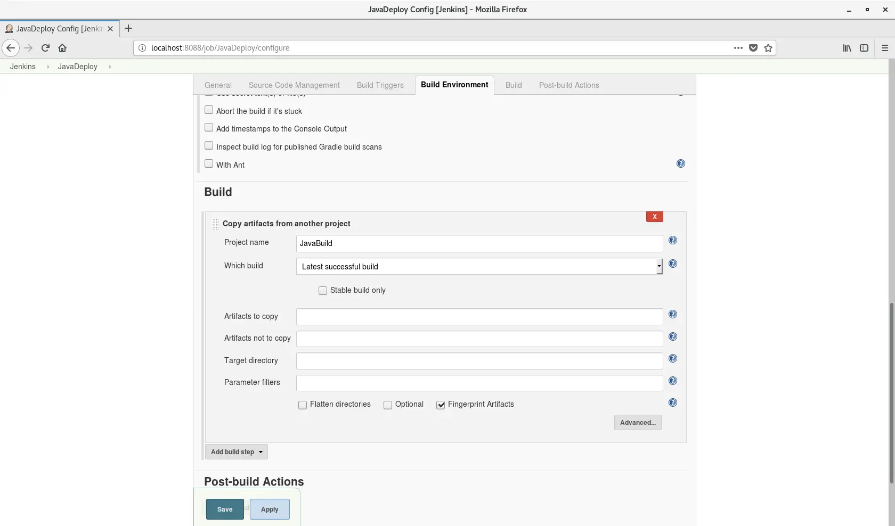

Select another Job name with `Project name`. I used the Job name generated last time. `Which build` specifies which build of the specified Job the artifacts will be brought from. There are various options, but I think `Lastest successful build` looks good. Check the `Stable build only` option just to be sure. All you have to do is specify the source file path and the destination path.

If there are files you don't want to copy, write them to `Artifacts not to copy`. I only want to copy the built Jar file to this Job's workspace, so I configured it as follows.

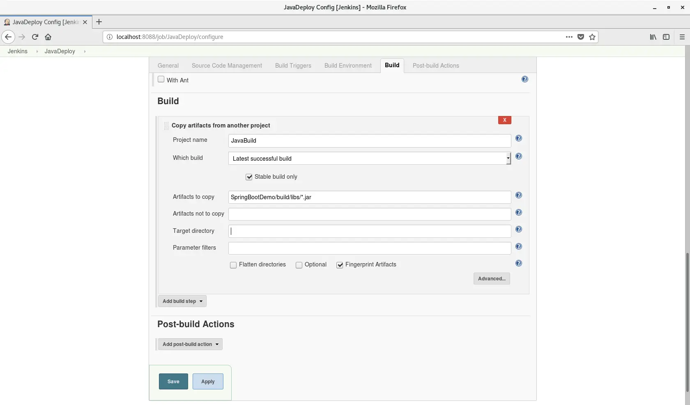

Now let's build the Job again and see if it works as expected.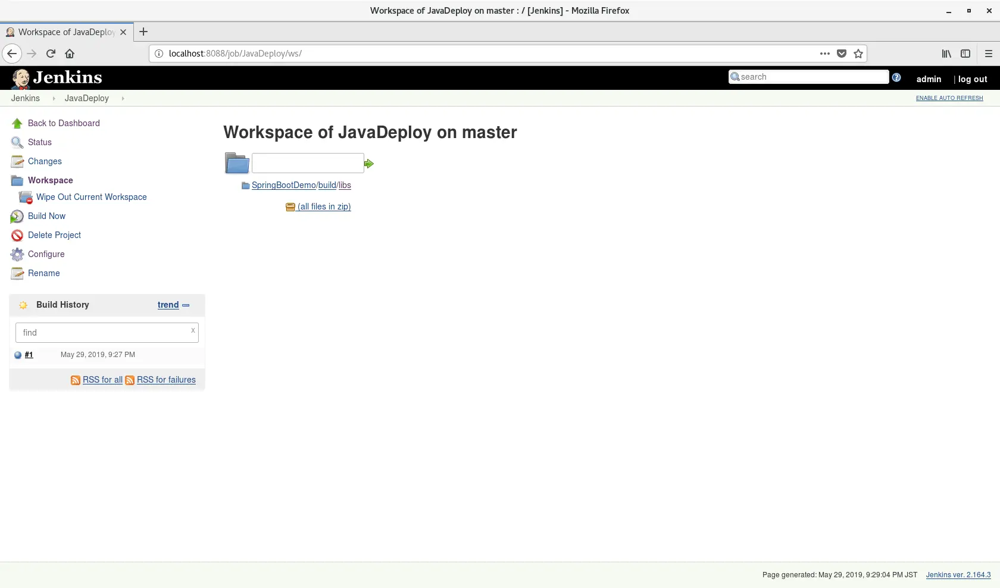

The build has completed successfully and the artifacts have been copied.

The next step is to transfer this artifact to another environment.

## Transfer artifacts(1)

To transfer files using ssh, you need a plugin called `Publish over SSH`. Through this plugin, you can make an SSH connection to transfer files and execute remote shell commands. You can see this plugin in the inventory by going to the plugin installation menu and specifying a filter with ssh.

After installing the plugin and restarting Jenkins, you need to configure the connection destination. If you enter `Configure System` from the Jenkins settings, you can confirm that the Publish over SSH configuration item has been created.

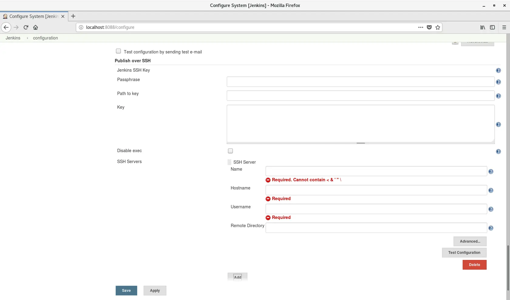

You can also connect by entering the public key in `Key`, but since we haven't configured that yet, proceed with the connection settings as usual with your ID and password. When you press the `Add` button in `SSH Servers`, a field will appear where you can enter information about the connection destination. Write a free name for the connection destination in `Name`, and write the actual IP address or host name in `Hostname`. This time, I'm trying to connect to my mac (because I don't have a server that can connect to SSH), so I'll just use the internal IP on the router and the mac account. [^2]

Enter the ID in `Username`. Also, since you can connect by entering a password, you need a field to write a password. Click the `Advanced` button, check `Use password authentication, or use a different key`, and enter your password in `Passphrase / Password`. Also, the default port for SSH is 22, so make sure that the port is properly opened. After entering all the necessary information, you can check whether you can connect by pressing the `Test configuration` button.

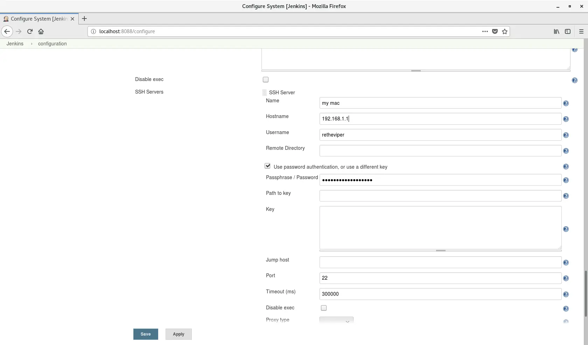

If the information you entered is correct, `Success` will be output after pressing `Test configuration`. Save your settings and return to the Job.

## Transfer artifacts(2)

When you enter Jobd settings and go to the `Build Environment` tab, you will see `Send files or execute commands over SSH before the build starts` and `Send files or execute commands over SSH after the build runs` items. For now, I want to start SSH after storing the artifacts, so I choose the latter. Of course, there is also a menu called `Send files or execute commands over SSH` on the `Build` tab, so you can set it here.

In `Name`, select the SSH connection destination server entered in the Jenkins settings. Then, in `Source files`, enter the path of the file you want to transfer. The rest is optional, but if you enter a file path in `Remove prefix`, the path up to the point you entered will be deleted. `Remote directory` also allows you to specify which folder to transfer files to. [^3]

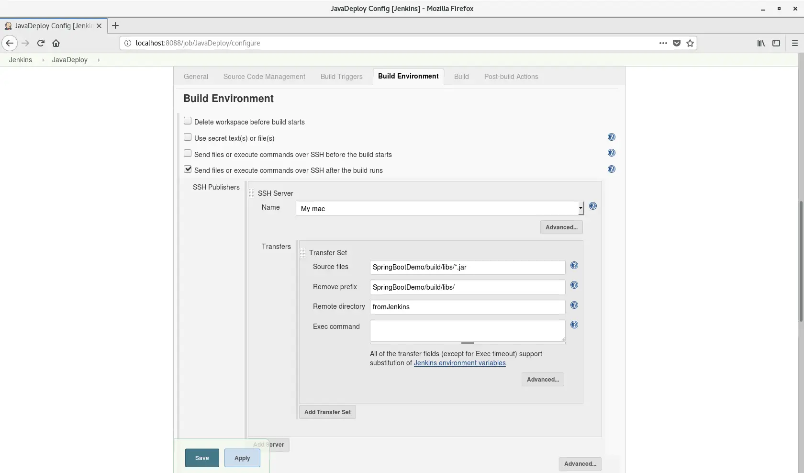

My settings are like this. I didn't want to create the same folder, so I set it to only files. If everything goes as planned, it should be transferred to a folder called fromJenkins under the user's home folder. Just to be sure, check the permissions and owner of the destination folder. And then build the Job.

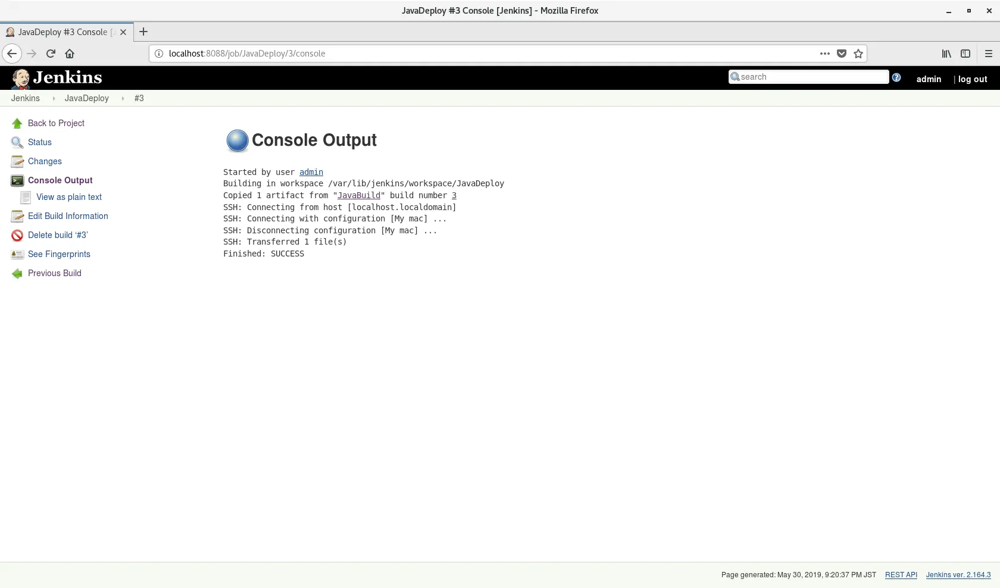

The build was successful. The console will display the number of files successfully transferred. Now, let's check from the Mac to see if the transfer was really successful.

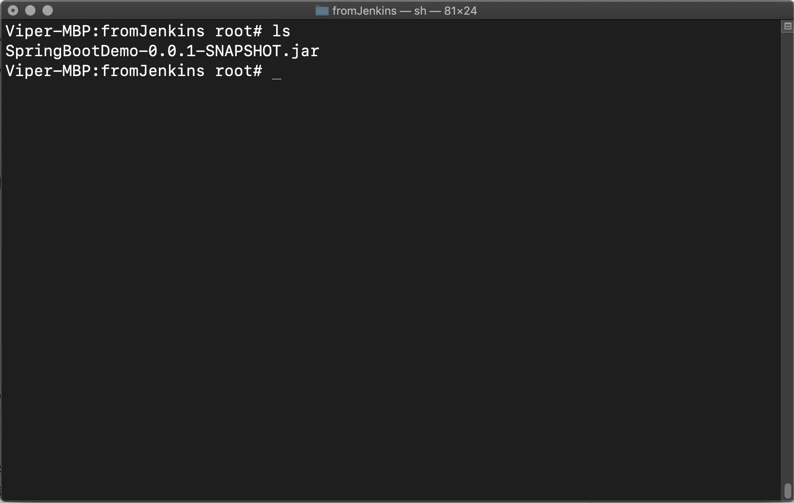

You can also check it here. The file transfer task is now successful. I'll take this opportunity to run the Jar file from my Mac.

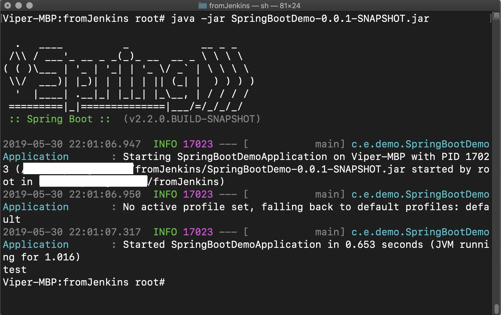

Since this is a test demo, I only output the characters `test`, but the execution was successful. This concludes the task for this post.

## Finally

This time, we simply connected two tasks to copy files, but from here on, there are many ways to link them, such as creating a Job that ends the execution of an existing Jar file and starts a newly deployed file. It all depends on the application! I hope that everyone who reads this post will try automation with Jenkins and be able to apply it even more than I can.Well, that's all for now. As we gather more information for beginners, we'll see you in a new post.

[^1]: Although it looks like it is a zip file from this screen, it actually means that it can be downloaded as a zip file. The artifacts are properly saved in the folder in their original form.
[^2]: However, I don't write the actual information in the screenshot because it's just in case.
[^3]: Basically, the home directory of the user connected via SSH is used as the standard.
