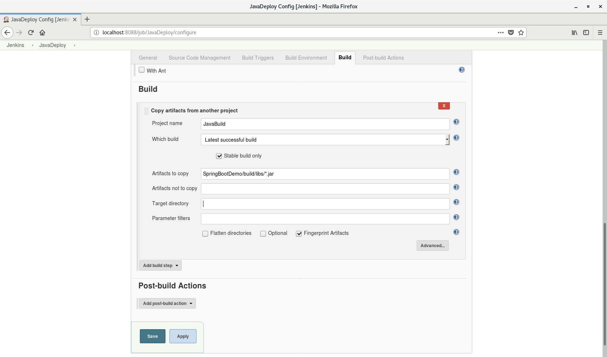
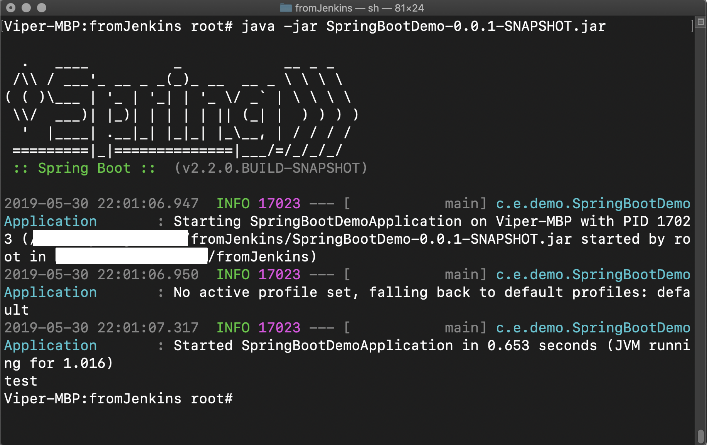

今回のポストではビルドしたJarファイルをデプロイするJobを作りたいと思います。デプロイといっても、実際このポストを書くきっかけとなったタスクは単純です。[前回のポスト](../../../05/30/jenkins-javabuild)のようなJobで生成したJarファイルを違うサーバに転送して実行するだけです。これを繋いで一連の作業にした方が良いのではと思ったのですが、どうやらプロジェクトの設計はそうではなかったみたいです。理由は各サーバの利用目的が違うから、らしいです。

ともかく、JarファイルをSSHで転送するJobを作ります。もうすでにJarファイルをビルドするJobを作りましたので、そちらのソースを利用します。

## 成果物の確保

まずJarファイルをどうやって新規Jobのワークスペースに持ってくるかを考えたいですね。単純には、前回生成したJobにビルドの後、シェルコマンドでファイルをコピーするようなタスクを追加することを考えられます。実際仕事でも一番最初に試した方法でもあります。

でもファイルのパスやJarファイルの名称などが変わったりするとコマンドの修正が必要となりますし、あまりスマートな方法だとは思えません。なので今回はプラグインによる方法を使いたいと思います。Jenkinsのメイン画面から順番に`Manage Jenkins`、`Manage Plugins`をクリックしてプラグインのインストール画面に移動します。そして`Availale`をクリックした後、右上の`Filter`に`Copy`を入力します。

`Copy Artifact`というプラグインがリストに出ることを確認できます。これをチェックし、インストールします。なるべくプラグインのインストールやアップデートをした後にはJenkinsを再起動するようにしましょう。再起動中には以下のような画面が現れます。

ターミナルから直接`service jenkins restart`というコマンドを入力することでも再起動はできますが、プラグインのインストールとアップデートの後のオプションでもできます。再起動の後には自動的に元の画面に戻ります。

再起動が終わり、無事プラグインがインストールされたらちゃんとJobからプラグインを使えるようになったか確認してみます。まずこのプラグインはJobが終わったあと成果物を指定して保存するように設定できます。またそうやって保存された成果物は他のJobから利用できるようにワークスペースにコピーすることができます。なのでまずはコピー元となるJobに成果物を保存するための工程を追加しましょう。

前回作成した`JavaBuild`のJobの設定に入り、`Post-build actions`タブから`Archive the artifacts`を選択します。そして保存したい成果物の経路を入力します。

Jobに変更が発生すると保存してチェックです。ビルドしてみないと思い通りに動くかどうかわからないのがJenkinsの数少ない短所の一つではないかと思いますが、それでもチェックは大事ですので。

ちゃんとビルドできました。保存された成果物に関してはJobのメイン画面から確認できます。どんなファイルが保存できたか確認しましょう。

狙い通り、ビルドしたファイルだけ保存できました。[^1]`*.jar`と指定していますが、それでもビルドされるファイルは一つしかなったので当たり前な結果ですね。ともかくこれでこちらのJobでの設定は終了です。次の作業に移行しましょう。

## 成果物を引き継ぐ

今回はデプロイ専用として`JavaDeploy`というJobを生成してみました。こちらではまず保存した成果物をワークスペースに持ってくる設定が必要ですね。

Jobの設定画面から`Build`のタブに移動し、`Add Build Step`をクリックしてみると`Copy artifacts from another project`という項目がドロップダウンメニューに現れたことを確認できます。

`Project name`で、他のJob名を選びます。私は前回生成したJob名にしました。`Which build`では、指定したJobのどんなビルドから成果物を持ってくるかを指定します。様々なオプションがありますが、`Lastest successful build`が良さげではないかと思います。`Stable build only`オプションは念のためチェックします。あとはコピー元のファイルパスと、コピー先のパスを指定すればオッケーです。

コピーしたくないファイルがあれば`Artifacts not to copy`に書くといいです。私はビルドしたJarファイルだけをこのJobのワークスペースにコピーするので、以下のように設定しました。

ではまたJobをビルドして思い通りになるか試してみましう。

無事ビルドが終わり、成果物をコピーされました。

次にはこの成果物を他の環境に転送することですね。

## 成果物を転送する(1)

sshによるファイル転送をするには、`Publish over SSH`というプラグインが必要です。このプラグインを通じでSSH接続を行い、ファイル転送やリモートでのシェルコマンドが実行できます。プラグインのインストールメニューに移動し、sshでフィルターを指定すると目録からこのプラグインを見ることができます。

プラグインをインストールして、Jenkinsの再起動まで終わったあとは接続先の設定が必要です。Jenkinsの設定から`Configure System`に入ると、Publish over SSHの設定項目ができたことを確認できます。

`Key`に公開鍵を入力することでも接続できますが、まだその設定はしてないため普通にIDとパスワードで接続設定を進めます。`SSH Servers`の`Add`ボタンを押すと、接続先の情報を入力できるフィールドができます。`Name`には接続先の自由な名称を書き、`Hostname`には実際のIPアドレスやホスト名を書きます。今回、私は自分のmacに接続してみるので(SSH接続できるようなサーバーを持ってないからですが)ルーターでの内部IPとmacのアカウントをそのまま使います。[^2]

`Username`にはIDを入力します。また、パスワード入力で接続するためパスワードを書くフィールドも必要ですね。`Advanced`ボタンをクリックし、`Use password authentication, or use a different key`をチェックしたあと`Passphrase / Password`にパスワードを入力します。またSSH用の基本設定のポートは22となっていますが、こちらもちゃんとポートが開放されているか確認しましょう。必要な情報を全部入力したら`Test configuration`ボタンを押すことで接続できるかかチェックできます。

入力した情報に間違いがないと、`Test configuration`を押した後に`Success`が出力されます。設定を保存してJobに戻ります。

## 成果物を転送する(2)

Jobdの設定に入って`Build Environment`のタブにいくと、`Send files or execute commands over SSH before the build starts`と`Send files or execute commands over SSH after the build runs`の項目ができています。今は成果物を格納した後からSSHを開始したいので後者を選択します。もちろん`Build`のタブにも`Send files or execute commands over SSH`というメニューができるので、こちらで設定しても良いです。

`Name`ではJenkinsの設定から入力したSSH接続先のサーバーを選択します。そして`Source files`では転送したいファイルのパスを入力します。あとはオプションですが、`Remove prefix`でファイルパスを入力すると入力したところまでのパスが消えます。また、`Remote directory`ではどのフォルダにファイルを転送するかを指定できます。[^3]

私の設定はこうです。フォルダを同じく作成したくはないのでファイルのみの設定としました。思い通りになったら、ユーザーのホームフォルダ配下のfromJenkinsというフォルダに転送されるはずです。念の為、転送先のフォルダの権限や所有者もチェックしておきましょう。そしてJobのビルドです。

ビルドは無事成功しました。コンソールを見ると転送に成功したファイルの個数が表示されます。では本当に転送に成功したか、macの方から確認してみます。

こちらでも確認できました。これでファイル転送というタスクは成功です。せっかくですのでmacの方からJarファイルを実行してみます。

テスト用のデモなので`test`という字を出力するだけにしていますが、とにかく見事実行は成功です。今回のポストでのタスクもこれで終わりました。

## 最後に

今回はただ単にファイルをコピーする作業を二つ繋げただけですが、ここからは既存のJarファイルの実行を終了し、新しくデプロイされたファイルを起動するなどのJobを作っていくなど連携の方法は色々ありそうです。何もかも応用次第ですからね！このポストを読まれる皆さんもJenkinsで自動化を試し、私以上に応用できることになるといいなと思います。

それでは、今回はここまで。また初心者向けの情報が集まったら、新しいポストでお目にかかりましょう。

[^1]: この画面からはまるでzipファイルになっているようにも見えますが、実際はzipファイルでダウンロードできるという意味です。成果物はちゃんとフォルダの中に元の形で保存されています。
[^2]: ただ、スクショにはもしものことなので実際の情報は書いていません。
[^3]: 基本的にはSSH接続したユーザーのホームディレクトリが基準となります。
