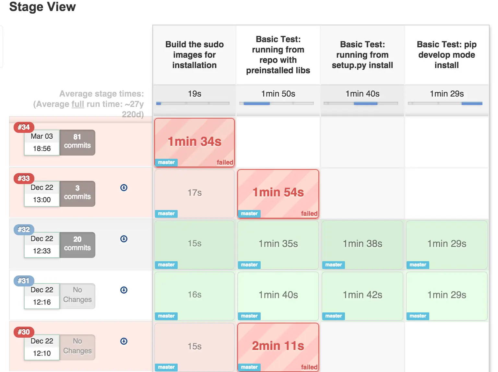
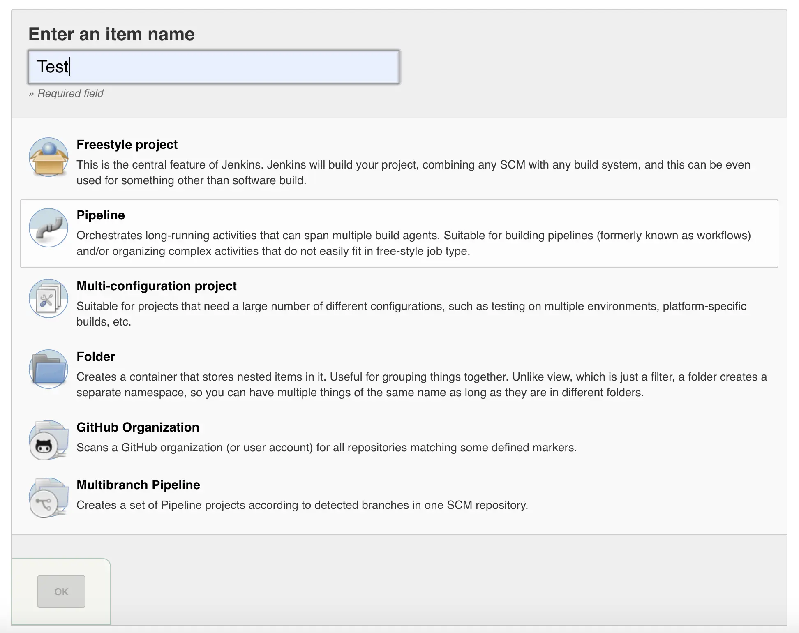
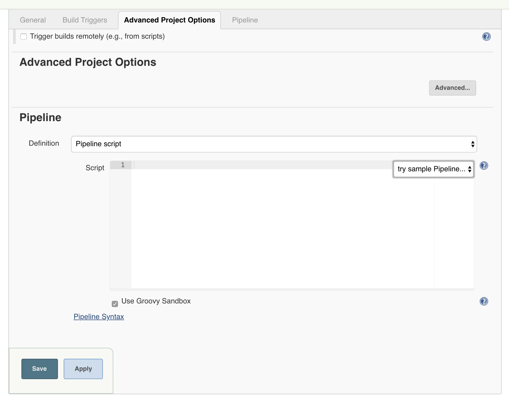
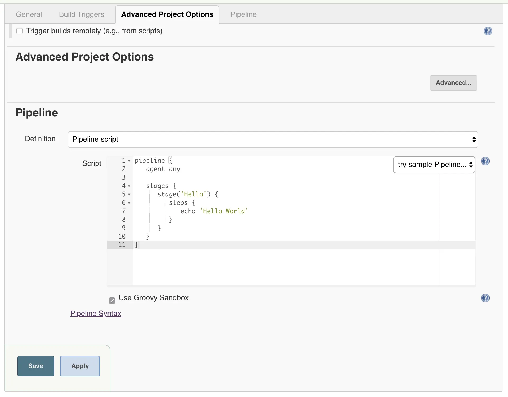
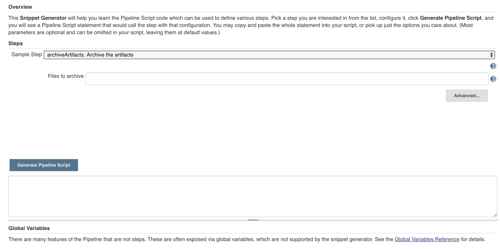
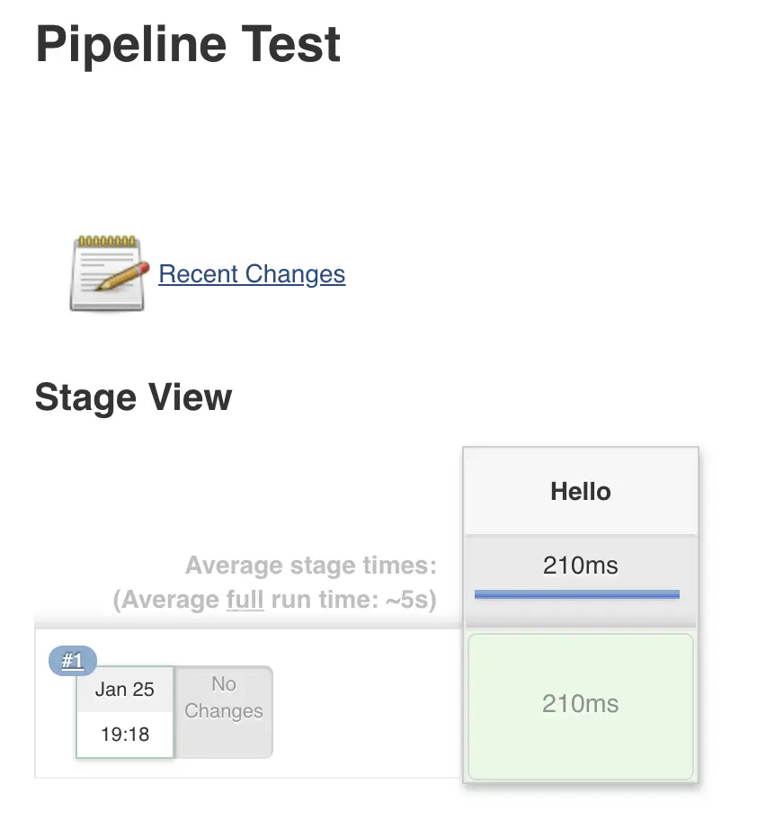
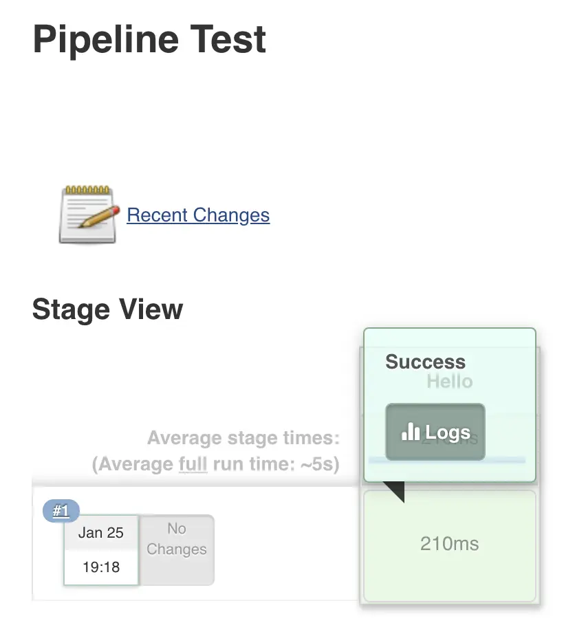
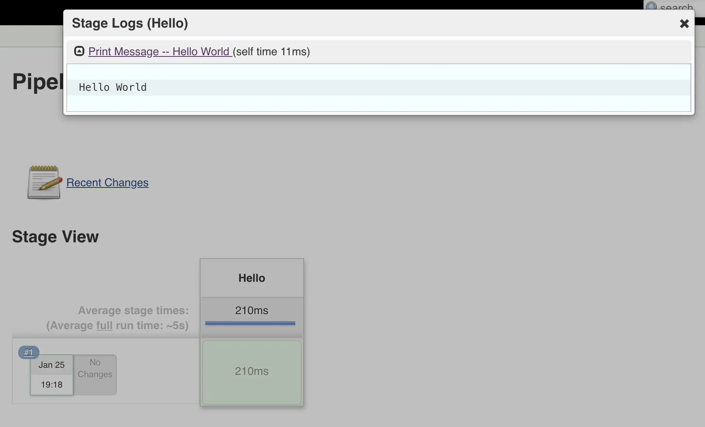

The job generation with Jenkins that I introduced last time was based on an old-fashioned method. In fact, when Jenkins was updated to 2.0 in 2016, a feature called Pipeline was introduced that allows you to create jobs using scripts.

Pipeline uses groovy to write the commands and tasks you want to execute in units called stages. The script you write will be executed sequentially from the top, and the execution results will be displayed on the screen at each stage. The usage is quite different compared to previous Jenkins jobs, so this time I would like to introduce how to create a Pipeline job with a sample.

## What do you enjoy about using Pipeline?

First of all, I would like to know what advantages it has compared to a normal job. Creating a Jenkins job with Pipeline instead of an existing Freestyle job has the following advantages:

- Easy to manage as it is a script
  - Since it can be managed as a file, version control can be performed using Git etc.
- easy to create
  - It provides snippets so you can easily create scripts.
- Easily check job success/failure history
  - Jobs are executed in stages, so you can easily check which stages succeeded or failed.

Execution history for stages within a Pipeline job is displayed through the GUI, providing an easily viewable execution log. The screen looks like the one below.



## Pipeline creation tutorial

## Creating a Pipeline job

First, let's briefly explain the steps to create a Pipeline job. Enter the job name from the job creation screen and select Pipeline.



## Pipeline script

When you create a job with Pipeline, the screen for specifying the items to be executed by the job is also different from Freestyle jobs. The settings such as build triggers are the same, but if you scroll down the screen you can see that there is a tab called Pipeline. You can choose what to execute by writing the script directly here or specifying a script file managed with Git etc.



However, it is also difficult to write a script all of a sudden. First, click try sample Pipeline... on the right side of the screen. First, let's select Hello world.



The Pipeline script uses groovy, but there is no need to study groovy syntax first. There are other sample codes, so please refer to them to see how to write them.

Additionally, for those who are not familiar with Pipeline scripts, Jenkins provides a Snippet creation feature. This is a convenient feature that automatically generates a script by selecting the task you want to execute from the drop-down menu and entering the necessary parameters. When you click Pipeline Syntax below the Pipeline script input field, the following screen will be displayed.



You can write the script by hand from the beginning, but if you don't know how to write it, use this function.

## Pipeline execution results

When you run a completed Pipeline job, success and failure results are displayed for each stage. This is the execution result screen for the Hello World sample created earlier.



Here, you can click on each stage to check the results for the tasks written for each stage. Let's click on Logs.



On the Log screen, the results of commands and tasks executed on the stage are output, and you can also check the details along with the execution time.



## Pipeline script structure

Now, let's take a quick look at the structure of the Pipeline script. First define the Pipeline script with the following code.

```groovy
pipeline {
  // Write the agents and stages to run inside this block
}
```

## Configuring the execution agent

After writing the pipeline block, the next step is to set up the environment to execute the pipeline. If you want to run it in an instance where Jenkins is running, you can just write agent any, but these days it seems like Docker containers are often used just to run jobs. In that case, you need to specify a Docker container as the execution environment. Specify the container with code like the following.

```groovy
pipeline {
  agent {
    docker {
      image 'image to run'
      args 'command-line arguments to pass when running the image' // optional
    }
  }
}
```

## create a stage

Once you have configured the environment, the next step is to write the tasks you want to execute. What is important here is the concept of stage. Jenkins' official website defines a stage block as a "distinct subset of tasks to be performed throughout the Pipeline." In other words, one stage is one task stage. Within a stage, you define a step, which is a single task unit, and write the commands to be executed within the step.

```groovy
pipeline {
  agent {
    // Docker environment
  }
  stages {
    stage('Stage 1') {
      steps {
        // Command to run
      }
    }
    stage('Stage 2') {
      // ...
    }
    // ...
  }
}
```

This concludes the explanation of the Pipeline itself. Next, I will show you what the actual Pipeline job will look like when written.

## Pipeline script example

I created a simple example assuming that the following job is created using Pipeline.

1. Execution environment is openjdk container (root user)
2. Check out the source code with Git (directory is springboot)
3. Run the gradlew task and create a war file
4. Upload the completed war file to Azure Blob

Expressing this in actual code is as follows.

```groovy
pipeline {
  agent {
    docker {
      image 'openjdk' // Use the official openjdk image
      args '-u root' // Run as root
    }
  }
  stages {
    stage('Checkout') { // Git checkout stage
      steps {
        checkout([$class: 'GitSCM', branches: [[name: '*/branch']], doGenerateSubmoduleConfigurations: false, extensions: [[$class: 'RelativeTargetDirectory', relativeTargetDir: 'directory to save']], submoduleCfg: [], userRemoteConfigs: [[credentialsId: 'Git credential ID', url: 'https://Git repository']]])
      }
    }
    stage('Build') { // Build stage
      steps {
        dir(path: 'springbootapi') { // Specify the working directory
          sh './gradlew bootWar'
        }
      }
    }
    stage('Upload') { // Stage for uploading the built WAR file to Azure Blob
      steps {
        dir('springbootapi/web/build/libs'){
          azureUpload storageCredentialId: 'storage credential ID', storageType: 'blob', containerName: 'container name', filesPath: '**/*.war'
        }
      }
    }
    stage('Finalize') { // Stage that cleans up the workspace when finished
      steps {
        cleanWs()
      }
    }
  }
}
```

It may seem difficult if you are not yet familiar with Pipeline code, but once you use Pipeline Syntax you will be able to use it immediately, so please give it a try.

## lastly

When I first encountered Jenkins, I had no idea that such a useful tool existed! However, I was surprised to find that with the introduction of Pipeline, I was able to understand tasks even more conveniently and clearly. Recently, I had a chance to play around with Azure Pipelines a little bit, and the job creation there seemed to be based on Jenkins' Pipeline. It's such a positive change that I think all future CI/CD tools will probably look like this, even if the language and grammar are different. Everyone, please try out Jenkins Pipeline and enjoy comfortable builds and deployments.

See you soon!
