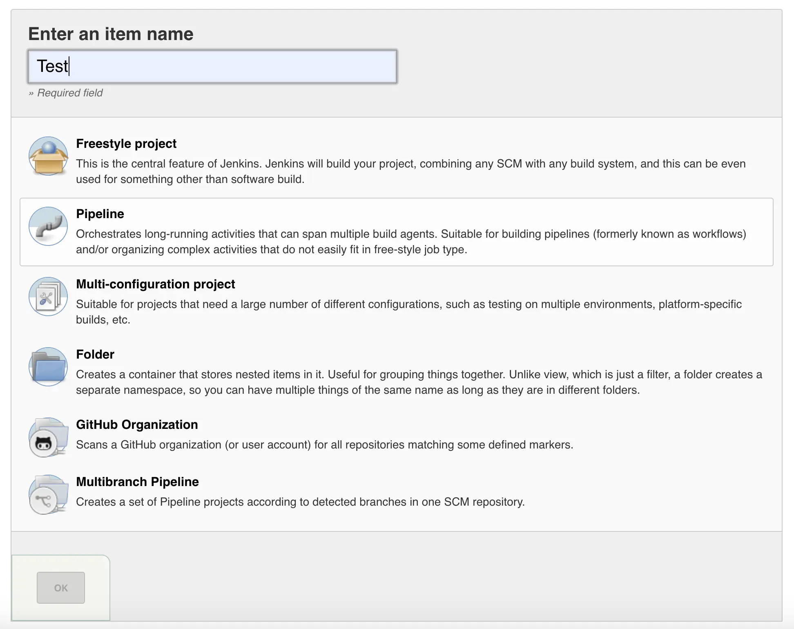
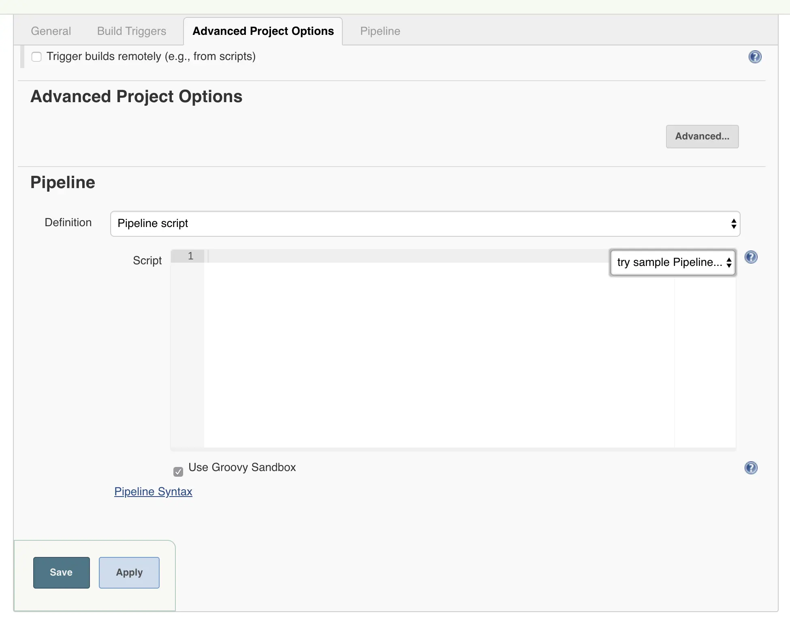
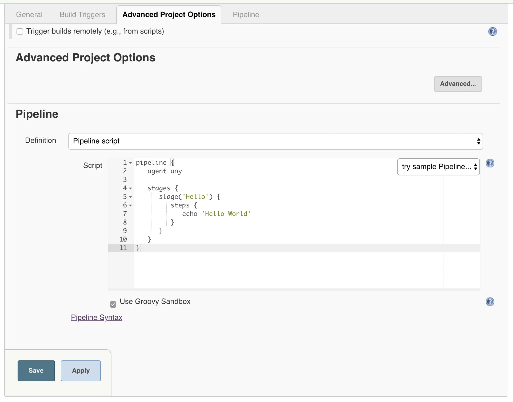
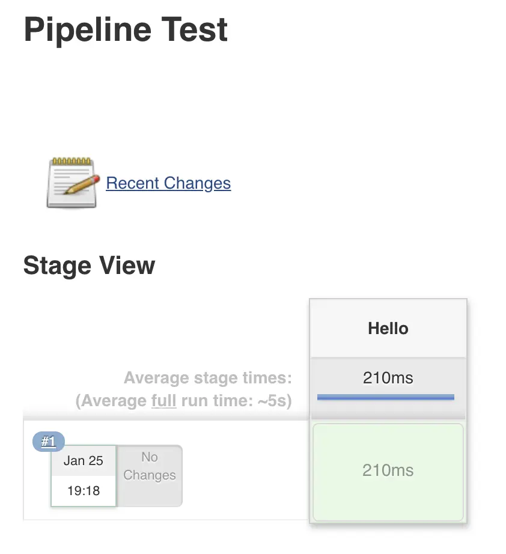
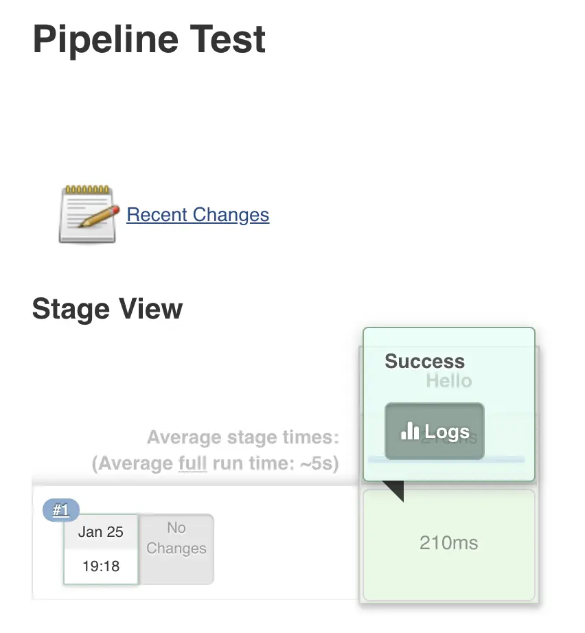
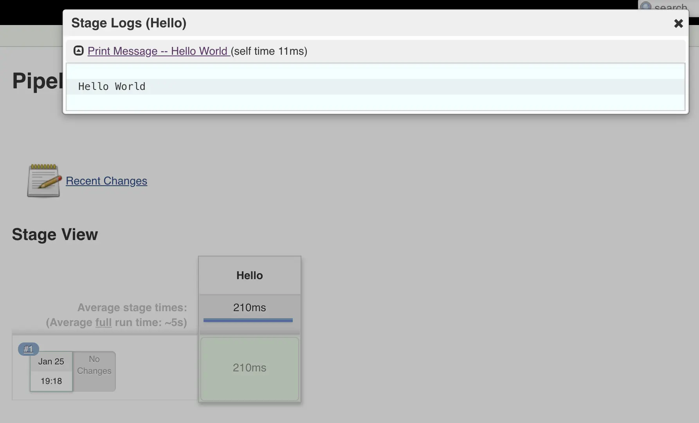

前回までご紹介したJenkinsでのジョブ生成は、どちらかというと、古いやり方によるものでした。実際、2016年にJenkinsが2.0にアップデートされながら、スクリプトでジョブを作成できるPipelineというものが導入されていました。

Pipelineではgroovyを使って、実行したいコマンドやタスクなどをステージという単位で書きます。書いたスクリプトは上から順次実行され、各ステージごとに実行結果を画面上に表示してくれます。今までのJenkinsジョブと比べ使い方がかなり違うので、今回はそのPipelineジョブを作成する方法をサンプルを持って紹介したいと思います。

## Pipeline使うと何が嬉しい？

まずは普通のジョブと比べ、どんなメリットがあるかを知りたいですね。既存のFreestyleジョブでなく、PipelineでJenkinsのジョブを作成すると以下のようなメリットがあります。

- スクリプトなので管理がしやすい
  - ファイルとしても管理ができるので、Gitなどでバージョンコントロールができます。
- 作成が簡単
  - Snippetを提供するので簡単にスクリプトを作成できます。
- ジョブの成功・失敗履歴を簡単に確認できる
  - ステージ単位でジョブを実行するので、どのステージが成功・失敗したか簡単に確認できます。

Pipelineジョブ内のステージに関する実行履歴はGUIから表示され、簡単に確認できる実行ログを提供しています。以下のような画面です。


## Pipeline作成チュートリアル

### Pipelineジョブの作成

では、まずPipelineジョブを作成する手順を簡単に説明していきましょう。ジョブ作成画面からジョブ名を入力して、Pipelineを選択します。



### Pipelineスクリプト

Pipelineでジョブを作成すると、ジョブで実行する項目を指定する画面もFreestyleジョブとは違うものになります。ビルドトリガーなどの設定は同じですが、画面を下にスクロールしてみるとPipelineというタブがあることを確認できます。ここに直接スクリプトを書くか、Gitなどで管理しているスクリプトファイルを指定するかで何を実行するか選べられます。



しかし、いきなりスクリプトを書くのも難しいことです。まず画面の右にあるtry sample Pipeline...をクリックしてみましょう。まずはHello worldを選んでみます。



Pipelineのスクリプトはgroovyを使っていますが、groovyの文法をまず勉強する必要はありません。サンプルのコードは他にもあるので、それらを参考してどんな書き方をするかを確認しましょう。

また、Pipelineスクリプトに慣れてない人のためにJenkinsではSnippet作成機能を提供しています。実行したいタスクをドロップダウンメニューから選び、必要なパラメータなどを入力すると自動的にスクリプトを生成してくれる便利な機能です。Pipelineのスクリプト入力欄の下にあるPipeline Syntaxをクリックすると以下のような画面が表示されます。


最初からスクリプトを手で書いても良いですが、どう書いたらわからない場合はこちらの機能を使いましょう。

### Pipelineの実行結果

完成したPipelineジョブを実行するとステージ別に成功と失敗の結果が表示されます。先ほど作成したHello Worldサンプルの場合の実行結果画面です。



ここでは各ステージをクリックすると、ステージ別に書いたタスクに対して結果を確認できます。Logsをクリックしてみましょう。



Log画面ではステージで実行したコマンドやタスクの結果がそれぞれ出力され、実行時間と共に詳細を確認することもできます。



### Pipelineスクリプトの構造

では、簡単にPipelineスクリプトがどんな構造となっているかもみていきましょう。Pipelineスクリプトはまず以下のようなコードで定義します。

```groovy
pipeline {
  // この中に実行するエージェントやステージを書く
}
```

### 実行エージェントの設定

pipelineブロックを書いたら、次はpipelineを実行する環境を設定します。単純にJenkinsが起動しているインスタンスの中での実行ならagent anyと書くだけですが、最近はジョブを実行するためだけのDockerコンテナを使うことも多いようです。その場合は実行環境としてDockerコンテナを指定する必要がありますね。以下のようなコードでコンテナを指定します。

```groovy
pipeline {
  agent {
    docker {
      image '実行したいイメージ'
      args 'イメージを実行する時に渡すコマンドライン変数' // 省略可能
    }
  }
}
```

### ステージを作る

環境まで設定できたら、次は実行したいタスクを書きます。ここで大事なのはステージという概念です。Jenkinsの公式サイトではステージブロックを「Pipeline全体で実行するタスクの明確なサブセット」として定義しています。つまり、ステージ一つが一つのタスクの段階という意味でしょう。ステージの中では一つのタスク単位であるステップを定義し、ステップの中で実行するコマンドを書きます。

```groovy
pipeline {
  agent {
    // Docker環境
  }
  stages {
    stage('ステージ名1') {
      steps {
        // 実行したいコマンド
      }
    }
    stage('ステージ名2') {
      // ...
    }
    // ...
  }
}
```

Pipelineそのものに対する説明は以上となります。では、次に実際のPipelineジョブを書いたらどんな形になるのかを紹介します。

### Pipelineスクリプト例題

以下のジョブをPipelineで作ると仮定して、簡単な例題を作ってみました。

1. 実行環境はopenjdkコンテナ(rootユーザー)
2. Gitでソースコードをチェックアウト(ディレクトリはspringboot)
3. gradlewタスクを実行してwarファイルを作る
4. 出来上がったwarファイルをAzure Blobにアップロード

これを実際のコードで表現すると以下のようになります。

```groovy
pipeline {
  agent {
    docker {
      image 'openjdk' // openjdk公式イメージを使用
      args '-u root' // ユーザーをrootに指定
    }
  }
  stages {
    stage('Checkout') { // Gitチェックアウトステージ
      steps {
        checkout([$class: 'GitSCM', branches: [[name: '*/ブランチ']], doGenerateSubmoduleConfigurations: false, extensions: [[$class: 'RelativeTargetDirectory', relativeTargetDir: '保存するディレクトリ']], submoduleCfg: [], userRemoteConfigs: [[credentialsId: 'GitクレデンシャルID', url: 'https://Gitレポジトリ']]])
      }
    }
    stage('Build') { // ビルドステージ
      steps {
        dir(path: 'springbootapi') { // 作業ディレクトリを指定
          sh './gradlew bootWar'
        }
      }
    }
    stage('Upload') { // ビルドしたwarファイルをAzure Blobにアップロードするステージ
      steps {
        dir('springbootapi/web/build/libs'){
          azureUpload storageCredentialId: 'ストレージクレデンシャルID', storageType: 'blob', containerName: 'コンテナ名', filesPath: '**/*.war'
        }
      }
    }
    stage('Finalize') { // 作業が終わるとワークスペースを削除するステージ
      steps {
        cleanWs()
      }
    }
  }
}
```

まだPipelineのコードに慣れてないと難しいと思われるかもしれませんが、Pipeline Syntaxを活用するとすぐかけるものなので皆さんもぜひ挑戦してみてください。

## 最後に

最初Jenkinsに接した時もこんなに便利なツールがあるとは！と思いましたが、Pipelineの導入でさらに便利かつ明確にタスクがわかるようになっていて驚きました。最近はAzure Pipelinesを少し触る機会があったのですが、そちらのジョブ作成もこのJenkinsのPipelineを意識した感じです。これからのCI/CDツールは多分言語や文法は違っても、どれもこのような形になるのではないかと思うくらい良い変化です。皆さんもぜひJenkinsのPipelineに触れて、快適なビルド・デプロイを楽しんてみてください。

では、また！
