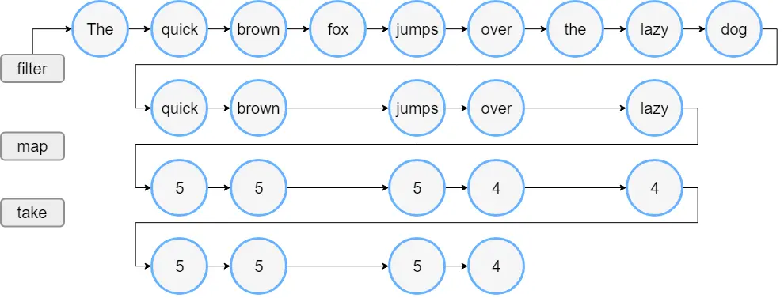
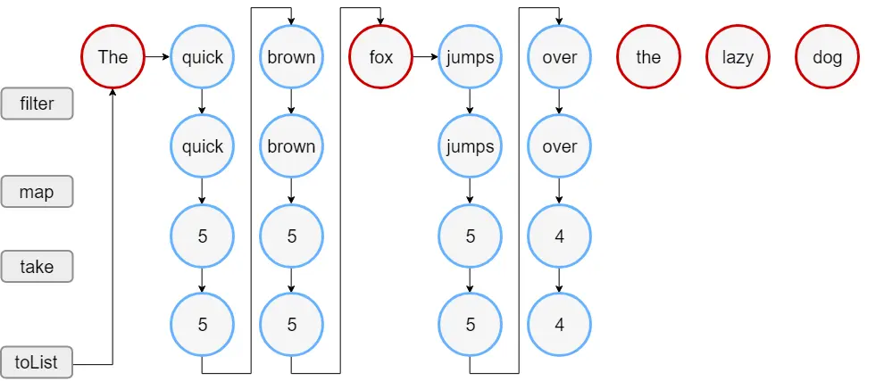

When there are many ways to write a certain process, it can be difficult to decide which one is the best. In this case, you will need to compare each method from various viewpoints, such as code readability, code length, and expected problems, and decide which method to choose. However, making decisions from this perspective is often effective when the writing style is completely different, and if you end up writing similar code in the first place, you need to think from other perspectives as well. If the difference is only slightly different, you can't tell the difference just by looking at it. In such cases, you need to carefully consider the internals and mechanisms of the API before making a selection.

In that sense, this time I would like to talk about the difference between two methods that can be used to process Kotlin Collections: ``using the Collection's operation directly'' and ``converting it to a Sequence and then processing it.''

## Differences in processing methods

In Java, there are various ways to process elements of a Collection, but I think it's safe to say that they can be broadly divided into methods from 1.8 and earlier (loop using `for`, `while`, etc.) and methods from 1.8 and later (method using `Stream`). These two methods are based on different paradigms, so the style of writing code is also very different. For example, even if you want to perform the same processing, the appearance will be completely different, as you can see in the code below.

```java
// Using a for loop
List<String> filterEven() {
    List<Integer> list = List.of(1, 2, 3, 4, 5, 6, 7, 8, 9, 10);
    List<String> result = new ArrayList<>();
    for (Integer i : list) {
        if (i % 2 == 0) {
            result.add(i.toString());
            if (result.size() == 3) {
                break;
            }
        }
    }
    return result;
}

// Using Stream
List<String> filterEvenStream() {
    return List.of(1, 2, 3, 4, 5, 6, 7, 8, 9, 10)
            .stream()
            .filter(i -> i % 2 == 0)
            .map(i -> i.toString())
            .limit(3)
            .collect(Collectors.toList());
}
```

In the case of processing using Stream, operations are stacked, and this can be said to be an API that all languages ​​that support modern functional programming have. For example, Kotlin seems to have many official names, but some call it `Functional function`, and this time I would like to talk about its operating method, Functional Function.

In Kotlin, Collection also has such operations, and [Sequence](https://kotlinlang.org/docs/sequences.html), which can be called Kotlin's version of Stream, also allows similar operations. Also, since Java's Stream can be used as is, there are three types of processing using functional functions. The usage of each is not much different. So, you can do the same processing with the code below, but it can be a bit annoying. "Which one should I use?" For example, even if you want to perform the same process, you can use various methods in Kotlin, such as the following.

```kotlin
// Using Collection
fun filterEven(): List<String> = listOf(1, 2, 3, 4, 5, 6, 7, 8, 9, 10).filter { it %2 == 0 }.map { it.toString() }.take(3)

// Using Sequence
fun filterEvenSequence: List<String> = listOf(1, 2, 3, 4, 5, 6, 7, 8, 9, 10).asSequence().filter { it %2 == 0 }.map { it.toString() }.take(3).toList()

// Using Java's Stream API
fun filterEvenStream(): List<String> = listOf(1, 2, 3, 4, 5, 6, 7, 8, 9, 10).stream().filter { it %2 == 0 }.map { it.toString() }.limit(3).collect(Collectors.toList())
```

There is not much difference in the above code visually. There are no major changes in processing or logic. If the usage is not much different and you can expect the same results, I think the next thing to be concerned about is performance. In particular, it is said that Sequence has better performance than Collection, so it is definitely better to use Sequence as much as possible.

However, if we accept this as fact, several questions remain. If Sequence always has a performance advantage, why do we call `asSequence()` to explicitly convert when calling a Functional function from a Collection instead of converting it internally to Sequence? Or why is it possible to call Functional functions even in Collections? Doesn't this mean that Sequence has better performance than Collection only under certain conditions? So, this time I will talk about the difference between Collection and Sequence, mainly from a performance perspective.

## Lazy evaluation

Kotlin's Sequence was originally planned to have the same name as Java's Stream. This is not just a coincidence, as the actual processing is similar to Stream. What is similar is the concept of [lazy evaluation](https://en.wikipedia.org/wiki/Lazy_evaluation). Simply put, this means ``delay processing as much as possible = do not process until it is needed.'' In many cases, Sequence is said to improve performance thanks to this lazy evaluation. In other words, by delaying processing, Sequence can be expected to perform better than Collection.

However, it is not immediately clear why simply delaying processing improves performance. First of all, in loop processing, the concept of ``determining whether to perform a process based on necessity'' does not make sense to me. Loop processing as we understand it means processing while going through all the elements of the target data model.

Therefore, even if you say that using Sequence will improve performance, performance can deteriorate or improve depending on various factors, so it is dangerous to believe only that story and change all processing to Sequence. If Sequences are so good in the first place, the question arises: why not treat all Iterable objects as Sequences? So, first of all, I would like to explain how the functional functions are different between Collection and Sequence, and the results of executing each code.

### Collection of eager evaluation

Functional function in Collection is called eager evalution. This is the opposite of lazy evaluation, which means that processing is performed even if it is not needed. What you can expect when you do this is that the result of the process is already in memory, and you can use that cache if it is called multiple times.

With eager evaluation, every time a functional function is called, all of its elements will be processed first. For example, let's say you write the following process. `onEach()` is for visualizing the process flow.

```kotlin
listOf(1, 2, 3, 4, 5, 6, 7, 8, 9, 10)
    .filter { it %2 == 0 }
    .onEach { println("Found even: $it") }
    .map { it.toString() }
    .onEach { println("Now $it is String") }
    .take(3)
    .onEach { println("$it has taken") }
```

The result of running this code is as follows.

```bash
Found even: 2
Found even: 4
Found even: 6
Found even: 8
Found even: 10
Now 2 is String
Now 4 is String
Now 6 is String
Now 8 is String
Now 10 is String
2 has taken
4 has taken
6 has taken
```

In other words, the Functional function in Collection processes in the following order.

1. Search for elements that apply to the filter predicate from the List and create a List with the results
1. Map the elements of the filtered List and create a List with the results
1. take from mapped List elements

This can be expressed in a picture as follows.


*Source: Kotlin official documentation - [Sequences](https://kotlinlang.org/docs/sequences.html#iterable)*

#### Collection operation

The processing in Collection is as above, but what about the implementation? Here I would like to take a look at the code of `map()` in Collection. The code is as follows.

```kotlin
public inline fun <T, R> Iterable<T>.map(transform: (T) -> R): List<R> {
    return mapTo(ArrayList<R>(collectionSizeOrDefault(10)), transform)
}
```

`ArrayList` and Lambda, which are newly instantiated with the size of the original Collection, are passed to the function `mapTo()`. By the way, the function `collectionSizeOrDefault()` is implemented as follows. You can see that if it is a Collection, it will be a List with a size of 10, and if it is not (such as a Sequence), it will be a List with a default size of 10.

```kotlin
internal fun <T> Iterable<T>.collectionSizeOrDefault(default: Int): Int = if (this is Collection<*>) this.size else default
```

Also, in the function `mapTo()`, the implementation loops through the original Collection and adds the Lambda execution results to a new List. The actual code is as follows.

```kotlin
public inline fun <T, R, C : MutableCollection<in R>> Iterable<T>.mapTo(destination: C, transform: (T) -> R): C {
    for (item in this)
        destination.add(transform(item))
    return destination
}
```

What you can see here is that each time a Functional function is called, a loop over the List occurs, creating a new List. Therefore, in the case of the sample code above, it can be said that the loop is 6 times and the List is created 4 times. Even if `onEach()` is excluded, the loop is 3 times, so it seems like there are quite a lot.

What we can think of here is that when we say ``Sequence has better performance,'' it means that if we use Sequence, we can reduce the number of loops and list creation like this. What kind of processing is done in Sequence, and does it actually reduce the number of times such loops and lists are created? Let's take a look at what happens in Sequence when we write the same process.

### Lazy evaluation sequence

Collection can be easily converted to Sequence processing by calling `asSequence()`. However, the key point is that in order to actually run this code, termination processing is required, just like Java's Stream. This can also be said to be a characteristic of lazy evaluation, in which actual processing is not performed until it is needed. For example, let's say you wrote the following code.

```kotlin
listOf(1, 2, 3, 4, 5, 6, 7, 8, 9, 10)
    .asSequence() // Convert to Sequence
    .filter { it %2 == 0 }
    .onEach { println("Found even: $it") }
    .map { it.toString() }
    .onEach { println("Now $it is String") }
    .take(3)
    .onEach { println("$it has taken") }
    .toList() // Convert back to Collection (terminal operation)
```

The result of running this code is as follows. Although the result is the same as with Collection, you can see that the order of processing has changed.

```bash
Found even: 2
Now 2 is String
2 has taken
Found even: 4
Now 4 is String
4 has taken
Found even: 6
Now 6 is String
6 has taken
```

What you can see here is that no processing is done for 8 and 10 in the first place. This means that Collection has a structure in which the next functional function is executed after one functional function completes processing for all elements, whereas Sequence repeats the same processing for the next element after all processing for one element is completed. It's complicated to express in words, but the order is as follows.

1. Apply filter to List elements
1. If the element matches the predicate of filter, move on to the next process
1. map filtered elements
1. take the mapped element
1. Repeat the same process for the next element

This can be expressed in a picture as follows.


*Source: Kotlin official documentation - [Sequences](https://kotlinlang.org/docs/sequences.html#sequence)*

Since the processing order and mechanism are different, you can expect that the implementation will be quite different from Collection. Now, let's take a look at this implementation.

#### operation in Sequence

As with Collection, let's take a look at the implementation of Sequence in `map()`. In the previous code, we understood that Sequence's `map()` is an intermediate process and does not create a new Collection. If you look at the implementation, you can see that it looks like the following and returns a Sequence that reflects the processing results.

```kotlin
public fun <T, R> Sequence<T>.map(transform: (T) -> R): Sequence<R> {
    return TransformingSequence(this, transform)
}
```

However, you can see that a new Sequence instance called `TransformingSequence` is created internally. The implementation of this class is as follows. Here, Lambda is executed for each loop.

```kotlin
internal class TransformingSequence<T, R>
constructor(private val sequence: Sequence<T>, private val transformer: (T) -> R) : Sequence<R> {
    override fun iterator(): Iterator<R> = object : Iterator<R> {
        val iterator = sequence.iterator()
        override fun next(): R {
            return transformer(iterator.next())
        }

        override fun hasNext(): Boolean {
            return iterator.hasNext()
        }
    }

    internal fun <E> flatten(iterator: (R) -> Iterator<E>): Sequence<E> {
        return FlatteningSequence<T, R, E>(sequence, transformer, iterator)
    }
}
```

As you can see from the execution results and implementation of the above code, when using Sequence, processing is performed on one element as a unit, so you can expect to reduce unnecessary processing that can occur when using Functional functions with Collection (such as generating a List every time, performing a map on the previous element, etc.). Therefore, if the original Collection is large or there are many operations, Sequence seems to be better.

However, from a performance perspective, there is another difference between Collection and Sequence that should be considered. It's a difference in data structure.

## Stateless

As was the case with Java's Stream, a Sequence is characterized by having no state. Having no state here means that there is no information about the number or order of elements it has. The reason is that Sequence is based on Iterator. And because of this, the performance may be lower than Collection depending on the type of processing.

Let's consider the sample code we used earlier. In the sample code, `toList()` was called to return a List as the terminal processing for the Sequence. This means converting something from ``stateless'' to ``stateful.'' An easy way would be to create a Mutable List and `add()` all the elements one by one. What actually happens? First, let's take a look at the code of `toList()`. Below is its implementation.

```kotlin
public fun <T> Sequence<T>.toList(): List<T> {
    return this.toMutableList().optimizeReadOnlyList()
}
```

It looks like it is first converted to a Mutable List and then converted to a read-only (Immutable) List. Let's take a look at the implementation of changing to Mutable List.

```kotlin
public fun <T> Sequence<T>.toMutableList(): MutableList<T> {
    return toCollection(ArrayList<T>())
}
```

You create an instance of ArrayList and pass it to `toCollection()`. Here, `toCollection()` seems to pass a List as an argument to specify the type in the common process when returning a Sequence to a Collection. Let's take a look at the implementation of `toCollection()` further.

```kotlin
public fun <T, C : MutableCollection<in T>> Sequence<T>.toCollection(destination: C): C {
    for (item in this) {
        destination.add(item)
    }
    return destination
}
```

What I realized when I got this far is that each Sequence element is put into a List one by one. However, although it is a simple process, we need to pay attention to the fact that "adding elements to the List" itself.

As mentioned earlier, Sequence does not know the number of elements it has, so when creating an instance of List, we have no choice but to "assume" the size. Basically, in a Mutable List, when you need to add more elements than the current size, you create a new Array with a larger size than the internal Array and repeat copying the elements there. And repeat this until you have all the elements. This means that the more elements a Sequence has, the more Array instances and copies will need to be made.

And when all the copying is completed, the size of the Array may be larger than the actual number of elements. In that case, not only would you be wasting memory, you would also not know the actual size, so you would have to readjust the size to match the number of elements. That's probably why the implementation of `toList()` calls `optimizeReadOnlyList()` at the end. The implementation of `optimizeReadOnlyList()` is as follows. I've readjusted the size.

```kotlin
internal fun <T> List<T>.optimizeReadOnlyList() = when (size) {
    0 -> emptyList()
    1 -> listOf(this[0])
    else -> this
}
```

As you can see, if you process it using Sequence and then combine it into a Collection, there is certainly a possibility that the performance will be worse than Collection as the number of elements increases. Even if a List is created when calling a Functional function in a Collection, the number of elements is already known, so there is no need to create and copy an Array if the size of the List does not match. Therefore, when choosing between Collection and Sequence, it seems necessary to consider not only the number of times the functional function is called and the type of processing, but also the number of elements.

However, even when the number of elements is large, Sequence may be more advantageous depending on the type of termination processing. For example, if you only process individual elements, such as `forEach()` or `onEach()`, you can still expect better performance with Sequence.

Another possible process that affects performance when there are a large number of elements is that among the functional functions that can be called even when using Sequence, there are some that clearly "require state." For example, something like the list below.

- You need to know what elements are included
  - `distinct()`
  - `average()`
  - `min()`
  - `max()`
  - `take()`
- Need to know the order of elements
  - `indexOf()`
  - `mapIndexed()`
  - `flatMapIndexed()`
  - `elementAt()`
  - `filterIndexed()`
  - `foldIndexed()`
  - `forEachIndexed()`
  - `reduceIndexed()`
  - `scanIndexed()`

How does Sequence handle these processes? I guess I'll have to take a look at its implementation first. Here, I would like to take a look at `sort()`. The implementation is as follows.

```kotlin
public fun <T : Comparable<T>> Sequence<T>.sorted(): Sequence<T> {
    return object : Sequence<T> {
        override fun iterator(): Iterator<T> {
            val sortedList = this@sorted.toMutableList()
            sortedList.sort()
            return sortedList.iterator()
        }
    }
}
```

It's simple, but after converting the Sequence to a List and sorting it, you convert it back to a Sequence and return it. The function called here to change to List is `toMutableList()`, so the same thing will happen when calling `toList()`. Therefore, for operations that require state, the larger the number of elements, the more likely the performance will deteriorate compared to Collection.

However, if the state is not required, I think Sequence will still have good performance because unlike Collection, it does not create a list of intermediate results.

## lastly

This is quite a long story, but the bottom line about which one to choose from a performance standpoint is that it depends on what kind of processing you want to do. I think it can be summarized as follows.

| Conditions | Recommendations |
|---|---|
| Complex processing | Sequence |
| Collection is required as the processing result | Collection |
| Just loop | Sequence |
| Processing requires state | Collection |
| Large number of elements | Sequence |
| Small number of elements | Collection |

Of course, it is quite possible that there may be more than one of these conditions, so it is necessary to think carefully about the necessary processing and which one to use. In most cases, I don't think there will be any particular problem if you decide to use Collection for the time being...

This time I introduced Sequence in Kotlin, but there is actually a good article called [When should you use Sequence?](https://typealias.com/guides/when-to-use-sequences) that explains it clearly with illustrations, so I recommend it if you want to understand Sequence more deeply.

Also, although we have only introduced processing using the Kotlin API here, when using Java Stream, unlike Sequence, you can call `parallelStream()`. Therefore, if it is okay to process in parallel, you may want to consider using Stream in addition to Collection and Sequence.

See you soon!
