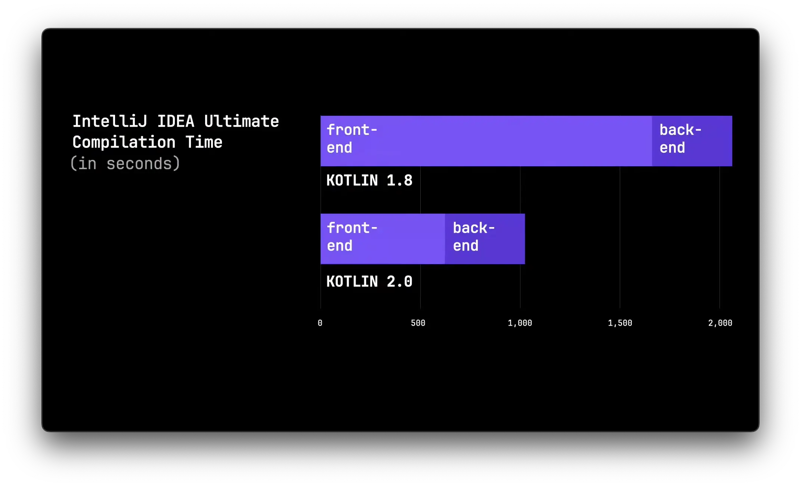
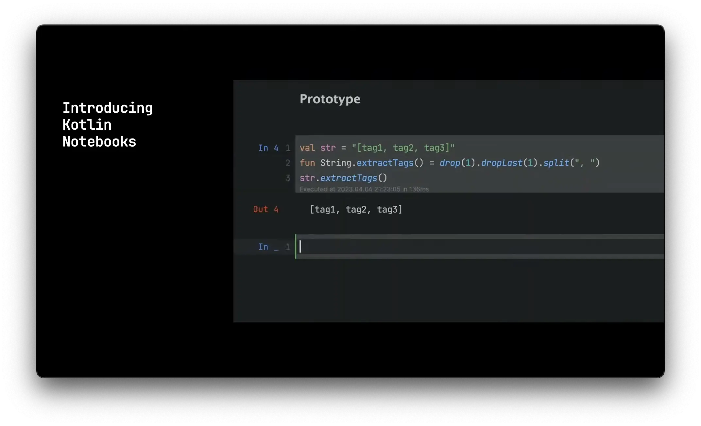
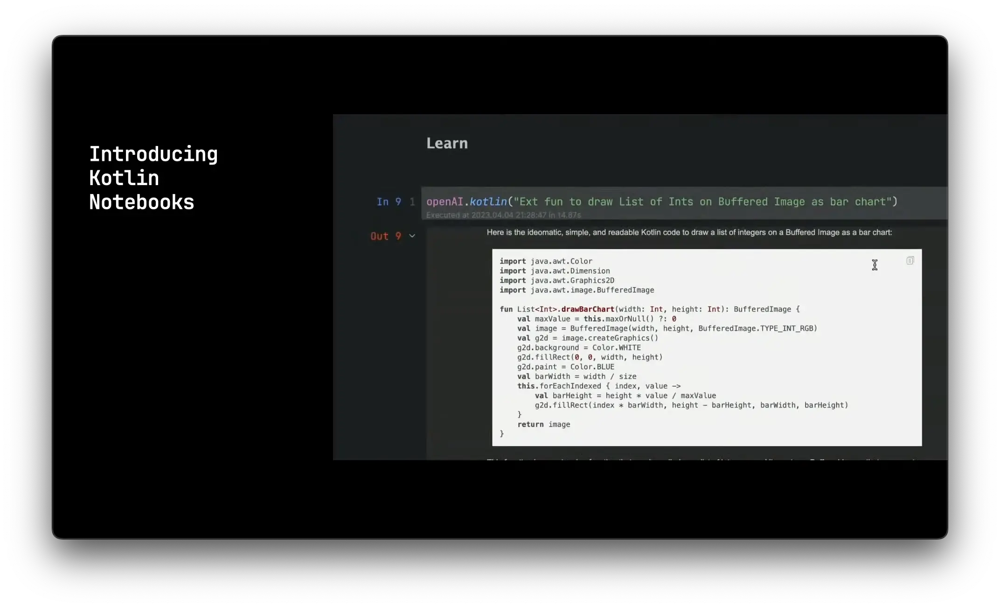
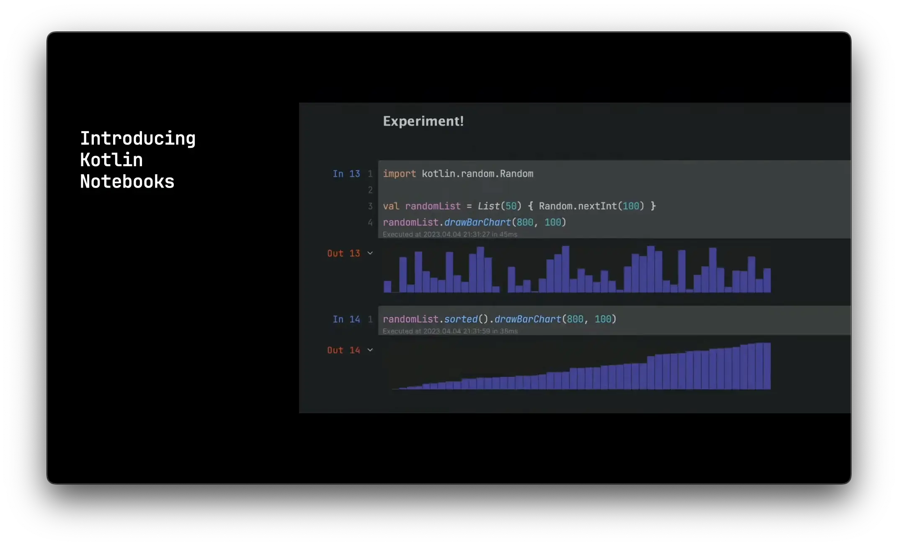
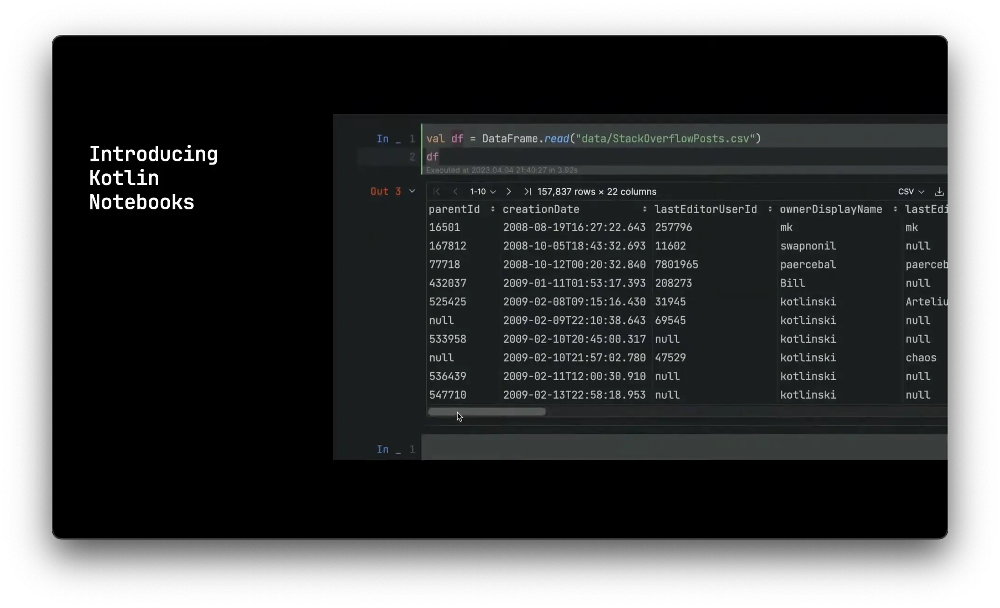
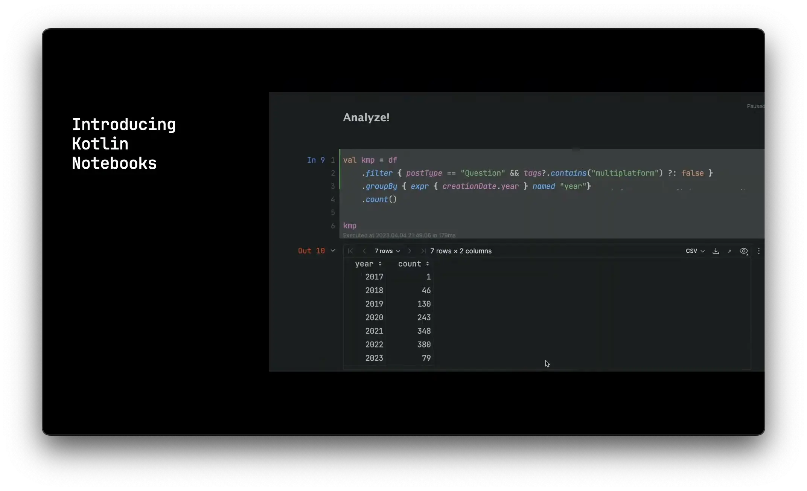
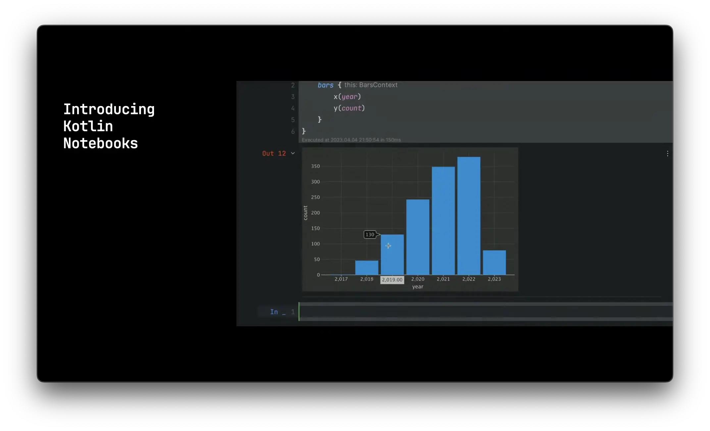

올해도 [KotlinConf](https://kotlinconf.com/)가 열렸습니다. 매년 꼭 챙겨 보는 편은 아니지만, 최근에는 K2 Compiler와 KMM을 비롯해 JetBrains 쪽 움직임이 꽤 활발하다는 느낌이 들어서 이번에는 키노트와 주요 세션을 살펴봤습니다. 생각보다 흥미로운 발표가 많아서, 인상 깊었던 내용을 간단히 정리해 보려 합니다.

아래에서는 세션별로 어떤 이야기가 나왔는지 순서대로 살펴보겠습니다.

## K2 Compiler

먼저 Kotlin 2.0에 들어갈 예정인 [K2 Compiler](https://blog.jetbrains.com/kotlin/2021/10/the-road-to-the-k2-compiler/) 이야기입니다. 2021년부터 계속 소개되던 주제인데, 단순히 컴파일러 성능만 높이는 것이 아니라 플러그인 대응 같은 구조적인 개선도 함께 가져가려는 흐름으로 보였습니다. Kotlin 1.8이 나온 시점에서도 이미 상당 부분이 구현된 상태라는 점이 인상적이었습니다.

세션에서는 Kotlin 1.8과 K2 기반 2.0의 컴파일 성능 차이를 그래프로 보여 줬는데, 같은 환경에서 20초 걸리던 작업이 10초 수준으로 줄어드는 식으로 설명되었습니다.



Android 공식 언어가 Kotlin으로 자리 잡으면서 Java에서 Kotlin으로 옮긴 뒤 빌드가 느려졌다는 이야기도 종종 들렸는데, 이런 개선은 꽤 반가운 소식입니다. 컴파일러 성능이 좋아지면 IntelliJ에서의 개발 경험도 함께 좋아질 테니, 체감 효과도 작지 않을 것 같습니다.

또 당시 발표 기준으로는 Kotlin 1.9가 그해 하반기에 예정되어 있었고, 그다음에 1.10 같은 버전은 계획에 없다고 했습니다. 즉 1.9 다음은 바로 2.0으로 넘어간다는 뜻이었습니다. 게다가 2.0은 1.9와의 하위 호환성을 유지하므로, 1.9에서 컴파일되는 코드라면 2.0에서도 그대로 컴파일될 수 있도록 하겠다는 설명이 있었습니다.

물론 실제 현업에서는 컴파일러가 통째로 바뀌는 버전을 바로 도입하기는 쉽지 않습니다. 예상하지 못한 문제가 생길 수도 있고, 기업 환경에서는 버전 업 자체를 보수적으로 가져가는 경우가 많기 때문입니다. 그래도 개인 프로젝트에서 가장 먼저 시험해 보고 싶은 변화 중 하나라는 생각이 들었습니다.

## 요청이 많았던 기능들

이 세션은 [YouTrack](https://www.jetbrains.com/youtrack/)에 올라온 기능 요청 가운데 특히 관심이 많았던 항목들을 앞으로 어떤 방향으로 풀어 갈지 소개하는 시간이었습니다. 하나씩 보면 꽤 흥미로운 주제가 많았습니다.

### Static Extensions

[KT-11968](https://youtrack.jetbrains.com/issue/KT-11968/Research-and-prototype-namespace-based-solution-for-statics-and-static-extensions)은 Java 클래스에도 `Companion object`처럼 정적 메서드나 정적 프로퍼티를 확장 형태로 추가하고 싶다는 요청입니다.

기존에는 이런 식으로 Java 클래스에 대해 인스턴스 생성 없이 바로 쓰는 정적 확장을 자연스럽게 만들기 어려웠습니다.

```kotlin
File.open("data.txt")
fun File.Companion.open(name: String)
```

발표에서는 앞으로 `static` 키워드를 사용해 이런 형태를 지원하는 방향을 보여 줬습니다.

```kotlin
fun File.static.open(name: String)
```

개인적으로는 MySQL과 JVM의 날짜 최대값 기준이 달라서 버그를 겪었던 적이 있었고, 그때 `LocalDate`에 별도 프로퍼티를 추가하고 싶어도 Java 클래스에는 이런 식의 정적 확장을 붙이기 어려워 포기한 적이 있었습니다. 그래서 이 기능은 꽤 반가웠습니다.

### Collection Literals

[KT-43871](https://youtrack.jetbrains.com/issue/KT-43871/Collection-literals)은 말 그대로 컬렉션 리터럴을 언어 차원에서 지원해 달라는 요청입니다.

지금까지는 보통 이런 식으로 작성했죠.

```kotlin
cmdArgs = listOf("-language-version", "2.0")
```

앞으로는 아래처럼 더 직관적인 컬렉션 리터럴을 쓸 수 있는 방향이 제시됐습니다.

```kotlin
val skip: PersistentSet<Int> = [0, 1]
val skip2 = PersistentSet [0, 1]
```

개인적으로는 `const` 키워드의 적용 범위도 좀 더 넓어졌으면 좋겠다는 생각이 있지만, 그래도 이 변화 자체는 충분히 반갑습니다. 특히 어노테이션 인자처럼 사실상 리터럴이 자주 쓰이는 위치에서는 활용 범위가 꽤 넓을 것 같습니다.

### Name-Based Destructuring

[KT-19627](https://youtrack.jetbrains.com/issue/KT-19627)은 분해 선언 시 변수명과 실제 필드명이 일치하도록 보완해 달라는 요청입니다.

예를 들어 다음 코드는 문제가 없습니다.

```kotlin
data class Person(
    val firstName: String,
    val lastName: String
)

val (firstName, lastName) = Person("John", "Doe")
```

그런데 아래처럼 순서를 잘못 쓰면 의도와 달리 값이 뒤바뀝니다.

```kotlin
val (lastName, firstName) = Person("John", "Doe")
```

이 경우 `firstName`에는 `Doe`, `lastName`에는 `John`이 들어갑니다. 이런 실수를 막기 위해 `inline class`를 도입하거나, 아예 분해 선언을 피하는 방식으로 대응하는 경우도 있었는데, 앞으로는 변수명과 필드명을 컴파일러가 더 적극적으로 확인해 이런 오류를 줄여 주겠다는 방향이 소개됐습니다.

아이디어 자체는 상당히 인상적이지만, 실제로 얼마나 엄격하게 검사할지, 변수명과 필드명이 정확히 일치할 때만 동작하는지 같은 부분은 직접 동작을 봐야 판단할 수 있을 것 같습니다.

### Context Receivers

[KT-10468](https://youtrack.jetbrains.com/issue/KT-10468/Context-receivers-multiple-receivers-on-extension-functions-properties)은 함수에 필요한 컨텍스트를 일반 파라미터가 아니라 별도의 문맥으로 전달할 수 있게 하자는 제안입니다.

예를 들어 지금은 이런 코드가 있다고 할 수 있습니다.

```kotlin
fun processRequest(context: ServiceContext, request: ServiceRequest) {
    val data = request.loadData(context)
}
```

그리고 호출되는 쪽도 컨텍스트를 파라미터로 받아야 합니다.

```kotlin
fun ServiceRequest.loadData(context: ServiceContext): Data { /** ... */ }
```

이 구조에서는 함수 안에서 다른 함수를 많이 호출할수록 컨텍스트를 계속 넘겨야 합니다. 이를 아래처럼 `context` 키워드로 표현할 수 있게 하자는 것이었습니다.

```kotlin
context(ServiceContext)
fun processRequest(request: ServiceRequest) {
    val data = request.loadData()
}

context(ServiceContext)
fun ServiceRequest.loadData(): Data { /** ... */ }
```

아직 `context`에 어떤 기준으로 값을 전달하는지, 함수 내부에서는 어떤 방식으로 접근하는지까지는 명확히 알기 어려웠지만, 코드가 훨씬 깔끔해질 가능성은 충분히 느껴졌습니다.

### Explicit Fields

[KT-14663](https://youtrack.jetbrains.com/issue/KT-14663/Support-having-a-public-and-a-private-type-for-the-same-property)은 private 프로퍼티와 외부 공개용 프로퍼티를 굳이 따로 만들지 않아도 되는 형태를 지원해 달라는 요청입니다.

예를 들어 지금은 이런 패턴을 자주 봅니다.

```kotlin
private val _applicationState = MutableStateFlow(State())
val applicationState: StateFlow<State>
    get() = _applicationState
```

발표에서는 이를 다음처럼 더 간결하게 표현할 수 있는 방향을 보여 줬습니다.

```kotlin
val applicationState: StateFlow<State>
    field = MutableStateFlow(State())
```

비슷한 프로퍼티를 두 개 선언하지 않아도 되고 줄 수도 줄일 수 있으니 꽤 편리해 보였습니다. 특히 Compose처럼 상태를 프로퍼티 중심으로 관리하는 코드에서는 자주 쓰일 만한 패턴이라는 생각이 들었습니다.

## Kotlin Notebooks

이 세션에서는 새로운 Kotlin Notebooks도 발표됐습니다. 이미 [Jupyter Notebook](https://jupyter.org/)에서도 Kotlin을 쓸 수 있지만, 이를 Kotlin에 좀 더 특화된 형태로 다듬은 느낌이었습니다. 영상에서 다양한 기능을 직접 보여 주고 있어서 설명보다는 화면 예시를 보는 편이 더 빠릅니다.








그 외에도 자동완성, 온라인 코드 공유, 테이블 정렬, 컬럼 순서 변경 같은 기능이 소개됐습니다. Kotlin으로 실험적 코드를 돌리거나 데이터를 다루는 흐름이 조금 더 편해질 것 같았습니다.

## Google @ KotlinConf

이 세션은 Google 측 발표였는데, 전체적으로는 Android 앱 중 Kotlin과 Compose를 쓰는 비율처럼 지표 중심의 이야기가 많았습니다. Google 내부에서도 Kotlin을 적극적으로 쓰고 있고, Google Workspace에서도 Kotlin Multiplatform으로 비즈니스 로직을 작성하고 있다는 설명이 있었습니다.

또 눈에 띄었던 것은 Android 개발에서 Gradle 기본 설정이 Kotlin DSL로 넘어갔다는 점입니다. Kotlin으로 개발하는 입장에서는 Groovy보다 Kotlin DSL이 훨씬 자연스럽다고 느껴졌기 때문에, 이런 변화는 반가웠습니다.

다만 Google 입장에서는 Kotlin 외에도 Flutter나 Go 같은 다른 선택지도 함께 가져가고 있기 때문에, 앞으로 어떤 방향으로 무게를 둘지는 계속 지켜볼 필요가 있어 보였습니다. KotlinConf라는 자리에서는 당연히 그런 경쟁 이야기를 깊게 하지는 않았지만, 장기적으로는 Google의 방향성과 Compose Multiplatform의 확장 속도를 더 주의 깊게 보고 싶었습니다.

## Crossplatform

이 세션에서는 Compose의 iOS 지원과 Kotlin Multiplatform의 현재 상태를 소개했습니다. Compose for iOS는 Alpha, Multiplatform은 Beta 단계이며, 이미 많은 라이브러리가 대응하고 있다는 이야기였습니다. Kotlin이 처음부터 JVM 밖의 영역까지 염두에 두고 설계된 언어였다는 점을 생각하면, 10년이 넘어서야 그 로드맵이 본격적으로 현실이 되어 가는 느낌이 들었습니다.

개인적으로는 Xcode와 SwiftUI보다 IntelliJ와 Compose 쪽이 더 잘 맞는다고 느끼고 있었기 때문에, iOS 개발까지 Kotlin 흐름 안에서 볼 수 있게 된 점이 특히 반가웠습니다. 게다가 AppCode가 그해 종료된다는 발표도 있었기 때문에, Mac이나 iOS 개발을 하려면 결국 SwiftUI를 본격적으로 공부해야 하나 고민하던 시점이었습니다. 그런 상황에서 Compose의 iOS 지원 확대는 타이밍상으로도 꽤 의미 있게 느껴졌습니다.

마침 최근에 웹, 모바일, 데스크톱 앱을 가능한 한 Kotlin만으로 풀어 보는 사이드 프로젝트를 하고 있었기 때문에, 이쪽은 조만간 직접 한 번 시도해 보고 싶다는 생각이 들었습니다.

## 마지막으로

처음에는 K2 Compiler의 현재 상태가 궁금해서 보기 시작했는데, 예상보다 흥미로운 소식이 많았습니다. 개인적으로는 하나의 언어로 가능한 한 많은 것을 해결하고 싶어서 Kotlin을 계속 보고 있었는데, 이번 KotlinConf를 보고 나니 그 선택이 꽤 괜찮았다는 생각이 더 강해졌습니다.

아직 서버 사이드에서 Kotlin의 점유율이 압도적이라고 보기는 어렵지만, 여러 분야에서 Kotlin을 사용할 수 있는 기반이 계속 넓어진다면 언어 자체의 성장 가능성은 충분하다고 생각합니다. 이번 글에서는 키노트와 일부 세션만 간단히 다뤘지만, 공식 채널에는 다른 발표도 많이 올라와 있으니 관심이 있다면 직접 보는 것도 추천합니다.
