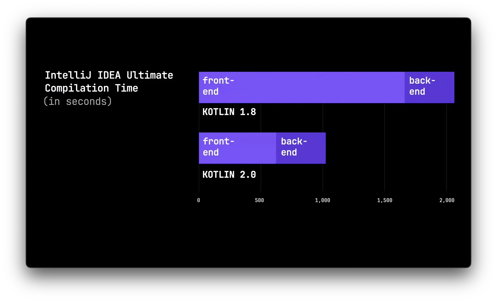
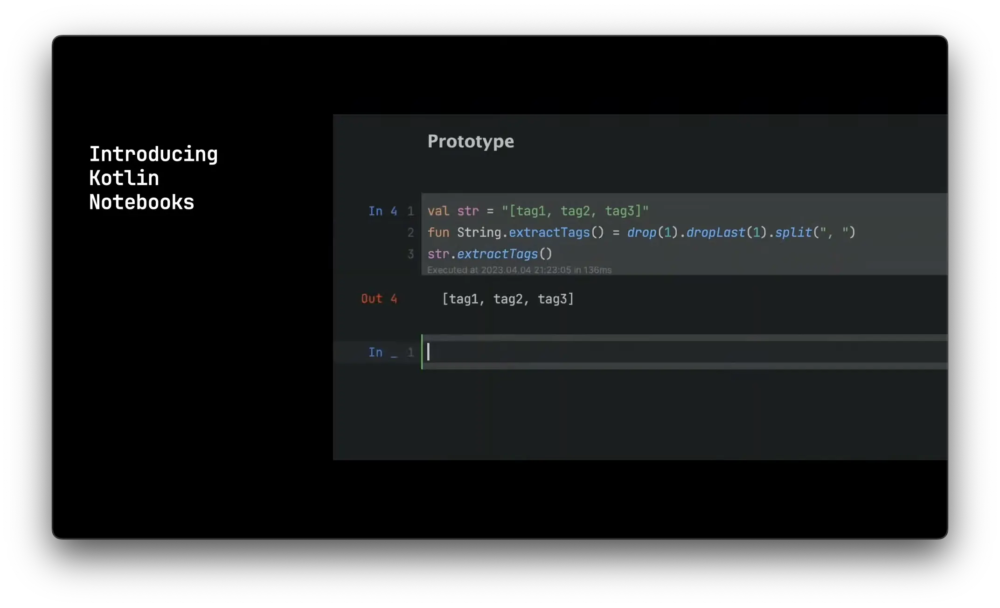
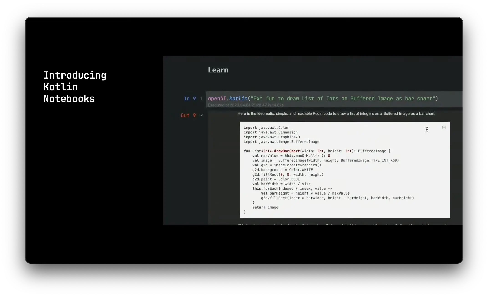
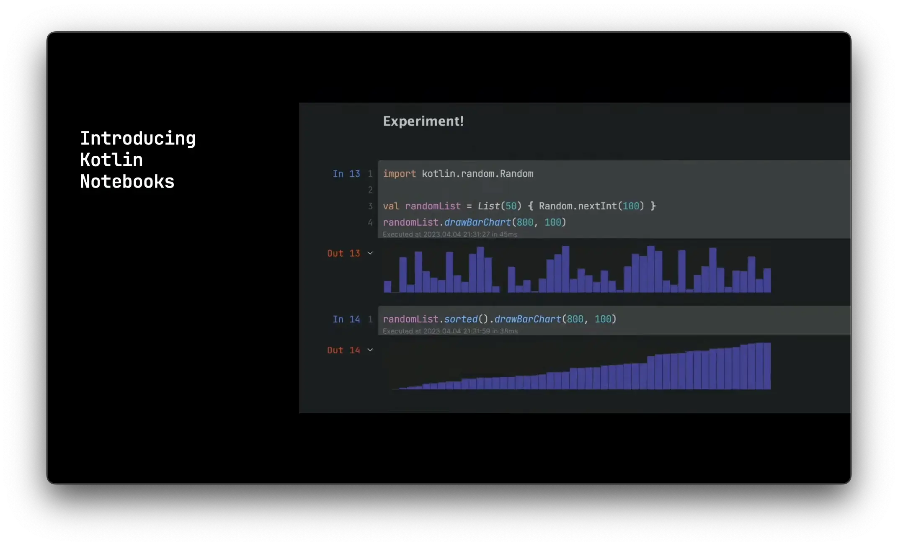
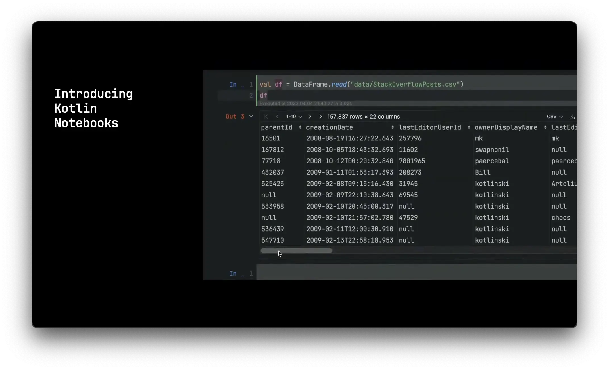
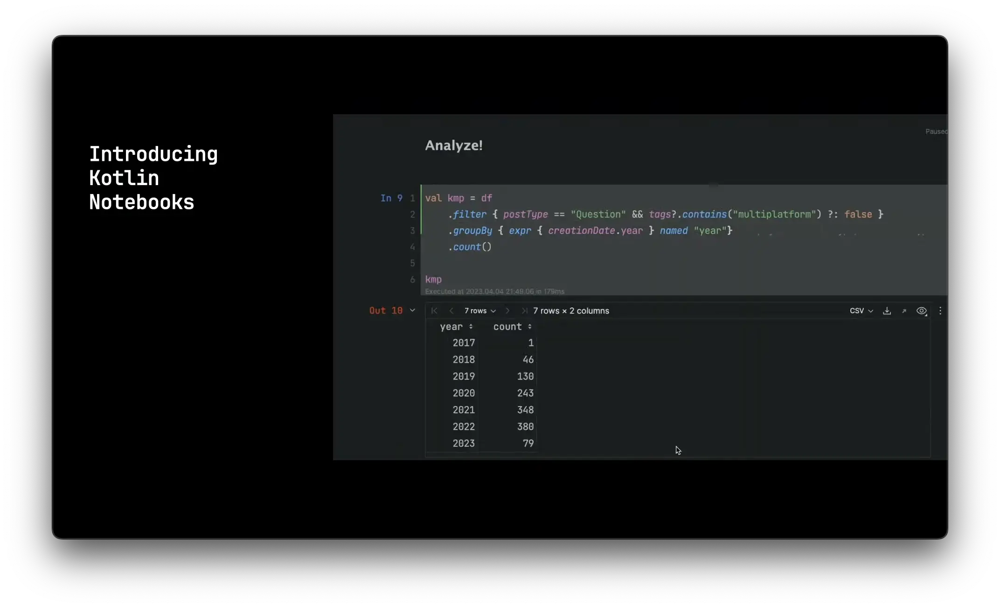
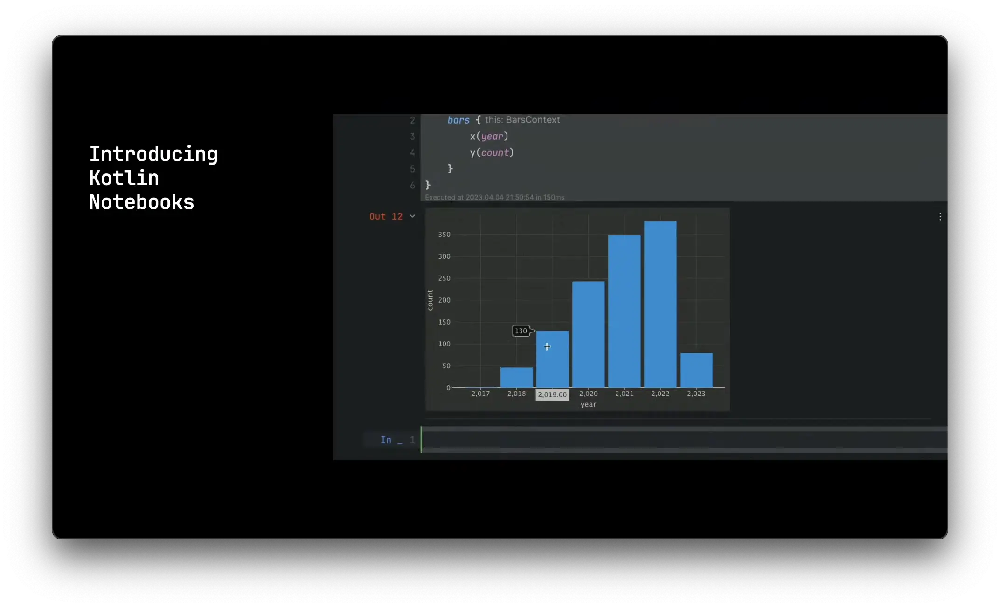

今年も[KotlinConf](https://kotlinconf.com/)が開催されました。毎年興味を持って参加やキーノートを視聴しているわけでもありませんが、最近はK2 CompilerにやKMMなどJetbrainsのプロダクトがかなり盛んな感じなので視聴することにしました。そこで思ったより興味深い発表が多かったので、今回はその内容について簡単にまとめてみようかなと思います。

では、セッション別にどんな話があったのかを紹介していきます。

## K2 Compiler

まずはKotlin 2.0で採用予定の[K2 Compiler](https://blog.jetbrains.com/kotlin/2021/10/the-road-to-the-k2-compiler/)の話です。2021年から発表されていて、コンパイラの性能向上のみでなくプラグイン対応などの機能も提供する予定となっていますね。今現在開発が進んでいて、Kotlin 1.8がリリースされた今もかなり多い部分が完成されている状態です。

ここではKotlin 1.8と、2.0になった場合のコンパイラのパフォーマンスの違いをまずグラフとして提示していました。当たり前ながら、2.0でかなり速度が上がったように見えます。同じ環境で20秒かかるものが、10秒に短縮されたということですね。



Andoridの公式言語としてKotlinが採用され、JavaからKotlinに移行した開発者の間でやはりビルドが遅くなったという話を聞いた覚えがあるのでこれはかなり嬉しい結果となっていますね。またコンパイラのパフォーマンスが上がるとintellijでのコンパイルも早くなるわけなのでより快適な開発環境になると思います。

また、今年の後半にはKotlin 1.9のリリースが予定されていて、その次に1.10のようなバージョンは予定にないとのことでした。つまり、1.9の後はすぐに2.0となるとのことですね。そして2.0は1.9の後方互換性を保つので、1.9でコンパイルができるのであれば2.0でもコンパイルができるとのことです。

もちろん言語のバージョンアップを急ぐ企業さんはそこまではないと思いますし、コンパイラ自体が変わることでどんな問題が起こるかわからないので、実際の採用まではかなり時間がかるでしょう。ただ個人的にはサイドプロジェクトで色々試してみたいので、来年からはK2 Compilerに触れられるということが楽しみです。

## 要望の多い機能

[Youtrack](https://www.jetbrains.com/youtrack/)というサイトからJetbrainsのプロダクトに関して議論できるのですが、ここで要望の多い機能に対して今後どのような形で対応していくかを説明するセッションです。ここは一つ一つ、どのような要望があるかを見ていきます。

### Static Extensions

[KT-11968](https://youtrack.jetbrains.com/issue/KT-11968/Research-and-prototype-namespace-based-solution-for-statics-and-static-extensions)に上がっているもので、JavaクラスにもCompanion objectのように、staticなメソッドやプロパティを追加できるようにしてほしいということです。

例えば、今までは以下のようにJavaのクラスにCompanion objectを定義してインスタンスの生成なしで使うことはできませんでした。

```kotlin
File.open("data.txt")
fun File.Companion.open(name: String)
```

これを、`static`というキーワードを使って以下のように書けるようになるとのことです。

```kotlin
fun File.static.open(name: String)
```

個人的にはMySQLとJVMの日付のMAX_VALUEの閾値が違ってバグが起きたことがあって、LocalDateに別途プロパティを追加したかったのにJavaのクラスにはstaticなプロパティの追加ができなくて諦めた経験があるのでこれはとても嬉しい変化です。

### Collection Literals

[KT-43871](https://youtrack.jetbrains.com/issue/KT-43871/Collection-literals)に上がっているもので、その名の通りコレクションのリテラルを作成できるようにしてほしいということです。

例えば、今までは言語レベルでコレクションのリテラルに対応していなかったので、以下のような書き方が多かったかなと思います。

```kotlin
cmdArgs = listOf("-language-version", "2.0")
```

それが、以下のようにコレクションのリテラルを書けるようになるとのことです。

```kotlin
val skip: PersistentSet<Int> = [0, 1]
val skip2 = PersistentSet [0, 1]
```

個人的には`const`キーワードの適用範囲をもっと広げてほしいと思っているところですが、これもまた悪くない変化ですね。特にアノテーションなどで使われる配列は実際リテラルになるケースが多いと思いますので、そこでまた色々と活用できる余地ができるかもしれません。

### Name-Based Destructing

[KT-19627](https://youtrack.jetbrains.com/issue/KT-19627)に上がっているもので、分解宣言時に変数名とフィールド名が一致するようにしてほしいということです。

例えば以下のように分解宣言をしたとしましょう。

```kotlin
data class Person(
    val firstName: String,
    val lastName: String
)

val (firstName, lastName) = Person("John", "Doe")
```

上記のコードの場合、`firstName`は`John`, `lastName`は`Doe`となります。data classの実際のフィールド名とも一致しているので、なんの問題もありません。ただ、もし間違って以下のようにしたらどうでしょう。

```kotlin
val (lastName, firstName) = Person("John", "Doe")
```

この場合、意図とは違って`firstName`は`Doe`, `lastName`は`John`となってしまいます。このようなミスを回避するために[inline class](https://kotlinlang.org/docs/inline-classes.html)などを導入してフィールドごとに型を定義したり、分解宣言そのものを使わないようにするなどの対応をしていることも少なくはないかと思いますが、今後はこのようなミスを回避するために、分解宣言時に変数名とフィールド名が一致するかどうかコンパイラが判断して値の代入を行うことになるとのことです。

個人的にはかなりすごいと思いますが、心配も多いですね。単純に変数名とフィールドが一致する時のみ動作してくれるのかどうかわからないので、実際の動作を見ておきたいものです。

### Context Recivers

[KT-10468](https://youtrack.jetbrains.com/issue/KT-10468/Context-receivers-multiple-receivers-on-extension-functions-properties)に上がっているもので、関数にコンテキストが必要な場合はパラメータとしてではなく、別途のキーワードを使ってコンテキストを渡すことができるようにしてほしいということです。

例えば、以下のような関数があるとします。

```kotlin
fun processRequest(context: ServiceContext, request: ServiceRequest) {
    val data = request.loadData(context)
}
```

上記の関数ではコンテキストを引数としてもらい、さらにそのコンテキストを違う関数の方に渡しています。当然、呼ばれる関数の方も引数にコンテキストが必要になります。以下のようにですね。

```kotlin
fun ServiceRequest.loadData(context: ServiceContext): Data { /** ... */ }
```

この場合、関数の中で呼ばれる他の関数が多くなればなるほど、その関数にもコンテキストを渡す必要が出てきます。そこで、以下のように別途のキーワードを使って、引数の追加なしでコンテキストを渡すことができるようになるということです。

```kotlin
context(ServiceContext)
fun processRequest(request: ServiceRequest) {
    val data = request.loadData()
}

context(ServiceContext)
fun ServiceRequest.loadData(): Data { /** ... */ }
```

この`context`のキーワードに渡せるコンテキストの基準が何か、そしてどのように関数の中でコンテキストを呼び出せるかどうかはまだわかりませんが、より綺麗な感覚になっているかなと思います。

### Explicit Fields

[KT-14663](https://youtrack.jetbrains.com/issue/KT-14663/Support-having-a-public-and-a-private-type-for-the-same-property)に上がっているもので、privateなプロパティに対してpublicなプロパティを定義しなくても良いようにしてほしいということです。

例えば、privateのプロパティに対して、外部から参照する場合は以下のように書くケースがあるかなと思います。privateなプロパティを維持しつつ、外部で参照のみできる別のプロパティがその値を提供するということですね。

```kotlin
private val _applicationState = MutableStateFlow(State())
val applicationState: StateFlow<State>
    get() = _applicationState
```

これを、以下のように書けるようになるらしいです。

```kotlin
val applicationState: StateFlow<State>
    field = MutableStateFlow(State())
```

行数をかなり減らせられ、似たようなプロパティを定義する必要もなくなるのでかなり便利そうな感覚です。特にComposeのようにプロパティで状態を管理する場合はこのようなパターンが多いかなと思いますので、有効活用できるかなと思いました。

## Kotlin Notebooks

このセッションで新しくKotlin Notebooksというものの発表がありました。今は[Jupyter Notebook](https://jupyter.org/)でもKotlinは使えるのですが、似たような機能をKotlin専用として開発したような感覚ですね。Jupyterそのものも有名で、動画の中ですでに多くの機能を紹介しているので説明よりはそのキャプチャを載せておきます。以下のような活用例が紹介されています。













その他、自動完成やオンラインでのコードシェア対応、テーブルのソートとカラムの順番変更などができるという点が紹介で明らかになっています。

## Google@KotlinConf

こちらのセッションはGoogleの人が出て発表をしていましたが、主に指標の話で、Androidのアプリの中でKotlinやComposeを採用しているものがどれほど多いかの話などが多かったですね。また、GoogleでもKotlinを積極活用していて、Google WorkspaceでもKotlin Multiplatformを利用してビジネスロジックを書いているという話がありました。

他に注目したいところは、Androidの開発においてGradleのデフォルト設定がKotlin DSLになったというところです。Kotlinで開発をしているならもちろんGroovyよりはKotlinの方が便利だと思っていたので、このような変化はありがたいですね。

ただ、GoogleでもKotlinを利用しているとはいえ、FlutterやGoという競合もあるので、今後どのような方向性を取っていくのかが気になりました。もちろんKotlinのカンファレンスなのでそのような話には触れなかったのですが、今後のGoogleの方針やCompose Multiplatformのシェアについてはもっと注目したいと思いました。

## Crossplatform

このセッションではComposeのiOS対応の発表と、Mutiplatformの現在の紹介などがありました。ComposeのiOSはAlpha、MultiplatformはBetaの段階で多くのライブラリが対応しているなどの話が続きましたね。Kotlinが初めからJVM以外の領域でも活用できることを目標として開発されたのは確かですが、登場から10年以上も経ってやっとそのロードマップが現実になっているなという感覚でした。

個人的にはXcodeやSwiftUIよりはintellijとComposeの方が合っていると感じていたので、iOSの開発ができるようになったのは大変嬉しく思っています。特に、AppCodeの開発が今年て終了するとのことだったのでMacやiOSの開発のためには致し方なくSwiftUIを勉強する必要があるかなと思っていたところなのでタイミング的にも最適ですね。直近でちょうどKotlinのみでウェブとモバイル、デスクトップのアプリを開発するというサイドプロジェクトをやっているので、早速試してみようかなと思っています。

## 最後に

純粋にK2 Compilerの現在が知りたくて試聴した動画で、思わぬ発表が続いて嬉しい気持ちになりました。個人的には一つの言語で必要なことができるようにしたいと思っていたので、Kotlinという言語を選択したのは正解だったという気持ちになりました。

やはりまだサーバサイドでもシェアはそこまで高くないかなと思いますが、これからもいろいろな分野でKotlinを使える環境が整っていくと言語として伸びるポテンシャルは十分など思いますので、また今後に期待ですね。

取り急ぎ、KotlinConfのキーノートの動画を紹介しましたが、他にもいろいろな動画が公式のチャンネルにて配信中なので、興味がある方はぜひ見てみてください。

では、また！
