올해도 KotlinConf가 열렸습니다. 며칠에 걸쳐 진행되는 행사라 모든 세션을 다 보기는 어렵지만, 우선 키노트에서 나온 핵심 내용부터 정리해 봤습니다. 전체 일정은 [공식 스케줄](https://kotlinconf.com/schedule/)에서 확인할 수 있고, [YouTube 라이브 스트리밍](https://www.youtube.com/@Kotlin/streams)도 제공되고 있으니 관심이 있다면 함께 보면 좋겠습니다.

행사 초반에는 KotlinConf'24 공식 앱 소개가 있었습니다. 이 앱으로 컨퍼런스 일정과 세션 정보를 확인할 수 있고, 소스 코드도 [GitHub](https://github.com/JetBrains/kotlinconf-app)에 공개되어 있습니다. Kotlin Multiplatform으로 만들어져 iOS, Android, Web에서 동작하니, 샘플 프로젝트로도 꽤 참고할 만해 보였습니다.

## Kotlin의 현재

먼저 Kotlin 생태계 현황입니다. 발표에 따르면, 꾸준히 Kotlin을 사용하는 엔지니어 수가 200만 명을 넘었다고 합니다.

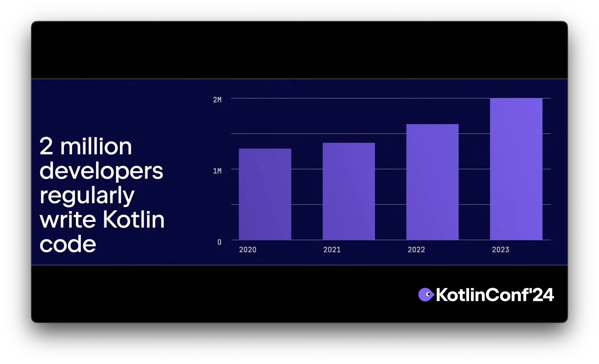

Kotlin을 도입하는 기업도 계속 늘고 있다고 합니다. 대표적인 사례는 아래 이미지에 정리돼 있습니다.

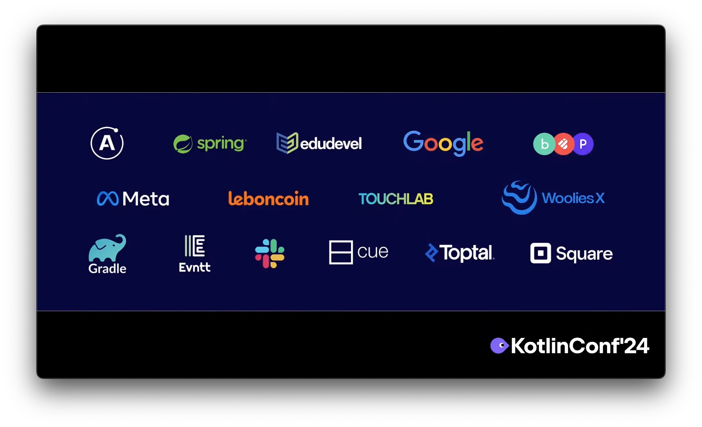

## Kotlin 2.0 and K2 Compiler

이번 키노트에서 가장 큰 주제는 역시 Kotlin 2.0과 K2 컴파일러였습니다. 전반적으로 컴파일 속도가 개선됐다는 점이 강조됐고, 일부 프로젝트에서는 예외적으로 느려지는 경우도 있다고 언급됐습니다. IntelliJ의 K2 모드도 소개됐는데, 코드 하이라이트가 최대 1.8배 빨라진다고 합니다.

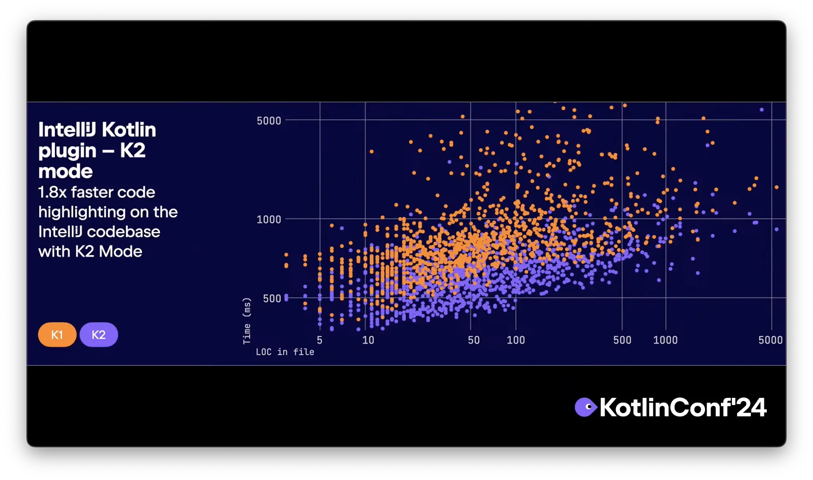

K2 모드는 IntelliJ 2024.1 이상에서 설정할 수 있고, 2024.2부터는 성능 개선을 포함한 베타 버전으로 제공될 예정이라고 합니다.

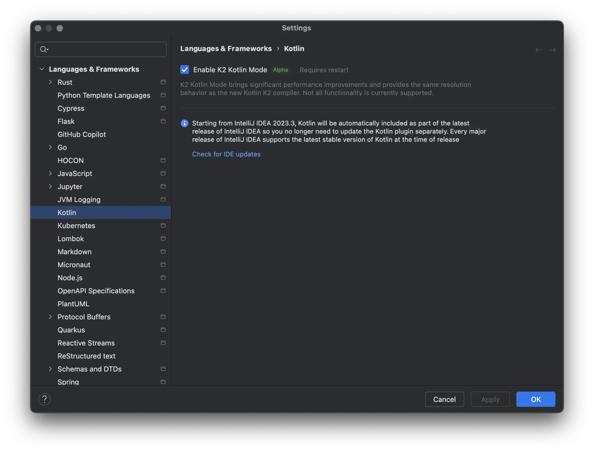

2.0 마이그레이션은 1,000만 줄의 코드, 18,000명의 엔지니어, 80,000개 프로젝트에서 검증됐고, 1.9에서 2.0으로의 전환도 비교적 매끄럽게 진행할 수 있다는 설명이 있었습니다.

### Meta의 사례

Meta는 Kotlin-first 전략으로 개발을 적극 추진하고 있다고 합니다. IDE부터 코드 최적화까지 Kotlin을 폭넓게 활용하고 있고, 기존에 Java로 작성된 Facebook, Instagram, Facebook Messenger, WhatsApp 같은 앱을 Kotlin으로 자동 변환하는 도구도 만들어 마이그레이션을 자동화하고 있다고 합니다.

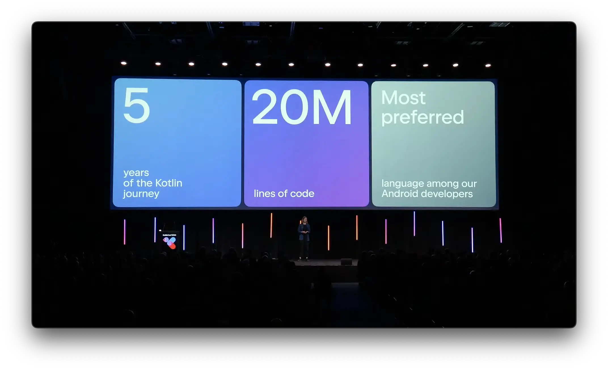

또한 Meta는 Kotlin 1.8 시점부터 일부 프로젝트에서 이미 K2 컴파일러를 도입했고, 현재는 전체 프로젝트의 95%가 K2를 사용하고 있다고 합니다. 그 결과 Android 프로젝트에서는 빌드 시간이 최대 20% 단축됐다고 합니다.

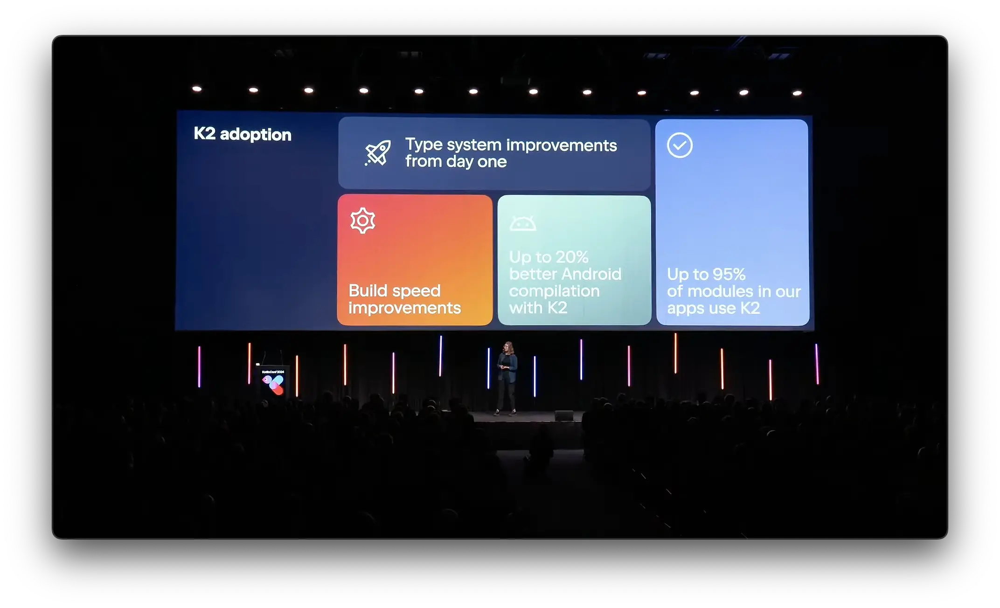

### Google의 사례

Google도 K2 컴파일러 개선에 협력하고 있으며, Android 툴링 측면에서 Lint, [Parcelize](https://developer.android.com/kotlin/parcelize?hl=ko), [KSP](https://kotlinlang.org/docs/ksp-overview.html) 등에 기여하고 있다고 합니다. Jetpack Compose 컴파일러도 개선돼, 기존에는 Kotlin 버전과 따로 맞춰야 했던 부분을 2.0부터는 같은 버전으로 지정할 수 있게 됐다고 합니다.

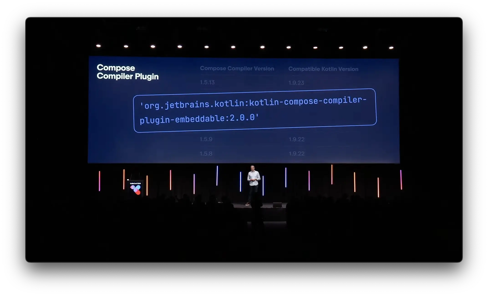

Android Studio의 Kotlin 2.0 지원 계획도 함께 소개됐습니다.

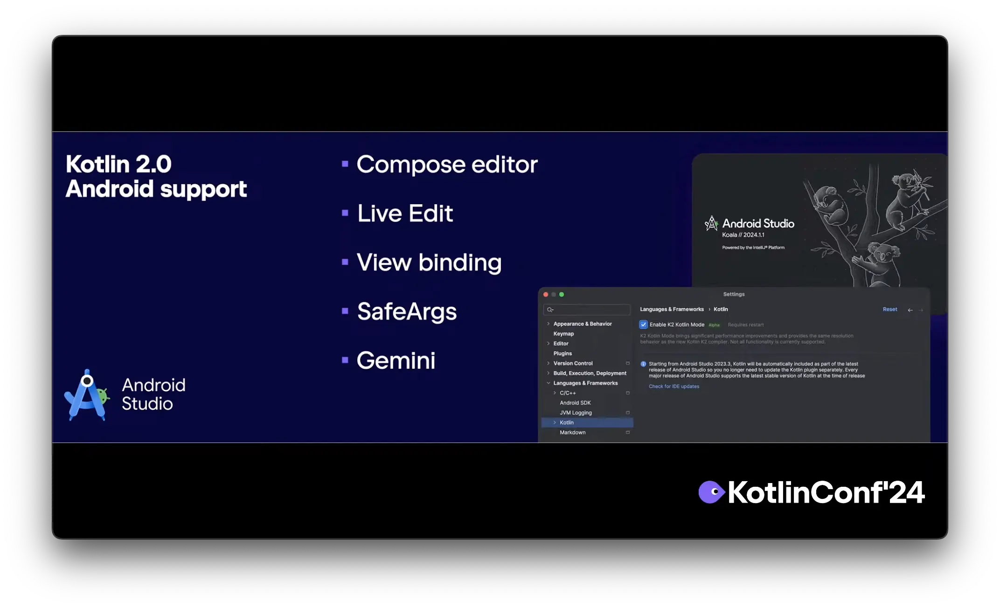

Jetpack Compose에도 새로운 기능이 추가될 예정이고, 아래에 정리된 기능들이 7월부터 순차적으로 제공된다고 합니다.

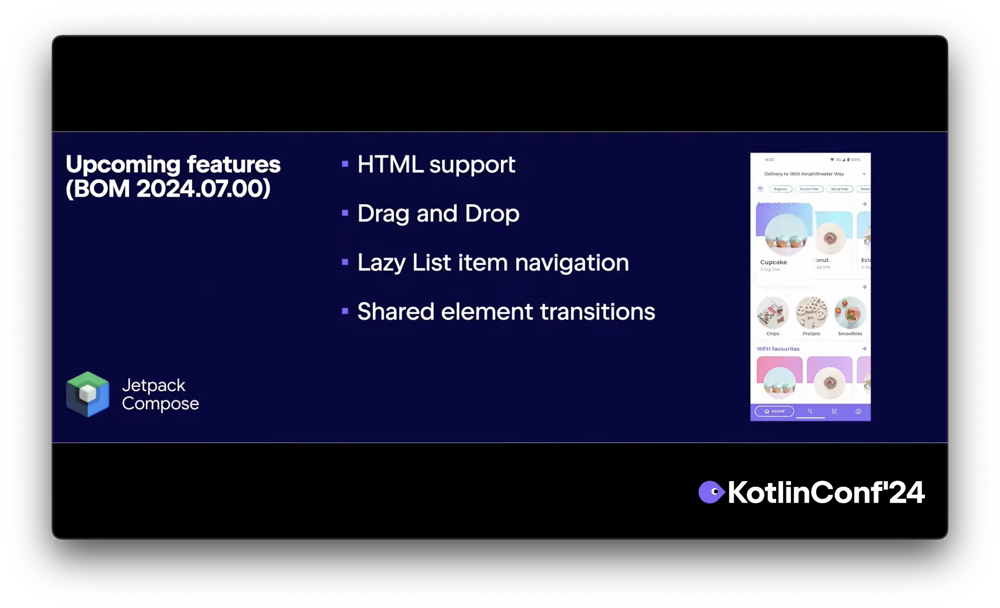

컴파일러 자체의 안정성과 성능 개선도 강조됐습니다.

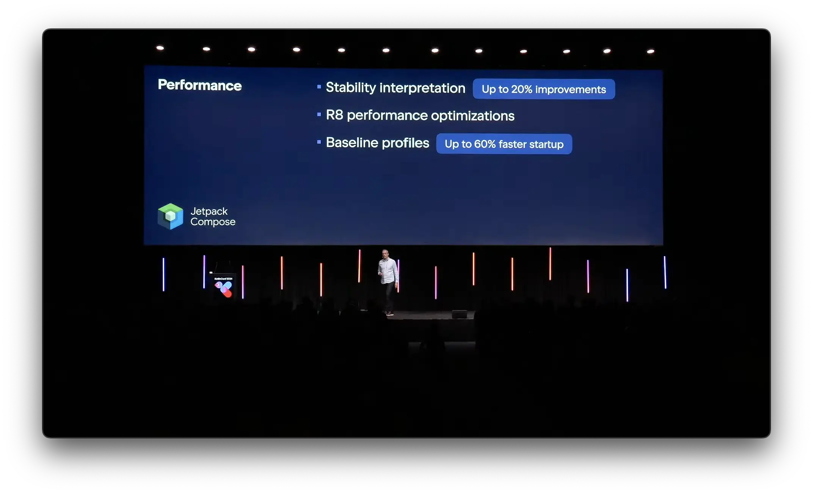

그 밖에도 Google 내부에서는 서버 사이드 Kotlin 도입이 계속 진행 중이고, KMP 기반 개발도 확대되고 있다고 합니다. Jetpack Compose 관련 라이브러리 역시 Multiplatform을 지원하게 되어 ViewModel, Room 같은 라이브러리도 Kotlin Multiplatform에서 사용할 수 있게 됐다고 합니다.

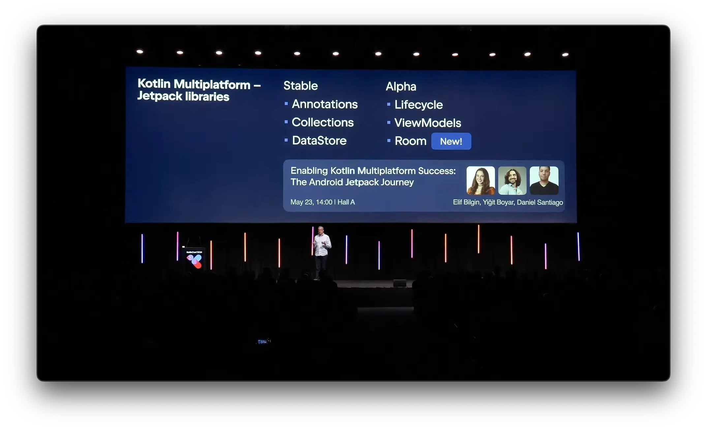

## Kotlin Multiplatform

K2 컴파일러 도입으로 Kotlin 코드를 직접 Swift 코드로 변환할 수 있게 됐다는 이야기도 나왔습니다. 덕분에 iOS 앱 개발에서도 Kotlin Multiplatform 활용 범위가 더 넓어질 것으로 보입니다.

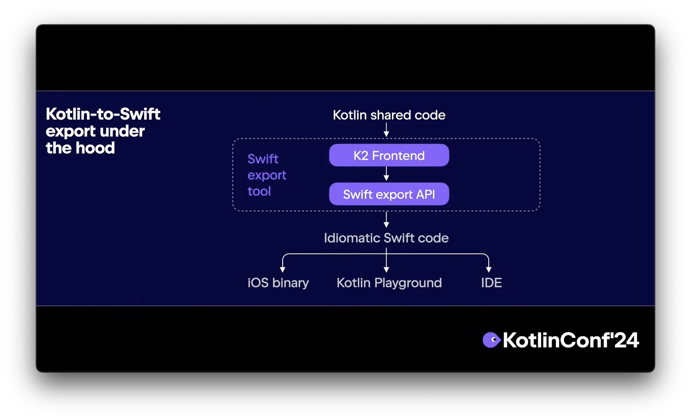

또 [Fleet](https://www.jetbrains.com/ko-kr/fleet/)로 iOS 앱까지 개발할 수 있다는 소개도 있었습니다. Fleet에서는 Compose Multiplatform 기반으로 iOS와 Android 앱을 함께 다룰 수 있고, 리팩터링부터 디버깅까지 한 흐름으로 작업할 수 있다는 설명이었습니다. AppCode 지원이 2023년에 종료됐기 때문에, 이 부분은 반가운 소식이었습니다.

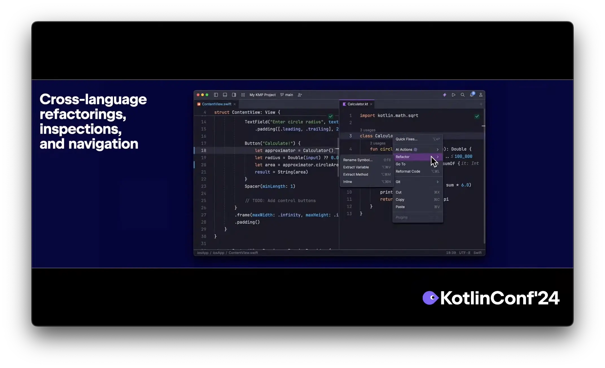

새 빌드 도구인 [Amper](https://github.com/JetBrains/amper)도 소개됐습니다. 아직 나온 지 오래되지는 않았지만 이미 JetBrains IDE에서 지원하고 있고, YAML만으로 빌드 설정을 작성할 수 있어 새 프로젝트에서 한 번 써볼 만해 보입니다.

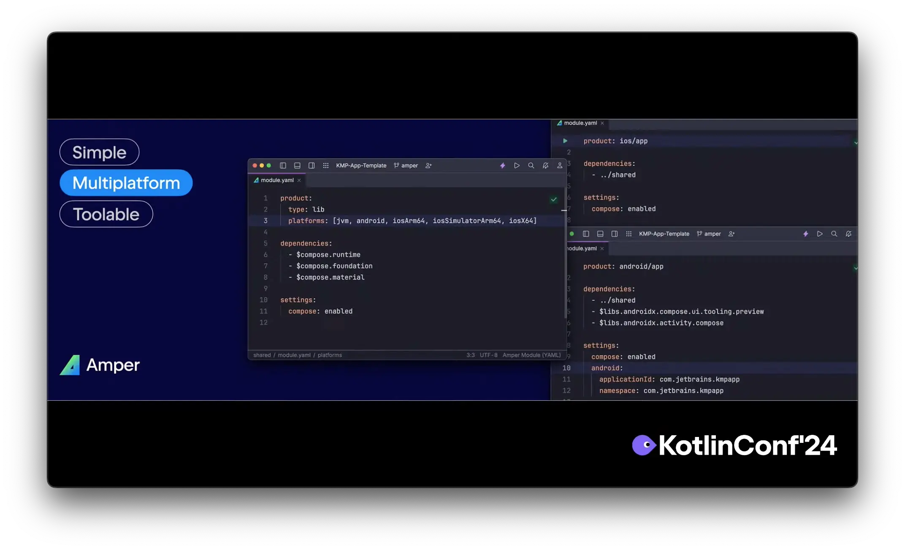

Compose Multiplatform 쪽에도 여러 기능이 추가됐습니다. 개인적으로는 데스크톱 앱에서 파일 선택 다이얼로그를 구현할 때 대응 API가 없어 Java AWT를 써야 했던 적이 있었는데, 이런 영역의 지원이 늘어나는 점이 특히 반가웠습니다.

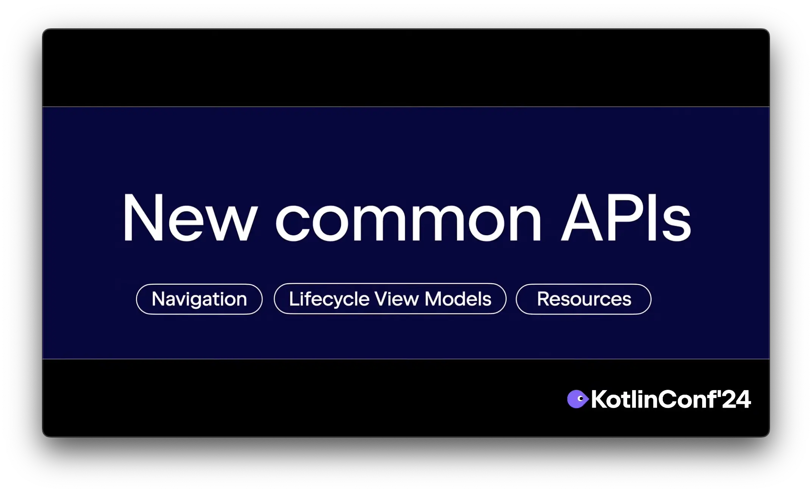

## Upcoming

다음으로는 Kotlin 2.1 베타부터 도입 예정인 기능과 새 라이브러리, AI 모델 관련 발표가 이어졌습니다.

### Guard

`when` 분기에서 조건을 더 깔끔하게 쓸 수 있도록 돕는 기능입니다. 기존에는 `status`를 여러 번 반복해서 써야 하는 상황이 있었습니다.

```kotlin
fun render(status: Status): String =
    when {
        status == Status.Loading -> "Loading"

        status is Status.OK && status.data.isEmpty() -> "No data"
        status is Status.OK -> status.data.joinToString()

        status is Status.Error && status.isCritical -> "Critical problem"
        else -> "Unknown problem"
    }
```

하지만 이를 `when (status)` 형태로 바꾸면 `and` 조건에서 컴파일 에러가 발생했습니다.

```kotlin
fun render(status: Status): String =
    when (status) {
        Status.Loading -> "Loading"

        is Status.OK && status.data.isEmpty() -> "No data" // Error: expecting '->'
        is Status.OK -> status.data.joinToString()

        is Status.Error && status.isCritical -> "Critical problem" // Error: expecting '->'
        else -> "Unknown problem"
    }
```

이를 개선하기 위해 `Guarded Condition`이 도입될 예정이라고 합니다.

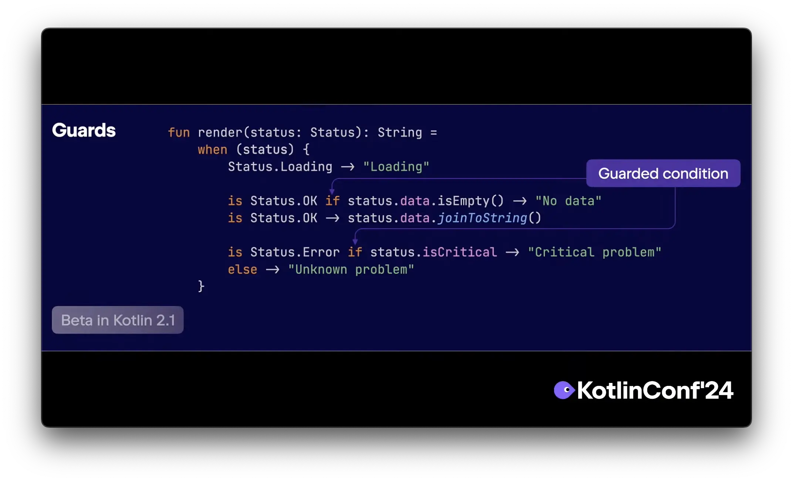

### $-escaping problem

Kotlin에서 `$`는 문자열 보간에 사용됩니다. 그래서 `$` 자체를 문자열로 쓰고 싶을 때, 특히 multi-line string에서는 꽤 번거로운 문제가 생깁니다. 예를 들어 아래와 같은 코드가 있을 수 있습니다.

```kotlin
val jsonSchema: String = """
    "$schema": "https://json-schema.org/draft/2020-12/schema",
    "$id": "https://example.com/product.schema.json",
    "$dynamicAnchor": "meta",
    "title": "Product",
    "type": "object"
}"""
```

여기서 `schema`, `id` 등은 변수명이 아니라 문자열로 쓰고 싶은 값입니다. 하지만 multi-line string에서는 단순 이스케이프로 해결되지 않아, 결국 이런 식으로 써야 할 때가 있었습니다.

```kotlin
val jsonSchema: String = """
    "${'$'}schema": "https://json-schema.org/draft/2020-12/schema",
    "${'$'}id": "https://example.com/product.schema.json",
    "${'$'}dynamicAnchor": "meta",
    "title": "Product",
    "type": "object"
}"""
```

이 문제를 해결하기 위해, 문자열 리터럴에서 `$`를 두 번 써도 보간과 충돌하지 않도록 하는 기능이 추가될 예정이라고 합니다.

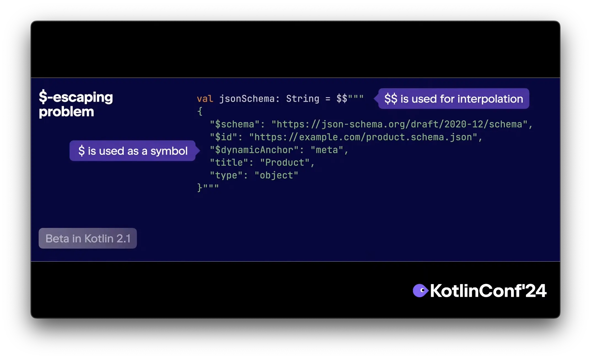

### Non-local break/continue

지금까지는 컴파일러가 람다가 실제로 어디서 실행되는지 정확히 판단할 수 없어서, `break`나 `continue`를 사용할 수 없는 경우가 있었습니다. 예를 들어 아래 코드는 에러가 납니다.

```kotlin
for (i in 0..n) {
    val date = state[i]?.let {
        when (it) {
            -1 -> break // Error: 'break' is not allowed here
            0 -> continue // Error: 'continue' is not allowed here
            else -> process(it)
        }
    }
}
```

Kotlin 2.1부터는 `let` 같은 inline 함수를 더 정확히 해석할 수 있게 되어, 이런 경우에도 `break`와 `continue`를 사용할 수 있게 된다고 합니다.

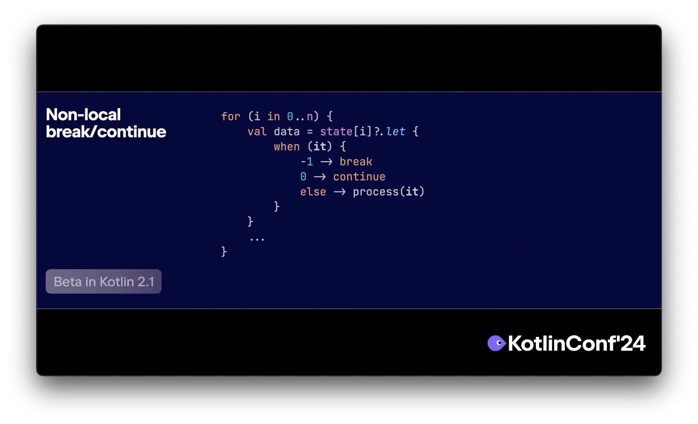

### Contexts

작년에 발표된 `Context`도 다시 소개됐습니다. 이미 프리뷰로 제공되고 있고, Kotlin 2.2부터는 베타 버전으로 제공될 예정이라고 합니다. 이를 활용하면 DI와 비슷한 방식으로 세션, 트랜잭션처럼 여러 함수에서 공통으로 써야 하는 값을 매번 인자로 넘기지 않고 공유할 수 있게 됩니다.

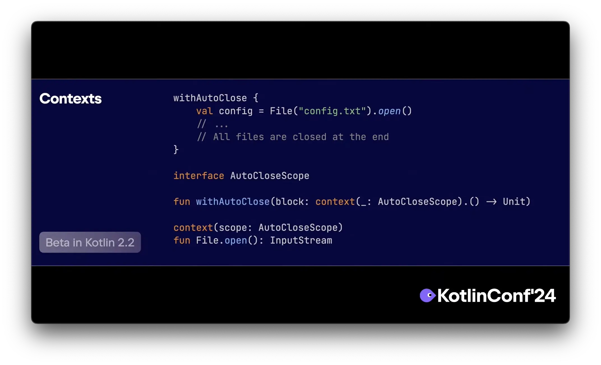

### Core Libraries

Kotlin 코어 라이브러리도 계속 확장될 예정입니다. 이미 공개된 [kotlinx.io](https://github.com/Kotlin/kotlinx-io)뿐 아니라 [kotlinx.rpc](https://github.com/Kotlin/kotlinx-rpc) 같은 새 라이브러리도 발표됐습니다. 이런 라이브러리들은 Multiplatform 개발을 뒷받침하기 위해 제공되며, 여러 플랫폼에서 공통으로 사용할 수 있습니다.

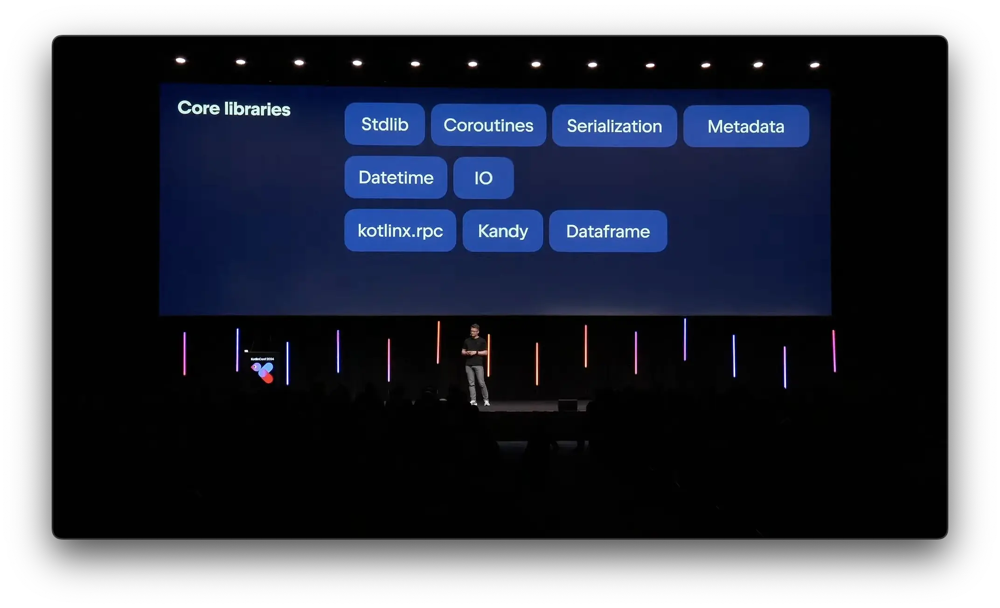

### AWS SDK for Kotlin

Kotlin용 AWS SDK 제공 계획도 발표됐습니다. 지금까지는 Java SDK를 함께 쓰는 경우가 많았는데, 앞으로는 코루틴과 null safety 같은 Kotlin의 특성을 살리면서 Multiplatform에서도 활용할 수 있는 SDK가 제공될 예정이라고 합니다.

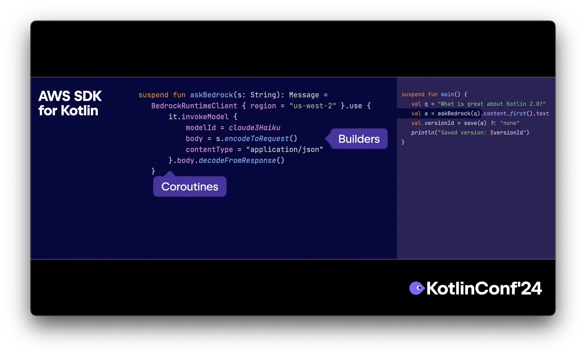

### Kotlin Language Model

Fleet에서는 이미 사용할 수 있고, IntelliJ에서는 2024.2부터 사용할 수 있는 Kotlin 전용 언어 모델도 소개됐습니다. 기존 여러 모델과 비교했을 때 Kotlin에 특화된 덕분인지, 상대적으로 파라미터 수가 적은 편인데도 벤치마크에서 높은 정확도를 보였다고 합니다. 다만 비교 대상으로 사용된 Llama는 이미 버전 3이 나온 상태라, 최신 모델과 비교했을 때 어느 정도 경쟁력이 있을지는 조금 더 지켜봐야 할 것 같습니다.

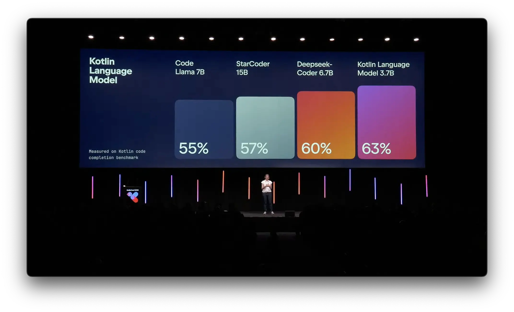

## 마지막으로

이상으로 KotlinConf 2024 키노트에서 눈에 띄었던 내용을 간단히 정리해 봤습니다. 이 외에도 볼 만한 세션이 많았고, Kotlin 2.0 역시 [Changelog](https://github.com/JetBrains/kotlin/releases/tag/v2.0.0)를 보면 변경점이 상당히 많아서 앞으로도 계속 확인해 볼 만하다고 느꼈습니다.

Compose 쪽 발전도 인상적이었지만, Flutter 같은 경쟁 프레임워크도 계속 발전하고 있으니 앞으로 얼마나 점유율을 넓혀 갈지도 흥미롭습니다. 언어 생태계 전반의 변화 속도가 워낙 빠르기 때문에, Kotlin도 계속 좋은 방향으로 진화해 주면 좋겠습니다.
