今年のKotlinConfが開催されました。数日かけてのイベントなので、全てのセッションを見ることはできませんが、まずはキーノートの方で重要な情報をまとめてみました。全体のスケージュールは[こちら](https://kotlinconf.com/schedule/)から確認できて、[YouTubeでのライブ配信](https://www.youtube.com/@Kotlin/streams)も行われているので、興味がある方はぜひチェックしてみてください。

まずはKotlinConf'24の公式アプリの紹介がありました。公式アプリでは今回行われるカンファレンスとセッションを確認できるもので、[GitHubにてソースコードを公開](https://github.com/JetBrains/kotlinconf-app)しています。Kotlin Multiplatformで作成されていて、iOS、Android、Webで動作するものなので、いいサンプルとして使えるかもしれません。

## Kotlinの今

まずはKotlinの現状から。常にKotlinを使っているエンジニアの数が、200万以上になっているとのことです。

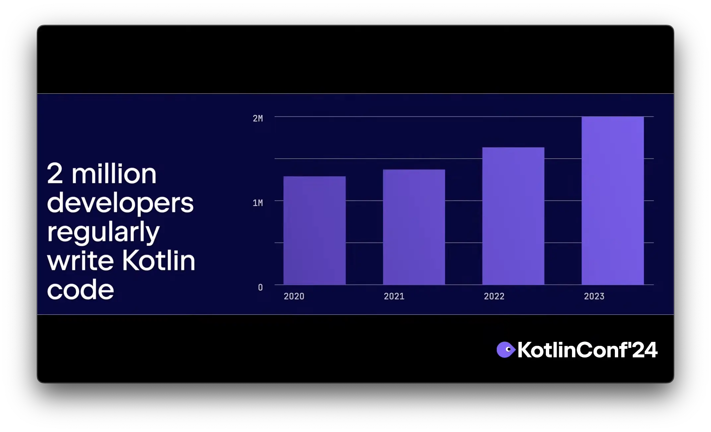

また、Kotlinを導入している企業もどんどん増えているとのことです。代表的な企業は以下の画像通りだそうです。

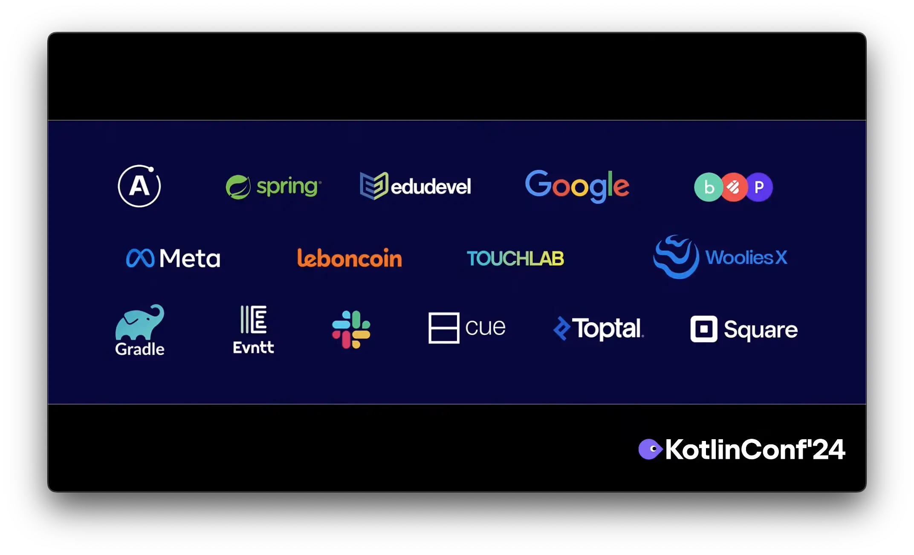

## Kotlin 2.0 and K2 Compiler

Kotlin 2.0からはK2コンパイラーの導入により、全般的にコンパイルの速度が向上したという話が主なテーマです。ただ一部プロジェクトでは、遅くなるケースもあるとのことでした。また、IntellijでもK2コンパイラーモードがあり、コードハイライトが1.8倍速くなるとのことです。

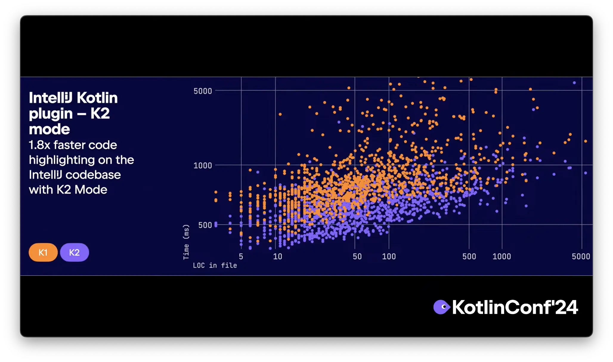

K2モードは、Intellij 2024.1以上から以下の設定画面で設定できます。2024.2からは性能の改善を含め、Beta版として提供される予定です。

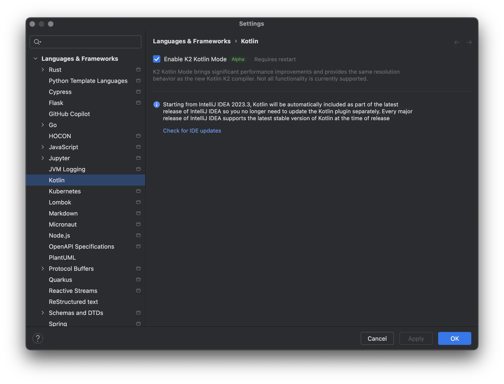

2.0へのマイグレーションは1000万行のコード、18000人のエンジニア、80000のプロジェクトでテストされていて、1.9からのマイグレーションはスムーズに行えるとのことです。

### Metaの場合

Metaの場合、Kotlin firstでの開発を積極的に進めているとのことでした。IDEからコードの最適化までの全てにおいてKotlinを採用して、既存のJavaで作成されたFacebook, Instagram, Facebook Messenger, WhatsAppなどのアプリにおいて、Kotlinに自動変換できるツールを作成して移行を自動化しているとのことです。

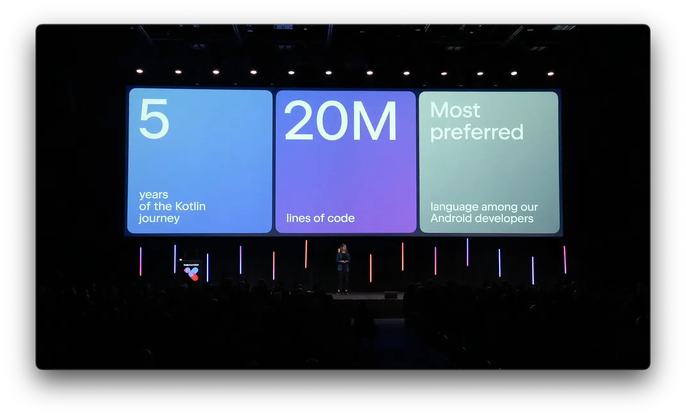

そしてMetaはKotlin 1.8の時点から一部のプロジェクトにおいてすでにK2コンパイラーを採用していて、今は95%のプロジェクトがK2コンパイラーを使っているとのことです。その効果としてはAndroidプロジェクトにおいては最大20%のビルド時間の短縮ができたらしいです。

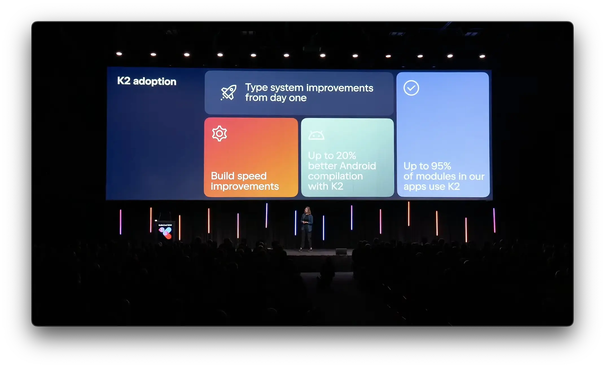

### Googleの場合

K2コンパイラーにはGoogle側も協力していて、Androidのツーリングに関してLintや[Parcelize](https://developer.android.com/kotlin/parcelize?hl=ja)、[KSP](https://kotlinlang.org/docs/ksp-overview.html)などにもコントリビュートしているそうです。また、Jetpack Composeのコンパイラーの改善もあり、従来はKotlinとバージョンと相違があったのですが、2.0からは同じバージョンで指定できるようになったとのことです。

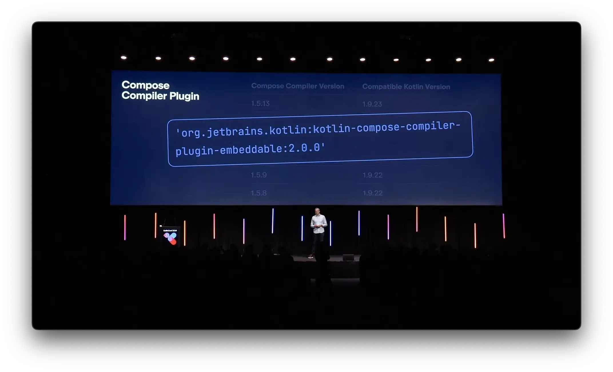

またAndroid StudioでもKotlin 2.0のサポートを予定しているとのことでした。代表的な機能は以下の画像の通りです。

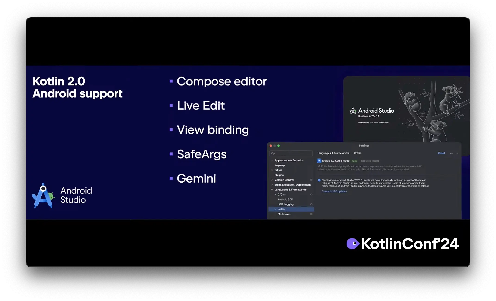

Jetpack Composeにおいても新しい機能を追加される予定だそうです。主に以下の画像で挙げている機能が、7月から提供される予定だそうです。

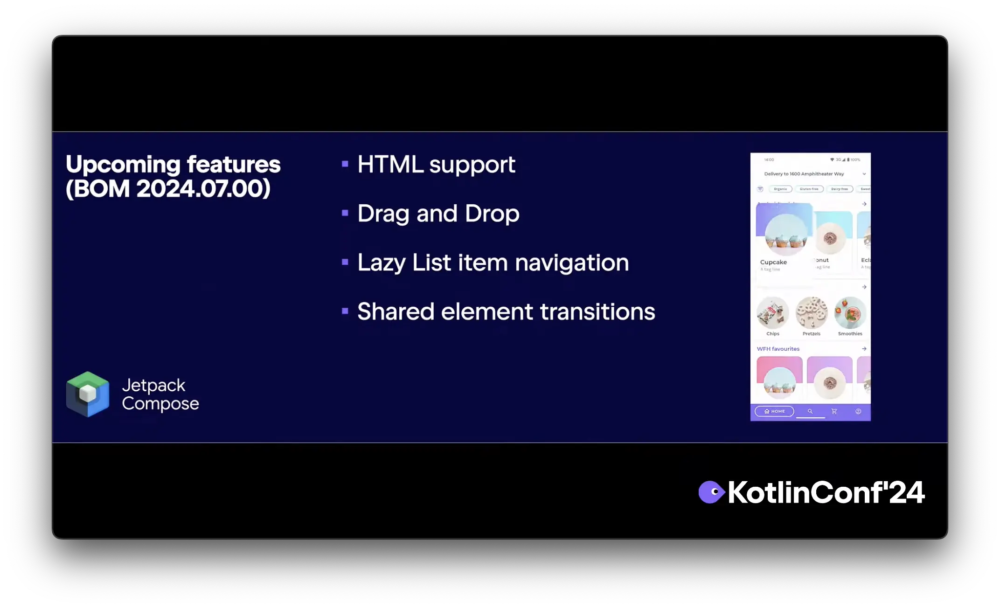

コンパイラーそのものの改善もあり、安定性やパフォーマンスが向上しているとのことです。

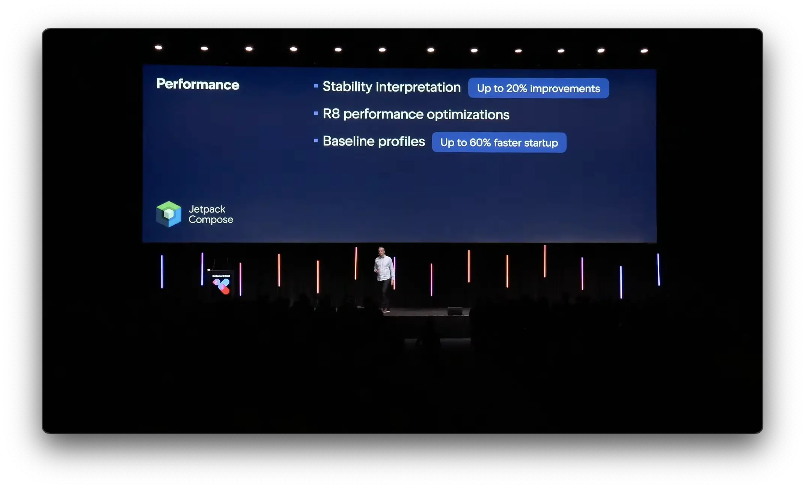

他にも、Google内部ではサーバサイドKotlinの採用も進んでいたり、KMPによる開発も進んでいるとのことでした。あとはJetpack ComposeのライブラリもMultiplatformに対応していて、ViewModelやRoomなどのライブラリもKotlin Multiplatformで使えるようになったとのことです。

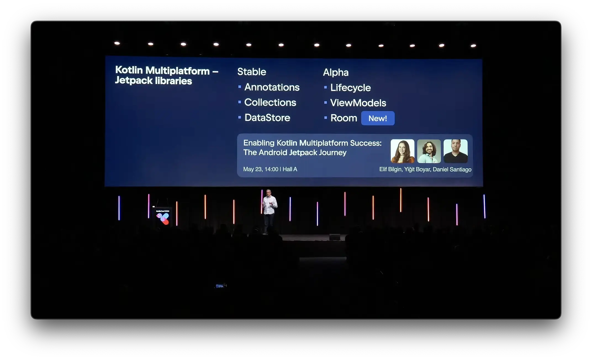

## Kotlin Multiplatform

K2コンパイラーの導入により、Kotlinのコードを直接Swiftのコードに変換することができるようになったとのことです。これにより、iOSアプリの開発においてもKotlin Multiplatformを使って開発することができるようになりました。

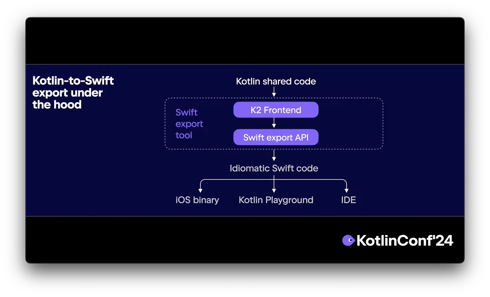

そして[Fleet](https://www.jetbrains.com/ja-jp/fleet/)で、iOSアプリも開発できるという紹介もありました。FleetだとCompose MultiplatformによるiOSとAndroidのアプリ開発が同時に可能で、リファクタからデバッグまで一貫して開発できるとのことです。AppCodeのサポートが2023年に終了となっていたので、これは嬉しいニュースですね。

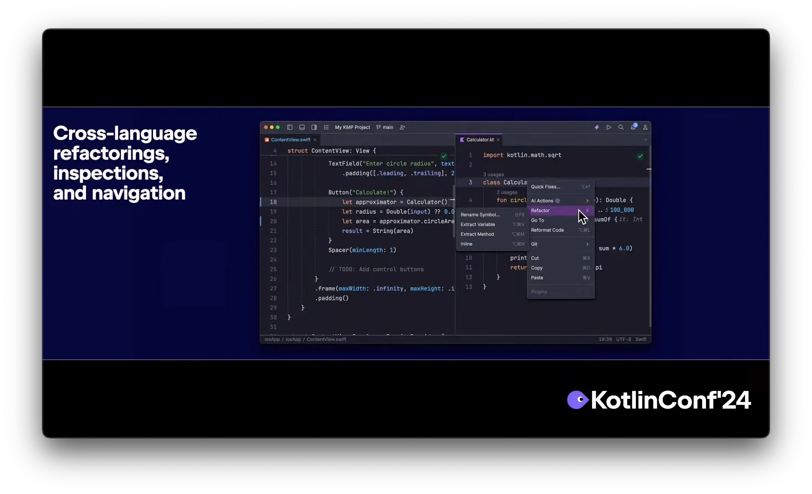

また、新しいビルドツールである[Amper](https://github.com/JetBrains/amper)も紹介されました。まだ発表されてから間もないのですが、すでにJetBrainsのIDEでサポートされていて、YAMLファイルだけでビルド設定を行うことができるので、新しいプロジェクトで使ってみるのもいいかもしれません。

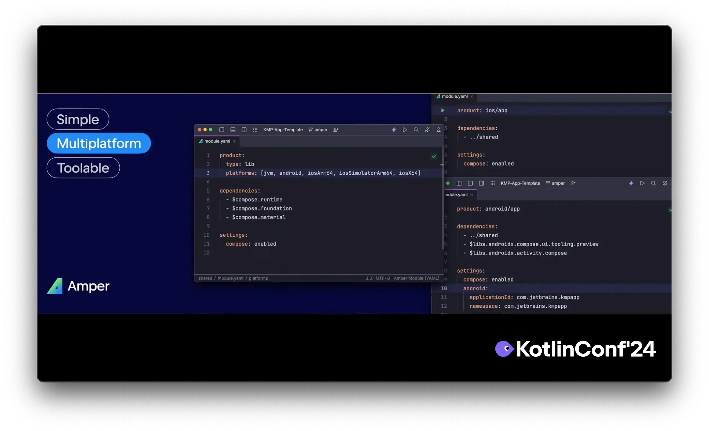

Compose Multiplatformにおいても、以下の新しい機能が追加されたらしいです。どれも期待していた機能だったので、嬉しいですね。個人的にはデスクトップアプリでファイルの選択ダイアログを実装した時に、対応する機能がなくJavaのAWTを使わざるを得なかったので、このようなAPIもあるといいなと思っています。

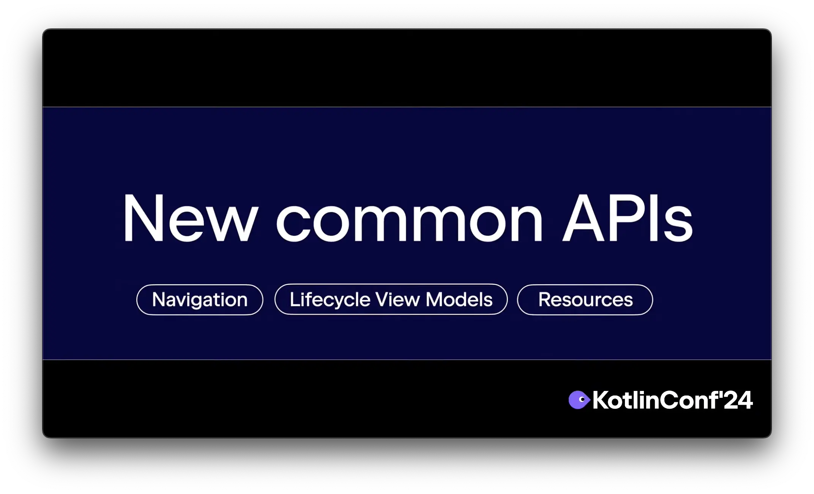

## Upcoming

次に、Kotlin 2.1のベータ版から導入予定の機能について紹介や、新しいライブラリ、AIモデルの発表がありました。以下の画像の通りです。

### Guard

whenの分岐で、変数の重複を防ぐための機能です。既存のコードなら、以下のようなコードで`status`が重複する場合があっても、どうしようもなかったですね。

```kotlin
fun render(status: Status): String =
    when {
        status == Status.Loading -> "Loading"

        status is Status.OK && status.data.isEmpty() -> "No data"
        status is Status.OK -> status.data.joinToString()

        status is Status.Error && status.isCritical -> "Critical problem"
        else -> "Unknown problem"
    }
```

なぜなら、以下のようにコードを変えた場合に`and`でコンパイルエラーが発生してしまうからです。

```kotlin
fun render(status: Status): String =
    when (status) {
        Status.Loading -> "Loading"

        is Status.OK && status.data.isEmpty() -> "No data" // Error: expecting '->'
        is Status.OK -> status.data.joinToString()

        is Status.Error && status.isCritical -> "Critical problem" // Error: expecting '->'
        else -> "Unknown problem"
    }
```

これを改善するため、以下のように`Guarded Condition`を導入する予定だそうです。

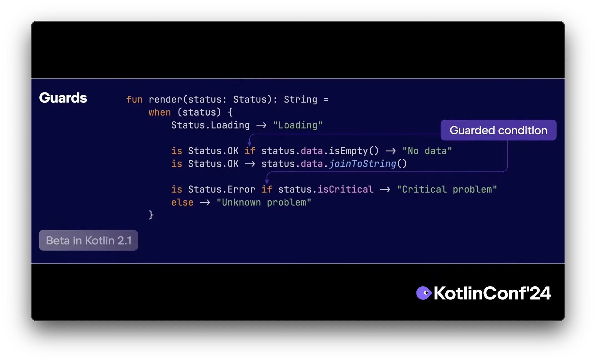

### $-escaping problem

Kotlinで`$`は、文字列の中で変数を埋め込むために使われています。ということは、`$`を文字列として使いたい場合にエスケープの問題が発生するとのことでもあります。特にMulti-line Stringがそうですね。例えば、以下の例があります。

```kotlin
val jsonSchema: String = """
    "$schema": "https://json-schema.org/draft/2020-12/schema",
    "$id": "https://example.com/product.schema.json",
    "$dynamicAnchor": "meta",
    "title": "Product",
    "type": "object"
}"""
```

ここで`schema`や`id`などは変数ではなく、文字列として使いたい場合がありますが、Multi-line Stringの場合にはエスケープができません。なので、以下のようなコードになるケースもありました。

```kotlin
val jsonSchema: String = """
    "${'$'}schema": "https://json-schema.org/draft/2020-12/schema",
    "${'$'}id": "https://example.com/product.schema.json",
    "${'$'}dynamicAnchor": "meta",
    "title": "Product",
    "type": "object"
}"""
```

これを解決するために、文字列リテラルで`$`を2回入れることでinterpolationできるようにする、という機能が導入される予定だそうです。

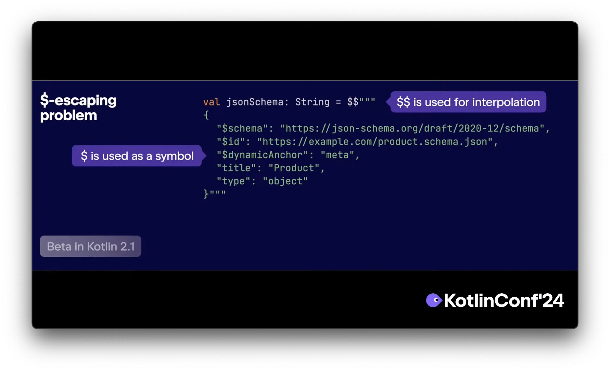

### Non-local break/continue

今までは、コンパイラーがLambdaが実行される場所を特定できないため、`break`や`continue`が使えなかったです。なので、以下のようなコードはエラーになってしまいます。

```kotlin
for (i in 0..n) {
    val date = state[i]?.let {
        when (it) {
            -1 -> break // Error: 'break' is not allowed here
            0 -> continue // Error: 'continue' is not allowed here
            else -> process(it)
        }
    }
}
```

これもまた、Kotlin 2.1からは`let`のようなinline関数を正しく解析できるようになるため、`break`や`continue`が使えるようになるとのことです。

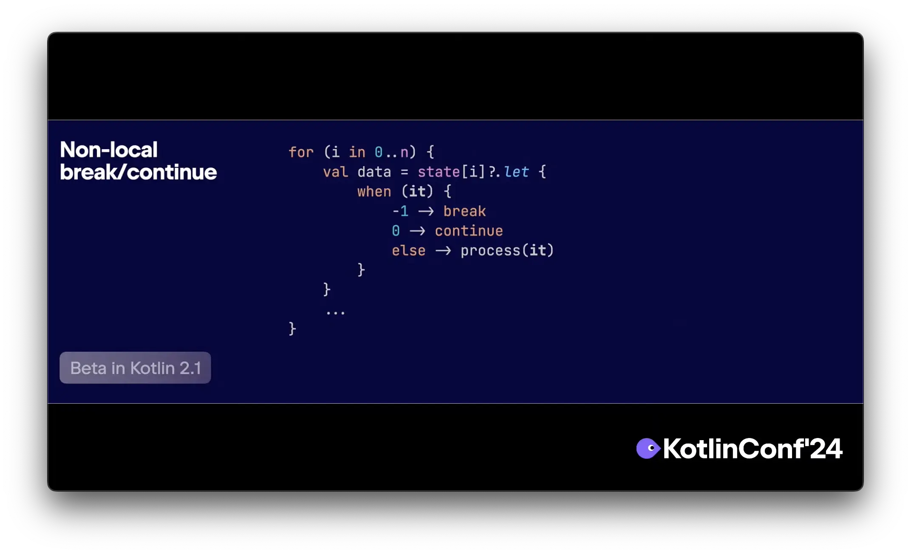

### Contexts

去年発表された`Context`についても発表がありました。これはすでにプレビューとして導入されていて、Kotlin 2.2からはベータ版として提供される予定だそうです。これでDIと似たようなことをしたり、セッションやトランザクションなど色々な関数で使い回す必要があるものは、関数の引数に渡すことなく、`Context`を使って共有することができるようになります。

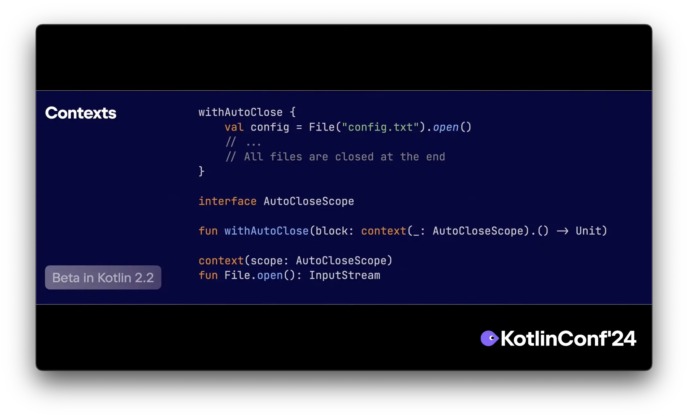

### Core Libraries

Kotlinのコアライブラリも改善される予定だそうです。すでに発表されている[kotlinx.io](https://github.com/Kotlin/kotlinx-io)のようなものだけでなく、[kotlinx.rpc](https://github.com/Kotlin/kotlinx-rpc)のような新しいライブラリの発表もありました。これらのコアライブラリは、Multiplatformでの開発をサポートするために提供されるもので、どのプラットフォームでも使えるものです。

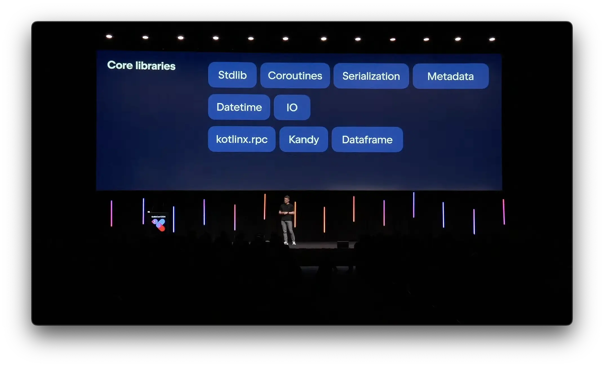

### AWS SDK for Kotlin

Kotlin用のAWS SDKも提供される予定という発表もありました。今まではJavaのSDKを使うことが多かったのですが、CoroutineやNull SafetyのようなKotlinの特徴を活かせつつ、Multiplatformで使えるSDKが提供されるとのことです。

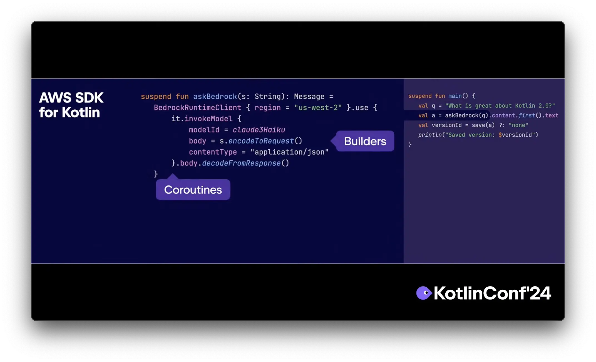

### Kotlin Language Model

Fleetではすでに利用可能で、Intellijでは2024.2から利用可能となるKotlinの言語モデルが開発中のことです。既存のいくつかのモデルと比べ、Kotlinに特化されたからか、比較的パラメータの数が少ないことに比べ、ベンチマークでは高い精度を示しているとのことです。ただ、比較で使っているLlamaの場合はすでにバージョン3がリリースされているので、最新のモデルと比べる場合どの程度の精度があるのかは気になるところです。

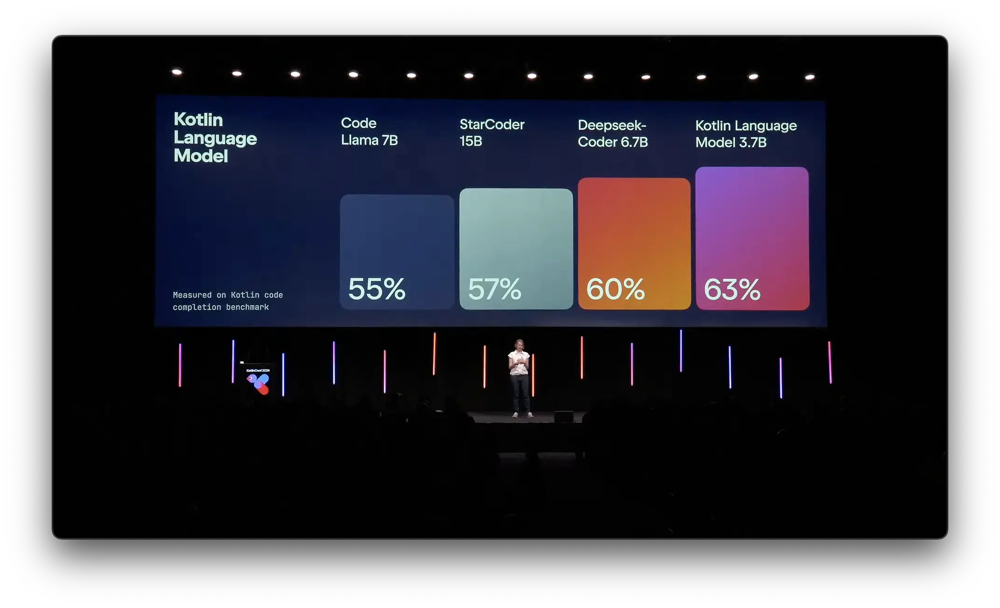

## 最後に

KotlinConf'24のキーノートでの発表内容を以上でまとめてみました。他にも多くのセッションがあ理、Kotlin 2.0も[Changelog](https://github.com/JetBrains/kotlin/releases/tag/v2.0.0)を見ると、多くの変更があるので、また色々とチェックしていきたいところですね。

Composeの発展も良かったのですが、Flutterのような他のフレームワークもあるのでこれからどれだけのシェアを取れるかが楽しみです。言語としても他の言語の発展も早いので、Kotlinも引けを取らないように頑張ってほしいですね。

では、また！
