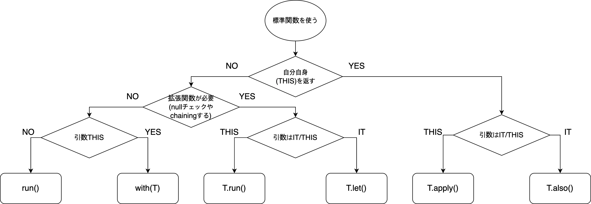

Kotlin을 Java와 구분 짓는 요소는 여럿 있지만, 그중에서도 자주 눈에 띄는 것이 `Scope Function`입니다. 이런 내장 함수들은 잘 쓰면 Java보다 코드를 더 간결하게 만들 수 있고, 작성 의도도 조금 더 분명하게 드러낼 수 있습니다. 다만 다른 언어에서 바로 익숙해지는 개념은 아니다 보니, 막상 실무나 개인 코드에서 언제 어떤 함수를 써야 하는지는 꽤 헷갈립니다.
검색해 보면 Scope Function을 소개하는 글은 많지만, 대부분은 각 함수의 문법만 설명하고 끝나는 경우가 많습니다. 그래서 "이 함수들이 애초에 왜 필요한가", "서로 어떻게 구분해야 하는가", "실제로는 어느 장면에서 쓰는 것이 자연스러운가"를 한 번 정리해 보고 싶었습니다. 이번 글은 공식 문서와 몇몇 참고 자료를 바탕으로 그 기준을 정리한 메모입니다.
## Scope Function이란

먼저 Scope Function이 정확히 무엇인지부터 보겠습니다. 이름 그대로, 어떤 객체를 기준으로 임시 스코프를 만들고 그 안에서 코드를 실행하는 함수들입니다. [공식 설명](https://kotlinlang.org/docs/reference/scope-functions.html)은 다음과 같습니다.
> The Kotlin standard library contains several functions whose sole purpose is to execute a block of code within the context of an object. When you call such a function on an object with a lambda expression provided, it forms a temporary scope. In this scope. In this scope. functions are called scope functions.

요약하면, 특정 객체를 문맥으로 삼아 람다 블록을 실행할 때 쓰는 기능입니다. 완전히 새로운 종류의 문법이라기보다, "이 블록은 이 객체를 대상으로 한다"는 사실을 코드에서 더 분명하게 드러내는 도구에 가깝습니다. 아래 예시는 두 코드가 같은 일을 하지만, 후자가 처리 범위를 더 명확하게 보여 줍니다.
```kotlin
// Scope Function이 없는 코드
var john = Person("John", 20, Gender.Male)
john.doWarmingUp()
john.startToRun()

// Scope Function의 let을 사용한 경우
var john = Person("John", 20, Gender.Male).let {
    it.doWarmingUp()
    it.startToRun()
    it
}
```

## 어떻게 다른가

스코프를 나눈다는 점만 보면 좋아 보이지만, 실제로는 어느 함수를 골라야 하는지가 다음 문제입니다. Kotlin에는 [with](https://kotlinlang.org/api/latest/jvm/stdlib/kotlin/with.html), [let](https://kotlinlang.org/api/latest/jvm/stdlib/kotlin/let.html), [apply](https://kotlinlang.org/api/latest/jvm/stdlib/kotlin/apply.html), [run](https://kotlinlang.org/api/latest/jvm/stdlib/kotlin/run.html), [also](https://kotlinlang.org/api/latest/jvm/stdlib/kotlin/also.html) 다섯 가지 Scope Function이 있고, 상황에 따라 선택 기준이 달라집니다.
이 함수들의 차이는 결국 두 가지입니다. 람다 안에서 리시버에 어떻게 접근하느냐, 그리고 함수 호출 결과로 무엇을 반환하느냐입니다. Scope Function은 대상 객체(리시버)를 기준으로 람다를 실행하고 값을 돌려주는데, 이 두 축이 함수마다 조금씩 다릅니다. 표로 정리하면 다음과 같습니다.
| 함수 이름 | 리시버 접근 방식 | 반환값 |
|---|---|---|
| with | this | 마지막 결과 |
| let | it | 마지막 결과 |
| apply | this | T |
| run | this | 마지막 결과 |
| also | it | T |

또 하나 기억해 둘 점은, `with`를 제외한 나머지 네 함수가 [Extension Function](https://kotlinlang.org/docs/reference/extensions.html)이기도 하다는 점입니다. 확장 함수는 기존 클래스에 메서드를 덧붙인 것처럼 보이게 만드는 Kotlin의 기능입니다. Java에서는 상속이나 래퍼 클래스로 우회해야 했던 패턴을 Kotlin에서는 훨씬 간단히 표현할 수 있습니다.
그래서 `let`, `apply`, `run`, `also`는 원래 그 객체가 가진 함수처럼 호출할 수 있습니다. `with`만 조금 다르게, 객체를 인자로 받는 일반 함수 형태를 취합니다.
### 참고: it와 this

`it`은 매개변수가 하나만 있는 Lambda에서 사용됩니다. 예를 들어 Java라면, 파라미터가 하나라도 [Method Reference](https://docs.oracle.com/javase/tutorial/java/javaOO/methodreferences.html)를 사용하지 않는 한 다음과 같이 써야합니다.
```java
List<String> names = List.of("john", "jack");
// Predicate의 인자는 하나뿐이지만,
Optional<String> filtered = names.stream().filter(name -> "john".equals(name)).findFirst();
```

Kotlin에서는 같은 상황이라면 패터미터를 생략하고 단순히 `it`로 표현할 수 있습니다.
```kotlin
val names: List<String> = listOf("john", "jack")
// it으로 생략
val filtered = names.first { it == "o" }
```

결국 `this`과 같지 않습니까? 라고 생각하기 쉽지만, `it`은 Lambda의 파라메타에 스코프가 한정되어 `this`의 스코프는 로컬에서도 글로벌이 될 수 있다는 점이 다릅니다. 왜냐하면 `this`은 리시버 자체를 가리키며 매개 변수가 없으면 Lambda의 범위를 가리키기 때문입니다. 즉, 매개 변수가없는 Lambda에서는 it를 사용할 수 없지만 this는 사용할 수 있습니다.
## 언제 쓸까

다섯 함수의 차이를 알았다면, 이제는 실제로 어떻게 구분해 쓸지가 중요합니다. 아래 기준은 여러 자료를 참고한 뒤, 제가 가장 납득하기 쉬웠던 방식으로 정리한 것입니다.
### with

`with`는 확장 함수가 아니라, 객체를 인자로 받는 일반 함수입니다. 그래서 특정 객체를 기준으로 여러 줄의 작업을 묶고 싶을 때 쓰기 좋습니다. 예를 들어 반복문 안에서 짧은 처리 블록을 메서드로 따로 뽑기엔 애매할 때, 범위를 분명하게 나누는 용도로 쓸 수 있습니다.
```kotlin
for (name in names) {
    println(name)
    with(name) {
        var rev = this.reversed()
        reversedName.add(rev)
    }
}
```

### let

`let`은 어떤 객체를 받아 그 객체로 무언가를 계산하거나 처리할 때 자연스럽습니다. 반환값이 람다의 마지막 식이기 때문에, 변환이나 후속 계산에도 잘 어울립니다. 특히 [Safe Call](https://kotlinlang.org/docs/reference/null-safety.html#safe-calls)과 함께 쓰기 좋아서, null이 아닐 때만 동작시키고 싶은 경우에 자주 등장합니다.
```kotlin
var name: String? = null
name?.let { println("name is not null") }
```

### apply

`apply`는 람다 안에서 객체를 설정한 뒤, 결과로 그 객체 자신을 그대로 돌려받고 싶을 때 씁니다. 그래서 객체 초기화나 설정값 변경에 특히 잘 맞습니다. 생성 직후 프로퍼티를 채우거나, 설정 객체를 단계적으로 구성할 때 자주 쓰게 됩니다.
```kotlin
if (devMode) {
    SomeConfig().apply {
        name = "devMode"
    }
}
```

### 실행

`run`은 가장 애매하게 느껴질 수 있는 함수입니다. `run {}`처럼 일반 함수처럼도 쓸 수 있고, 객체에 붙여서 Scope Function처럼도 쓸 수 있기 때문입니다. 그래서 일부 글에서는 다른 함수로 충분하면 굳이 쓰지 않아도 된다고 설명하기도 합니다.
그래도 완전히 쓸모없는 것은 아닙니다. `this` 문맥으로 여러 작업을 한 뒤 마지막 계산 결과를 반환하고 싶을 때는 나름 깔끔합니다. 비슷한 일을 `let`으로도 할 수 있지만, `this`를 쓰는 쪽이 더 읽기 쉬운 경우도 있습니다.
```kotlin
// run을 사용하는 경우
var result1 = server.run {
    port = 8080
    get("/members:$port")
}

// let을 사용하는 경우
var result2 = server.let {
    it.port = 8081
    get("/members:${it.port}")
}
```

### also

`also`는 객체 자체를 유지한 채, 부수 효과를 추가하고 싶을 때 잘 맞습니다. 예를 들어 로그를 남기거나, 디버깅 출력을 하거나, 객체를 다음 단계로 넘기기 전에 잠깐 다른 동작을 끼워 넣고 싶을 때 유용합니다. 이런 특성 때문에 조건 분기 비슷하게 활용하는 예도 종종 보입니다.
```kotlin
var name: String? = null
name?.let { println("name is not null") } ?: also { println("name is null") }
```

### 요약

[Kotlin Standard Library (let, run, also, apply, with)](https://medium.com/@brijesh1794/kotlin-standard-library-let-run-also-apply-with-bb08473d29fd)에서는 다섯 가지 Scope Function 중 무엇을 선택할지 판단하는 순서도를 제시합니다. 아래 이미지는 그 내용을 간단히 옮긴 것입니다. 어떤 함수를 써야 할지 헷갈릴 때는 이런 기준을 출발점으로 삼아도 괜찮겠습니다.

## 응용

Scope Function이 리턴 값으로 리시버 자체를 리턴한다는 것은 빌더 패턴으로 사용할 수 있다는 의미입니다. 그래서 적절한 조합으로, Scope Function에 의한 메서드 체인도 할 수 있습니다. 이것을 잘 활용하면 상당히 함수적인 감각으로 코드를 작성할 수 있습니다. 다음은 그 예 중 하나입니다.
```kotlin
// let 체인
var three: Int = " abc ".let { it.trim() }.let { it.length }

// also 체인
var jack: Person = Person("Jack", 30, Gender.MALE).also { println(it.name) }.also { it.doWarmingUp() }
```

## 마지막으로

사실 이런 기능이 완전히 새로운 것은 아닙니다. 같은 JVM 계열 언어인 [Groovy](http://groovy-lang.org)에도 비슷한 발상이 이미 있었습니다. 다만 Kotlin은 이런 기능을 비교적 절제된 방식으로 제공해서, 과하게 낯설지 않으면서도 개발 경험을 꽤 쾌적하게 만들어 줍니다.
그래서 Kotlin의 매력은 "완전히 새로운 언어"라기보다, 익숙한 생태계 위에서 불편한 부분을 잘 다듬어 준 언어라는 데 있다고 생각합니다. Java의 안정성과 Kotlin의 표현력을 함께 가져가고 싶다면, Scope Function도 한 번쯤 의식적으로 익혀 둘 만한 기능입니다.
