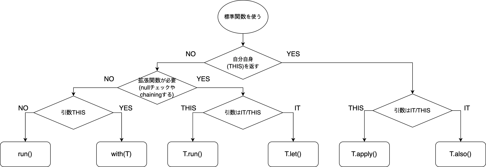

KotlinがJavaと区別される特徴といえば色々あるとは思いますが、そのうちの一つとしてあげられるものが`Scope Function`ではないかと思います。以前のポストでも簡単に触れたことがありますが、これらのビルトイン関数たちは確かに上手く使うと、Javaより簡潔なコードを書くばかりでなく、より作成者の意図が伝わりやすい、強力な武器になり得るのではないかと思います。しかしながら、やはり他の言語と比べて新しい概念のものであるので、どの場面で使った方が良いか、どう使ったらいいかという、いわゆるBest Practiceがどんなものであるか悩ましくもなりますね。

おそらくこう思っているのは自分だけでなく、ネットから検索してみるとScope Functionに関しての多くの記事を見つけることができますが、大抵が個別の関数の使い方の紹介に過ぎないような気がしています。なので、具体的にこれらの関数はなんのためのものであり、それぞれどう使い分けるか、またどの場面で使うべきかというのが気になっていたところです。調べてみたところ、公式のドキュメントやいくつかのブログの記事などに情報があったので、これらをまとめて整理してみました。

## そもそもScope Functionって？

最初にScope Functionを言及しましたが、これは一体なんでしょう。まずはなぜこれらの関数にこんな名前がつけられたのかを知る必要がありそうです。[公式の説明](https://kotlinlang.org/docs/reference/scope-functions.html)だと、以下のように述べています。

> The Kotlin standard library contains several functions whose sole purpose is to execute a block of code within the context of an object. When you call such a function on an object with a lambda expression provided, it forms a temporary scope. In this scope, you can access the object without its name. Such functions are called scope functions.

要するに、特定のオブジェクトに範囲(Scope)を限定し、Lambdaで書かれた関数を実行させたい場合に使えるもののようです。もちろん、これは全く新しい形の関数ではありません。形(コードの書き方)としては、オブジェクトの関数を呼び出しているだけのように見えるだけですね。しかし、コードをみてみると、コードブロックで警戒を作ることでより`特定のオブジェクト`に限った処理であることが視覚的に、明確になります。例えば、以下のようなコードはどれもやっていることは同じですが、コードも読む側からすると処理を適用させる`範囲`は後者の方が明確になりますね。

```kotlin
// Scope Functionなしのコード
var john = Person("John", 20, Gender.Male)
john.doWarmingUp()
john.startToRun()

// Scope Functionのletを使った場合
var john = Person("John", 20, Gender.Male).let {
    it.doWarmingUp()
    it.startToRun()
    it
}
```

## どう違う？

上述した通り、コードの範囲を限定することで、処理の範囲が明確になるのが分かりました。しかし、これでScope Functionを使う準備は整ったかというと、そうでもないです。実はそれ以外でも考えなければならないところがあるのです。なぜなら、Scope Functionには[with](https://kotlinlang.org/api/latest/jvm/stdlib/kotlin/with.html)、[let](https://kotlinlang.org/api/latest/jvm/stdlib/kotlin/let.html)、[apply](https://kotlinlang.org/api/latest/jvm/stdlib/kotlin/apply.html)、[run](https://kotlinlang.org/api/latest/jvm/stdlib/kotlin/run.html)、[also](https://kotlinlang.org/api/latest/jvm/stdlib/kotlin/also.html)の5つの関数が存在するからです。複数の関数が存在していることは、時と場合によって違う関数を選ぶ必要があるということでしょう。

では、これらの関数は他と何が違うのでしょう。まず、考えられるのは仕様です。Scope Functionは、内部的には渡したLambdaを実行してその結果を返すこととなっています。だとすると、仕様としてはLambdaで扱うオブジェクトと戻り値の差だけとなります。Scope Functionには処理の対象となるオブジェクト(レシーバーと言います)と、Lambdaをまずパラメータとして渡すようになります。ここで渡したレシーバーへのアクセスをどう書くかと、処理後の戻り値がどうなるかがこの5つのScope Functionでそれぞれ違います。これをテーブルとして表すと、以下のようになります。

| 関数名 | レシーバーのアクセス | 戻り値 |
|---|---|---|
| with | this | 最後の結果 |
| let | it | 最後の結果 |
| apply | this | T |
| run | this | 最後の結果 |
| also | it | T |

また、withを除いた他の4つの関数たちは、[Extension Function](https://kotlinlang.org/docs/reference/extensions.html)でもあるという特徴があります。 Extension Functionは何か？というと、簡単に、既定のクラスに関数を追加することです。Javaだとクラスの継承やラッパークラスの作成、オーバーライドなどで実現できる機能ですが、Kotlinでは簡単に定義できます。

「Scope FunctionなのにExtension Functionでもあると？」と思うかもしれませんが、理由は簡単です。クラスの作成時に関数として定義してなくても、もともとそのクラスにあったかのように呼べる関数だから、ということです。どのオブジェクトでも、宣言しなくてもwithを除いたScope Functionをあらかじめ宣言しておいたかのように使うことができます。

### 参考：itとthis

`it`は、パラメータが一つのみのLambdaで使われるものです。例えばJavaだと、パラメータが一つだとしても、[Method Reference](https://docs.oracle.com/javase/tutorial/java/javaOO/methodreferences.html)を使わない限り以下のように書く必要があります。

```java
List<String> names = List.of("john", "jack");
// Predicateの引数は一つだけだが、
Optional<String> filtered = names.stream().filter(name -> "john".equals(name)).findFirst();
```

Kotlinでは、同じ状況だとパタメータを省略して単純に`it`として表現することができます。

```kotlin
val names: List<String> = listOf("john", "jack")
// itでの省略
val filtered = names.first { it == "o" }
```

結局、`this`と同じではないか？と思いがちですが、`it`はLambdaのぱらめーたにスコープが限定されて、`this`のスコープはローカルでもグローバルでもなれるという点が違います。なぜなら、`this`はレシーバーそのものを指していて、パラメータがない場合はLambdaのスコープの外を指すことになるからです。つまり、パラメータのないLambdaではitを使えないですが、thisは使えるということになります。

## いつ使う?

では、Scope Functionに5つの関数があり、それぞれどう違うかがわかったので、次はそれぞれをどう使い分けるか知りたいですね。さまざまな意見があったので、(自分の)納得の行くもので整理してみました。

### with

`with`はExtension Functionではないので、オブジェクトをパラメータとして受け取る一般的な関数として使えます。このような特徴があるので、複数のオブジェクトで同じような処理を行う必要があるときに使えます。例えばforループの中で、わざとメソッドを分離したくない(命名がめんどくさいとか…)の場合に使えるでしょう。また、やはりScope Functionなので、処理の範囲を明確に区分するためにも使えそうですね。

```kotlin
for (name in names) {
    println(name)
    with(name) {
        var rev = this.reversed()
        reversedName.add(rev)
    }
}
```

### let

オブジェクトをトリガーにして、そのオブジェクトを持って何かの処理を行いたい場合に使うものです。`let`の意味通り、そのオブジェクトを持って何かをするというイメージですね。また、戻り値も最後の結果となるので、それを持ってまた何かができそうです。また、[Safe Call](https://kotlinlang.org/docs/reference/null-safety.html#safe-calls)な使い方ができるため、Nullではない場合のみの動作として指定することも可能です。なのでNullになり得るオブジェクトでは、`let`を使った方が良いでしょう。

```kotlin
var name: String? = null
name?.let { println("name is not null") }
```

### apply

Lambdaでレシーバーの関数を使わず、レシーバーそのものを返却する場合に使います。つまり、レシーバーのプロパティに新しい値を入れる場合のことです。代表的にはオブジェクトの初期化がありますね。もちろん初期化だけなら、コンストラクタを呼ぶだけで十分ではないかと思われますが、同じオブジェクトの値を入れ替える(例えばConfigurationクラスなど)場合に役立つらしいです。例えば以下のような場合を考えられます。

```kotlin
if (devMode) {
    SomeConfig().apply {
        name = "devMode"
    }
}
```

### run

他の4つの関数で事足りるので、なるべくこれは使わないように、という話が多いです。確かに、runはノーマルな関数としても使えるので(`run {}`)、`with`との違いがいまいちわからない感覚ではありますね。あえて使う場合は、オブジェクトの値をオーバーライドする時だそうです。でも、これも`let`でできるので、あえて使う必要はなさそうです。多くのケースで、これは推奨されてませんでした。

ただ、一部ではオブジェクトの初期化として使うと便利と言ってました。確かに`this`を使うので、少しながら`it`を使う`let`よりコードが短くなり得るというメリットはありますね。

```kotlin
// runを使う場合
var result1 = server.run {
    port = 8080
    get("/members:$port")
}

// letを使う場合
var result2 = server.let {
    it.port = 8081
    get("/members:${it.port}")
}
```

### also

オブジェクトがトリガーとなり、そのオブジェクトとは関係のない別の処理を行います。なので、元のオブジェクトがNullであっても、そのオブジェクトが呼ばれた時点でなんらかの処理を行うことができます。これを応用すると、条件分岐(三項演算子)のように使うことも可能です。例えば、こんな感じですね。

```kotlin
var name: String? = null
name?.let { println("name is not null") } ?: also { println("name is null") }
```

### まとめ

[Kotlin Standard Library (let, run also, apply, with)](https://medium.com/@brijesh1794/kotlin-standard-library-let-run-also-apply-with-bb08473d29fd)では、5つのScope Functionのどれを使うか判断する基準を、フローチャートとして提示しています。以下は、そのフローチャートを簡単に翻訳したものです。どれを使うか悩ましい時は、こういう基準でコードを書いても良さそうですね。



## 応用

Scope Functionが戻り値としてレシーバーそのものを返すというのは、すなわちBuilderパターンとして使えるという意味でもあります。なので、適切な組み合わせで、Scope Functionによるメソッドチェーンもできます。これをよく活用すると、かなり関数型的な感覚でコードを書くことができるでしょう。以下は、その例の一つです。

```kotlin
// letの連鎖
var three: Int = " abc ".let { it.trim() }.let { it.length }

// alsoの連鎖
var jack: Person = Person("Jack", 30, Gender.MALE).also { println(it.name) }.also { it.doWarmingUp() }
```

## 最後に

実は、このようなKotlinの機能は、そう新しいものでもありません。なぜなら、同じJVM言語であり、同じく機能する`with()`のような関数を提供している[Groovy](http://groovy-lang.org)があるからです。自分の中では[Spock](http://spockframework.org)かGradleのイメージしかないのですが…

ただ、このようにKotlinが提供する機能は「新しくはないけど、快適」という感覚を確かに伝えてくれているような気がします。なのでJavaプログラマーがKotlinに転向していく数も増えているのでしょう。最近は特にPythonやJavaScriptのような言語が人気を得ているところですが(Kotlinは[TIOBE](https://www.tiobe.com/tiobe-index/)の順位からだと見えもしないし…)、もっと性能と安定性、そして快適な開発のバランスを持ちたいと思う人にはぜひおすすめしたい言語です。なのでもっと、Kotlinの魅力をより多くの人(自分を含め)にわかった欲しいところです。今回のポストで少しはそれが伝わると幸いですね。

では、また!
