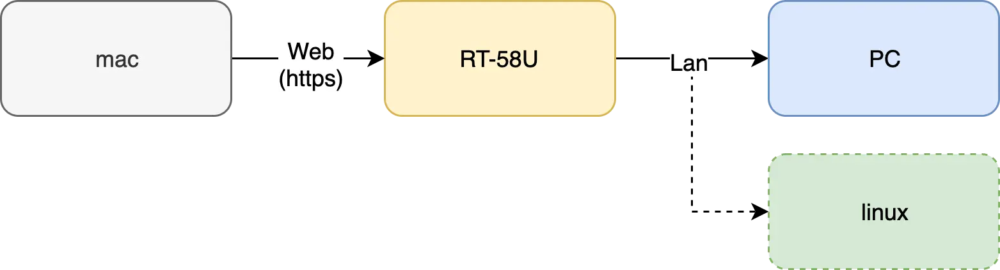

집에서 쓰는 라우터는 Asus RT-AC58U이고, 개인적으로 쓰는 것은 RT-AC68U입니다. 두 모델은 하드웨어뿐 아니라 펌웨어 기능도 조금 다릅니다. 예를 들어 AiMesh 같은 기능은 RT-AC58U에서 지원하지 않습니다.

문제는 펌웨어를 업데이트한 뒤부터 WAN에서 관리 페이지에 접속할 때 HTTPS만 허용되기 시작했다는 점입니다. RT-AC68U는 [Let's Encrypt](https://letsencrypt.org) 인증서를 자동으로 만들고 갱신하는 기능이 있어서 괜찮았지만, RT-AC58U는 그렇지 않았습니다. 그래서 브라우저로 관리 페이지에 접속할 때마다 인증서 경고가 떠서 꽤 거슬렸습니다.

리눅스 기반 장비라면 수동으로 인증서를 넣을 수 있지 않을까 싶어서 더 찾아봤고, 실제로 RT-AC58U에도 인증서를 넣는 데 성공했습니다. 이 글에서는 그 과정을 정리해 보겠습니다.

## 시스템 구성

구성을 그림으로 보면 다음과 같습니다.



목표는 DDNS가 등록된 라우터에 SSL 인증서를 넣어, HTTPS로 접속해도 경고가 뜨지 않게 만드는 것입니다. 나중에는 이 라우터 아래에 홈 서버도 붙일 계획이었기 때문에, 같은 방식으로 서버 쪽에도 SSL을 적용할 수 있을지 확인하고 싶었습니다.

## 라우터 설정 1

먼저 DDNS를 설정합니다. ASUS 라우터는 `http://router.asus.com`으로 로컬 관리 페이지에 접속할 수 있습니다. 여기서 WAN 설정의 DDNS 탭으로 들어가 원하는 주소를 등록합니다. ASUS는 `asuscomm.com` 도메인을 제공하므로 그쪽을 사용했습니다.

DDNS가 설정되면 SSH도 켭니다. 이것 역시 관리 페이지에서 설정할 수 있습니다. 가능하면 공개키 인증으로 접속하고, 포트도 기본값에서 바꿔 둡니다.

```bash
# SSH 포트가 2022인 경우
$ ssh -p 2022 retheviper@javaman.asuscomm.com
```

여기까지 하면 인증서를 준비하기 위한 라우터 측 설정은 끝입니다.

## Mac에서 설정 1

라우터 OS는 리눅스이지만, 필요한 도구가 부족합니다. `yum`이나 `apt` 같은 패키지 관리도 없고, 성능도 넉넉하지 않아서 인증서 발급은 Mac에서 진행했습니다.

인증서는 Let’s Encrypt를 사용합니다. 유효기간은 90일로 짧지만 발급과 갱신이 무료라서 이런 용도에는 적당합니다.

먼저 `certbot`을 설치합니다.

```bash
brew install letsencrypt
```

설치 후 다음처럼 인증서를 발급합니다.

```bash
sudo certbot certonly --manual
```

도메인을 입력하고 나면, certbot이 인증용 문자열과 접속 URL을 보여 줍니다. 화면은 대략 이런 식입니다.

```bash
Saving debug log to /var/log/letsencrypt/letsencrypt.log
Plugins selected: Authenticator manual, Installer None
Please enter in your domain name(s) (comma and/or space separated)  (Enter 'c'
to cancel): [도메인]
```

다음 단계에서는 IP 공개 여부를 묻습니다.

```bash
Obtaining a new certificate
Performing the following challenges:
http-01 challenge for [도메인]

...

(Y)es/(N)o: Y
```

그 다음에는 인증용 파일을 특정 URL에서 서빙하라는 안내가 나옵니다.

```bash
Create a file containing just this data:

[코드]

And make it available on your web server at this URL:

[http 주소]

Press Enter to Continue
```

여기서 잠시 멈추고, 출력된 코드와 URL을 복사해 둡니다.

## PC에서 설정

certbot이 요구한 것은 간단합니다. 해당 URL로 요청했을 때 방금 보여 준 코드를 돌려주면 됩니다. 그래서 임시 웹 서버를 하나 띄우기로 했습니다.

라우터에 직접 두기엔 번거로워서, 라우터에 연결된 PC에서 서버를 띄웠습니다. 집의 PC는 Windows라서 Node.js와 Express로 간단하게 처리했습니다.

```cmd
> mkdir node
> cd node
> npm install express
```

그리고 다음처럼 `app.js`를 작성합니다.

```javascript
var express = require('express')
  , http = require('http')
  , app = express()
  , server = http.createServer(app);

app.get('/[복사해 둔 http 주소]', function (req, res) {
    res.send('[복사해 둔 코드]');
  });

server.listen(80, function() {
  console.log('Express server listening on port ' + server.address().port);
});
```

서버를 실행해 브라우저에서 URL을 열었을 때 코드가 그대로 보이면 준비가 끝난 것입니다.

## Mac에서 설정 2

다시 Mac으로 돌아와 certbot 화면에서 Enter를 누르면 검증이 진행됩니다.

```bash
Waiting for verification...
Cleaning up challenges

IMPORTANT NOTES:
 - Congratulations! Your certificate and chain have been saved at:
   /etc/letsencrypt/live/javaman.asuscomm.com/fullchain.pem
   Your key file has been saved at:
   /etc/letsencrypt/live/javaman.asuscomm.com/privkey.pem
```

인증서 발급이 끝났으면, 출력된 경로에서 다음 파일을 복사해 둡니다.

- `cert.pem`
- `key.pem`

## 라우터 설정 2

SSH로 라우터에 접속한 뒤 다음 경로로 이동합니다.

```bash
cd /tmp/etc
```

여기에 방금 복사한 인증서 파일을 덮어씌웁니다. 그리고 실행 중인 HTTPD 프로세스를 다시 시작합니다.

```bash
ps

# PID가 562인 경우
$ kill 562

# 프로세스 재실행
$ /usr/sbin/httpds -s -i br0 -p 8443 &
```

`&`를 붙이지 않으면 터미널이 계속 점유되므로 주의해야 합니다. 재실행 후 브라우저에서 관리 페이지를 열어 인증서 경고가 사라졌는지 확인하면 됩니다.

주의할 점은 재부팅입니다. 라우터를 재시작하면 넣어 둔 인증서가 초기화되는 경우가 있어서, 재부팅 후에는 다시 적용해야 할 수 있습니다.

## 마지막으로

이 과정을 거치면 WAN에서 라우터 관리 페이지에 접속해도 인증서 경고가 뜨지 않습니다. 그 자체만으로도 꽤 만족스러운 결과였습니다.

다만 아직 남은 과제도 있습니다.

- 인증서 갱신을 어떻게 자동화할지
- 라우터 재부팅 후 어떻게 다시 적용할지

Let’s Encrypt 인증서는 90일마다 갱신해야 하므로, 갱신 후 라우터에 다시 올리는 절차를 자동화하는 방법을 더 고민해야 합니다. `crontab`을 쓰는 방법도 떠올랐지만, 라우터 쪽에서 사용할 수 있는 명령이 제한적이라 아직은 완전히 정리하지 못했습니다.

그래도 리눅스 기반 장비라면 이런 식의 우회가 가능하다는 걸 확인한 것만으로도 의미가 있었습니다. 완전한 자동화까지는 남았지만, 최소한 수동 적용 경로를 확보했다는 점에서는 꽤 쓸 만한 경험이었습니다.

[^1]: SSL 인증서는 해당 서버가 신뢰할 수 있는 대상인지 증명해 주는 전자 문서입니다. HTTPS 통신은 이 인증서를 통해 더 안전하게 보호됩니다.
[^2]: Dynamic Domain Name System의 약자입니다. 집에서 쓰는 공유기는 IP 주소가 자주 바뀌는데, DDNS는 그 변화를 고정된 호스트 이름에 연결해 줍니다.
