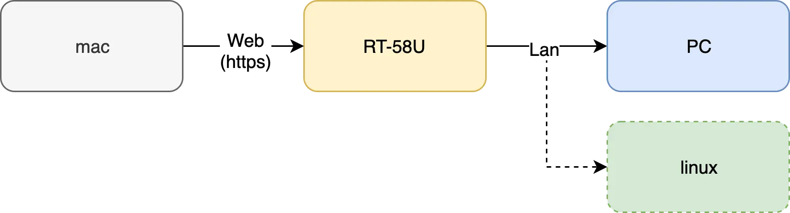

実家で使っているルーターは、Asus社のRT-AC58Uです。そして個人的に使っているものは同じくASUS社のRT-AC68U。この二つは単にマシンスペックだけでなく、ファームウェアレベルで提供している機能も少し違います。例えばAiMeshといった機能はRT-AC58Uでは対応していません。

そしてこないだファームウェアをアップデートすると、管理ページにWANからアクセスするにはhttpsしかできないという制約ができました。RT-AC68Uの場合は[Let's encrypt](https://letsencrypt.org)でSSL証明書[^1]を作成して更新まで自動で行われる機能を持っているので特に問題はないですが、残念ながらRT-AC58Uはそうではないです。なのでいつもブラウザからRT-AC58Uの管理ページに接続すると証明書がおかしいと怒られます。

これから修正される可能性もなくはないと思いますが、最近は[802.11ax](https://ja.wikipedia.org/wiki/IEEE_802.11#IEEE_802.11ax)に対応した新型が続々と登場しているので、もう古くなってしまったRT-AC58Uのファームウェアバージョンアップがいつまで続くかわからない状態です。そして毎回証明書がおかしいと怒られるのをみると少し不安になりますね。

実家と家のルーターの場合、ソフトウェアそのものはそう変わらないだろうと思って調べてみたらやはりそうでしたので、手動でもSSL証明書を入れられる方法がありそうな気がしました。もっと調べてみるとOSはLinuxであって、結論から言うと58Uにも証明書を入れることは成功しました。

今回はそのSSL証明書をRT-AC58Uに適用させるまでの方法を記載します。

## システム構成

現在のシステム構成図を絵で表現するとこちら。



ここでやりたいことは、DDNS[^2]を登録したルーターにSSL証明書を入れ、httpsで接続した管理ページで怒られないようにすることです。これを試した理由のもう一つはのちにこのルーターの下にホームサーバーとして機能するLinuxのマシンもおきたいからでもあります。ホームサーバーにはのちに簡単なWebアプリケーションを置いて運用する予定で、今回試したことが成功したら同じ仕組みでそちらにもSSL証明書を適用できると思います。

それでは、自分がどうやってSSL証明書を作成してルーターにアップロードし、適用したかを述べていきます。

## ルーターの設定(1)

ルーターではまず、DDNS設定が必要です。ASUS社のルーターの場合、Chromeなどのブラウザーから`http://router.asus.com`を入力するとローカルのルーターの管理ページにアクセスできます。そして「詳細設定」メニューから「WAN]を選び、さらにDDNSのタブに入って好みのアドレスとして登録します。ASUS社のルーターはasuscomm.comという無料のサーバーを提供しているのでそちらを使いましょう。DDNSの登録ができたら、「管理」メニュー配下の「システム」タブで「WANからの接続を許可」を「はい」にしておきます。私は家から接続するために事前に実家のルーターで予めDDNSの設定をしておきました。

DDNSでの管理ページ接続設定が終わったら、次はルーターへのSSH接続を設定します。こちらも同じく「管理」ページから設定することができます。SSHを接続設定が終わったらテストをして、なるべく公開鍵でアクセスできるようにして、ポート番号も変えておきましょう。SSHのポートを変えた場合は、ターミナルでは以下のコマンドでアクセスできます。

```bash
# SSHのポートが2022の場合
$ ssh -p 2022 retheviper@javaman.asuscomm.com
```

SSH時のIDとアドレスは管理ページのIDとDDNSで登録したものとなります。ここまでできたらSSL証明書を作成するためのルーター側の準備はまず終わります。

## macでの設定(1)

ルーターのOSはLinuxとなっていますが、やはり重要なコマンドがいくつか足りていないです。代表的にパッケージ管理用の`yum`や`apt`、`dnf`のどちらも搭載されていなく、CPUの性能も怪しいので重要な作業はまずmacで行うことにしました。

また、SSL証明書自体はRT-AC68Uで対応しているLet's encryptを使います。こちらは有効期間が90日にすぎないですが、発給も更新も無料となっているのでこういう簡単な作業で使うには最適です。

まず、ターミナルでLet's encryptをインストールします。

```bash
brew install letsencrypt
```

インストールが終わったら、`certbot`コマンドで証明書を作成できます。ただ、証明書を作成する前にDDNSを登録して置く必要があります。私はすでにルーターで提供している機能でドメインを登録してあるので、それをそのまま使います。

```bash
sudo certbot certonly --manual
```

コマンドを入力すると以下のような画面が出力されます。ただ、自分は何回か同じコマンドを実行しているので初めての実行で出力される画面は少し違う可能性はあります。

```bash
Saving debug log to /var/log/letsencrypt/letsencrypt.log
Plugins selected: Authenticator manual, Installer None
Please enter in your domain name(s) (comma and/or space separated)  (Enter 'c'
to cancel): [ドメイン]
```

ルーターで使っているDDNSのドメインを入力してエンターを押下すると次の画面へ。

```bash
Obtaining a new certificate
Performing the following challenges:
http-01 challenge for [ドメイン]

- - - - - - - - - - - - - - - - - - - - - - - - - - - - - - - - - - - - - - - -
NOTE: The IP of this machine will be publicly logged as having requested this
certificate. If you're running certbot in manual mode on a machine that is not
your server, please ensure you're okay with that.

Are you OK with your IP being logged?
- - - - - - - - - - - - - - - - - - - - - - - - - - - - - - - - - - - - - - - -
(Y)es/(N)o: Y
```

IPが記録されることに同意しますかという質問が表示されます。同意するしかないので`Y`を入力。すると以下の画面が現れます。

```bash
- - - - - - - - - - - - - - - - - - - - - - - - - - - - - - - - - - - - - - - -
Create a file containing just this data:

[コード]

And make it available on your web server at this URL:

[httpアドレス]

- - - - - - - - - - - - - - - - - - - - - - - - - - - - - - - - - - - - - - - -
Press Enter to Continue  
```

この画面で一旦作業を止め、画面に表示されるコードとURLはコピーしておきましょう。あとでここに戻ってきます。

## PCでの設定

先ほど出力された画面は、「このURLにリクエストを送るので、このコードがレスポンスとして取得できるようにしてください」という意味です。なので一時的にサーバーを立てて、レスポンスできるようにしておく必要があります。

ただ単にサーバー上でアクセスできるファイルを作る方法もありますが、別の方法を試すことにしました。準備するものはルーターに繋がっているPC上でレスポンスの提供ができるサーバーを立てること。ルーターの性能が十分であればルーターでやっても良いのですが、自分のRT-AC58UはPythonをダウンロードして圧縮ファイルを解凍するだけでもしばらく死んでいました。ここではPCにNode.jsを使って簡単サーバーを作ってみます。他にPythonやRubyなどを使っても構いません。これはあくまで自分が最速でサーバーを立てられる方法がNode.jsだっただけです。

実家のPCはWindowsなので、[公式ホームページ](https://nodejs.org)からNode.jsをダウンロードしてインストールします。また、expressを使ってサーバーを構築することにします。インストールが終わったらコマンドラインからnpmを使えるようになリます。以下のコードでexpressのスタータープロジェクトを作ることができます。

```cmd
> mkdir node
> cd node
> npm install express
```

このあとはVSCodeなどのテキストエディタを使って、以下のコードを作成します。ファイル名は`app.js`にして、先ほどexpressをインストールしたフォルダに保存します。先ほどコピーしておいたURLとコードはは忘れずに入力しておきましょう。

```javascript
var express = require('express')
  , http = require('http')
  , app = express()
  , server = http.createServer(app);

app.get('/[コピーしておいたhttpアドレス]', function (req, res) {
    res.send('コピーしておいたコード');
  });

server.listen(80, function() {
  console.log('Express server listening on port ' + server.address().port);
});
```

ファイルを保存したらコマンドラインから実行して、サーバーを起動します。以下のコマンドで実行できます。

```cmd
> node app.js
```

サーバーが起動したら、ローカルからアクセスできるか確認します。ブラウザーでURLを入力してみて、ちゃんとコードが表示されるかを確認できたらPCでの設定は終わりです。

## macでの設定(2)

PCでサーバーを起動している状態でmacに戻ります。エンターを押下するとサーバーとの通信が始まって、結果として以下の画面が出力されます。

```bash
Waiting for verification...
Cleaning up challenges

IMPORTANT NOTES:
 - Congratulations! Your certificate and chain have been saved at:
   /etc/letsencrypt/live/javaman.asuscomm.com/fullchain.pem
   Your key file has been saved at:
   /etc/letsencrypt/live/javaman.asuscomm.com/privkey.pem
   Your cert will expire on 2020-02-14. To obtain a new or tweaked
   version of this certificate in the future, simply run certbot
   again. To non-interactively renew *all* of your certificates, run
   "certbot renew"
 - If you like Certbot, please consider supporting our work by:

   Donating to ISRG / Let's Encrypt:   https://letsencrypt.org/donate
   Donating to EFF:                    https://eff.org/donate-le
```

SSL認証書の作成が無事完了しました。この画面からは認証書が保存された位置と、満了日を確認できます。また、cerbot renewを入力すると更新ができるということを教えてくれます。

SSL証明書を作成したので、あとはルーターにコピーして適用するだけです。まず画面に表示されたパスに入って、以下のファイルをコピーしておきましょう。

- cert.pem
- key.pem

コピーができたら、ルーターに接続します。

## ルーターでの設定(2)

SSHでルーターに接続して以下のパスに移動します。

```bash
cd /tmp/etc
```

ディレクトリー内のファイルをみると、先ほどコピーしておいたファイルと同じものが置かれてあるのを確認できます。viでファイルをあけ、先ほどコピーしておいたもので上書きします。

cert.pemとkey.pemの上書きが終わったら、次にルーター内でのプロセス目録を確認します。すでに管理ページがhttpdsのサービスとして実行されているため、新しい証明書を適用するためには一回サービスを終了して再実行する必要があります。

```bash
ps
```

以上のコマンドを入力すると、現在実行中のプロセスの目録が出力されます。そのうち、`httpds -s -i br0 -p 8443`があればそれを終了させます。8443は管理ページで指定したデフォルトのポート番号です。プロセスの左に出力されるのがプロセスのID(PID)なので覚えておきましょう。その後は以下のコマンドを入力します。

```bash
# PIDが562の場合
$ kill 562

# プロセスの再実行
$ /usr/sbin/httpds -s -i br0 -p 8443 &
```

`&`を入力しないと他のコマンドを入力できなくなるので注意しましょう。入力が終わり、もう一度`ps`を入力してちゃんとプロセスが起動していたらこちらでの設定は終わり。`exit`を押してsshから抜け出した後は、ブラウザからルーターの管理ページに接続して証明書で怒られるかを確認します。今までの過程で特に問題なかったら、問題ないはずです。

ただ一つ、注意しなければならないことはルーターの再起動です。自分は週に一回は再起動するようにしていますが、こういう場合はせっかく入れたSSL証明書の値が初期化されるみたいです。なので再起動はなるべくしないか、再起動後には証明書を入れ直す必要があります。

## 最後に

以上のことで特に問題がなかったら、WANからルーターの管理ページにアクセスしても証明書がおかしいと怒られるようなことはなくなります。これで安心して外からの管理ができますね！

ただ、これで全てが完璧になったわけではないです。残りのタスクは以下です。

- 証明書の更新はどうするか
- ルーターの再起動にどう対応するか

Let's encryptで作成してもらった証明書は有効期間が90日なので、のちに更新する必要があります。更新自体はcertbotのコマンドを打つだけで簡単に終わりますが、更新後の処理(ルーターにアップロードする、アプリケーションを再起動する)が必要となりますね。こちらは`crontab`でスケジューリングすると何んとかなりそうですが、残念ながらルーターにはコマンドとして入ってなかったです。

ルーターが再起動した時もどう対応できるかは検証対象ですね。最初はscpでファイルを上書き、httpsdプロセスも再起動するようなシェルスクリプトを作ることで対応できるかと思ったら、権限問題があったりするのでより簡単にできる方法はないか考えています。

ま、結果的にLinuxでサーバー構築ができたらWANからルーターの管理ページに接続するようなことはなくなる可能性もなくはないですが。とにかく何かわかったらまたポストとして書くことにしましょう。

それでは、皆さんもぜひ、SSL証明書で安全かつ快適なWeb生活を！

[^1]: SSL証明書とは、このサーバーは信頼できるかを証明してくれる電子文書のことです。SSL証明書を適用することによりhttpsでの通信は第三者の攻撃より守られます。
[^2]: Dynamic Domain Name Systemの略で、家庭用のルーターはIPアドレスが動的に変わることが多いですが、これを文字列のホスト名とつなげてくれる便利なサービスです。ルーターのIPアドレスがどうかわろうが、DDNSの設定ができていたらいつでも同じURLからルーターにアクセスできます。
