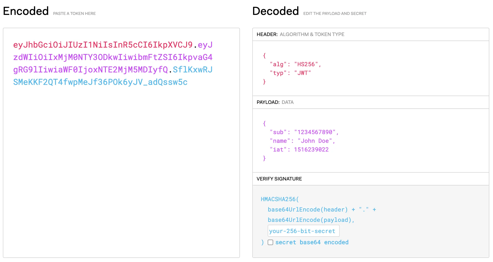
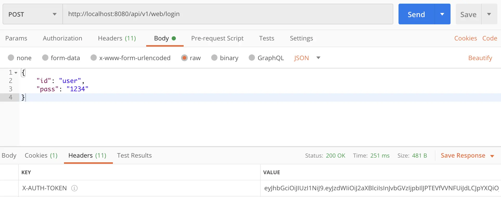

최근에는 Spring Security를 이용해 REST API 로그인을 어떻게 구현하는지 계속 살펴보고 있습니다. 실무에 바로 쓸지 여부와는 별개로, REST API에서 인증과 인가를 어떻게 다루는지, 그리고 Spring Security가 내부적으로 어떻게 움직이는지 정도는 미리 알아 두는 편이 좋다고 생각했습니다. 저도 요즘은 이런 구현을 자주 하지 않아서 감각을 잃지 않으려는 목적도 있습니다. 그래서 이번에는 직접 조사한 내용과 실제로 구현해 본 내용을 함께 정리해 보려 합니다.

이번 글에서는 JWT와 Spring Security를 사용해 REST API 로그인 흐름을 만드는 방법을 다룹니다. 처음에는 Spring Security도 JWT도 REST API 인증과 인가도 거의 몰라서 꽤 고생했지만, 일단 동작하는 형태로 구현할 수 있었기 때문에 배운 내용을 정리해 두려 합니다.
## JWT란

JWT(JSON Web Token)는 서명이나 암호화에 필요한 정보를 JSON 객체 형태로 담아 전달할 수 있게 해 주는 오픈 표준[RFC 7519](https://tools.ietf.org/html/rfc7519)입니다. 데이터에 서명이 들어가 있기 때문에, 토큰이 어디서 왔는지 확인하거나 중간에 변조되지 않았는지 검증할 수 있습니다. 그래서 많은 경우 사용자 인증에 사용됩니다.

JWT는 필요한 정보를 토큰 안에 모두 담을 수 있어 서버 입장에서도 별도의 상태를 많이 들고 있지 않아도 됩니다. 즉, 세션 기반 방식과 달리 Stateless하게 인증과 인가를 처리할 수 있습니다. REST API 로그인에 잘 맞는 이유가 바로 여기에 있습니다.
## JWT에서 로그인 시나리오

JWT를 사용하는 로그인 흐름은 단순합니다. 클라이언트가 ID나 비밀번호 같은 로그인 정보를 서버에 보내면, 서버는 그 정보를 확인한 뒤 JWT를 발급해 돌려줍니다. 이후 클라이언트는 요청마다 이 토큰을 함께 보내고, 서버는 토큰을 검증한 다음 응답을 돌려줍니다.

JWT는 보통 요청이나 응답의 HTTP Header에 실어 전달합니다. 왜 세션이 아니라 Header를 쓰는지에 대해서는 [REST API에서 로그인 구현하기](../spring-rest-api-how-to-login)을 참고하면 됩니다.

로그인에 성공한 뒤에는 세션 기반 방식과 마찬가지로 사용자가 어떤 URL에 접근할 수 있는지 확인해야 합니다. 이 역할은 Spring Security가 맡게 됩니다.
## JWT 및 Spring Security로 로그인

이제 위의 흐름을 실제 코드로 어떻게 만들지 생각해 보겠습니다. 먼저 로그인 요청을 받는 컨트롤러와 메서드를 준비해야 합니다. 컨트롤러는 서비스 클래스에서 로그인 정보를 검증하고, 검증이 끝나면 그 결과를 바탕으로 JWT를 만들어야 합니다.
### Spring Security 설정 (JWT를 사용하기 전에)

우선 REST API에서의 인증과 인가를 Spring Security만으로 간단히 구현해 보겠습니다. Spring Security 자체만으로도 공부할 것이 많기 때문에, 여기서는 DB에 저장된 사용자 정보를 가져와 사용자의 역할에 따라 접근 가능한 URL을 제한하는 기능만 다룹니다. 로그인과 직접 관계없는 코드와 설명은 생략했습니다.
#### Entity 클래스

먼저 DB에서 사용자 정보를 가져올 클래스를 만들어야 합니다. `UserDetails`를 구현한 클래스를 하나 두면 됩니다. 원래 사용자 엔티티를 그대로 써도 되지만, 인증용으로 분리된 클래스가 있으면 역할이 분명해집니다. 다만 그 경우에는 사용자 정보와 테이블 관계가 잘 맞도록 관리해야 합니다.

아래 코드는 `UserDetails`를 Spring Data JPA 엔티티로 만든 예시입니다. 여기서는 사용자 이름과 역할을 JWT에 담아 인증과 인가에 사용합니다.
```java
@Data
@Entity
public class User implements UserDetails {

    @Id
    @GeneratedValue(strategy = GenerationType.IDENTITY)
    private long id;

    // 사용자명(일반적으로 ID)
    private String username;
    
    // 사용자 계정의 만료 여부
    private boolean accountNonExpired;

    // 사용자 계정의 잠금 여부
    private boolean accountNonLocked;

    // 사용자 계정 자격 증명의 만료 여부
    private boolean credentialsNonExpired;

    // 사용자 계정의 활성화 여부
    private boolean enabled;

    // 인가를 위한 사용자 역할
    @ElementCollection(fetch = FetchType.EAGER)
    private List<String> roles = new ArrayList<>();

    // 사용자 인가 정보를 가져온다
    @Override
    public Collection<? extends GrantedAuthority> getAuthorities() {
        return this.roles.stream()
                    .map(SimpleGrantedAuthority::new)
                    .collect(Collectors.toUnmodifiableList());
    }
}
```

#### 서비스 클래스

이제 `UserDetails`를 가져오는 서비스 클래스를 준비합니다. 로그인 이후 사용자 정보를 꺼내 오는 역할도 이 클래스가 맡습니다. `UserDetailsService`는 `loadUserByUsername` 하나만 제공하므로, Repository에서 사용자 이름으로 검색할 수 있게 구현하면 됩니다.
```java
@Service
public class UserServiceImpl implements UserDetailsService {

    // UserDetails를 가져올 수 있는 Repository
    private final UserRepository repository;

    @Autowired
    public UserServiceImpl(UserRepository repository) {
        this.repository = repository;
    }
    
    // 인증 후 사용자 정보를 가져오는 메서드
    @Override
    public UserDetails loadUserByUsername(final String username) throws UsernameNotFoundException {
        return this.repository.findByUsername(username);
    }
}
```

#### Configuration 클래스

인가를 위한 Configuration 클래스입니다. 여기서는 `USER` 역할이 없으면 어떤 URL에도 접근할 수 없도록 설정합니다. 로그인 후 사용자가 URL에 접근하면, 이 설정을 통해 역할을 확인하고 접근 권한을 부여하게 됩니다. 사용자 생성 시 `ROLE_USER` 형태로 역할을 저장해 두는 편이 일반적입니다.

또한 이번 구현은 REST API이고 JWT 기반 인증을 사용할 것이므로, 몇 가지 기본 설정을 바꿔 둡니다. 예를 들면 [Basic Auth](https://ja.wikipedia.org/wiki/Basic%E8%AA%8D%E8%A8%BC), [CSRF](https://ja.wikipedia.org/wiki/%E3%82%AF%E3%83%AD%E3%82%B9%E3%82%B5%E3%82%A4%E3%83%88%E3%83%AA%E3%82%AF%E3%82%A8%E3%82%B9%E3%83%88%E3%83%95%E3%82%A9%E3%83%BC%E3%82%B8%E3%82%A7%E3%83%AA) 설정, 세션 설정 등이 있습니다.
```java
@Configuration
public class SecurityConfig extends WebSecurityConfigurerAdapter {

    @Bean
    @Override
    public AuthenticationManager authenticationManagerBean() throws Exception {
        return super.authenticationManagerBean();
    }

    @Override
    protected void configure(final HttpSecurity httpSecurity) throws Exception {
        httpSecurity
                // Basic 인증을 사용하지 않는다
                .httpBasic().disable()
                // CSRF 설정을 사용하지 않는다
                .csrf().disable()
                // 세션은 Stateless이므로 사용하지 않는다
                .sessionManagement().sessionCreationPolicy(SessionCreationPolicy.STATELESS)
                .and()
                // USER가 아니면 어떤 URL에도 접근할 수 없다
                .authorizeRequests()
                .anyRequest().hasRole("USER");
    }
}
```

이제 Spring Security를 쓰기 위한 최소한의 준비는 끝났습니다. 사용자 CRUD용 Service와 Repository는 이미 적절히 작성돼 있다고 가정하고 다음 단계로 넘어가겠습니다.
### JWT 종속성 추가

다음 단계에서는 JWT를 본격적으로 사용하기 위한 설정을 합니다. Spring Boot에서 JWT를 쓰려면 의존성을 추가해야 합니다. JWT는 사양이 정해져 있어서 JSON을 직접 만들고 Base64로 인코딩해도 구현은 가능하지만, 이런 처리는 라이브러리를 쓰는 편이 훨씬 안전합니다.

Spring(Java)에서 쓸 수 있는 JWT 라이브러리는 여러 가지가 있습니다. JWT 자체가 표준이기 때문에 기본 개념은 비슷하지만, 라이브러리마다 지원 범위가 조금씩 다를 수 있습니다. 그래서 공식 사이트의 [라이브러리 목록](https://jwt.io/#libraries-io)을 보고 선택하는 것이 좋습니다. 이 글에서는 `JSON Web Token Support For The JVM`을 사용하는 방법을 기준으로 설명합니다.
Maven의 경우 다음과 같이 종속성을 추가합니다.
```xml
<dependency>
    <groupId>io.jsonwebtoken</groupId>
    <artifactId>jjwt</artifactId>
    <version>0.9.1</version>
</dependency>
```

Gradle의 경우는 다음과 같습니다.
```groovy
dependencies {
    implementation 'io.jsonwebtoken:jjwt:0.9.1'
}
```

### JWT를 제공하는 클래스 만들기

의존성을 추가했으면 이제 로그인 성공 시 응답에 실어 줄 JWT를 실제로 만들어야 합니다. 구현 방식은 여러 가지가 있지만, 여기서는 토큰을 생성하고 검증까지 맡는 클래스를 먼저 두고, 그다음 요청마다 헤더의 JWT를 확인하는 클래스를 만드는 흐름으로 진행하겠습니다.
#### JWT 사양

JWT를 만들기 전에 먼저 JWT가 어떤 구조로 이루어져 있는지 간단히 보겠습니다. JWT는 `Header`, `Payload`, `Signature`의 세 부분으로 구성되며, 각 부분을 Base64 문자열로 인코딩해 이어 붙이면 하나의 토큰이 됩니다.
##### Header 구성

Header에는 이 토큰이 무엇인지와 어떤 알고리즘으로 서명됐는지에 대한 정보가 들어갑니다.
| id | 의미 | 상세 |
|---|---|---|
| typ | Token Type | JWT의 타입(=JWT) |
| alg | Hashing Algorithm | 인코딩에 사용하는 알고리즘 |

##### Payload 구성

Payload는 이름과 값이 짝을 이루는 여러 정보 조각으로 구성되며, 흔히 본문에 해당하는 부분이라고 볼 수 있습니다. 여기 담기는 각 정보 조각을 Claim이라고 부릅니다. 이번 로그인에서는 여기에 사용자 ID와 역할, 그리고 토큰의 발급 정보를 넣겠습니다.
| id | 의미 | 상세 |
|---|---|---|
| jti | JWT ID | JWT의 식별자 |
| sub | subject | JWT의 고유 키 |
| iss | issuer | JWT의 발행자 |
| aud | audience | JWT의 대상 |
| iat | issued at | JWT가 발행된 시간 |
| nbf | not before | JWT의 시작 시간 |
| exp | expiration time | JWT의 만료 시간 |

##### 시그너처

Signature는 Header와 Payload를 인코딩한 뒤, 미리 정해 둔 비밀 키로 다시 서명한 값입니다. 덕분에 서버는 클라이언트가 보낸 JWT가 중간에 변조되지 않았는지 확인할 수 있습니다.
Header, Payload, Signature 순서로 올바르게 만든 JWT는 [JWT 공식 사이트](https://jwt.io)에서 확인할 수 있습니다. 토큰 구조와 내부 데이터를 눈으로 바로 볼 수 있어서 디버깅할 때도 꽤 유용합니다.

### Token Provider 클래스 구현

이제 실제로 JWT를 만들어 주는 클래스를 작성해 보겠습니다. 여기서는 Header, Payload, Signature를 모두 세세하게 다루기보다, 필요한 최소 정보만 담는 쪽으로 구성합니다.
먼저 토큰 생성 메서드를 만들고, Payload에는 사용자 이름과 역할만 담습니다. 여기에 발급 시각과 만료 시각을 더해 유효 기간을 제한하고, 마지막으로 비밀 키로 Signature를 생성합니다.
그 외에도 토큰에서 사용자 정보를 꺼내는 메서드, 요청 헤더에서 토큰을 가져오는 메서드, 만료 여부를 확인하는 메서드, 토큰에서 사용자 식별자를 읽어 오는 메서드도 함께 준비합니다. 이 부분은 필요하면 별도 클래스로 나눠도 괜찮습니다.
```java
@Component
public class JWTProvider {

    // Signature 인코딩에 사용하는 시크릿 키
    private static final String TOKEN_SECRET_KEY = "This is secret!";

    // 토큰의 유효 기간(1시간)
    private static final long TOKEN_VALID_DURATION = 1000L * 60L * 60L;

    // 사용자 정보를 가져오는 서비스 클래스
    private final UserDetailsService service;

    @Autowired
    public JWTProvider(UserDetailsService service) {
        this.service = service;
    }

    // User 객체로부터 JWT를 만든다
    public String createToken(User user) {
        // Claim으로 사용자명과 역할을 담는다
        Claims claims = Jwts.claims().setSubject(user.getId());
        claims.put("roles", user.getRoles());
        // 토큰의 시작 시간과 만료 시간을 정한다
        Date iat = new Date();
        Date exp = new Date(iat.getTime() + TOKEN_VALID_DURATION);
        // JWT 생성
        return Jwts.builder()
                .setClaims(claims)
                .setIssuedAt(iat)
                .setExpiration(exp)
                .signWith(SignatureAlgorithm.HS256, TOKEN_SECRET_KEY)
                .compact();
    }

    // 토큰으로부터 사용자 정보를 가져온다
    public Authentication getAuthentication(final String token) {
        final UserDetails userDetails = this.service.loadUserByUsername(this.getSubject(token));
        return new UsernamePasswordAuthenticationToken(userDetails, "", userDetails.getAuthorities());
    }

    // 요청 Header에서 토큰을 가져온다
    public String resolveToken(final HttpServletRequest request) {
        return request.getHeader("X-AUTH-TOKEN");
    }

    // 토큰의 유효 기간을 검증한다
    public boolean validateToken(final String token) {
        try {
            final Jws<Claims> claims = Jwts.parser().setSigningKey(TOKEN_SECRET_KEY).parseClaimsJws(token);
            return !claims.getBody().getExpiration().before(new Date());
        } catch (Exception e) {
            return false;
        }
    }

    // 토큰에서 사용자명을 가져온다
    public String getSubject(final String token) {
        return Jwts.parser().setSigningKey(TOKEN_SECRET_KEY).parseClaimsJws(token).getBody().getSubject();
    }
}
```

### 커스텀 Filter 클래스의 구현

다음으로는 로그인 요청을 검사할 Filter 클래스를 만듭니다. 사용자가 로그인하면 이 클래스에서 먼저 `JWTProvider`로 헤더의 토큰을 꺼내고, 유효 기간을 확인한 뒤 문제가 없으면 DB에서 사용자 정보를 읽어 Spring Security의 `Authentication`에 넣습니다.
```java
@Component
public class JWTAuthenticationFilter extends GenericFilterBean {

    // 토큰을 검증하기 위한 Provider
    private final JWTProvider provider;

    @Autowired
    public JWTAuthenticationFilter(JWTProvider provider) {
        this.provider = provider;
    }

    // 로그인 요청을 필터링한다
    @Override
    public void doFilter(final ServletRequest request, final ServletResponse response, final FilterChain filterChain)
            throws IOException, ServletException {
        final String token = this.provider.resolveToken((HttpServletRequest) request);
        if (token != null && this.provider.validateToken(token)) {
            final Authentication auth = this.provider.getAuthentication(token);
            SecurityContextHolder.getContext().setAuthentication(auth);
        }
        filterChain.doFilter(request, response);
    }
}
```

### Spring Security에 JWT로 로그인 설정 추가

이제 JWT를 만들고 검증하는 준비는 끝났습니다. 다음 단계는 Spring Security와 이 클래스들을 연결해 실제 인증과 인가를 처리하는 것입니다. 구현 방식은 하나로 정해져 있지 않아서, 상황에 맞게 고를 수 있는 세 가지 방법으로 나눠 보았습니다.
#### FormLogin을 사용하는 경우

Spring Security의 FormLogin을 사용해서 로그인 URL과 로그인 후 JWT 발급까지 함께 처리하려는 경우입니다. 클라이언트는 로그인 정보를 POST Form 데이터로 보냅니다.
여기서는 로그인 처리 URL과 자격 증명 파라미터를 설정하고, 로그인 성공 시 토큰을 만들어 돌려줄 `AuthenticationSuccessHandler`를 연결합니다.
##### AuthenticationSuccessHandler 만들기

먼저 로그인 성공 시 토큰을 응답으로 돌려주는 SuccessHandler를 만듭니다. 로그인에 성공하면 `Authentication`에 사용자 정보가 담기므로, 이를 `Provider`에 넘겨 토큰을 생성한 뒤 응답 헤더에 실어 반환합니다.
```java
@Component
public class JWTAuthenticationSuccessHandler implements AuthenticationSuccessHandler {

    // 토큰을 생성하기 위한 Provider
    final private JWTProvider provider;

    @Autowired
    public JWTAuthenticationSuccessHandler(JWTProvider provider) {
        this.provider = provider;
    }

    @Override
    public void onAuthenticationSuccess(HttpServletRequest request,
                                        HttpServletResponse response,
                                        Authentication auth) throws IOException, ServletException {
        // 이미 응답을 반환했다면 아무 작업도 하지 않는다
        if (response.isCommitted()) {
            return;
        }
        // 로그인에 성공한 사용자 정보를 가져온다
        User user = (User) auth.getPrincipal();
        // Header에 토큰을 넣는다
        response.setHeader("X-AUTH-TOKEN", this.provider.createToken(user));
        // HTTP Status는 200 OK
        response.setStatus(HttpStatus.OK.value());
    }
}
```

##### Spring Security 설정

이제 로그인 성공 처리를 맡을 Handler를 만들었으니 Spring Security 설정을 바꿔 보겠습니다. 핵심은 `loginProcessingUrl()`과 사용자명, 비밀번호 파라미터를 지정하고, 기본 `UsernamePasswordAuthenticationFilter` 대신 앞에서 만든 `JWTAuthenticationFilter`가 동작하도록 바꾸는 것입니다.
```java
@Configuration
public class SecurityConfig extends WebSecurityConfigurerAdapter {

    // 로그인 성공 시 처리를 담당하는 Handler
    private final JWTAuthenticationSuccessHandler successHandler;

    // 로그인 이후의 인증/인가를 처리하는 Filter
    private final JWTAuthenticationFilter filter;

    @Autowired
    public SecurityConfig(JWTAuthenticationSuccessHandler successHandler, JWTAuthenticationFilter filter) {
        this.successHandler = successHandler;
        this.filter = filter;
    }

    @Bean
    @Override
    public AuthenticationManager authenticationManagerBean() throws Exception {
        return super.authenticationManagerBean();
    }

    @Override
    protected void configure(final HttpSecurity httpSecurity) throws Exception {
        httpSecurity
                .httpBasic().disable()
                .csrf().disable()
                .sessionManagement().sessionCreationPolicy(SessionCreationPolicy.STATELESS)
                .and()
                // formLogin을 사용한다
                .formLogin()
                // POST로 자격 증명을 받아 로그인 처리를 수행하는 URL(UserDetailsService를 사용하게 된다)
                .loginProcessingUrl("/api/v1/web/login")
                // 로그인 처리용 URL은 인증/인가 없이 접근할 수 있게 한다
                .permitAll()
                // 사용자명 파라미터(기본값은 username)
                .usernameParameter("id")
                // 사용자 비밀번호 파라미터(기본값은 password)
                .passwordParameter("pass")
                // 로그인 성공 시 실행할 successHandler를 지정한다
                .successHandler(this.successHandler)
                .and()
                .authorizeRequests()
                .anyRequest().hasRole("ROLE_USER")
                .and()
                // 기본 Filter 설정을 바꾼다
                .addFilterBefore(this.filter, UsernamePasswordAuthenticationFilter.class);
    }
}
```

#### JSON을 사용할 수 있는 Filter를 사용하는 경우

FormLogin을 쓰면 로그인 정보는 Form 데이터여야 합니다. 하지만 REST API에서는 JSON으로 주고받는 편이 더 자연스럽기 때문에, 자격 증명도 JSON으로 보내고 싶은 경우가 많습니다. 문제는 Spring Security가 이를 바로 지원하지 않는다는 점입니다.
이 경우에는 `UsernamePasswordAuthenticationFilter`를 상속한 커스텀 필터를 만들어 JSON을 직접 파싱해야 합니다. FormLogin보다 조금 번거롭지만, 한 번 만들어 두면 오히려 REST API에 더 잘 맞습니다.
##### JsonUsernamePasswordAuthenticationFilter 만들기

자격 증명을 확인하는 기본 필터는 `UsernamePasswordAuthenticationFilter`입니다. 이를 상속한 사용자 정의 클래스를 만들어, Form 데이터와 JSON 둘 다 처리할 수 있게 합니다. 아래 예시는 두 방식을 함께 지원하는 형태입니다.
```java
public class JsonUsernamePasswordAuthenticationFilter extends UsernamePasswordAuthenticationFilter {

    // Header에서 Content-Type을 확인하기 위한 상수
    private static final String CONTENT_TYPE = "Content-Type";
    
    // JSON 데이터를 저장할 Map
    private Map<String, String> jsonRequest;

    // 사용자명을 가져온다
    @Override
    protected String obtainUsername(HttpServletRequest request) {
        return getParameter(request, getUsernameParameter());
    }

    // 비밀번호를 가져온다
    @Override
    protected String obtainPassword(HttpServletRequest request) {
        return getParameter(request, getPasswordParameter());
    }
    
    // JSON 또는 Form 데이터 자격 증명을 가져와 Authentication으로 만든다
    @Override
    public Authentication attemptAuthentication(HttpServletRequest request, HttpServletResponse response) throws AuthenticationException {
        if (headerContentTypeIsJson(request)) {
            ObjectMapper mapper = new ObjectMapper();
            try {
                this.jsonRequest = mapper.readValue(request.getReader().lines().collect(Collectors.joining()),
                        new TypeReference<Map<String, String>>() {
                        });
            } catch (IOException e) {
                throw new RuntimeException(e);
            }
        }
        String username = obtainUsername(request) != null ? obtainUsername(request) : "";
        String password = obtainPassword(request) != null ? obtainPassword(request) : "";
        UsernamePasswordAuthenticationToken authRequest = new UsernamePasswordAuthenticationToken(username, password);
        setDetails(request, authRequest);
        return this.getAuthenticationManager().authenticate(authRequest);
    }

    // 요청에서 파라미터(사용자명과 비밀번호)를 가져온다
    private String getParameter(HttpServletRequest request, String parameter) {
        if (headerContentTypeIsJson(request)) {
            return jsonRequest.get(parameter);
        } else {
            return request.getParameter(parameter);
        }
    }

    // Header의 Content-Type이 JSON인지 판정한다
    private boolean headerContentTypeIsJson(HttpServletRequest request) {
        return request.getHeader(CONTENT_TYPE).equals(MediaType.APPLICATION_JSON_VALUE);
    }
}
```

##### AuthenticationSuccessHandler 만들기

여기서도 동작은 FormLogin과 같습니다. 자세한 내용은 앞의 `AuthenticationSuccessHandler 만들기` 항목과 동일합니다.
##### Spring Security 설정

여기서는 앞에서 만든 사용자 정의 `UsernamePasswordAuthenticationFilter`에 `filterProcessesUrl`, `AuthenticationManager`, `AuthenticationSuccessHandler`를 설정해 기본 필터 구성을 바꿉니다. 이 방식은 FormLogin을 사용하지 않아도 됩니다.
```java
@Configuration
public class SecurityConfig extends WebSecurityConfigurerAdapter {

    // 로그인 성공 시 처리를 담당하는 Handler
    private final JWTAuthenticationSuccessHandler successHandler;

    // 로그인 이후의 인증/인가를 처리하는 Filter
    private final JWTAuthenticationFilter filter;

    @Autowired
    public SecurityConfig(JWTAuthenticationSuccessHandler successHandler, JWTAuthenticationFilter filter) {
        this.successHandler = successHandler;
        this.filter = filter;
    }

    @Bean
    @Override
    public AuthenticationManager authenticationManagerBean() throws Exception {
        return super.authenticationManagerBean();
    }

    @Override
    protected void configure(final HttpSecurity httpSecurity) throws Exception {
        httpSecurity
                .httpBasic().disable()
                .csrf().disable()
                .sessionManagement().sessionCreationPolicy(SessionCreationPolicy.STATELESS)
                .and()
                // FormLogin은 사용하지 않는다
                .formLogin().disable()
                .authorizeRequests()
                .anyRequest().hasRole("ROLE_USER")
                .and()
                // 인증 전에 JWT Filter를 설정한다
                .addFilterBefore(this.filter, UsernamePasswordAuthenticationFilter.class)
                // UsernamePasswordAuthenticationFilter는 커스텀 클래스로 대체한다
                .addFilterAt(getJsonUsernamePasswordAuthenticationFilter(), UsernamePasswordAuthenticationFilter.class);
    }

    // 커스텀 UsernamePasswordAuthenticationFilter 설정
    private JsonUsernamePasswordAuthenticationFilter getJsonUsernamePasswordAuthenticationFilter() {
        JsonUsernamePasswordAuthenticationFilter jsonFilter = new JsonUsernamePasswordAuthenticationFilter();
        try {
            // 로그인 처리 URL을 설정한다
            jsonFilter.setFilterProcessesUrl("/api/v1/web/login");
            // AuthenticationManager를 설정한다
            jsonFilter.setAuthenticationManager(this.authenticationManagerBean());
            // AuthenticationSuccessHandler를 설정한다
            jsonFilter.setAuthenticationSuccessHandler(this.successHandler);
            jsonFilter.setUsernameParameter("id");
            jsonFilter.setPasswordParameter("pass");
        } catch (Exception e) {
            throw new RuntimeException(e);
        }
        return jsonFilter;
    }
}
```

#### 로그인용 Controller를 사용하는 경우

다른 URL을 Controller로 처리하듯, 로그인 전용 Controller를 따로 두는 방법도 있습니다. 일반적인 Controller와 크게 다르지 않아서 오히려 가장 손에 익는 방식일 수도 있습니다.
또 `ResponseEntity`나 커스텀 응답 클래스를 쓸 수 있으므로, 헤더에 토큰만 싣는 것이 아니라 본문에 추가 데이터를 함께 보내고 싶을 때도 유용합니다.
##### 컨트롤러 작성

앞서 말했듯이 일반적인 REST API용 Controller와 크게 다르지 않습니다. 로그인 URL과 그에 연결할 메서드를 만들어 로그인 인증을 처리하면 됩니다.
```java
@RestController
@RequestMapping("api/v1/web")
public class SignApiController {

    // 자격 증명을 검증하는 서비스 클래스
    private final UserService service;
    
    // 토큰을 생성하는 Provider
    private final JWTProvider provider;

    @Autowired
    public SignApiController(MemberService service, JWTProvider provider) {
        this.service = service;
        this.provider = provider;
    }

    // Form 데이터로 자격 증명을 받아 인증을 수행한다
    @PostMapping("/login")
    public void login(@Validated @RequestBody LoginMemberForm form, HttpServletResponse response) {
        // 자격 증명으로부터 사용자 정보를 가져온다
        User user = this.service.getUser(form.getId(), form.getPassword());
        // 가져온 정보로 토큰을 생성한다
        String token = this.provider.createToken(user);
        // Header에 토큰을 생성해 담는다
        response.setHeader("X-AUTH-TOKEN", this.provider.createToken(user));
        // HTTP Status는 200 OK
        response.setStatus(HttpStatus.OK.value());
    }
}
```

##### Spring Security 설정

Controller를 사용하는 경우에는 로그인 URL을 인증 없이 열어 두고, 앞에서 만든 Filter를 적용하는 설정을 추가합니다.
```java
@Configuration
public class SecurityConfig extends WebSecurityConfigurerAdapter {

    // 로그인 이후의 인증/인가를 처리하는 Filter
    private final JWTAuthenticationFilter filter;

    @Autowired
    public SecurityConfig(JWTAuthenticationFilter filter) {
        this.provider = provider;
    }

    @Bean
    @Override
    public AuthenticationManager authenticationManagerBean() throws Exception {
        return super.authenticationManagerBean();
    }

    @Override
    protected void configure(final HttpSecurity httpSecurity) throws Exception {
        httpSecurity
                .httpBasic().disable()
                .csrf().disable()
                .sessionManagement().sessionCreationPolicy(SessionCreationPolicy.STATELESS)
                .and()
                .authorizeRequests()
                // 로그인 처리용 URL은 인증/인가 없이 접근할 수 있다
                .antMatchers("/api/v1/web/login/").permitAll()
                .anyRequest().hasRole("ROLE_USER")
                .and()
                // 기본 Filter 설정을 바꾼다
                .addFilterBefore(this.filter, UsernamePasswordAuthenticationFilter.class);
    }
}
```

### 테스트

지금까지 구현한 로그인은 `curl`이나 [Postman](https://www.postman.com) 같은 도구로 쉽게 테스트할 수 있습니다.
예를 들어 FormLogin을 사용한 경우의 요청은 다음과 같습니다.
```bash
curl -i -X POST "http://localhost:8080/api/v1/web/login" -d "id=user" -d "pass=1234"
```

Postman으로 JSON 로그인 테스트를 하면 아래처럼 확인할 수 있습니다. `X-AUTH-TOKEN` 헤더에 JWT가 돌아오는 것도 볼 수 있습니다.

## 마지막으로

생각보다 Spring Security 주변 설정이 많아서 원하는 모습으로 맞추는 데 꽤 고생했습니다. 그래도 REST API에서 JWT를 이용한 로그인 흐름은 이 정도로 구현할 수 있었습니다. 상황에 따라서는 이 부분만 따로 라이브러리처럼 묶어 두는 것도 가능하겠다는 생각이 들었습니다.

다만 이걸로 모든 설정이 끝난 것은 아닙니다. 여기서는 `AuthenticationSuccessHandler`만 만들었지만, 상황에 따라서는 로그인 실패를 처리할 `AuthenticationFailureHandler`도 필요합니다. 또 인증되지 않은 URL 접근에 대한 예외 처리도 따로 생각해야 합니다. JWT 방식은 토큰이 클라이언트에 남기 때문에 서버 쪽에서 로그아웃을 직접 제어하기 어렵다는 점도 있습니다. 그래서 다음 단계에서는 예외 처리와 로그아웃 전략까지 함께 봐야 합니다.
