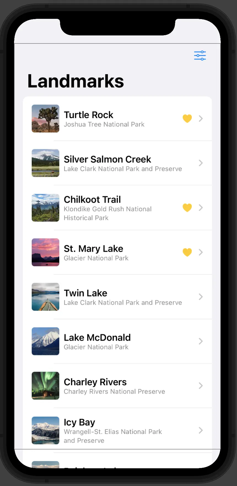
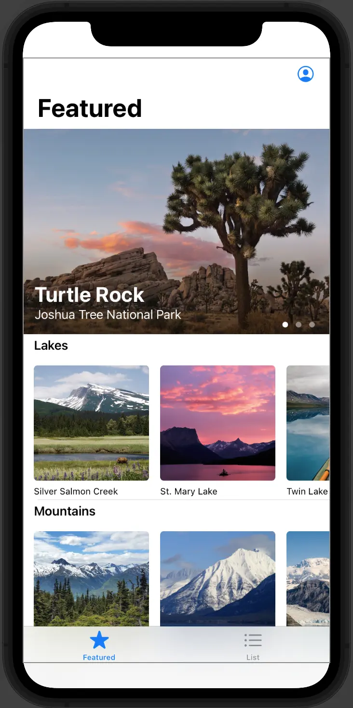

Continuing from the previous post, this time I want to talk about what stood out to me while using SwiftUI. For an engineer like me, whose background is mostly backend development, building a GUI can be confusing because it introduces concepts that do not usually appear on the backend, such as layout, color, and screen transitions. Some of those ideas are especially hard to get used to.

In my case, although I have never written production-level code, I had some experience with [React Native](https://reactnative.dev/), [Flutter](https://flutter.dev/), and [Jetpack Compose](https://developer.android.com/jetpack/compose), so I thought I had a little understanding of how to configure screens in SwiftUI. However, there were still features that did not exist on the backend.

In this post, I want to focus on the SwiftUI features and concepts that caught my attention.

## SwiftUI

First, let's briefly introduce SwiftUI itself. SwiftUI is a so-called declarative UI framework, and you can see the influence from front ends such as [React](https://ja.reactjs.org/) and [Vue](https://vuejs.org/). In short, the elements that make up a screen (the names vary depending on the framework or library, such as Widget, Component, Material, etc.) are "declared" as a single object, and a single screen is completed by combining those elements. This kind of declarative UI is adopted not only by SwiftUI but also by various frameworks and libraries, such as React Native, Flutter, and Jetpack Compose, even if it is limited to mobile.

There are various ways to implement elements depending on the framework and library, but in SwiftUI, each element is called a View, and the protocol [View](https://developer.apple.com/documentation/swiftui/view) is implemented as a struct. Therefore, in the case of a screen that displays a list, the View that displays data as a single row, the View that displays that row as a list, the View that displays menus above and below the list, etc. are each defined as a struct.

The way to create such a screen is a fixed paradigm concept of the framework, so I don't think there will be any particular problems in implementing it according to it, even if you are an engineer with a completely different background like me.

But let's say you want to create a real app. If you create a screen by implementing the elements as presented by the framework, in order to run the app and perform some processing, you will need to connect it to "logic" such as connecting to the backend or performing some processing within the app. Sometimes, but not always, unfamiliar concepts come up on the backend. It's called a "state."

## State

If you're implementing a backend app, there's a clear process where there's a request and a response (even if it's just an HTTP status). This series of processing does not have the concept of "changes midway through." In this case, the data is often permanent or temporary until the process is finished.

However, in the world of screens, the story is different. Many mobile apps consist of various elements such as sliders, buttons, text boxes, etc., and the state of these elements may change all the time. If you have a progress bar to display the status of a file being downloaded, and if you simply want to show the progress, all you need to do is allocate one thread to process it.

Here's one thing: What if downloads had a function like "pause"? This function allows you to stop a process by pressing the button while the process is in progress, and restart it by pressing the button again. I'm sure there are other things to consider, but I think it's necessary to remember the concepts of "stopped" and "restarted" somewhere. In other words, we need a mechanism to remember the user's input on the screen until some kind of processing is actually performed.

Of course, SwiftUI also has things for managing state. However, when considering the use case, the required state will differ depending on the scope, such as whether it is necessary only for one screen element (View), multiple elements, or multiple screens (the entire application). This is because there is no need to manage things that are needed in a single view for the entire app, which tends to make things complicated. So, here I would like to talk about what kinds of things are available to manage the state for each scope.

## State in an Individual View

First, let's look at the smallest unit, View. The list screen mentioned earlier seems to be a good example. In Apple's tutorial, you will create a list screen like the one below.



This screen has a function that allows you to filter the items displayed in the list by pressing the button on the top right. For example, some rows have a heart symbol, which means "favorites", and includes functions such as whether to filter only those items that have been registered as favorites or by item category.

This screen treats "categories to filter" and "display only favorites" as states, but these states are data that does not need to be known on other screens. [@State](https://developer.apple.com/documentation/swiftui/state) can be used in this case. The code is as follows. (partially omitted)

```swift
// List screen
struct LandmarkList: View {
    // Whether to show favorites only
    @State private var showFavoritesOnly = false
    // Category to filter by
    @State private var filter = FilterCategory.all
    
    // Supported categories
    enum FilterCategory: String, CaseIterable, Identifiable {
        case all = "ALL"
        case lakes = "Lakes"
        case rivers = "Rivers"
        case mountains = "Mountains"
        
        var id: FilterCategory { self }
    }
    
    // Apply the filter to the items
    var filteredLandmarks: [Landmark] {
        modelData.landmarks.filter { landmark in
            (!showFavoritesOnly || landmark.isFavorite)
                && (filter == .all || filter.rawValue == landmark.category.rawValue )
        }
    }

    var body: some View {
        NavigationView {
            // Item list
            List(selection: $selectedLandmark) {
                ForEach(filteredLandmarks) { landmark in
                    NavigationLink {
                        LandmarkDetail(landmark: landmark)
                    } label: {
                        LandmarkRow(landmark: landmark)
                    }
                }
            }
            .toolbar {
                ToolbarItem {
                    // Add a toolbar button for filtering
                    Menu {
                        // Selectable categories
                        Picker("Category", selection: $filter) {
                            ForEach(FilterCategory.allCases) { category in
                                Text(category.rawValue).tag(category)
                            }
                        }
                        .pickerStyle(.inline)
                        
                        // Toggle for showing favorites only
                        Toggle(isOn: $showFavoritesOnly) {
                            Label("Favorites only", systemImage: "heart.fill")
                        }
                    } label: {
                        Label("Filter", systemImage: "slider.horizontal.3")
                    }
                }
            }
        }
    }
}
```

In this way, `@State` will be used to manage the state in one View.

## State shared by views in a parent-child relationship

Now, we were able to manage the state in one View, but the next thing to worry about is how to share the state between multiple Views, especially between Views that have a parent-child relationship. For example, in the list screen shown earlier, each row is a View.

In fact, passing the state from the parent View to the child View is already shown in the code above. There is a toggle for "whether to display only favorites", and here the parent state is passed to `isOn`. However, you need to pay attention to adding `$` when passing it as `isOn` in order to link the toggle behavior with the Boolean defined in `@State`. By adding `$`, the property will be passed in the form of [`Binding<Boolean>`](https://developer.apple.com/documentation/swiftui/binding) instead of Boolean. By passing the wrapper in this way, you can change the state of the parent even within [Toggle](https://developer.apple.com/documentation/swiftui/toggle/). `Toggle` is certainly a different view from the list screen, but the value of `showFavoritesOnly`, which is the parent state, changes every time you press it.

I would like to write a related post later, but there is a way to manage state in a somewhat similar way in Jetpack Compose. For example, to manage a simple state like `@State`, you can write it as follows.

```kotlin
// Boolean state
var toggle: Boolean by remember { mutableStateOf(false) }

if toggle {
    println("On!")
    toggle = false
} else {
    println("Off!")
    toggle = true
}
```

The above writing method is based on the so-called [Delegation](https://kotlinlang.org/docs/delegation.html), and `mutableStateOf<T>` returns [`MutableState<T>`](https://developer.android.com/reference/kotlin/androidx/compose/runtime/MutableState), but by using `by`, it actually handles `Boolean` itself.

You can also decompose `MutableState<T>` and specify the state and the processing that changes the state as shown below. This also plays a role similar to `Binding` mentioned earlier.

```kotlin
// Text state and update function
val (content: String, onValueChange: (String) -> Unit) = remember { mutableStateOf("") }

// Show the state in the text field and update it when the value changes
TextField(value = content, onValueChange = onValueChange)
```

The underlying idea is similar in SwiftUI and Jetpack Compose: if you want other elements to be able to update a piece of state, you generally pass around some object that wraps that state. One interesting difference is that Swift lets you access that wrapper with the `$` syntax, while in Kotlin you need to think a bit more explicitly about how the state object is declared and passed around.

## State Shared Across the App

Now, I would like to talk about the state as a larger unit. There are various screens on the app, and some relationships may not be parent-child relationships. Taking Apple's tutorial app as another example, it may be typical to have separate tabs, as shown below.



Here, the displayed screen changes by touching "Featured" or "List" at the bottom, but these two screens are not in a parent-child relationship. See the code below.

```swift
struct ContentView: View {
    @State private var selection: Tab = .featured
    
    enum Tab {
        case featured
        case list
    }
    
    var body: some View {
        // Tab menu
        TabView(selection: $selection) {
            // Featured screen
            CategoryHome()
                .tabItem {
                    Label("Featured", systemImage: "star")
                }
                .tag(Tab.featured)
            
            // LandmarkList screen
            LandmarkList()
                .tabItem {
                    Label("List", systemImage: "list.bullet")
                }
                .tag(Tab.list)
        }
    }
}
```

Depending on your requirements, it may be necessary to share the state between screens that have this equal relationship. For example, if you were to create a shopping app, you would need to maintain information about the products in your cart even when you open your account screen. In this way, there are situations where the state needs to be shared across the entire app, regardless of the currently displayed screen.

What should you do in this case? Of course, there is a root View, so one option is to define the state there with `@State`. However, the more items you want to manage, the more complicated that approach becomes. The root View requires multiple `@State` properties, and you then have to pass them to each screen. In that situation, it makes more sense to gather the state into a single object and reuse it.

Apple's tutorial also presents this method, and there is a method to provide Landmark data and user profiles as data that can be shared between screens as an object that can be shared together. First, below is the code for the object in that state. (partially omitted)

```swift
final class ModelData: ObservableObject {
    @Published var landmarks: [Landmark] = load("landmarkData.json")
    @Published var profile = Profile.default
}
```

Here, the Landmark information in the app is read from json, and the profile is Enum. And you can see that a protocol called [ObservableObject](https://developer.apple.com/documentation/combine/observableobject) is being used. By using `ObservableObject`, this class called ModelData will function as `Publisher`, which maintains the state that changes and notifies the screen that references it when a value changes. Each property that becomes a state can be specified as a state by adding [@Published](https://developer.apple.com/documentation/combine/published).

Now that we have defined an object to hold state, the next step is how to use it within the app. In the tutorial, the following is defined in the main struct of the app as shown below. (partially omitted)

```swift
@main
struct LandmarksApp: App {
    // Declare ModelData as a state object
    @StateObject private var modelData = ModelData()
    
    var body: some Scene {
        WindowGroup {
            ContentView()
                .environmentObject(modelData) // Pass the state object to the main screen
        }
    }
}
```

As you can see in the code, the app uses the defined state object by attaching [@StateObject](https://developer.apple.com/documentation/swiftui/stateobject) and passing it to the main screen. By the way, you can pass a state object to `environmentObject()` for any screen defined as `View` in this way, so even if you want to display only part of the screen as a preview, you can test the operation by passing a state object to the screen to be displayed as a preview. For example, the preview of the Landmark list screen shown earlier is as follows.

```swift
struct LandmarkList_Previews: PreviewProvider {
    static var previews: some View {
        LandmarkList()
            .environmentObject(ModelData()) // Pass the state object
    }
}
```

Once we've passed the state object to the screen, all we need to do is use it inside. Just by declaring an object with state using the [@EnvironmentObject](https://developer.apple.com/documentation/swiftui/environmentobject) annotation, the object will be automatically DIed and can be used on that screen. Also, talking about the list screen, please take a look at the code below. You can see that the list is displayed using `landmarks` data. (partially omitted)

```swift
struct LandmarkList: View {
    // State object
    @EnvironmentObject var modelData: ModelData

    // Read data from the state object and apply the filter
    var filteredLandmarks: [Landmark] {
        modelData.landmarks.filter { landmark in
            (!showFavoritesOnly || landmark.isFavorite)
                && (filter == .all || filter.rawValue == landmark.category.rawValue )
        }
    }
```

By the way, in the case of Jetpack Compose, it seems to use `remember` of the object itself instead of using this method. For example, it will look like this: One of the reasons may be that the approach to creating elements is different in the first place.

```kotlin
// State shared across the whole app
class ApplicationState(
    val environment: MutableState<Environment>,
    val hash: MutableState<String>
)

// Initialize the state
@Composable
fun rememberApplicationState(
    environment: MutableState<Environment> = mutableStateOf(Environment.PRODUCTION),
    hash: MutableState<String> = mutableStateOf("")
): ApplicationState {
    return remember(environment, hash) {
        ApplicationState(environment, hash)
    }
}

// Define the state
val appState = rememberApplicationState()
```

## Persisted State

Until now, the status was valid only while the app was running. Sometimes that's enough, but sometimes you want to make the state permanent. For example, if it's a learning app, you might want to save information such as how far you've progressed. You would expect this kind of data to remain the same even after restarting the app, right?

Of course, there is a DB for this case, and if the app has a network function, it will probably save data on the server side. However, in this case, it cannot be called a "state". This is because the state involves updating the screen. If you want to display the number of times you touch the screen and save it at the same time, you may not want to implement it by updating and referencing the DB every time. [@AppStorage](https://developer.apple.com/documentation/swiftui/appstorage) can be used there. By using this, you can update and persist the screen at the same time.

Also, according to the tutorial, some data saved as defaults can be accessed using this annotation. This is an example of a "favorite" button displayed on the list screen, but the button icon is referenced from `@AppStorage`. The code is below. (partially omitted)

```swift
struct FavoriteButton: View {
    // Display the button as a heart icon
    @AppStorage("Favorite.iconType")
    private var iconType: IconType = .heart
}
```

## Finally

How was it? In my opinion, there were many concepts and approaches that were completely different from the fields I had been exposed to so far, so while I thought it was very interesting, it was also an experience that made me question ``Is this really it?'' Maybe it's always like that when you step into a field you have no experience with.

However, I feel like this has solved one of the questions about how to handle it when creating an app to some extent. In reality, creating the screen may bring up many new concepts, and there may be many difficult things to do in terms of screen layout and UX, but I feel like we can create something that "works." I hope that this article will be helpful for those like myself who have only experienced the back end.

See you soon!
