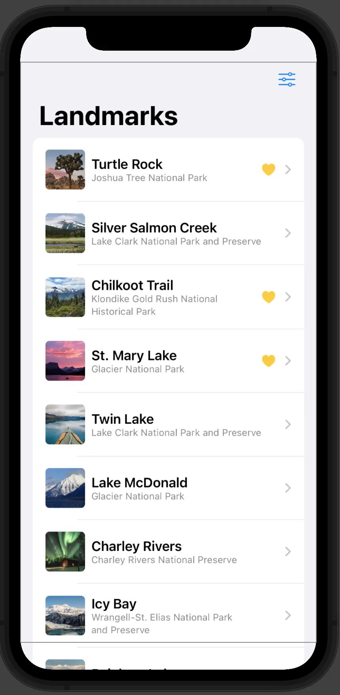
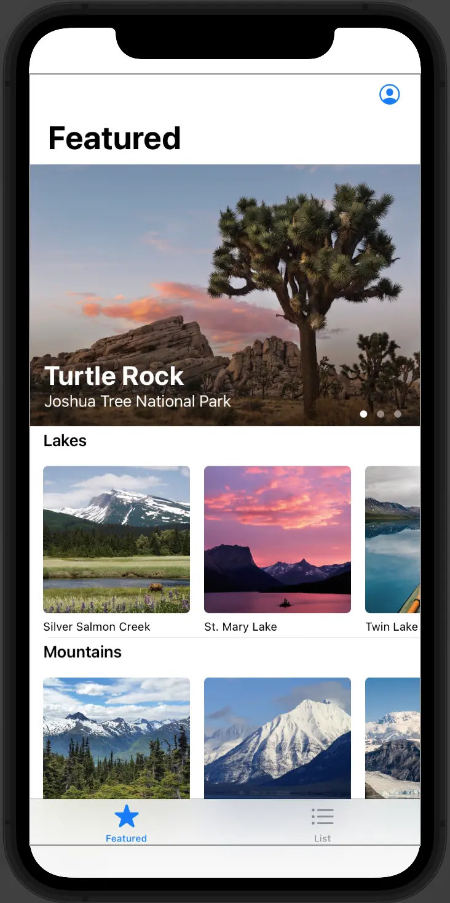

前回に続いて、今回はSwiftUIを触りながら感じたことについて述べたいと思います。自分のように、今までバックエンドの実績しかないエンジニアがGUIを作るとしたら、画面のレイアウトや色合い、画面間の繊維など「今までなかった概念」で混乱することも多いかなと思います。そしてその中でも特に難しい、うまく扱えない機能などもあるかなと思います。

自分の場合、プロダクションレベルのコードを書いたことはないものの、以前から[React Native](https://reactnative.dev/), [Flutter](https://flutter.dev/), [Jetpack Compose](https://developer.android.com/jetpack/compose)には少し触れたことがあったためSwiftUIで「画面を構成する方式」については少し理解しているつもりでした。しかし、やはりバックエンドでは存在しない機能がありました。

今回はそのSwiftUIの話となりますが、中でも私が注目した機能もしくは概念について述べたいと思います。

## SwiftUI

まずは、SwiftUIそのものに対して簡単に紹介しましょう。SwiftUIはいわゆる宣言型(Declarative)UIのフレームワークで、[React](https://ja.reactjs.org/)や[Vue](https://vuejs.org/)などのフロントエンドからの影響が見えます。要するに、画面を構成する要素(Widget, Component, Materialなどフレームワークやライブラリによって呼び方は様々ですが)を一つのオブジェクトとして「宣言」し、それらの要素の組み合わせによって一つの画面を完成するという形になっているということです。このような宣言型UIはSwiftUIだけでなく、モバイルに限定してもReact NativeやFlutter、Jetpack Composeなど様々なフレームワークやライブラリで採択しているものでもあります。

そして、要素の実装についてもフレームワークやライブラリによって色々と方法が分かれますが、SwiftUIでは、個別の要素はViewといい、[View](https://developer.apple.com/documentation/swiftui/view)というprotocolをstructとして実装していきます。なので、一覧を表示する画面であれば、一つの行としてデータを表示するView、その行をリストとして表示するためのView、さらに一覧の上や下にメニューを表示するViewなどが一つ一つのstructとして定義されていく形ということです。

このような画面の作り方は、フレームワークのパラダイム・コンセプトとして決まってあるものなので、それに従って実装を進めることには私のようにバックグラウンドが全く違うエンジニアでも特に問題はないかなと思います。

ただ、実際のアプリを作るとしましょう。画面に対してはフレームワークで提示する通り要素を実装して作ったとしたら、アプリを実行してなんらかの処理を行うためにはバックエンドを繋げるか、アプリ内でなんらかの処理を行うかなど「ロジック」とつなげる必要があるはずです。ここで常にとは言い難いのですが、バックエンドでは見慣れない概念が出てくる場合があります。「状態」というものです。

## 状態

バックエンドのアプリを実装している場合は、リクエストがあり、それに対してのレスポンス（HTTPステータスのみだとしても）がある、という明確なプロセスがありますね。この一連の処理には、「途中で変化する」という概念はありません。この場合のデータは永続化されるか、処理が終了するまでの一時的な物が多いです。

しかし、画面の世界だと話は変わってきます。多くのモバイルアプリではスライダ、ボタン、テキストボックスなどいろいろな要素で構成されてあり、それらの要素に関する状態が常に変わってくるケースもあるのです。ファイルをダウンロードしている状態を表示するためのプログレスバーがあるとしたら、単純に進行状況を見せるとしたら一つのスレッドを割り当てて処理するだけで良いでしょう。

ここで一つ、もしダウンロードに「一時停止」のような機能があったらどうでしょうか。プロセスが進行中にボタンを押下したら止まり、再度押下したら再開されるような機能です。他にも色々と考慮すべきものはあるかと思いますが、この「停止している」「再開した」という概念をどこかに記憶しておく必要はあるでしょう。つまり、画面においてのユーザの入力に対して、なんらかの処理を実際に行うまで記憶しておくための機構が必要ということですね。

SwiftUIでももちろん、状態を管理するためのものがあります。ただ、ユースケースで考えると画面の要素(View)一つに限って必要なものか、それとも複数の要素において必要なものか、複数の画面（アプリ全体）にかけて必要なものかという、スコープによって必要な状態は違うものになります。View一つで必要なものをアプリ全体で管理する必要もなければ、複雑になりがちだからですね。なので、ここではそのスコープ別に状態を管理するためにどんなものがあるのかについて述べていきたいと思います。

### 個別Viewの状態

まずは最も小さい単位、Viewの場合です。先に述べた、一覧の画面が良い例になりそうですね。Appleのチュートリアルでは、以下のような一覧の画面を作ることになります。



この画面では右上のボタンを押すことで、一覧に表示するアイテムをフィルタリングできる機能があります。たとえば一部の行にハートマークがついてありますが、これは「お気に入り」を意味していて、そのお気に入りとして登録したものだけをフィルタするか、アイテムのカテゴリでフィルタするかなどの機能が入っています。

そしてこの画面では、「フィルタするカテゴリ」や「お気に入りだけを表示する」を状態として扱っていますが、この状態は他の画面では知る必要がないデータとなっています。この場合に使えるのが、[@State](https://developer.apple.com/documentation/swiftui/state)です。コードとしては、以下のようになっています。(一部省略)

```swift
// 一覧画面
struct LandmarkList: View {
    // お気に入りだけを表示するかどうか
    @State private var showFavoritesOnly = false
    // フィルタするカテゴリ
    @State private var filter = FilterCategory.all
    
    // カテゴリの種類
    enum FilterCategory: String, CaseIterable, Identifiable {
        case all = "ALL"
        case lakes = "Lakes"
        case rivers = "Rivers"
        case mountains = "Mountains"
        
        var id: FilterCategory { self }
    }
    
    // アイテムにフィルタを適用
    var filteredLandmarks: [Landmark] {
        modelData.landmarks.filter { landmark in
            (!showFavoritesOnly || landmark.isFavorite)
                && (filter == .all || filter.rawValue == landmark.category.rawValue )
        }
    }

    var body: some View {
        NavigationView {
            // アイテムの表示部
            List(selection: $selectedLandmark) {
                ForEach(filteredLandmarks) { landmark in
                    NavigationLink {
                        LandmarkDetail(landmark: landmark)
                    } label: {
                        LandmarkRow(landmark: landmark)
                    }
                }
            }
            .toolbar {
                ToolbarItem {
                    // ツールバーにフィルタを適用するためのボタンを追加
                    Menu {
                        // 選択できるカテゴリ
                        Picker("Category", selection: $filter) {
                            ForEach(FilterCategory.allCases) { category in
                                Text(category.rawValue).tag(category)
                            }
                        }
                        .pickerStyle(.inline)
                        
                        // お気に入りだけを表示するかどうかのトグル
                        Toggle(isOn: $showFavoritesOnly) {
                            Label("Favorites only", systemImage: "heart.fill")
                        }
                    } label: {
                        Label("Filter", systemImage: "slider.horizontal.3")
                    }
                }
            }
        }
    }
}
```

このように、一つのViewにおいて状態を管理するためには、`@State`を使うことになります。

### 親子関係のViewが共有する状態

さて、一つのViewでの状態を管理することはできましたが、次に気になるのは複数のView、特に親子関係になるView間でどうやって状態を共有できるかです。たとえば先ほどの一覧画面だと、一つ一つの行がViewになっているものなのですが、

実は、親のViewから子Viewに状態を渡すというのは、すでに先ほどのコードに表れています。「お気に入りだけを表示するかどうか」のトグルがあるのですが、ここで`isOn`に親の状態を渡していますね。ただ、トグル時の挙動を`@State`で定義したBooleanと結びつけるために`isOn`として渡す際、`$`をつけることに注目する必要があります。`$`をつけることで、Booleanではなく、[`Binding<Boolean>`](https://developer.apple.com/documentation/swiftui/binding)という形でプロパティを渡すことになります。こうしてラッパーを渡すことで、[Toggle](https://developer.apple.com/documentation/swiftui/toggle/)の中でも親の状態を変更できるようになります。`Toggle`は確かに一覧の画面とは別のViewになりますが、押下するたびに親の状態である`showFavoritesOnly`の値が変わるということです。

後でまた関連したポストを書きたいと思いますが、Jetpack Composeでも何となく似たような形で状態の管理ができる方法があります。例えば、`@State`のように簡単な状態を管理するためには以下のような書き方ができます。

```kotlin
// true/falseの状態
var toggle: Boolean by remember { mutableStateOf(false) }

if toggle {
    println("On!")
    toggle = false
} else {
    println("Off!")
    toggle = true
}
```

上記のような書き方はいわゆる[Delegation](https://kotlinlang.org/docs/delegation.html)によるもので、`mutableStateOf<T>`が返すのは[`MutableState<T>`](https://developer.android.com/reference/kotlin/androidx/compose/runtime/MutableState)ですが、`by`を使うことで実際は`Boolean`そのものを扱うようになります。

そして`MutableState<T>`を分解し、以下のように状態と、状態を変化させる処理の処理を指定することもできます。これもまた、先ほどの`Binding`のような役割をするようなものですね。

```kotlin
// テキストの状態と値の変更
val (content: String, onValueChange: (String) -> Unit) = remember { mutableStateOf("") }

// テキストフィールドに状態を表示し、変化があった場合は状態を変更させる
TextField(value = content, onValueChange = onValueChange)
```

こうやって他の要素に状態の変更を可能にするためには、基本的にその状態をラップしているオブジェクトを利用するという考えは、SwiftUIでもJetpack Composeでも一緒のようです。ただ、`$`というキーワードを使ってラッパーにアクセスできるSwiftと、状態のオブジェクトをどうやって宣言するかを考える必要のあるKotlinの違いがまた面白いポイントです。

### アプリ全体で共有する状態

さて、次はもっと大きい単位としての状態について述べたいと思います。アプリの画面は色々とあり、仲には親子の関係ではない場合もあります。Appleのチュートリアルのアプリをまたの例としてあげますと、以下のように、タブが分かれている場合が代表的なものと言えるかもしれません。



ここで、下にある「Featured」や「List」をタッチすることにより表示される画面が変わるわけですが、この二つの画面は親子といえる関係ではありません。以下のコードをご覧ください。

```swift
struct ContentView: View {
    @State private var selection: Tab = .featured
    
    enum Tab {
        case featured
        case list
    }
    
    var body: some View {
        // タブメニュー
        TabView(selection: $selection) {
            // Featured画面
            CategoryHome()
                .tabItem {
                    Label("Featured", systemImage: "star")
                }
                .tag(Tab.featured)
            
            // LandmarkList画面
            LandmarkList()
                .tabItem {
                    Label("List", systemImage: "list.bullet")
                }
                .tag(Tab.list)
        }
    }
}
```

要件によっては、この対等な関係にある画面間でも状態を共有する必要はあります。たとえば、ショッピングのアプリを作るとしたら、自分のアカウントの画面を開いている場合でもカートに入れている商品の情報は維持される必要がありますね。このように、現在表示している画面とは関係なく、アプリ全体で共有する状態が必要な場面があります。

この場合は、どうしたらいいでしょうか？もちろん、起点となるViewがあるので、そこに`@State`を定義しておくというのも一つの方法かもしれません。ただ、状態として管理したい項目が増えれば増えるほど複雑になりがちですね。起点のViewには複数の`@State`が必要となり、画面ごとにそれらを渡す必要があります。だとすると、やはり一つのオブジェクトに状態をまとめて置いて使いまわしたいものです。

Appleのチュートリアルでもそれを提示していて、画面間で共有するデータとしてLandmarkのデータと、ユーザのプロフィールをまとめて共有できるオブジェクトとして提供する方法があります。まずは、以下がその状態のオブジェクトのコードとなります。（一部省略）

```swift
final class ModelData: ObservableObject {
    @Published var landmarks: [Landmark] = load("landmarkData.json")
    @Published var profile = Profile.default
}
```

ここでアプリ内でLandmarkの情報はjsonから読み取ったものとなっていて、プロフィールはEnumとなっています。そして[ObservableObject](https://developer.apple.com/documentation/combine/observableobject)というプロトコールが使われているのが見えますね。`ObservableObject`を使うことで、このModelDataというクラスは変更される状態を保持し、値の変更があった場合はそれを参照する画面に通知する`Publisher`として機能することになります。そしてそれぞれの状態となるプロパティについては、[@Published](https://developer.apple.com/documentation/combine/published)をつけることで状態として指定することになります。

こうして状態を保持するためのオブジェクトを定義したら、次はアプリ内でどうやって使用するかですね。チュートリアルでは、以下のようにアプリのメインとなるstructに以下のように定義しています。（一部省略）

```swift
@main
struct LandmarksApp: App {
    // ModelDataを状態のオブジェクトとして宣言
    @StateObject private var modelData = ModelData()
    
    var body: some Scene {
        WindowGroup {
            ContentView()
                .environmentObject(modelData) // メイン画面に状態オブジェクトを渡す
        }
    }
}
```

コードでわかるように、アプリでは定義しておいた状態オブジェクトを[@StateObject](https://developer.apple.com/documentation/swiftui/stateobject)をつけて、メイン画面に渡すことで使うようになります。ちなみにこうやって`View`として定義された画面にならどんなものでも`environmentObject()`に状態オブジェクトを渡すことができるので、画面の一部だけをプレビューとして表示する場合でも、プレビューに表示する画面に状態オブジェクトを渡すことで動作を試すこともできます。例えば、先ほどのLandmarkの一覧画面のプレビューだと、以下のようになっています。

```swift
struct LandmarkList_Previews: PreviewProvider {
    static var previews: some View {
        LandmarkList()
            .environmentObject(ModelData()) // 状態オブジェクトを渡す
    }
}
```

こうして状態オブジェクトを画面に渡したら、中では使うだけです。[@EnvironmentObject](https://developer.apple.com/documentation/swiftui/environmentobject)というアノテーションを使って、状態を持つオブジェクトを宣言するだけで自動的にオブジェクトはDIされ、その画面で使えるようになります。また一覧の画面の話となりますが、以下のコードを見てください。`landmarks`のデータを使って一覧を表示しているのがわかります。（一部省略）

```swift
struct LandmarkList: View {
    // 状態オブジェクト
    @EnvironmentObject var modelData: ModelData

    // 状態オブジェクトからデータを取り出しフィルタを適用
    var filteredLandmarks: [Landmark] {
        modelData.landmarks.filter { landmark in
            (!showFavoritesOnly || landmark.isFavorite)
                && (filter == .all || filter.rawValue == landmark.category.rawValue )
        }
    }
```

ちなみに、Jetpack Composeの場合はこのような方法ではなく、オブジェクトそのものを`remember`するように使うようです。例えば以下のような形になります。そもそも要素を作成するアプローチが違うのが理由の一つなのかもしれませんね。

```kotlin
// アプリ全体で共有する状態
class ApplicationState(
    val environment: MutableState<Environment>,
    val hash: MutableState<String>
)

// 状態の初期化
@Composable
fun rememberApplicationState(
    environment: MutableState<Environment> = mutableStateOf(Environment.PRODUCTION),
    hash: MutableState<String> = mutableStateOf("")
): ApplicationState {
    return remember(environment, hash) {
        ApplicationState(environment, hash)
    }
}

// 状態の定義
val appState = rememberApplicationState()
```

### 永続化できる状態

今までの状態は、アプリが実行中のみ有効なものでした。それだけでも十分な場合もありますが、場合によっては状態を永続化したい場合もあるでしょう。例えば、学習用のアプリだとしたらどこまで進行したかなどを保存しておきたいかなと思います。このような種のデータは、アプリを再起動しても変わらないことを期待しますね。

もちろん、この場合のためにDBがあり、ネットワーク機能のあるアプリならサーバ側にデータを保存したりするでしょう。ただ、この場合は「状態」とは言えないものですね。なぜなら、状態は画面の更新を伴うものだからです。画面をタッチした回数を、画面に表示しながら同時に保存しておきたい場合は毎回DBの更新と参照で実装したくない場合もあるかなと思います。そこで使えるのが、[@AppStorage](https://developer.apple.com/documentation/swiftui/appstorage)です。これを使うことで、画面の更新と永続化を同時に行うことができます。

また、チュートリアルによると、いくつかデフォルトとして保存されているデータに関してもこのアノテーションでアクセスできるようにになっています。一覧画面に表示される「お気に入り」ボタンの例ですが、ボタンのアイコンを`@AppStorage`から参照するようになっています。コードは以下です。（一部省略）

```swift
struct FavoriteButton: View {
    // ボタンはハートのアイコンとして表示する
    @AppStorage("Favorite.iconType")
    private var iconType: IconType = .heart
}
```

## 最後に

いかがでしたか。自分の感想としては、やはり今まで自分が触れてきた分野とは全く違う概念やアプローチが多かったので、大変興味深いと思いつつ、「これであっているのか」という疑問もかなり湧いてくるような経験となっています。全く経験のない分野に足を踏み入れるのは常にそういうものなのかもしれませんが。

ただこれで、ある程度アプリを作る場合にどうやって処理を行うべきかについての疑問の一つは解けたような気がします。本当は画面を作る分、他にも色々と新しい概念が出てきたり、画面のレイアウトやUXの観点で色々と難しいものが出てくるかもしれませんが、とにかく「動く」ものを作れそうな気はしますね。何卒自分のようにバックエンドのみを経験してきた形にとって参考できるような記事となっていればと思います。

では、また！
